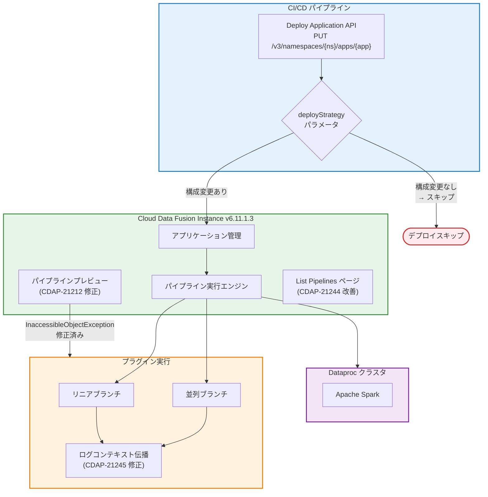

# Cloud Data Fusion: v6.11.1.3 GA リリース (パイプラインプレビュー修正、ログコンテキスト修正、デプロイ戦略パラメータ追加)

**リリース日**: 2026-06-05
**サービス**: Cloud Data Fusion
**機能**: パイプラインプレビュー修正、並列ブランチのログコンテキスト修正、セキュリティ修正、List pipelines レイテンシ改善、deployStrategy パラメータ追加
**ステータス**: GA (一般提供)

[このアップデートのインフォグラフィックを見る](https://takech9203.github.io/google-cloud-news-summary/20260605-cloud-data-fusion-v6-11-1-3-ga.html)

## 概要

Cloud Data Fusion バージョン 6.11.1.3 が一般提供 (GA) として公開された。本リリースは、パイプラインプレビュー実行の失敗、並列ブランチでのカスタムプラグインのログコンテキスト消失、セキュリティ脆弱性、List pipelines ページのレイテンシ、およびインスタンスアップグレード後の断続的なサービス利用不能など、複数の重要なバグ修正を含むパッチリビジョンである。

また、Deploy Application API に `deployStrategy` クエリパラメータが新たに導入され、パイプライン構成が変更されていない場合に再デプロイをスキップできるようになった。これにより、CI/CD パイプラインにおける不要なデプロイの回避とデプロイ効率の向上が実現される。

このアップデートは、Cloud Data Fusion を利用してデータ統合パイプラインを開発・運用するデータエンジニア、プラットフォームエンジニア、および CI/CD パイプラインで自動デプロイを行うチームに関連する。

**アップデート前の課題**

v6.11.1.3 以前には以下の課題が存在していた。

- 特定のプラグイン (Cloud SQL for PostgreSQL など) を使用した場合、パイプラインプレビュー実行が `InaccessibleObjectException` で失敗していた (CDAP-21212)
- カスタムプラグインが並列パイプラインブランチで実行される際にログコンテキストが消失し、デバッグが困難であった (CDAP-21245)
- CDAP における重大なセキュリティ脆弱性が存在していた (CDAP-21250)
- List pipelines ページのレイテンシが高く、大量のパイプラインを管理する環境でのユーザー体験が低下していた (CDAP-21244)
- インスタンスアップグレード後に断続的なサービス利用不能が発生していた (CDAP-21254)
- Deploy Application API で構成が変更されていないパイプラインの再デプロイをスキップする手段がなく、不要なデプロイが実行されていた

**アップデート後の改善**

今回のアップデートにより以下の改善が実現した。

- Cloud SQL for PostgreSQL などのプラグインを使用したパイプラインプレビューが正常に動作するようになった
- 並列ブランチとリニアパイプラインの両方で、カスタムプラグインのログコンテキストが一貫して伝播されるようになった
- 重大なセキュリティ脆弱性が修正された
- List pipelines ページのレイテンシが改善され、大規模環境でのパイプライン管理がスムーズになった
- インスタンスアップグレード後のサービス安定性が向上した
- `deployStrategy` パラメータにより、構成変更なしのパイプラインの再デプロイをスキップできるようになった

## アーキテクチャ図



Deploy Application API に追加された `deployStrategy` パラメータにより、構成変更のないパイプラインの再デプロイをスキップできる。また、プレビュー実行とログコンテキスト伝播の修正により、開発時のデバッグ効率が向上する。

## サービスアップデートの詳細

### バグ修正

1. **パイプラインプレビュー実行の InaccessibleObjectException 修正 (CDAP-21212)**
   - Cloud SQL for PostgreSQL などの特定のプラグインを使用した場合にパイプラインプレビュー実行が `InaccessibleObjectException` で失敗する問題が修正された
   - プレビュー機能を使用してパイプラインの動作を事前検証する際の信頼性が向上した

2. **並列ブランチでのカスタムプラグインのログコンテキスト修正 (CDAP-21245)**
   - カスタムプラグインが並列パイプラインブランチで実行される際にログコンテキストが消失する問題が修正された
   - リニアおよび並列ブランチのパイプライン実行において、一貫したログ伝播が保証されるようになった

3. **重大なセキュリティ脆弱性の修正 (CDAP-21250)**
   - CDAP における重大なセキュリティ脆弱性が修正された

4. **List pipelines ページのレイテンシ改善 (CDAP-21244)**
   - List pipelines ページのレイテンシが改善され、大量のパイプラインを管理する環境でのユーザー体験が向上した

5. **インスタンスアップグレード後のサービス利用不能修正 (CDAP-21254)**
   - インスタンスアップグレード後に断続的にサービスが利用不能になる問題が修正された
   - アップグレードプロセスの安定性と信頼性が向上した

### 新機能

1. **deployStrategy クエリパラメータの導入 (CDAP-21246)**
   - Deploy Application API に `deployStrategy` クエリパラメータが追加された
   - パイプライン構成が変更されていない場合に、既存パイプラインの再デプロイをスキップできる
   - CI/CD パイプラインにおける冪等なデプロイ操作が可能になった

## 技術仕様

### deployStrategy パラメータ

| 項目 | 詳細 |
|------|------|
| パラメータ名 | `deployStrategy` |
| 適用 API | Deploy Application API (PUT /v3/namespaces/{namespace-id}/apps/{pipeline-name}) |
| 動作 | 構成が変更されていない既存パイプラインの再デプロイをスキップ |
| 用途 | CI/CD パイプラインでの冪等デプロイ |

### 修正された問題の一覧

| CDAP ID | 種別 | 影響範囲 | 修正内容 |
|---------|------|----------|----------|
| CDAP-21212 | Fixed | パイプラインプレビュー | 特定プラグイン使用時の InaccessibleObjectException 修正 |
| CDAP-21245 | Fixed | ログ機能 | 並列ブランチでのカスタムプラグインのログコンテキスト消失修正 |
| CDAP-21250 | Fixed | セキュリティ | 重大なセキュリティ脆弱性の修正 |
| CDAP-21244 | Fixed | UI パフォーマンス | List pipelines ページのレイテンシ改善 |
| CDAP-21254 | Fixed | インスタンス管理 | アップグレード後の断続的サービス利用不能修正 |
| CDAP-21246 | Change | Deploy API | deployStrategy クエリパラメータの導入 |

### Deploy Application API の使用方法

```bash
# deployStrategy パラメータを使用したデプロイ
curl -X PUT \
  -H "Authorization: Bearer ${AUTH_TOKEN}" \
  -H "Content-Type: application/json" \
  "${CDAP_ENDPOINT}/v3/namespaces/default/apps/my-pipeline?deployStrategy=SKIP_IF_SAME_CONFIG" \
  --data @pipeline-config.json
```

## 設定方法

### 前提条件

1. Cloud Data Fusion インスタンスがバージョン 6.11.1 以上であること
2. `gcloud` CLI がインストールされ、認証済みであること

### 手順

#### ステップ 1: パッチリビジョンへのアップグレード

```bash
gcloud beta data-fusion instances update INSTANCE_ID \
  --project=PROJECT_ID \
  --location=LOCATION \
  --version=6.11.1 \
  --patch_revision=6.11.1.3
```

INSTANCE_ID、PROJECT_ID、LOCATION を実際の値に置き換える。

#### ステップ 2: アップグレードの確認

```bash
gcloud beta data-fusion instances describe INSTANCE_ID \
  --project=PROJECT_ID \
  --location=LOCATION
```

`patchRevision` フィールドが `6.11.1.3` に更新されていることを確認する。

#### ステップ 3: deployStrategy パラメータの使用 (オプション)

CI/CD パイプラインで Deploy Application API を使用している場合は、`deployStrategy` パラメータを追加して構成変更なしの再デプロイをスキップできる。

```bash
# 環境変数の設定
export AUTH_TOKEN=$(gcloud auth print-access-token)
export CDAP_ENDPOINT=$(gcloud beta data-fusion instances describe \
  --location=LOCATION \
  --format="value(apiEndpoint)" \
  INSTANCE_ID)

# deployStrategy を使用したデプロイ
curl -X PUT \
  -H "Authorization: Bearer ${AUTH_TOKEN}" \
  -H "Content-Type: application/json" \
  "${CDAP_ENDPOINT}/v3/namespaces/default/apps/my-pipeline?deployStrategy=SKIP_IF_SAME_CONFIG" \
  --data @pipeline-config.json
```

## メリット

### ビジネス面

- **開発効率の向上**: パイプラインプレビューの修正により、Cloud SQL for PostgreSQL を使用するパイプラインの事前検証が可能になり、開発サイクルが短縮される
- **運用効率の向上**: List pipelines ページのレイテンシ改善により、大量のパイプラインを管理する環境でのオペレーション効率が向上する
- **CI/CD 効率の改善**: `deployStrategy` パラメータにより不要なデプロイを回避でき、CI/CD パイプラインの実行時間とリソース消費が削減される

### 技術面

- **デバッグ効率の向上**: 並列ブランチでのログコンテキスト修正により、複雑なパイプラインのトラブルシューティングが容易になる
- **セキュリティの強化**: 重大なセキュリティ脆弱性の修正によりシステムの安全性が向上する
- **アップグレード信頼性の向上**: インスタンスアップグレード後のサービス安定性が改善され、メンテナンスウィンドウの影響が低減される
- **冪等デプロイ**: `deployStrategy` パラメータによりデプロイ操作が冪等になり、CI/CD パイプラインの信頼性が向上する

## デメリット・制約事項

### 制限事項

- パッチリビジョンのアップグレードにはインスタンスとパイプラインのダウンタイムが必要
- アップグレード前に実行中のパイプラインを停止し、上流トリガー (Managed Service for Apache Airflow トリガーなど) を無効化することが推奨される
- パッチリビジョンはプラットフォームの修正のみを含み、プラグインの変更やアップデートは含まない

### 考慮すべき点

- アップグレード前にダウンタイムのスケジュールを計画する必要がある
- `deployStrategy` パラメータの具体的な動作仕様については、CDAP のドキュメントで最新情報を確認することを推奨する
- セキュリティ脆弱性 (CDAP-21250) の修正が含まれるため、早期のアップグレードが推奨される

## ユースケース

### ユースケース 1: CI/CD パイプラインでの冪等デプロイ

**シナリオ**: Terraform や Cloud Build を使用してパイプライン構成を Infrastructure as Code で管理しており、コード変更がなくても毎回デプロイが実行されてしまう。

**実装例**:
```bash
# CI/CD スクリプト内で deployStrategy を使用
curl -X PUT \
  -H "Authorization: Bearer ${AUTH_TOKEN}" \
  -H "Content-Type: application/json" \
  "${CDAP_ENDPOINT}/v3/namespaces/production/apps/etl-daily-load?deployStrategy=SKIP_IF_SAME_CONFIG" \
  --data @pipeline-config.json
```

**効果**: パイプライン構成に変更がない場合はデプロイがスキップされ、CI/CD パイプラインの実行時間が短縮される。また、不要な再デプロイによるサービス中断リスクが排除される。

### ユースケース 2: Cloud SQL for PostgreSQL を使用したデータ統合パイプラインの開発

**シナリオ**: Cloud SQL for PostgreSQL からデータを取得するパイプラインを開発しており、プレビュー機能で動作を確認したい。

**効果**: v6.11.1.3 へのアップグレードにより、Cloud SQL for PostgreSQL プラグインを使用したパイプラインプレビューが正常に動作し、本番デプロイ前のデータ検証が可能になる。

### ユースケース 3: 複雑な並列処理パイプラインのデバッグ

**シナリオ**: 複数のカスタムプラグインを並列ブランチで実行するパイプラインにおいて、特定のブランチで発生する問題のデバッグが必要。

**効果**: ログコンテキストが正しく伝播されるようになったことで、並列ブランチ内の各カスタムプラグインのログが正確に識別・追跡でき、問題の特定が容易になる。

## 料金

Cloud Data Fusion の料金はインスタンスのエディションと実行時間に基づいて課金される。今回の v6.11.1.3 パッチリビジョンによる追加料金は発生しない。

| エディション | インスタンス時間あたりの料金 | 推奨同時パイプライン数 |
|-------------|--------------------------|---------------------|
| Developer | US$0.35 | 2 |
| Basic | US$1.80 | 無制限 |
| Enterprise | US$4.20 | 無制限 |

パイプライン実行時のコンピュート費用は、Managed Service for Apache Spark クラスタの利用に基づいて別途課金される。

## 利用可能リージョン

Cloud Data Fusion v6.11.1.3 は、Cloud Data Fusion がサポートするすべてのリージョンで利用可能。2026年6月時点で northamerica-south1 (Mexico) を含む複数のリージョンに対応している。詳細は [Cloud Data Fusion の料金ページのリージョンセクション](https://cloud.google.com/data-fusion/pricing#supported_regions) を参照。

## 関連サービス・機能

- **Cloud SQL for PostgreSQL**: 今回のリリースで修正されたプレビュー実行の InaccessibleObjectException に関連するプラグイン
- **Managed Service for Apache Spark (Dataproc)**: Cloud Data Fusion がパイプライン実行時に使用するコンピュートエンジン
- **Cloud Data Fusion v6.11.1.2**: 本バージョンの直前のパッチリビジョン
- **Cloud Data Fusion v6.11.1 (GA)**: 本パッチリビジョンのベースバージョン。Java 11 への移行、Dataproc 2.3 デフォルトイメージなどの機能を含む

## 参考リンク

- [インフォグラフィック](https://takech9203.github.io/google-cloud-news-summary/20260605-cloud-data-fusion-v6-11-1-3-ga.html)
- [公式リリースノート](https://docs.cloud.google.com/release-notes#June_05_2026)
- [Cloud Data Fusion リリースノート](https://docs.cloud.google.com/data-fusion/docs/release-notes)
- [パッチリビジョンへのアップグレード](https://docs.cloud.google.com/data-fusion/docs/how-to/upgrade-to-patch-revision)
- [利用可能なバージョンアップグレード](https://docs.cloud.google.com/data-fusion/docs/concepts/available-upgrades)
- [CDAP REST API リファレンス](https://docs.cloud.google.com/data-fusion/docs/reference/cdap-reference)
- [料金ページ](https://cloud.google.com/data-fusion/pricing)

## まとめ

Cloud Data Fusion v6.11.1.3 は、パイプラインプレビューの信頼性向上、並列ブランチでのログコンテキスト修正、重大なセキュリティ脆弱性の修正、UI パフォーマンスの改善、およびアップグレード後の安定性向上を含む重要なパッチリビジョンである。加えて、`deployStrategy` パラメータの導入により CI/CD パイプラインでの冪等デプロイが実現される。セキュリティ修正を含むため、Cloud Data Fusion 6.11.1 を使用しているすべてのユーザーに早期のアップグレードを推奨する。

---

**タグ**: #CloudDataFusion #PatchRevision #GA #セキュリティ修正 #パイプラインプレビュー #ログコンテキスト #deployStrategy #CICD #DataIntegration
