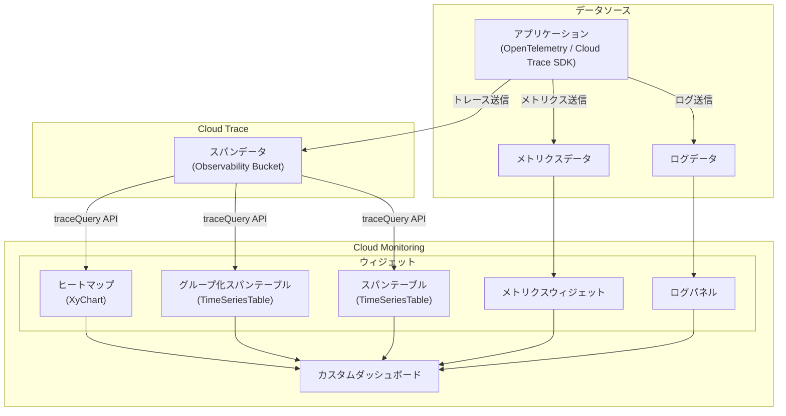

# Cloud Monitoring / Cloud Trace: カスタムダッシュボードでのトレースデータ表示

**リリース日**: 2026-06-05

**サービス**: Cloud Monitoring / Cloud Trace

**機能**: カスタムダッシュボードでのトレースデータ表示

**ステータス**: Public Preview (プレビュー)

[このアップデートのインフォグラフィックを見る](https://takech9203.github.io/google-cloud-news-summary/20260605-cloud-monitoring-trace-data-dashboards.html)

## 概要

Cloud Monitoring のカスタムダッシュボードにトレースデータを直接表示できるようになりました。この機能により、個別のスパンの確認や集約データの可視化が、メトリクスやログと同じダッシュボード上で実現できます。現在パブリックプレビューとして提供されています。

これまで、トレースデータの確認には専用の Trace Explorer ページへの遷移が必要でしたが、今回のアップデートにより、メトリクス、ログ、トレースを統合した「ユニファイドトラブルシューティングビュー」を構築できます。スパンのレイテンシをシステムメトリクスやアプリケーションログと相関させて分析することで、問題の根本原因をより迅速に特定できます。

対象ユーザーは、分散システムの運用チーム、SRE、アプリケーション開発者など、オブザーバビリティデータを日常的に活用するエンジニアです。

**アップデート前の課題**

- トレースデータを確認するには Trace Explorer ページに個別に遷移する必要があり、コンテキストの切り替えが発生していた
- メトリクスの異常とトレースデータの相関分析を行う際、複数の画面を行き来する必要があった
- チーム間で共有するダッシュボードにトレース情報を含めることができず、統合的な監視ビューの構築が困難だった

**アップデート後の改善**

- カスタムダッシュボードにトレースウィジェットを追加し、メトリクス・ログ・トレースを単一ビューで確認可能になった
- ヒートマップ、スパンテーブル、グループ化スパンテーブルなど複数の可視化形式を選択できるようになった
- Cloud Monitoring API を使用してプログラマティックにトレースウィジェットを構成・管理できるようになった

## アーキテクチャ図



カスタムダッシュボードは `traceQuery` API を通じて Cloud Trace のスパンデータにアクセスし、メトリクスやログと統合して表示します。

## サービスアップデートの詳細

### 主要機能

1. **トレースウィジェットの追加**
   - カスタムダッシュボードに専用のトレースウィジェットを配置可能
   - 「Add widget」ダイアログの「Data」セクションから「Trace」を選択して追加
   - 1 ダッシュボードあたり最大 100 ウィジェットまで配置可能

2. **複数の可視化形式**
   - **スパン期間ヒートマップ (Span duration heatmap)**: スパンレイテンシの分布をヒートマップで表示（デフォルト）
   - **スパンレート (Span rate)**: スパンの送信レートを折れ線グラフで表示
   - **スパン期間パーセンタイル (Span duration percentile)**: レイテンシのパーセンタイルデータを表示
   - **テーブル形式**: グループ化スパンテーブルおよび個別スパンテーブルとして表示

3. **Trace Explorer からの保存**
   - Trace Explorer ページから直接ダッシュボードにウィジェットを保存可能
   - Visualizer（ヒートマップ）、Span table、Grouped span table の 3 形式から選択

4. **スパンフィルタリング**
   - スパン名、サービス名、ステータス、スパン種別、属性などでフィルタリング可能
   - App Hub のサービス・ワークロードによるフィルタリングにも対応
   - ルートスパンのみの表示にも対応

## 技術仕様

### traceQuery オブジェクト

| パラメータ | 説明 |
|------|------|
| `resourceContainer` | トレースデータを含むプロジェクト（例: `projects/my-project`） |
| `spanDataValue` | 可視化するスパンデータの種類（`SPAN_DURATION` など） |
| `spanFilters` | スパンの絞り込みフィルタ |

### spanFilters のフィルタ項目

| フィルタ | 用途 |
|------|------|
| `displayNames` | スパン名でフィルタリング |
| `isRootSpan` | ルートスパンのみ表示 |
| `services` | サービス名でフィルタリング |
| `kinds` | スパン種別でフィルタリング |
| `status` | スパンステータスでフィルタリング |
| `attributes` | スパン属性でフィルタリング |
| `apphubServices` | App Hub サービスでフィルタリング |
| `apphubWorkloads` | App Hub ワークロードでフィルタリング |

### API 設定例

```json
{
  "displayName": "Trace Dashboard Example",
  "mosaicLayout": {
    "columns": 48,
    "tiles": [
      {
        "height": 22,
        "width": 48,
        "widget": {
          "title": "Span Duration Heatmap",
          "xyChart": {
            "chartOptions": {
              "displayHorizontal": false,
              "mode": "COLOR"
            },
            "dataSets": [
              {
                "plotType": "HEATMAP",
                "timeSeriesQuery": {
                  "traceQuery": {
                    "resourceContainer": "projects/my-project",
                    "spanDataValue": "SPAN_DURATION",
                    "spanFilters": {
                      "displayNames": [],
                      "isRootSpan": false,
                      "services": [],
                      "kinds": [],
                      "status": []
                    }
                  }
                }
              }
            ],
            "yAxis": {
              "scale": "LINEAR"
            }
          }
        }
      },
      {
        "yPos": 22,
        "height": 16,
        "width": 24,
        "widget": {
          "title": "Grouped Span Table",
          "timeSeriesTable": {
            "dataSets": [
              {
                "breakdowns": [
                  {
                    "aggregationFunction": { "type": "none" },
                    "column": "serviceOrWorkload",
                    "sortOrder": "SORT_ORDER_NONE"
                  }
                ],
                "timeSeriesQuery": {
                  "traceQuery": {
                    "resourceContainer": "projects/my-project",
                    "spanDataValue": "SPAN_DURATION",
                    "spanFilters": {}
                  }
                }
              }
            ],
            "metricVisualization": "NUMBER"
          }
        }
      }
    ]
  }
}
```

## 設定方法

### 前提条件

1. Cloud Monitoring が有効なプロジェクト
2. 必要な IAM ロール:
   - `roles/monitoring.editor`（Monitoring 編集者）
   - `roles/cloudtrace.user`（Cloud Trace ユーザー）- トレースデータを閲覧する各プロジェクトに対して付与

### 手順

#### ステップ 1: Google Cloud コンソールからウィジェットを追加

1. Google Cloud コンソールで「Dashboards」ページに移動
2. 既存のダッシュボードを選択するか、「Create dashboard」をクリック
3. ツールバーの「Add widget」をクリック
4. 「Add widget」ダイアログの「Data」セクションで「Trace」を選択

#### ステップ 2: ウィジェットの設定

1. チャートビューを選択（ヒートマップ、スパンレート、パーセンタイルなど）
2. 必要に応じてフィルタを追加してスパンの表示範囲を絞り込み
3. 「Apply」をクリックして設定を保存
4. ダッシュボードツールバーの「Save」をクリック

#### ステップ 3: Trace Explorer から保存（代替方法）

```
1. Google Cloud コンソールで Trace Explorer ページを開く
2. ツールバーの「Save to dashboard」を選択
3. 表示形式を選択:
   - Visualizer (ヒートマップ)
   - Span table (個別スパン)
   - Grouped span table (グループ化スパン)
4. 保存先ダッシュボードを選択または新規作成
5. 「Save to dashboard」をクリック
```

#### ステップ 4: API 経由での作成

```bash
# gcloud CLI を使用してダッシュボードを作成
gcloud monitoring dashboards create --config-from-file=dashboard.json
```

## メリット

### ビジネス面

- **MTTR の短縮**: メトリクス、ログ、トレースを統合した単一ビューにより、問題の根本原因特定までの時間を短縮
- **チームコラボレーションの向上**: 共有ダッシュボードにトレース情報を含めることで、チーム全体の状況認識を統一

### 技術面

- **統合オブザーバビリティ**: 3 本柱（メトリクス・ログ・トレース）を単一ダッシュボードで統合表示
- **API による自動化**: Cloud Monitoring API を使用してプログラマティックにダッシュボードを構築・管理可能
- **柔軟なフィルタリング**: スパン名、サービス、属性など多様な条件でデータをフィルタリング可能

## デメリット・制約事項

### 制限事項

- ダッシュボードレベルのフィルタはトレースウィジェットに適用されない
- トレースウィジェットのクエリに変数（Variable）を適用することはできない
- パブリックプレビューの機能であり、サポートが限定される可能性がある（Pre-GA Offerings Terms が適用）
- 1 ダッシュボードあたり最大 100 ウィジェットの制限あり

### 考慮すべき点

- トレースデータの閲覧にはプロジェクトごとに `roles/cloudtrace.user` ロールが必要
- デフォルトのトレーススコープの設定が適切でない場合、期待するデータが表示されない可能性がある
- スパンデータの保持期間は 30 日間

## ユースケース

### ユースケース 1: マイクロサービスのレイテンシ監視

**シナリオ**: 複数のマイクロサービスで構成されるアプリケーションのレイテンシを統合的に監視したい。各サービスの応答時間、エラー率、スループットをメトリクスと併せて確認する。

**実装例**:
```json
{
  "widget": {
    "title": "Payment Service Latency",
    "xyChart": {
      "dataSets": [{
        "plotType": "HEATMAP",
        "timeSeriesQuery": {
          "traceQuery": {
            "resourceContainer": "projects/my-project",
            "spanDataValue": "SPAN_DURATION",
            "spanFilters": {
              "services": ["payment-service"],
              "displayNames": ["/api/v1/payment"]
            }
          }
        }
      }]
    }
  }
}
```

**効果**: サービス単位でのレイテンシ分布を視覚的に把握し、パフォーマンス劣化を即座に検出可能

### ユースケース 2: インシデント対応用統合ダッシュボード

**シナリオ**: オンコールエンジニアがインシデント発生時に使用する統合ダッシュボードを構築。メトリクスの異常検知、関連ログ、影響を受けているトレースを一画面で確認する。

**効果**: Trace Explorer への遷移なしにスパンの詳細を確認でき、インシデント対応時間を大幅に短縮

### ユースケース 3: AI/ML アプリケーションの推論レイテンシ追跡

**シナリオ**: Vertex AI を使用した推論パイプラインにおいて、各ステップ（前処理、推論、後処理）のスパンをダッシュボードで追跡し、ボトルネックを特定する。

**効果**: AI ワークロードのエンドツーエンドのパフォーマンスを可視化し、最適化すべきステップを明確化

## 料金

トレースウィジェットの表示自体に追加料金は発生しません。ただし、関連するサービスの利用料金が適用されます。

### 関連する料金体系

| サービス | 料金 | 無料枠 |
|--------|--------|--------|
| Cloud Trace スパン取り込み | $0.20/100 万スパン | 月 250 万スパンまで無料 |
| Cloud Monitoring API 読み取り | $0.50/100 万時系列返却 | 月 100 万時系列返却まで無料 |
| Cloud Monitoring データ（カスタムメトリクス） | $0.2580/MiB（最初の 150-100,000 MiB） | 月 150 MiB まで無料 |

トレースウィジェットはダッシュボード表示時に Cloud Trace のデータを読み取るため、Monitoring API 読み取り呼び出しとしてカウントされる可能性があります。

## 利用可能リージョン

Cloud Monitoring のカスタムダッシュボード機能はグローバルサービスとして提供されており、全リージョンで利用可能です。トレースデータ自体は Observability Bucket に保存され、保存先のリージョンはプロジェクト設定に依存します。

## 関連サービス・機能

- **Cloud Trace Explorer**: トレースデータの詳細な探索と分析を行う専用ページ。ダッシュボードウィジェットから直接遷移可能
- **Application Monitoring**: App Hub 登録サービスのトレースデータを自動的にダッシュボードに表示する機能
- **Cloud Monitoring ヒストグラムウィジェット**: 2026-06-02 に GA となったヒストグラムウィジェットと組み合わせて使用可能
- **Trace DAG 可視化**: 2026-06-01 に発表されたスパン詳細ページでの有向非巡回グラフ (DAG) 表示機能

## 参考リンク

- [インフォグラフィック](https://takech9203.github.io/google-cloud-news-summary/20260605-cloud-monitoring-trace-data-dashboards.html)
- [公式リリースノート](https://docs.cloud.google.com/release-notes#June_05_2026)
- [ドキュメント: Display trace data (Google Cloud console)](https://docs.cloud.google.com/monitoring/dashboards/display-traces-on-dashboards)
- [ドキュメント: Dashboard with trace data (API)](https://docs.cloud.google.com/monitoring/dashboards/api-examples#dashboard-with-trace-data)
- [ドキュメント: Display traces on a custom dashboard (Cloud Trace)](https://docs.cloud.google.com/trace/docs/display-traces-on-dashboards)
- [料金ページ](https://cloud.google.com/products/observability/pricing)

## まとめ

Cloud Monitoring のカスタムダッシュボードでトレースデータを直接表示できるようになったことで、メトリクス・ログ・トレースの 3 つのオブザーバビリティシグナルを統合した監視ビューの構築が可能になりました。パブリックプレビュー段階ですが、統合ダッシュボードの構築を検討している運用チームは、既存のダッシュボードにトレースウィジェットを追加して、トラブルシューティングワークフローの効率化を試すことを推奨します。

---

**タグ**: #CloudMonitoring #CloudTrace #Dashboard #Observability #Tracing #PublicPreview #CustomDashboard
