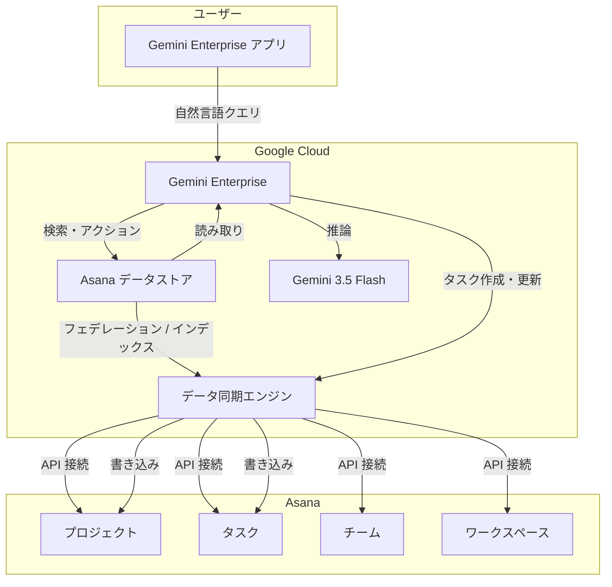

# Gemini Enterprise: Asana データストア (Preview) & Gemini 3.5 Flash 管理者制御

**リリース日**: 2026-06-05

**サービス**: Gemini Enterprise

**機能**: Asana データストア連携 / Gemini 3.5 Flash 管理者制御変更

**ステータス**: Preview / Announcement

📊 [このアップデートのインフォグラフィックを見る](https://takech9203.github.io/google-cloud-news-summary/20260605-gemini-enterprise-asana-data-store.html)

## 概要

Gemini Enterprise に 2 つの重要なアップデートが発表された。1 つ目は Asana データストアの Public Preview 提供開始であり、Asana アカウントを接続してプロジェクト、ワークスペース、チーム、タスクを自然言語で検索・閲覧できるようになった。さらに、プロジェクトやタスクの作成といったアクションを Gemini Enterprise アプリから直接実行することも可能である。

2 つ目は Gemini 3.5 Flash の管理者制御に関する変更である。2026 年 6 月 9 日をもって、Gemini 3.5 Flash の機能管理トグルは廃止され、すべてのユーザーに対して Gemini 3.5 Flash がデフォルトで有効化される。この変更は Global、US、EU のマルチリージョンに適用される。当初の予定から 1 日延長された日程である。

これらのアップデートにより、Gemini Enterprise はプロジェクト管理ツールとの連携を強化しつつ、最新の AI モデルをすべてのユーザーに標準提供する方向へと進化している。

**アップデート前の課題**

- Asana のプロジェクトやタスク情報を確認するには Asana の Web アプリやモバイルアプリに直接アクセスする必要があった
- Gemini Enterprise からプロジェクト管理情報を横断的に検索する手段がなかった
- Gemini 3.5 Flash の利用可否が管理者の設定に依存しており、組織によってはユーザーが最新モデルにアクセスできなかった

**アップデート後の改善**

- Gemini Enterprise アプリ内から自然言語で Asana のプロジェクト、タスク、チーム情報を検索可能になった
- Gemini Enterprise から直接 Asana のプロジェクト作成やタスク管理が実行可能になった
- Gemini 3.5 Flash がすべてのユーザーにデフォルト有効化され、組織全体で統一的に最新モデルを利用できるようになった

## アーキテクチャ図



Asana データストアを介して Gemini Enterprise がプロジェクト管理データにアクセスし、自然言語による検索とアクション実行を可能にするアーキテクチャを示す。

## サービスアップデートの詳細

### 主要機能

1. **Asana データストア (Public Preview)**
   - Asana アカウントを Gemini Enterprise に接続し、データストアとして利用可能
   - 自然言語によるプロジェクト、ワークスペース、チーム、タスクの検索
   - Gemini Enterprise アプリからの直接アクション実行 (プロジェクト作成、タスク作成・更新・削除)
   - Standard、Plus、Frontline エディションで利用可能

2. **サポートされるアクション**
   - プロジェクトの作成 (オプションのセクションとタスクを含む一括作成)
   - プロジェクトステータス更新の投稿
   - タスクの作成 (確認プロンプトなしで即時作成)
   - タスクの更新 (一括更新対応)
   - タスクの削除

3. **Gemini 3.5 Flash 管理者制御の廃止**
   - 2026 年 6 月 9 日以降、機能管理トグルが利用不可に
   - すべてのユーザーに対してデフォルト有効化
   - 管理者による無効化が不可能に
   - 当初の 6 月 8 日から 1 日延長

## 技術仕様

### Asana データストア仕様

| 項目 | 詳細 |
|------|------|
| ステータス | Public Preview |
| データ接続方式 | フェデレーション (直接取得) / インジェスション (インデックス化) |
| 対応リージョン | Global、US、EU |
| 対応エディション | Standard、Plus、Frontline |
| 対象エンティティ | プロジェクト、ワークスペース、チーム、タスク |
| アクセス制御 | データソースの ACL に基づく |

### Gemini 3.5 Flash 管理者制御

| 項目 | 詳細 |
|------|------|
| トグル廃止日 | 2026 年 6 月 9 日 |
| 適用リージョン | Global、US、EU マルチリージョン |
| デフォルト状態 | 有効 (無効化不可) |
| 変更前の状態 | 管理者がトグルで有効/無効を制御可能 |

## 設定方法

### 前提条件

1. Gemini Enterprise (Standard、Plus、または Frontline エディション) のライセンス
2. Gemini Enterprise Admin ロール (`roles/discoveryengine.agentspaceAdmin`)
3. Asana アカウントへの管理者アクセス
4. VPC Service Controls を使用している場合、既存のデータストアへの適用は不可 (再作成が必要)

### 手順

#### ステップ 1: Asana データストアの作成

1. Google Cloud コンソールで Gemini Enterprise ページに移動
2. [Data Stores] ページで [Create Data Store] をクリック
3. データソースとして Asana を選択
4. Asana アカウントの認証情報を入力して接続を確立

#### ステップ 2: データ同期の設定

1. フェデレーション (リアルタイム取得) またはインジェスション (定期インデックス化) を選択
2. インジェスションの場合、同期頻度を設定
3. 対象エンティティ (プロジェクト、タスク等) を選択

#### ステップ 3: アプリへの関連付け

1. Gemini Enterprise アプリの設定でデータストアを追加
2. 1 つのコネクタタイプにつき 1 つのデータストアのみ関連付けることを推奨

## メリット

### ビジネス面

- **作業効率の向上**: Gemini Enterprise から直接 Asana のプロジェクト情報にアクセスでき、アプリ切り替えが不要になる
- **意思決定の迅速化**: 自然言語でプロジェクトの状況を即座に把握し、タスクの作成・更新をその場で実行可能
- **AI モデルの統一利用**: Gemini 3.5 Flash がすべてのユーザーに提供されることで、組織全体で一貫した AI 機能を活用可能

### 技術面

- **シームレスな統合**: Gemini Enterprise のコネクタフレームワークを利用した標準的な接続方式
- **アクセス制御の継承**: Asana 側の権限設定が Gemini Enterprise でも適用される
- **フェデレーション対応**: データをコピーせずにリアルタイムで Asana にアクセス可能なため、データ鮮度が高い

## デメリット・制約事項

### 制限事項

- Public Preview 段階であり、SLA の対象外
- 1 つのアプリに対して 1 つのコネクタタイプにつき 1 つのデータストアのみ推奨
- VPC Service Controls を既存の Asana データストアに事後適用することは不可 (削除・再作成が必要)
- 対応リージョンは Global、US、EU のみ

### 考慮すべき点

- Gemini 3.5 Flash の無効化ができなくなるため、管理者は 6 月 9 日までにユーザーへの周知が必要
- Asana データストアは Preview 段階のため、本番環境での利用には注意が必要
- フェデレーション方式はデータをインデックス化しないため、検索品質がインジェスション方式より劣る可能性がある

## ユースケース

### ユースケース 1: プロジェクトマネージャーのデイリーレビュー

**シナリオ**: プロジェクトマネージャーが朝の業務開始時に、複数の Asana プロジェクトの進捗状況を Gemini Enterprise から確認する。

**実装例**:
```
ユーザー: "今週期限のタスクで未完了のものを教えて"
Gemini Enterprise: [Asana データストアを検索し、該当タスクの一覧を自然言語で回答]

ユーザー: "このタスクの期限を来週金曜日に変更して"
Gemini Enterprise: [Asana のタスクを直接更新]
```

**効果**: アプリを切り替えることなく、会話形式でプロジェクト管理業務を完結できる

### ユースケース 2: 新プロジェクトの迅速な立ち上げ

**シナリオ**: チームリーダーが新しいプロジェクトを Gemini Enterprise の会話から直接作成し、初期タスクを設定する。

**実装例**:
```
ユーザー: "Q3 マーケティングキャンペーンのプロジェクトを作成して、
          企画、制作、配信の3つのセクションとそれぞれに初期タスクを追加して"
Gemini Enterprise: [Asana にプロジェクトとセクション、タスクを一括作成]
```

**効果**: 複数ステップの操作を自然言語で一度に指示でき、プロジェクト立ち上げ時間を大幅に短縮

## 料金

Asana データストアの利用料金は Gemini Enterprise のエディション料金に含まれる。ただし、以下の点に留意が必要である。

- データインジェスション (インデックス化) を選択した場合、ストレージ容量に応じた追加課金が発生する可能性がある
- フェデレーション方式の場合、データストレージの追加費用は発生しない
- Gemini Enterprise の料金の詳細については [Gemini Enterprise 料金ページ](https://cloud.google.com/gemini-enterprise-agent-platform/generative-ai/pricing) を参照

## 利用可能リージョン

| リージョン | Asana データストア | Gemini 3.5 Flash 管理者制御変更 |
|-----------|-------------------|-------------------------------|
| Global | 対応 | 対応 |
| US | 対応 | 対応 |
| EU | 対応 | 対応 |

## 関連サービス・機能

- **Gemini Enterprise コネクタフレームワーク**: Asana 以外にも Slack、Jira Cloud、Confluence Cloud、ServiceNow、Microsoft 365 など多数のサードパーティデータソースに対応
- **Gemini 3.5 Flash**: 2026 年 5 月 19 日に GA となった最新の推論モデル。Gemini 3 ファミリーの機能を継承し、構造化出力、マルチモーダル対応、コード実行などをサポート
- **Gemini Enterprise 機能管理**: 管理者が Web アプリの各機能 (Agent Gallery、Agent Designer、Canvas、画像生成等) の有効/無効を制御する仕組み
- **Core Assistant**: 2026 年 5 月 28 日に GA となったルートエージェント。トレースとメトリクス機能も Preview で提供中

## 参考リンク

- 📊 [インフォグラフィック](https://takech9203.github.io/google-cloud-news-summary/20260605-gemini-enterprise-asana-data-store.html)
- [公式リリースノート](https://docs.cloud.google.com/release-notes#June_05_2026)
- [Asana コネクタドキュメント](https://docs.cloud.google.com/gemini/enterprise/docs/connectors/asana)
- [コネクタとデータストアの概要](https://docs.cloud.google.com/gemini/enterprise/docs/connectors/introduction-to-connectors-and-data-stores)
- [Web アプリ機能管理](https://docs.cloud.google.com/gemini/enterprise/docs/manage-web-app-features)

## まとめ

Gemini Enterprise の Asana データストア連携により、プロジェクト管理ワークフローが AI アシスタントとシームレスに統合される。自然言語でのタスク検索・作成が可能になることで、ツール間の切り替えコストが削減され、生産性の向上が期待できる。また、Gemini 3.5 Flash の全ユーザーへの標準提供は、組織全体で最新の推論モデルを活用する基盤を整えるものである。管理者は 6 月 9 日のトグル廃止に向けて、ユーザーへの事前周知を行うことを推奨する。

---

**タグ**: #GeminiEnterprise #Asana #Preview #GoogleCloud #Gemini35Flash #ProjectManagement #DataStore
