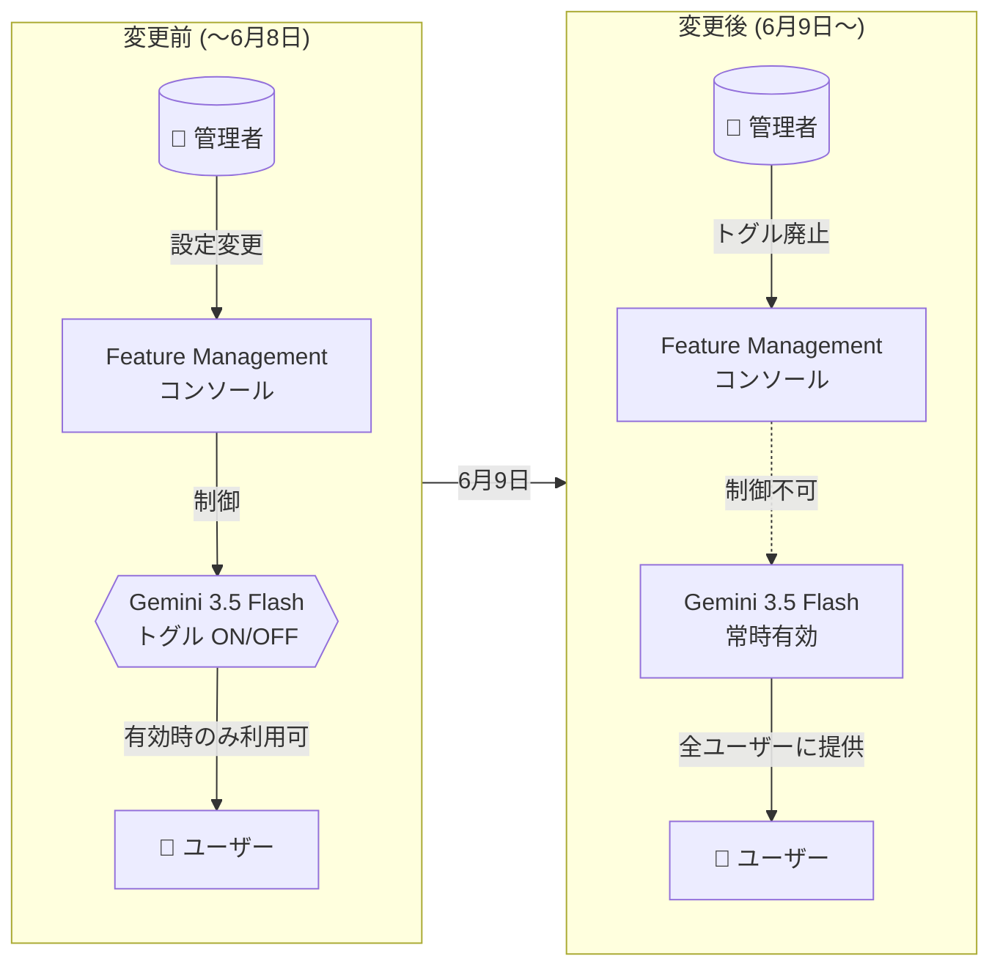

# Gemini Enterprise: Gemini 3.5 Flash 管理者制御トグルの廃止

**リリース日**: 2026-06-05

**サービス**: Gemini Enterprise

**機能**: Gemini 3.5 Flash 機能管理トグルの廃止

**ステータス**: Announcement

📊 [このアップデートのインフォグラフィックを見る](https://takech9203.github.io/google-cloud-news-summary/20260605-gemini-enterprise-gemini-3-5-flash-admin-control.html)

## 概要

Gemini Enterprise の管理者向けに重要なポリシー変更が発表された。2026 年 6 月 9 日をもって、Gemini 3.5 Flash の機能管理トグルが廃止され、すべてのユーザーに対して Gemini 3.5 Flash がデフォルトで有効化される。管理者がこの機能を無効化することはできなくなる。

この変更は Global、US、EU のマルチリージョンに適用される。当初 6 月 8 日に予定されていた廃止日は 1 日延長され、6 月 9 日となった。Gemini 3.5 Flash は 2026 年 5 月 19 日に GA (一般提供) となった最新の Flash モデルであり、Pro レベルのコーディング能力、並列エージェンティック実行、Flash 価格帯のコストとスピードを提供する。

管理者は 6 月 9 日までに、組織内のユーザーへの周知や、必要に応じたポリシー対応を完了する必要がある。

**アップデート前の課題**

- 管理者が Feature Management のトグルを使って Gemini 3.5 Flash を組織単位で有効/無効に制御できていた
- セキュリティポリシーやコンプライアンス要件に基づいて、特定のモデルへのアクセスを制限する運用が可能だった
- 組織の準備状況に応じて段階的な展開が可能だった

**アップデート後の改善**

- Gemini 3.5 Flash がすべてのユーザーに標準提供され、組織全体で統一的に最新モデルを利用可能になった
- 管理者によるトグル管理の運用負荷が軽減された
- ユーザーが常に最新の AI モデル (Pro レベルの知能を Flash 価格で提供) にアクセスできるようになった

## アーキテクチャ図

管理者による Gemini 3.5 Flash のトグル制御が廃止され、全ユーザーへの常時提供に移行するプロセスを示す。変更前は管理者がモデルの有効/無効を制御できたが、変更後はトグルが削除され、すべてのユーザーが自動的に Gemini 3.5 Flash を利用可能になる。

## サービスアップデートの詳細

### 主要機能

1. **機能管理トグルの廃止**
   - 2026 年 6 月 9 日以降、Gemini Enterprise の Feature Management 画面から Gemini 3.5 Flash のトグルが削除される
   - 管理者がモデルの可視性を制御する手段がなくなる
   - Gemini Enterprise アプリのチャットボックスで全ユーザーが Gemini 3.5 Flash を利用可能になる

2. **デフォルト有効化**
   - Gemini 3.5 Flash がすべてのユーザーに対してデフォルトで有効化される
   - ユーザーはモデルセレクターのドロップダウンから Gemini 3.5 Flash を選択可能
   - Agent Designer でも Gemini 3.5 Flash が利用可能

3. **スケジュールの延長**
   - 当初の予定: 2026 年 6 月 8 日
   - 変更後の予定: 2026 年 6 月 9 日 (1 日延長)
   - 初回アナウンス: 2026 年 5 月 26 日

## 技術仕様

### Gemini 3.5 Flash モデル仕様

| 項目 | 詳細 |
|------|------|
| モデル ID | gemini-3.5-flash |
| ステータス | GA (2026 年 5 月 19 日〜) |
| 最大入力トークン | 1,048,576 |
| 最大出力トークン | 65,535 |
| 対応リージョン | Global、US、EU |
| 知識カットオフ日 | 2025 年 1 月 |

### 管理者制御の変更タイムライン

| 日付 | イベント |
|------|---------|
| 2026-05-19 | Gemini 3.5 Flash GA リリース |
| 2026-05-26 | 管理者制御廃止の初回アナウンス (6 月 8 日予定) |
| 2026-06-05 | 期日変更のアナウンス (6 月 9 日に延長) |
| 2026-06-09 | 機能管理トグル廃止、全ユーザーに有効化 |

### 影響を受ける Feature Management 設定

| 設定項目 | 変更前 | 変更後 |
|----------|--------|--------|
| Enable model selector | 管理者が ON/OFF 制御可能 | 引き続き管理者が制御可能 |
| Gemini 3.5 Flash トグル | 管理者が ON/OFF 制御可能 | トグル廃止 (常時有効) |
| Gemini 2.5 Pro トグル | OFF にできない (GA のため) | 変更なし |

## 設定方法

### 管理者が 6 月 9 日までに実施すべきアクション

#### ステップ 1: 現在の設定状況を確認

1. Google Cloud コンソールで Gemini Enterprise ページに移動
2. 対象のアプリ名をクリック
3. [Configurations] > [Feature Management] タブを開く
4. Model availability セクションで Gemini 3.5 Flash の現在の設定を確認

#### ステップ 2: ユーザーへの事前通知

1. 現在 Gemini 3.5 Flash を無効にしている場合、ユーザーに新モデルが利用可能になることを周知
2. 利用ガイドラインやセキュリティポリシーの更新が必要な場合は事前に対応
3. AI 利用に関する社内ポリシーの見直しが必要かを確認

#### ステップ 3: コンプライアンス要件の確認

1. データ処理に関するコンプライアンス要件を確認
2. Gemini 3.5 Flash のセキュリティコントロール (Data Residency、CMEK、VPC-SC、AXT) が要件を満たすことを確認
3. 必要に応じて、VPC Service Controls や組織ポリシーの設定を調整

## メリット

### ビジネス面

- **組織全体での AI 活用促進**: すべてのユーザーが最新の Flash モデルにアクセスできることで、AI 活用の民主化が進む
- **管理運用の簡素化**: トグル管理の運用負荷が削減され、管理者はより戦略的なタスクに集中可能
- **一貫したユーザー体験**: 組織内で統一されたモデル利用が可能になり、生産性のばらつきが軽減される

### 技術面

- **Pro レベルの性能を Flash 価格で**: Gemini 3.5 Flash は Pro レベルのコーディング能力と並列エージェンティック実行を Flash 価格帯で提供
- **マルチモーダル対応**: テキスト、コード、画像、音声、動画、PDF の入力に対応
- **高度な機能サポート**: 構造化出力、思考機能 (Thinking)、コード実行、関数呼び出し、コンテキストキャッシュに対応

## デメリット・制約事項

### 制限事項

- 管理者が Gemini 3.5 Flash を無効化する手段がなくなる
- 組織のセキュリティポリシーでモデルの段階的展開を行っていた場合、そのワークフローが利用不可になる
- Gemini 2.5 Flash は既にモデルセレクターから削除されており、ダウングレードの選択肢がない

### 考慮すべき点

- AI 利用に厳格なポリシーを設けている組織は、6 月 9 日までにポリシーの更新が必要
- 監査やコンプライアンス対応で、モデル変更の記録を残す必要がある場合は事前に対応
- ユーザーが新モデルの特性 (知識カットオフ日が 2025 年 1 月) を理解していることを確認
- Gemini 3.5 Flash ではファインチューニング (Supervised / Continuous / Preference) および Gemini Live API が未対応

## ユースケース

### ユースケース 1: モデル制限付き環境からの移行

**シナリオ**: セキュリティポリシー上、新しい AI モデルの導入には評価期間を設けていた組織が、6 月 9 日のトグル廃止に対応する。

**対応手順**:
1. セキュリティチームと Gemini 3.5 Flash のセキュリティコントロール (CMEK、VPC-SC、AXT、Data Residency) を確認
2. テスト環境で Gemini 3.5 Flash の動作を評価
3. 利用ガイドラインを更新し、ユーザーに展開

**効果**: コンプライアンス要件を満たしつつ、全ユーザーが最新モデルの恩恵を受けられる

### ユースケース 2: 全社的な AI 活用の標準化

**シナリオ**: これまで部門ごとに AI モデルの利用設定が異なっていた大規模組織が、統一的なモデル利用環境を構築する。

**効果**: Gemini 3.5 Flash の標準化により、部門間での知見共有やベストプラクティスの横展開が容易になり、組織全体の AI リテラシー向上に寄与する

## 料金

Gemini 3.5 Flash の利用は Gemini Enterprise のエディション料金に含まれる。追加のモデル利用料は発生しない。

Gemini Enterprise の料金の詳細については [Gemini Enterprise 料金ページ](https://cloud.google.com/gemini-enterprise-agent-platform/generative-ai/pricing) を参照。

## 利用可能リージョン

| リージョン | トグル廃止の適用 |
|-----------|-----------------|
| Global | 対象 |
| US (マルチリージョン) | 対象 |
| EU (マルチリージョン) | 対象 |

## 関連サービス・機能

- **Gemini Enterprise Feature Management**: 管理者が Web アプリの各機能 (Agent Gallery、Agent Designer、Canvas、画像生成、モデルセレクター等) の有効/無効を制御する仕組み。Gemini 3.5 Flash 以外のトグルは引き続き利用可能
- **Agent Designer**: エージェント作成ツール。2026 年 6 月 1 日に US/Global リージョンのエージェントが Gemini 3.5 Flash に自動移行済み
- **Gemini 2.5 Pro**: GA モデルとしてトグルを OFF にできない状態で引き続き利用可能
- **Gemini 3.1 Pro**: Limited Availability で US/Global リージョンに提供中。管理者がトグルで制御可能

## 参考リンク

- 📊 [インフォグラフィック](https://takech9203.github.io/google-cloud-news-summary/20260605-gemini-enterprise-gemini-3-5-flash-admin-control.html)
- [公式リリースノート](https://docs.cloud.google.com/release-notes#June_05_2026)
- [Web アプリ機能管理ドキュメント](https://docs.cloud.google.com/gemini/enterprise/docs/manage-web-app-features)
- [Gemini 3.5 Flash モデル仕様](https://docs.cloud.google.com/gemini-enterprise-agent-platform/models/gemini/3-5-flash)
- [Gemini Enterprise リリースノート](https://docs.cloud.google.com/gemini/enterprise/docs/release-notes)
- [料金ページ](https://cloud.google.com/gemini-enterprise-agent-platform/generative-ai/pricing)

## まとめ

Gemini Enterprise において Gemini 3.5 Flash の管理者制御トグルが 2026 年 6 月 9 日に廃止される。管理者はこの日までに、ユーザーへの周知、セキュリティポリシーの確認・更新、コンプライアンス要件の検証を完了する必要がある。全ユーザーが Pro レベルの性能を持つ最新 Flash モデルに標準的にアクセスできるようになることは、組織の AI 活用を加速する一方で、モデル展開を段階的に管理していた組織には事前準備が求められる。

---

**タグ**: #GeminiEnterprise #Gemini35Flash #AdminControl #FeatureManagement #GoogleCloud #PolicyChange
