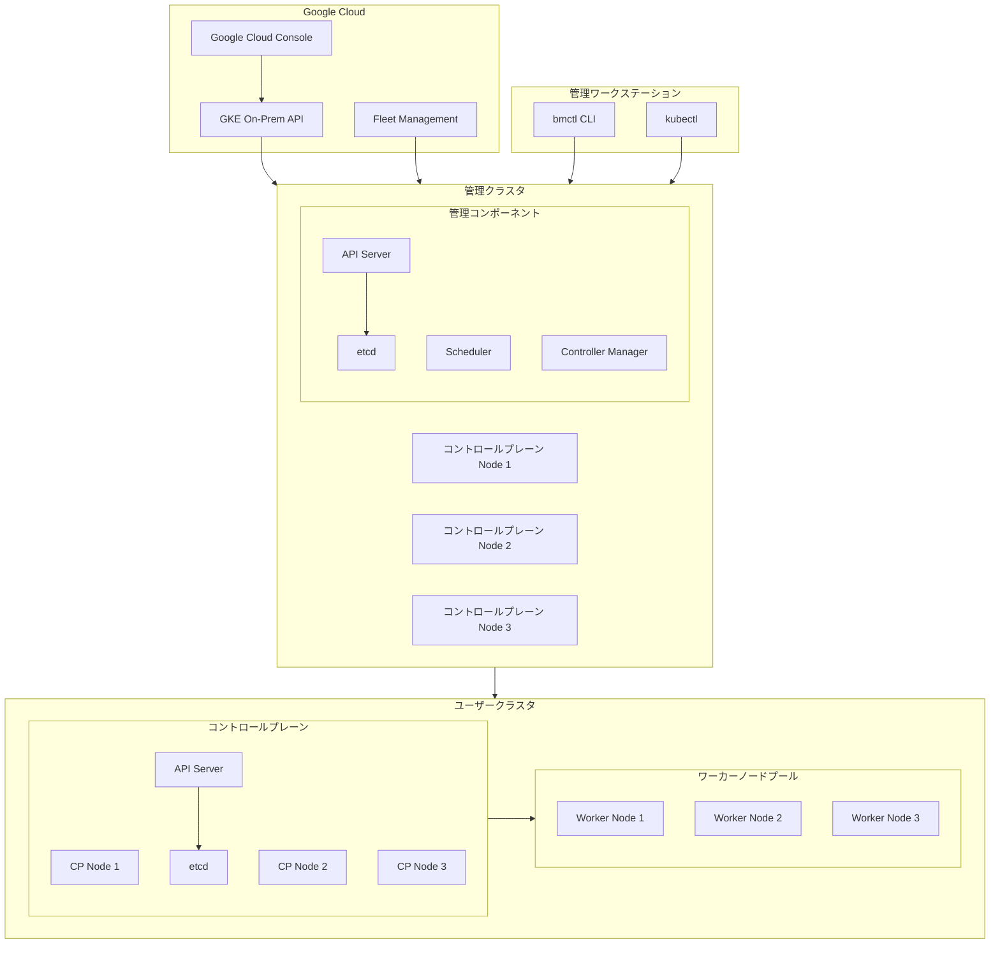

# Google Distributed Cloud (bare metal): バージョン 1.33.900-gke.90 リリース

**リリース日**: 2026-06-05

**サービス**: Google Distributed Cloud (software only) for bare metal

**機能**: バージョン 1.33.900-gke.90

**ステータス**: GA

📊 [このアップデートのインフォグラフィックを見る](https://takech9203.github.io/google-cloud-news-summary/20260605-google-distributed-cloud-bare-metal-1-33-900.html)

## 概要

Google Distributed Cloud (software only) for bare metal バージョン 1.33.900-gke.90 がリリースされました。本バージョンは Kubernetes v1.33.11-gke.100 上で動作し、コントロールプレーンの安定性とノードプール管理に関する複数の重要なバグ修正が含まれています。

今回のリリースでは、特にクラスタの運用信頼性を大幅に向上させる修正が中心となっています。etcd メンバーシップのクリーンアップ、証明書ローテーション時の遅延解消、ノードプール更新時のテイント・ラベルの固着問題など、本番環境で遭遇しやすい運用上の課題が解決されています。

リリース後、GKE On-Prem API クライアント（Google Cloud コンソール、gcloud CLI、Terraform）でのインストールまたはアップグレードが可能になるまで、約 7～14 日かかります。

**アップデート前の課題**

- ノードプール更新中に一時的または部分的な障害が発生すると、ノードのテイントやラベルが永続的に固着（ストランド）し、ワーカーノードのスケジューリングに影響を与えていた
- 新しいコントロールプレーンノードがブートストラップまたはスケーリング中にクラスタへの参加に失敗した場合、孤立した etcd メンバーシップがクリーンアップされず、既存の API サーバーが繰り返し再起動していた
- コントロールプレーンの証明書ローテーションや etcd 暗号化更新時に、ローカル API サーバーの再起動待ちでコントロールプレーンノードあたり 3 分間のストールが発生していた
- etcd 暗号化の有効化または更新時に API サーバーが突然終了し、最大 5 分間の接続タイムアウトが発生していた
- 以前使用した名前でユーザークラスタを再作成すると、k8s-health-check サービスアカウントの欠落によりプロビジョニングが無期限に停止していた

**アップデート後の改善**

- ノードプール更新の一時的な障害がテイントやラベルの永続的な固着を引き起こさなくなった
- 孤立した etcd メンバーシップが自動的にクリーンアップされ、API サーバーの不要な再起動が防止される
- 証明書ローテーションおよび etcd 暗号化更新時のストール時間が解消され、ノードが Unknown ステータスを報告しなくなった
- etcd 暗号化の有効化・更新時に API サーバーがグレースフルに再起動され、接続タイムアウトが発生しなくなった
- 以前使用した名前でのユーザークラスタ再作成が正常に完了するようになった

## アーキテクチャ図



Google Distributed Cloud for bare metal のクラスタアーキテクチャを示しています。管理クラスタがユーザークラスタのライフサイクルを管理し、Google Cloud のコンソールや GKE On-Prem API、管理ワークステーションの bmctl から操作できます。今回の修正は主にコントロールプレーンの etcd と API Server、およびワーカーノードプールの管理に関連しています。

## サービスアップデートの詳細

### バージョン情報

| 項目 | 詳細 |
|------|------|
| リリースバージョン | 1.33.900-gke.90 |
| Kubernetes バージョン | v1.33.11-gke.100 |
| 前回バージョン | 1.33.800-gke.75 (2026-05-18) |
| 利用可能時期 | リリース後 7～14 日で GKE On-Prem API クライアントから利用可能 |

### 主要修正内容

1. **ノードプール更新時のテイント・ラベル固着問題の修正**
   - ノードプール更新中に一時的または部分的な障害が発生した場合に、ノードテイントやラベルがワーカーノード上で永続的に固着（ストランド）する問題を修正
   - これによりスケジューリング不整合やワークロード配置の問題が解消される

2. **孤立した etcd メンバーシップのクリーンアップ**
   - 新しいコントロールプレーンノードがブートストラップまたはスケーリング中にクラスタへの参加に失敗した際、孤立した etcd メンバーシップが残存する問題を修正
   - 従来はこの孤立メンバーシップが原因で既存コントロールプレーンの API サーバーが繰り返し再起動していた

3. **証明書ローテーション時のストール解消**
   - コントロールプレーンの証明書ローテーションや etcd 暗号化更新時に、ローカル API サーバーの再起動待ちでコントロールプレーンノードあたり 3 分間インストーラーがストールする問題を修正
   - ストール中にノードが一時的に Unknown ステータスを報告する問題も解消

4. **etcd 暗号化更新時の API サーバーの突然終了の修正**
   - etcd 暗号化の有効化または更新時に API サーバーが突然終了（abrupt termination）し、最大 5 分間の接続タイムアウトが発生する問題を修正
   - グレースフルな再起動プロセスが実装された

5. **ユーザークラスタ再作成時のプロビジョニング停止の修正**
   - 以前使用した名前でユーザークラスタを再作成する際、k8s-health-check サービスアカウントの欠落によりプロビジョニングが無期限に停止する問題を修正

## 技術仕様

### 対応クラスタタイプ

| クラスタタイプ | 説明 | 対応状況 |
|---------------|------|---------|
| Admin クラスタ | ユーザークラスタを管理するクラスタ | 対応 |
| User クラスタ | ワークロードを実行するクラスタ | 対応 |
| Hybrid クラスタ | 管理機能とワークロード実行を兼ねるクラスタ | 対応 |
| Standalone クラスタ | 自己管理型の単独クラスタ | 対応 |

### ノード要件

| リソース | 最小要件 | 推奨 |
|---------|---------|------|
| CPU/vCPU | 4 コア | 8 コア |
| RAM | 16 GiB | 32 GiB |
| ストレージ | 128 GiB | 256 GiB |

## 設定方法

### 前提条件

1. 既存の Google Distributed Cloud for bare metal クラスタ（バージョン 1.33.x）が稼働していること
2. 管理ワークステーションに最新の bmctl がダウンロードされていること
3. Application Default Credentials (ADC) が設定されていること
4. サードパーティストレージベンダーを使用している場合、本バージョンの対応状況を確認済みであること

### 手順

#### ステップ 1: ADC の設定

```bash
gcloud auth application-default login
```

Google アカウントで認証を行い、ADC を設定します。

#### ステップ 2: bmctl のダウンロード

最新の bmctl をダウンロードします。bmctl のバージョンがアップグレード対象バージョン（1.33.900-gke.90）と一致している必要があります。

#### ステップ 3: クラスタ構成ファイルの更新

```yaml
apiVersion: baremetal.cluster.gke.io/v1
kind: Cluster
metadata:
  name: my-cluster
  namespace: cluster-my-cluster
spec:
  type: user
  anthosBareMetalVersion: 1.33.900-gke.90
```

`anthosBareMetalVersion` フィールドをターゲットバージョンに更新します。

#### ステップ 4: クラスタのアップグレード実行

```bash
bmctl upgrade cluster -c CLUSTER_NAME --kubeconfig ADMIN_KUBECONFIG
```

アップグレードにはプリフライトチェックが含まれ、クラスタの状態とノードの正常性が検証されます。

## メリット

### ビジネス面

- **運用コストの削減**: コントロールプレーンの障害からの自動回復により、手動介入の必要性が大幅に減少
- **サービス可用性の向上**: etcd 暗号化更新時の最大 5 分間のダウンタイムが解消され、SLA 遵守が容易に
- **クラスタ再利用の効率化**: 以前の名前でのクラスタ再作成が正常に動作し、リソースの再利用サイクルが改善

### 技術面

- **コントロールプレーンの安定性向上**: 孤立した etcd メンバーシップの自動クリーンアップにより API サーバーの不要な再起動が防止される
- **証明書ローテーションの高速化**: コントロールプレーンノードあたり 3 分のストールが解消され、ローテーション全体の所要時間が短縮
- **ノードプール管理の信頼性向上**: 一時的な障害がテイントやラベルの永続的な不整合を引き起こさなくなり、Pod スケジューリングの正確性が保証される

## デメリット・制約事項

### 制限事項

- リリース後、GKE On-Prem API クライアントでの利用可能化まで約 7～14 日の待機期間がある
- ダウングレード（低いバージョンへの移行）はサポートされていない
- サードパーティストレージベンダーを使用している場合、本バージョンの認定状況を個別に確認する必要がある

### 考慮すべき点

- アップグレード前にプリフライトチェックが実行され、チェックに失敗した場合はアップグレードが進行しない
- 管理クラスタは関連するユーザークラスタより先にアップグレードする必要がある
- アップグレード中はワークロードへの影響を最小限にするため、HA 構成を推奨

## 関連サービス・機能

- **GKE Enterprise**: Google Distributed Cloud は GKE Enterprise の一部として提供されるハイブリッド・マルチクラウドプラットフォーム
- **GKE On-Prem API**: Google Cloud コンソール、gcloud CLI、Terraform からのクラスタライフサイクル管理を提供
- **Fleet Management**: 複数のクラスタを統一的に管理するためのフリート管理機能
- **Connect Gateway**: オンプレミスクラスタへの安全なリモートアクセスを提供
- **Cloud Logging / Cloud Monitoring**: クラスタのログとメトリクスの一元管理

## 参考リンク

- 📊 [インフォグラフィック](https://takech9203.github.io/google-cloud-news-summary/20260605-google-distributed-cloud-bare-metal-1-33-900.html)
- [公式リリースノート](https://docs.cloud.google.com/release-notes#June_05_2026)
- [アップグレードガイド](https://cloud.google.com/distributed-cloud/bare-metal/docs/how-to/upgrade)
- [脆弱性修正一覧](https://cloud.google.com/kubernetes-engine/distributed-cloud/bare-metal/docs/vulnerabilities)
- [既知の問題](https://cloud.google.com/kubernetes-engine/distributed-cloud/bare-metal/docs/troubleshooting/known-issues)
- [ダウンロードページ](https://cloud.google.com/kubernetes-engine/distributed-cloud/bare-metal/docs/downloads)

## まとめ

Google Distributed Cloud for bare metal 1.33.900-gke.90 は、コントロールプレーンの安定性とノードプール管理の信頼性を大幅に改善するリリースです。特に etcd 関連の障害回復、証明書ローテーション時の遅延解消、ノードテイント・ラベルの固着問題の修正は、本番環境の運用品質を直接的に向上させます。既存の 1.33.x クラスタを運用している場合は、これらの重要な修正を適用するためにアップグレードを計画することを推奨します。

---

**タグ**: #GoogleDistributedCloud #BareMetal #Kubernetes #GoogleCloud #GKEEnterprise #etcd #ControlPlane
