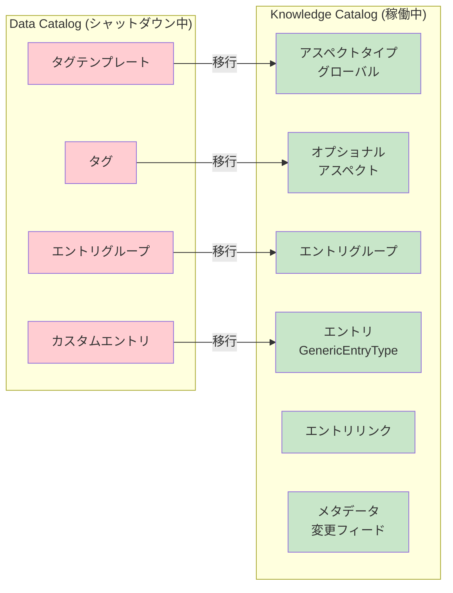

# Knowledge Catalog (Data Catalog): Data Catalog サービスの段階的シャットダウン開始

**リリース日**: 2026-06-05

**サービス**: Knowledge Catalog (Data Catalog)

**機能**: Data Catalog サービスの段階的シャットダウン

**ステータス**: Deprecated

📊 [このアップデートのインフォグラフィックを見る](https://takech9203.github.io/google-cloud-news-summary/20260605-knowledge-catalog-data-catalog-shutdown.html)

## 概要

2026年6月1日より、Data Catalog サービスの段階的シャットダウンが開始されました。この日以降、Data Catalog API へのアクセスに障害が発生したり、完全にアクセスできなくなる可能性があります。Knowledge Catalog（旧称 Dataplex Catalog）は影響を受けず、引き続き正常に稼働します。

Data Catalog は 2025年2月3日に非推奨（Deprecated）となり、Google Cloud Platform の利用規約に基づく猶予期間を経て、2026年6月1日がシャットダウン予定日として設定されていました。今回のリリースノートは、そのシャットダウンが実際に開始されたことを通知するものです。

まだ移行を完了していないユーザーは、速やかに Knowledge Catalog への移行を実施する必要があります。Knowledge Catalog は Data Catalog の後継サービスとして、より堅牢なメタモデル、改善されたスケーラビリティ、エントリリンクやメタデータ変更フィードなどの新機能を提供しています。

**アップデート前の課題**

- Data Catalog を使用していたユーザーは、非推奨通知後も API が利用可能だったため移行を先延ばしにする可能性があった
- Data Catalog のメタモデルはカスタムエントリの構造を強制できず、メタデータの一貫性が保ちにくかった
- エントリリンクやメタデータ変更フィード（Pub/Sub 連携）などの機能が Data Catalog では利用できなかった

**アップデート後の改善**

- Knowledge Catalog への一本化により、メタデータ管理の統一的なプラットフォームが確立される
- 型付きエントリによるメタデータ標準の強制が可能になり、データガバナンスが向上する
- エントリリンク、アスペクトタイプ、メタデータ変更フィードなどの新機能が活用可能になる

## アーキテクチャ図



Data Catalog の各リソースが Knowledge Catalog の対応するリソースに移行される関係を示しています。赤色がシャットダウン中のリソース、緑色が移行先の稼働中リソースです。

## サービスアップデートの詳細

### 主要機能

1. **段階的シャットダウンの開始**
   - 2026年6月1日以降、Data Catalog API へのアクセスに障害が発生する可能性がある
   - 完全にアクセスできなくなる場合もある
   - Knowledge Catalog（旧 Dataplex Catalog）は影響を受けない

2. **移行対象のリソース**
   - タグテンプレート → アスペクトタイプ（グローバル）
   - タグ → オプショナルアスペクト
   - エントリグループ → エントリグループ
   - カスタムエントリ → GenericEntryType のエントリ

3. **Knowledge Catalog の追加機能**
   - エントリリンク（entry links）によるリソース間の関係性定義
   - メタデータ変更フィード（Pub/Sub への Near real-time 通知）
   - 型付きエントリによるメタデータ標準の強制
   - リスト、マップ、配列などの複雑な構造のサポート

## 技術仕様

### 非推奨・シャットダウンのタイムライン

| 項目 | 日付 | 詳細 |
|------|------|------|
| Data Catalog 非推奨発表 | 2025年2月3日 | 公式に Deprecated としてマーク |
| Business Glossary on Data Catalog 非推奨 | 2025年5月19日 | Knowledge Catalog のビジネス用語集への移行推奨 |
| Data Catalog シャットダウン開始 | 2026年6月1日 | 段階的にアクセス不可に |
| Business Glossary on Data Catalog シャットダウン | 2026年6月1日 | Knowledge Catalog のビジネス用語集を使用 |

### リソースマッピング

| Data Catalog リソース | Knowledge Catalog リソース | 説明 |
|------|------|------|
| パブリックタグテンプレート | アスペクトタイプ（グローバル） | リージョナルからグローバルに変換 |
| パブリックタグ | オプショナルアスペクト | メタデータアノテーションとして継続 |
| エントリグループ | エントリグループ | システムエントリグループはプロジェクト単位で確立 |
| カスタムエントリ | GenericEntryType エントリ | 標準プロパティは required aspects としてモデル化 |
| システムエントリ | システムエントリ required aspects | スキーマなどはシステム定義アスペクトタイプで表現 |

## 設定方法

### 前提条件

1. Google Cloud プロジェクトで Dataplex API が有効化されていること
2. 適切な IAM ロール（Dataplex Catalog Admin, Editor, または Viewer）が付与されていること

### 手順

#### ステップ 1: 準備フェーズ - プライベートタグテンプレートの公開化

Data Catalog のプライベートタグテンプレートをパブリックに更新します。これにより Knowledge Catalog でアスペクトタイプとして表示されるようになります。

```bash
# Data Catalog のタグテンプレート一覧を確認
gcloud data-catalog tag-templates list --location=LOCATION
```

#### ステップ 2: 準備フェーズ - IAM 権限の設定

Knowledge Catalog でカスタムメタデータにアクセスするための IAM 権限を設定します。

```bash
# Knowledge Catalog の IAM 権限付与
gcloud projects add-iam-policy-binding PROJECT_ID \
    --member="user:USER_EMAIL" \
    --role="roles/dataplex.catalogEditor"
```

#### ステップ 3: アップグレードフェーズ - デフォルト UI の切り替え

Google Cloud コンソールで「Manage transition to Knowledge Catalog」ページにアクセスし、デフォルトの Catalog UI エクスペリエンスを Knowledge Catalog に設定します。

#### ステップ 4: アップグレードフェーズ - カスタムメタデータのアップグレード

Data Catalog のカスタムメタデータを Knowledge Catalog にアップグレードし、読み取り専用から読み書き可能な状態に移行します。

#### ステップ 5: プログラマティックワークロードの更新

API、クライアントライブラリ、Terraform モジュール、gcloud コマンドを Data Catalog API から Dataplex API に更新します。

## メリット

### ビジネス面

- **統一されたメタデータ管理**: 1つのプラットフォームでメタデータを一元管理できるため、データガバナンスが簡素化される
- **データ発見性の向上**: Knowledge Catalog の強化された検索機能により、組織内のデータアセットの発見が容易になる

### 技術面

- **堅牢なメタモデル**: 型付きエントリと必須アスペクトにより、メタデータの構造と品質を強制できる
- **スケーラビリティの改善**: 単一のアトミックな CRUD 操作でエントリに関連する全メタデータを操作可能
- **Near real-time メタデータ変更通知**: Pub/Sub を通じたメタデータ変更フィードでリアルタイムな連携が可能

## デメリット・制約事項

### 制限事項

- プライベートアスペクト/プライベートアスペクトタイプの概念は Knowledge Catalog に存在しない
- ポリシータグの検索は Knowledge Catalog 検索でサポートされていない
- Data Catalog のカスタムメタデータを Knowledge Catalog に持ち込む際、元の権限は引き継がれない（再設定が必要）
- Sensitive Data Protection の検査結果を直接 Knowledge Catalog に送信する機能はサポートされていない

### 考慮すべき点

- 移行完了前にシャットダウンが進行すると、Data Catalog API 経由のアクセスが突然失敗する可能性がある
- Data Catalog から Knowledge Catalog への更新伝搬には通常10分程度かかるが、それ以上かかる場合もある
- デフォルト UI を Knowledge Catalog に切り替えた後の Data Catalog への復帰は例外的なケースに限定される
- レイク、ゾーン、アセット、エンティティの Knowledge Catalog エントリとしての登録はサポートされていない

## ユースケース

### ユースケース 1: カスタムメタデータなしの場合の移行

**シナリオ**: Data Catalog を使用しているが、タグ、タグテンプレート、カスタムエントリ、エントリグループなどのカスタムメタデータを持たない組織

**実装例**:
```
Google Cloud コンソール > Tag templates > 
"Manage transition to Knowledge Catalog" > 
"Default catalog UI experience" タブ > 
"Set the default catalog UI experience to Knowledge Catalog" をクリック
```

**効果**: UI の切り替えのみで移行が完了し、Knowledge Catalog の全機能を即座に利用可能になる

### ユースケース 2: カスタムメタデータを持つ場合の段階的移行

**シナリオ**: タグテンプレートやタグを活用してデータアセットにメタデータを付与している組織が、プログラマティックワークロードを含めて完全移行する

**効果**: 準備フェーズでは Data Catalog が引き続き信頼できるソースとして機能しつつ、Knowledge Catalog でもメタデータが読み取り専用で利用可能になり、段階的に完全移行を達成できる

## 料金

Knowledge Catalog はメタデータストレージ SKU に基づいて課金されます。以下は無料で利用可能です:

- Knowledge Catalog でのカタログリソースの作成・管理
- Search API の呼び出し
- Google Cloud コンソールでの Knowledge Catalog ページの検索クエリ

詳細は [Knowledge Catalog の料金ページ](https://cloud.google.com/dataplex/pricing) を参照してください。

## 利用可能リージョン

Knowledge Catalog は Dataplex が利用可能な全リージョンで利用可能です。グローバルアスペクトタイプの定義は全リージョンにレプリケーションされます。

## 関連サービス・機能

- **Dataplex**: Knowledge Catalog は Dataplex の一部として統合されており、メタデータストレージと API は Dataplex API に統合されている
- **BigQuery**: Knowledge Catalog でシステムエントリとして自動的にカタログ化される主要なデータソース
- **Pub/Sub**: メタデータ変更フィードの配信先として使用される
- **Data Lineage**: データリネージ機能は Dataplex API を通じてエントリ詳細を取得するように更新されている

## 参考リンク

- 📊 [インフォグラフィック](https://takech9203.github.io/google-cloud-news-summary/20260605-knowledge-catalog-data-catalog-shutdown.html)
- [公式リリースノート](https://docs.cloud.google.com/release-notes#June_05_2026)
- [Data Catalog から Knowledge Catalog への移行ガイド](https://docs.cloud.google.com/dataplex/docs/transition-to-dataplex-catalog)
- [Knowledge Catalog 概要ドキュメント](https://docs.cloud.google.com/dataplex/docs/catalog-overview)
- [Data Catalog 非推奨情報](https://docs.cloud.google.com/data-catalog/docs/deprecations)
- [Knowledge Catalog 料金ページ](https://cloud.google.com/dataplex/pricing)

## まとめ

Data Catalog サービスの段階的シャットダウンが 2026年6月1日から開始されており、API アクセスに障害が発生する可能性があります。まだ移行を完了していない組織は、「Transition from Data Catalog to Knowledge Catalog」ガイドに従い、速やかに Knowledge Catalog への移行を完了させることが強く推奨されます。Knowledge Catalog はより堅牢なメタモデルと拡張された機能を提供しており、データガバナンスの基盤として長期的に活用できます。

---

**タグ**: #KnowledgeCatalog #DataCatalog #Dataplex #Deprecated #メタデータ管理 #移行 #シャットダウン
