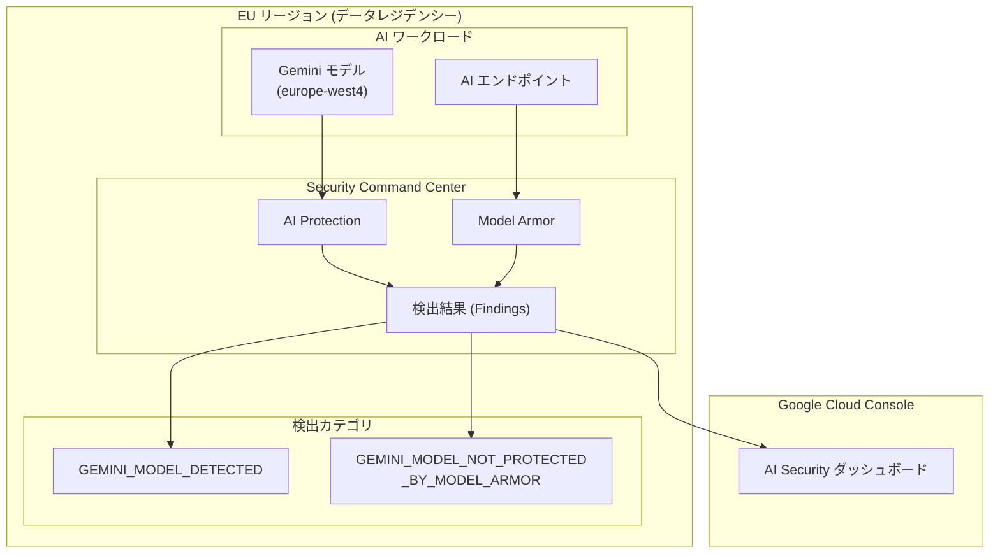

# Security Command Center: AI Protection が EU データレジデンシーをサポート、検出カテゴリ名を変更

**リリース日**: 2026-06-05

**サービス**: Security Command Center

**機能**: AI Protection の EU データレジデンシー対応および検出カテゴリ名の変更

**ステータス**: GA (一般提供)

[このアップデートのインフォグラフィックを見る](https://takech9203.github.io/google-cloud-news-summary/20260605-security-command-center-ai-protection-eu.html)

## 概要

Security Command Center の AI Protection が、Premium ティアにおいて欧州連合 (EU) でのデータレジデンシーをサポートするようになりました。これにより、EU 内のデータ主権要件を持つ組織が、AI ワークロードのセキュリティ保護を EU リージョン内で完結させることが可能になります。

また、AI Protection の検出カテゴリ名が変更され、AI Protection が検出対象としているのが Gemini ファウンデーションモデルであることをより明確に示す名前になりました。具体的には `VERTEX_AI_MODEL_DETECTED` が `GEMINI_MODEL_DETECTED` に、`VERTEX_AI_MODEL_NOT_PROTECTED_BY_MODEL_ARMOR` が `GEMINI_MODEL_NOT_PROTECTED_BY_MODEL_ARMOR` に変更されています。

これらのアップデートは、EU 規制環境での AI セキュリティ管理を強化し、セキュリティ運用チームがアラートの意味をより直感的に理解できるようにすることを目的としています。

**アップデート前の課題**

- AI Protection のデータレジデンシーは Premium ティアにおいて米国 (US) のみがサポートされており、EU の顧客はデータレジデンシー要件を満たしながら AI Protection を利用できなかった
- 検出カテゴリ名に `VERTEX_AI_MODEL` という接頭辞が使用されており、実際に検出されるのが Gemini ファウンデーションモデルであることが不明瞭だった
- EU の GDPR やデータ主権要件を持つ組織が AI セキュリティ管理において制約を受けていた

**アップデート後の改善**

- Premium ティアで EU マルチリージョンにおける AI Protection のデータレジデンシーが利用可能になった
- 検出カテゴリ名が `GEMINI_MODEL_DETECTED` および `GEMINI_MODEL_NOT_PROTECTED_BY_MODEL_ARMOR` に変更され、検出対象が明確になった
- EU 内の組織が GDPR 等の規制に準拠しながら AI ワークロードのセキュリティ監視を実施できるようになった

## アーキテクチャ図



AI Protection が EU リージョン内で Gemini モデルを検出し、Model Armor による保護状態を監視する全体フローを示しています。データレジデンシーが有効な場合、すべてのデータは EU マルチリージョン内に保持されます。

## サービスアップデートの詳細

### 主要機能

1. **EU データレジデンシーのサポート**
   - Security Command Center Premium ティアの AI Protection が EU マルチリージョン (`eu`) でデータレジデンシーをサポート
   - AI ワークロードは `europe-west4` (オランダ) に配置する必要がある
   - 検出結果 (Findings)、BigQuery エクスポート、通知設定などのリソースが EU 内に保持される

2. **検出カテゴリ名の変更**
   - `VERTEX_AI_MODEL_DETECTED` → `GEMINI_MODEL_DETECTED`: Gemini ファウンデーションモデルが検出されたことを示す
   - `VERTEX_AI_MODEL_NOT_PROTECTED_BY_MODEL_ARMOR` → `GEMINI_MODEL_NOT_PROTECTED_BY_MODEL_ARMOR`: Gemini モデルが Model Armor で保護されていないことを示す
   - カテゴリ名の変更により、検出対象が Gemini モデルであることが明確に

3. **Model Armor との連携**
   - EU リージョンにおいても Model Armor によるプロンプト・レスポンスのスクリーニングが利用可能
   - Model Armor はステートレスサービスとして動作し、EU 内でのデータ処理を保証
   - プロンプトインジェクション、ジェイルブレイク検出、機密データ保護フィルタが利用可能

## 技術仕様

### データレジデンシー対応リージョン

| 項目 | 詳細 |
|------|------|
| マルチリージョンエンドポイント | `eu` (欧州連合) |
| AI ワークロード推奨リージョン | `europe-west4` (オランダ) |
| 対象ティア | Premium (組織レベルアクティベーション必須) |
| データ保持状態 | At rest、In use、In transit すべてで EU 内に保持 |

### 検出カテゴリ名の変更一覧

| 旧カテゴリ名 | 新カテゴリ名 | 説明 |
|-------------|-------------|------|
| `VERTEX_AI_MODEL_DETECTED` | `GEMINI_MODEL_DETECTED` | Gemini ファウンデーションモデルの検出 |
| `VERTEX_AI_MODEL_NOT_PROTECTED_BY_MODEL_ARMOR` | `GEMINI_MODEL_NOT_PROTECTED_BY_MODEL_ARMOR` | Model Armor で保護されていない Gemini モデルの検出 |

### リージョナルエンドポイント

```
https://securitycenter.googleapis.com/v2/organizations/{org_id}/locations/eu
```

## 設定方法

### 前提条件

1. Security Command Center Premium ティアが組織レベルでアクティベーションされていること
2. データレジデンシーが初回アクティベーション時に有効化されていること (後から有効化はできない)
3. AI ワークロードが `europe-west4` リージョンに配置されていること

### 手順

#### ステップ 1: データレジデンシーの確認

データレジデンシーは Security Command Center の初回アクティベーション時にのみ有効化できます。既にアクティベーション済みの場合は、既存の設定を確認してください。

```bash
# Security Command Center の設定確認
gcloud scc settings describe \
  --organization=ORGANIZATION_ID
```

#### ステップ 2: AI Protection の有効化

```bash
# AI Protection サービスの有効化確認
gcloud scc settings services describe ai-protection \
  --organization=ORGANIZATION_ID \
  --location=eu
```

#### ステップ 3: Model Armor テンプレートの作成

```bash
# EU リージョンで Model Armor テンプレートを作成
gcloud model-armor templates create TEMPLATE_ID \
  --project=PROJECT_ID \
  --location=europe-west4 \
  --filter-config='{"piAndJailbreakFilterSettings":{"filterEnforcement":"ENABLED"},"sensitiveDataFilterSettings":{"filterEnforcement":"ENABLED"}}'
```

#### ステップ 4: 検出結果の確認

```bash
# EU リージョンの AI Protection 検出結果を一覧表示
gcloud scc findings list ORGANIZATION_ID \
  --location=eu \
  --filter='category="GEMINI_MODEL_DETECTED" OR category="GEMINI_MODEL_NOT_PROTECTED_BY_MODEL_ARMOR"'
```

## メリット

### ビジネス面

- **EU データ規制への準拠**: GDPR やその他の EU データ保護規制に準拠しながら AI セキュリティ管理が可能に
- **グローバル展開の加速**: EU 拠点の組織がデータ主権を維持しつつ AI ワークロードのセキュリティを確保可能
- **コンプライアンス負担の軽減**: データ所在地の証明が容易になり、監査対応が効率化

### 技術面

- **明確な検出カテゴリ**: カテゴリ名から検出対象 (Gemini モデル) が即座に判別可能
- **リージョナルデータ制御**: Findings、エクスポート設定、通知設定がすべて EU 内に保持
- **既存ワークフローとの互換性**: リージョナルエンドポイントを使用した API アクセスで既存の自動化を維持

## デメリット・制約事項

### 制限事項

- データレジデンシーは Security Command Center の初回アクティベーション時にのみ有効化可能 (後からの有効化は不可)
- 組織レベルのアクティベーションが必須 (プロジェクトレベルでは利用不可)
- AI ワークロードは `europe-west4` リージョンに配置する必要がある (他の EU リージョンでは AI Protection のフル機能が利用できない場合がある)
- Premium ティアのデータレジデンシー環境では一部機能が利用できない場合がある

### 考慮すべき点

- 検出カテゴリ名の変更により、既存のアラートルール、自動化スクリプト、SIEM 連携設定で旧カテゴリ名を参照している箇所の更新が必要
- `VERTEX_AI_MODEL_DETECTED` や `VERTEX_AI_MODEL_NOT_PROTECTED_BY_MODEL_ARMOR` をフィルタ条件で使用している場合は、新しいカテゴリ名への移行を計画する必要がある
- EU リージョンの検出結果は US リージョンの検出結果とは別に管理されるため、マルチリージョン運用の場合は各リージョンで個別に確認が必要

## ユースケース

### ユースケース 1: EU 拠点企業の AI セキュリティ管理

**シナリオ**: ドイツに本社を置く企業が Gemini モデルを活用した社内チャットボットを運用しており、GDPR に準拠したセキュリティ監視が必要。

**実装例**:
```bash
# EU データレジデンシーを有効にした SCC Premium で AI Protection を利用
# europe-west4 に配置された Gemini エンドポイントを監視

gcloud scc findings list ORGANIZATION_ID \
  --location=eu \
  --filter='category="GEMINI_MODEL_NOT_PROTECTED_BY_MODEL_ARMOR"' \
  --format="table(finding.name, finding.category, finding.state, finding.severity)"
```

**効果**: すべてのセキュリティデータが EU 内に保持され、GDPR のデータ移転制限に抵触せずに AI セキュリティ監視が可能。

### ユースケース 2: 検出カテゴリ名変更への対応

**シナリオ**: セキュリティ運用チームが既存の SIEM ルールで `VERTEX_AI_MODEL_DETECTED` を参照しており、新しいカテゴリ名への移行が必要。

**実装例**:
```bash
# 旧カテゴリ名で設定されていたフィルタを新カテゴリ名に更新
# Pub/Sub 通知設定の更新例
gcloud scc notifications update NOTIFICATION_ID \
  --organization=ORGANIZATION_ID \
  --location=eu \
  --filter='category="GEMINI_MODEL_DETECTED" OR category="GEMINI_MODEL_NOT_PROTECTED_BY_MODEL_ARMOR"'
```

**効果**: アラートの見落としを防ぎ、セキュリティ運用の継続性を確保。

## 料金

AI Protection は Security Command Center Premium ティアおよび Enterprise ティアに含まれる機能です。

| ティア | AI Protection の利用 | データレジデンシー (EU) |
|--------|---------------------|----------------------|
| Premium (従量課金) | 利用可能 | 利用可能 |
| Premium (サブスクリプション) | 利用可能 | 利用可能 |
| Enterprise | 利用可能 | 利用可能 |

Model Armor は Security Command Center の一部として、またはスタンドアロンサービスとして購入可能です。詳細な料金情報については [Security Command Center の料金ページ](https://cloud.google.com/security-command-center/pricing) を参照してください。

## 利用可能リージョン

AI Protection のデータレジデンシー対応状況:

| マルチリージョン | ステータス |
|----------------|-----------|
| US (米国) | GA - 利用可能 |
| EU (欧州連合) | GA - 利用可能 (本アップデートで追加) |

AI ワークロード推奨リージョン:

| リージョン | ロケーション | 備考 |
|-----------|-------------|------|
| `europe-west4` | オランダ | Low CO2、EU データレジデンシー対応 |
| `us-central1` | アイオワ | Low CO2 |
| `us-east4` | 北バージニア | - |
| `us-west1` | オレゴン | Low CO2 |

## 関連サービス・機能

- **[Model Armor](https://docs.cloud.google.com/model-armor/overview)**: LLM プロンプト・レスポンスのスクリーニングによる AI セキュリティ強化
- **[Security Command Center Premium](https://docs.cloud.google.com/security-command-center/docs/service-tiers)**: AI Protection を含むセキュリティ管理プラットフォーム
- **[Sensitive Data Protection](https://docs.cloud.google.com/sensitive-data-protection/docs/overview)**: AI データセット内の機密データ検出・分類
- **[Notebook Security Scanner](https://docs.cloud.google.com/security-command-center/docs/enable-notebook-security-scanner)**: Colab Enterprise ノートブックの脆弱性検出

## 参考リンク

- [インフォグラフィック](https://takech9203.github.io/google-cloud-news-summary/20260605-security-command-center-ai-protection-eu.html)
- [公式リリースノート](https://docs.cloud.google.com/release-notes#June_05_2026)
- [AI Protection の概要](https://docs.cloud.google.com/security-command-center/docs/ai-protection-overview)
- [データレジデンシーの計画](https://docs.cloud.google.com/security-command-center/docs/data-residency-support)
- [AI Protection の設定](https://docs.cloud.google.com/security-command-center/docs/configure-ai-protection)
- [リージョナルエンドポイント](https://docs.cloud.google.com/security-command-center/docs/regional-endpoints)
- [Security Command Center 料金](https://cloud.google.com/security-command-center/pricing)

## まとめ

今回のアップデートにより、Security Command Center AI Protection が EU データレジデンシーを Premium ティアでサポートし、欧州の規制要件を持つ組織が AI ワークロードのセキュリティ管理を EU 内で完結できるようになりました。また、検出カテゴリ名の変更は Gemini モデルの検出であることを明確化する改善ですが、既存の自動化設定への影響を確認し、速やかに新しいカテゴリ名への移行を計画することを推奨します。

---

**タグ**: #SecurityCommandCenter #AIProtection #DataResidency #EU #ModelArmor #Gemini #GDPR #セキュリティ #コンプライアンス
