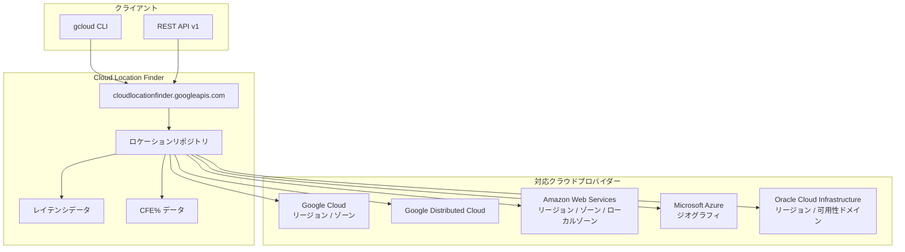

# Cloud Location Finder: 一般提供開始 (GA)

**リリース日**: 2026-06-06

**サービス**: Cloud Location Finder

**機能**: 一般提供開始

**ステータス**: GA

📊 [このアップデートのインフォグラフィックを見る](https://takech9203.github.io/google-cloud-news-summary/20260606-cloud-location-finder-ga.html)

## 概要

Cloud Location Finder が一般提供 (GA) となりました。本サービスは、Google Cloud、Google Distributed Cloud、Microsoft Azure、Amazon Web Services、Oracle Cloud Infrastructure の各クラウドプロバイダーにまたがるリージョンとゾーンのクラウドロケーションを、近接性（レイテンシ）、地理的位置（テリトリーコード）、カーボンフットプリント（CFE%）に基づいて特定・フィルタリングできる公開 API です。

マルチクラウド環境の拡大に伴い、ワークロードの最適な配置先を選定することはますます複雑化しています。Cloud Location Finder は、複数のクラウドプロバイダーのロケーション情報を統合的に提供し、レイテンシの最小化、コンプライアンス要件への対応、サステナビリティ目標の達成を支援します。REST API および gcloud CLI からアクセス可能で、自動的にロケーション情報が更新されるため、ハードコードされたリストの陳腐化を防ぎます。

対象ユーザーは、マルチクラウド戦略を採用する企業のクラウドアーキテクト、インフラストラクチャエンジニア、およびデータレジデンシーやサステナビリティ要件を管理するコンプライアンス担当者です。2025年6月のパブリックプレビューを経て、約1年間の運用実績を積み、本日 GA に到達しました。

**アップデート前の課題**

- マルチクラウド環境でのロケーション選定には、各プロバイダーのドキュメントを個別に調査する必要があった
- クラウドプロバイダー間のレイテンシデータを手動で収集・比較する必要があった
- ロケーション情報のハードコーディングにより、新リージョン追加時に手動更新が必要だった
- カーボンフットプリントを考慮したロケーション選定に統一的な手段がなかった
- Preview 段階のため SLA が保証されず、本番ワークロードでの利用に制約があった

**アップデート後の改善**

- GA により SLA が保証され、本番環境での利用が可能になった
- 5つのクラウドプロバイダーのロケーション情報を単一 API で統合的に検索可能
- ネットワークレイテンシに基づく近接性検索で、最適なデプロイ先を自動的に特定
- VPC Service Controls との統合により、セキュリティ境界内での利用が可能（Preview）
- REST API v1 エンドポイントが利用可能になり、安定した API バージョンで運用可能

## アーキテクチャ図



Cloud Location Finder はクライアント（gcloud CLI または REST API）からのリクエストを受け付け、内部のロケーションリポジトリを参照して、5つのクラウドプロバイダーにまたがるロケーション情報をレイテンシ・CFE% と共に返却します。

## サービスアップデートの詳細

### 主要機能

1. **近接性検索（Proximity Search）**
   - ネットワークレイテンシ（RTT）に基づいて、指定したソースロケーションから最も近いクラウドロケーションを検索
   - クラウドプロバイダーをまたいだ近接性比較が可能
   - ファーストパーティ間、サードパーティ間のレイテンシデータをサポート

2. **テリトリーコードフィルタリング**
   - ISO 3166-1 alpha-2 コードによる国・地域ベースのフィルタリング
   - データレジデンシーやコンプライアンス要件に対応したロケーション選定が可能

3. **カーボンフリーエネルギー（CFE%）ソート**
   - Google Cloud ロケーションのカーボンフリーエネルギー使用率に基づくソート
   - サステナビリティ目標に合致したロケーション選定を支援

4. **マルチクラウドロケーションリポジトリ**
   - Google Cloud、Google Distributed Cloud、AWS、Azure、OCI のロケーションを統合管理
   - 24時間ごとに自動更新され、常に最新のロケーション情報を提供

5. **VPC Service Controls 対応（Preview）**
   - セキュリティ境界内での Cloud Location Finder の利用が可能

## 技術仕様

### API 仕様

| 項目 | 詳細 |
|------|------|
| サービスエンドポイント | `https://cloudlocationfinder.googleapis.com` |
| API バージョン | v1 (GA), v1alpha |
| 認証 | OAuth 2.0 (`https://www.googleapis.com/auth/cloud-platform`) |
| IAM ロール | `roles/cloudlocationfinder.viewer` |
| IAM 権限 | `cloudlocationfinder.cloudLocations.search`, `cloudlocationfinder.cloudLocations.list` |
| gcloud コマンド | `gcloud cloudlocationfinder cloud-locations` |
| データ更新頻度 | 24時間ごと |

### フィルタリングオプション

| フィルタフィールド | 演算子 | 説明 | 例 |
|---|---|---|---|
| `carbon_free_energy_percentage` | >, < | CFE% でフィルタ（Google Cloud のみ） | `carbon_free_energy_percentage > 75` |
| `cloud_location_type` | =, != | ロケーションタイプ（REGION, ZONE 等） | `cloud_location_type = CLOUD_LOCATION_TYPE_REGION` |
| `cloud_provider` | =, != | クラウドプロバイダー | `cloud_provider = CLOUD_PROVIDER_GCP` |
| `territory_code` | =, != | ISO 3166-1 alpha-2 国コード | `territory_code = "JP"` |
| `latency` | >, < | レイテンシ（ms 単位の RTT） | `latency < 50` |
| `containing_cloud_location` | =, != | 親ロケーション | リソース名で指定 |

## 設定方法

### 前提条件

1. Google Cloud プロジェクトが作成済みであること
2. Google Cloud CLI がインストール済みであること

### 手順

#### ステップ 1: Cloud Location Finder API の有効化

```bash
gcloud services enable cloudlocationfinder.googleapis.com --project PROJECT_ID
```

#### ステップ 2: IAM ロールの付与

```bash
gcloud projects add-iam-policy-binding PROJECT_ID \
  --member user:myemail@example.com \
  --role roles/cloudlocationfinder.viewer
```

#### ステップ 3: 近接性検索の実行

```bash
# 最も近い Google Cloud ゾーンを検索
gcloud cloudlocationfinder cloud-locations search \
  --source-cloud-location=aws-us-east-1 \
  --query="cloud_provider=CLOUD_PROVIDER_GCP AND cloud_location_type=CLOUD_LOCATION_TYPE_ZONE" \
  --limit=1
```

#### ステップ 4: テリトリーコードによるフィルタリング

```bash
# 日本国内のリージョンを検索
gcloud cloudlocationfinder cloud-locations list \
  --filter="territory_code=\"JP\" AND cloud_location_type=CLOUD_LOCATION_TYPE_REGION"
```

## メリット

### ビジネス面

- **マルチクラウド戦略の加速**: 複数プロバイダーのロケーション情報を統一的に管理し、最適配置の意思決定を迅速化
- **コンプライアンス対応の効率化**: テリトリーコードフィルタにより、データレジデンシー要件を満たすロケーションを即座に特定
- **サステナビリティ目標の達成**: CFE% ベースのソートにより、環境負荷の低いロケーションを優先的に選択可能
- **GA による本番利用の安心感**: SLA 保証により、ミッションクリティカルなワークフローへの組み込みが可能

### 技術面

- **自動更新されるロケーションリポジトリ**: ハードコードされたリストの陳腐化を防止し、新リージョン追加時の手動対応が不要
- **統一 API インターフェース**: REST API と gcloud CLI の両方からアクセス可能で、既存の自動化パイプラインに容易に統合
- **レイテンシベースの最適化**: ネットワーク RTT データに基づく客観的な近接性評価により、パフォーマンス要件を満たすロケーション選定が可能
- **プロジェクトベースのクォータ管理**: クライアントプロジェクトでのみ API 有効化が必要で、リソースプロジェクトへの設定変更不要

## デメリット・制約事項

### 制限事項

- CFE%（カーボンフリーエネルギー）データは Google Cloud ロケーションのみで利用可能。サードパーティプロバイダーの CFE データは提供されない
- サードパーティクラウドのロケーションデータは公開情報に基づいており、Google Cloud はその正確性について責任を負わない
- VPC Service Controls 対応は現在 Preview 段階

### 考慮すべき点

- レイテンシデータはネットワーク条件により変動するため、定期的な再評価が推奨される
- 大規模なクエリでは API クォータに注意が必要
- Google Distributed Cloud connected ロケーションを検索する場合は、追加で GDC Hardware Management API の有効化と `roles/gdchardwaremanagement.reader` ロールの付与が必要

## ユースケース

### ユースケース 1: マルチクラウド DR サイト選定

**シナリオ**: AWS us-east-1 で稼働するアプリケーションの DR サイトを Google Cloud に構築する際、最もレイテンシが低い Google Cloud ゾーンを特定したい。

**実装例**:
```bash
gcloud cloudlocationfinder cloud-locations search \
  --source-cloud-location=aws-us-east-1 \
  --query="cloud_provider=CLOUD_PROVIDER_GCP AND cloud_location_type=CLOUD_LOCATION_TYPE_ZONE" \
  --limit=3
```

**効果**: 手動でのネットワークテスト不要で、RTT データに基づく最適な DR サイト候補を即座に特定。

### ユースケース 2: データレジデンシー対応のロケーション選定

**シナリオ**: GDPR 対応のため、EU 域内のみにデータを保持する必要があるマルチクラウド環境で、利用可能な全プロバイダーのリージョンを一覧化したい。

**実装例**:
```bash
gcloud cloudlocationfinder cloud-locations list \
  --filter="territory_code=\"DE\" AND cloud_location_type=CLOUD_LOCATION_TYPE_REGION"
```

**効果**: 複数プロバイダーのドキュメントを個別に調査する手間を省き、コンプライアンス要件を満たすロケーションを一括で確認可能。

### ユースケース 3: サステナブルなクラウド利用の推進

**シナリオ**: 企業のサステナビリティ目標に基づき、カーボンフリーエネルギー使用率が 75% 以上の Google Cloud リージョンを特定したい。

**実装例**:
```bash
gcloud cloudlocationfinder cloud-locations list \
  --filter="cloud_provider=CLOUD_PROVIDER_GCP AND cloud_location_type=CLOUD_LOCATION_TYPE_REGION AND carbon_free_energy_percentage > 75"
```

**効果**: サステナビリティ KPI に直結するロケーション選定を自動化し、環境報告にも活用可能。

## 料金

料金に関する詳細情報は公式ドキュメントの [Pricing ページ](https://docs.cloud.google.com/location-finder/docs/resources) を参照してください。

## 関連サービス・機能

- **[Google Cloud リージョンとゾーン](https://cloud.google.com/about/locations)**: Cloud Location Finder が参照する Google Cloud のロケーション一覧
- **[Google Distributed Cloud](https://cloud.google.com/distributed-cloud)**: エッジおよびオンプレミスのロケーションもサポート
- **[VPC Service Controls](https://cloud.google.com/vpc-service-controls)**: Cloud Location Finder をセキュリティ境界内で利用可能（Preview）
- **[Carbon Free Energy for Google Cloud](https://cloud.google.com/sustainability/region-carbon)**: CFE% データのソース
- **[Cloud Asset Inventory](https://cloud.google.com/asset-inventory)**: クラウドリソースのインベントリ管理

## 参考リンク

- 📊 [インフォグラフィック](https://takech9203.github.io/google-cloud-news-summary/20260606-cloud-location-finder-ga.html)
- [公式リリースノート](https://docs.cloud.google.com/release-notes#June_06_2026)
- [Cloud Location Finder ドキュメント](https://docs.cloud.google.com/location-finder/docs/overview)
- [クイックスタート](https://docs.cloud.google.com/location-finder/docs/quickstart)
- [REST API リファレンス](https://docs.cloud.google.com/location-finder/docs/reference/rest)
- [クエリ・フィルタ構文](https://docs.cloud.google.com/location-finder/docs/syntax)

## まとめ

Cloud Location Finder の GA リリースにより、マルチクラウド環境におけるロケーション選定が本番環境で安心して利用できるようになりました。レイテンシ最適化、コンプライアンス対応、サステナビリティ目標の達成を単一の API で実現でき、マルチクラウド戦略を推進する企業にとって重要なツールとなります。まずは `gcloud services enable cloudlocationfinder.googleapis.com` で API を有効化し、近接性検索やテリトリーフィルタリングを試すことをお勧めします。

---

**タグ**: #CloudLocationFinder #GA #GoogleCloud #MultiCloud #LocationManagement
