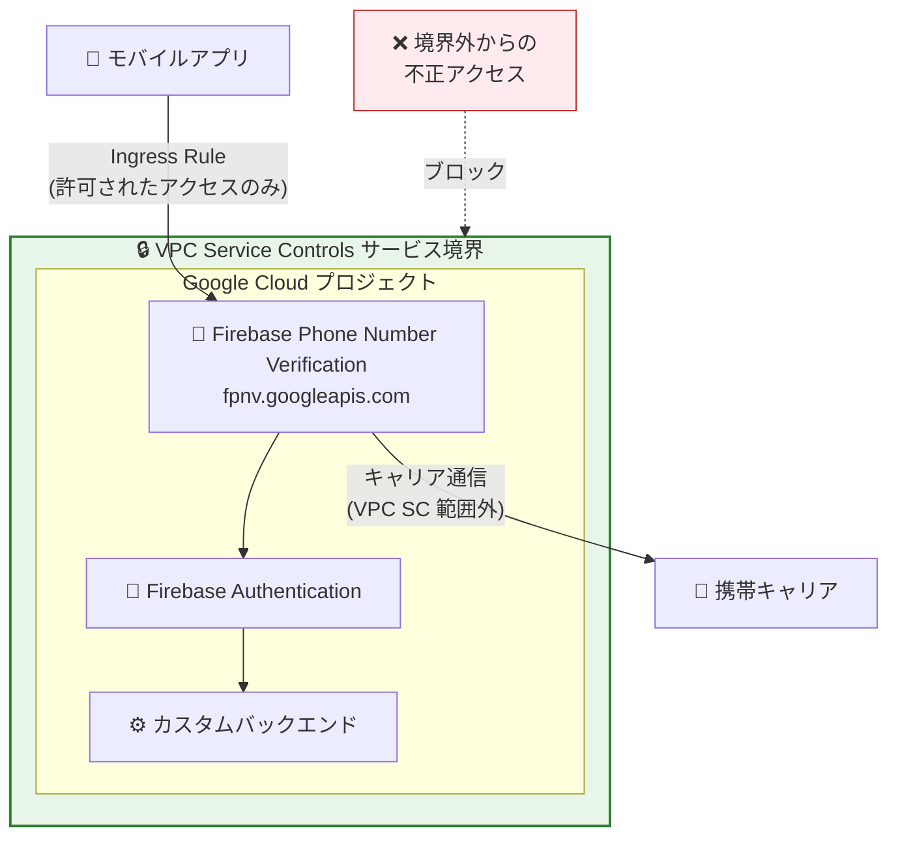

# VPC Service Controls: Firebase Phone Number Verification サポート GA

**リリース日**: 2026-06-06

**サービス**: VPC Service Controls

**機能**: Firebase Phone Number Verification インテグレーションの一般提供 (GA)

**ステータス**: GA

📊 [このアップデートのインフォグラフィックを見る](https://takech9203.github.io/google-cloud-news-summary/20260606-vpc-service-controls-firebase-phone-verification.html)

## 概要

VPC Service Controls が Firebase Phone Number Verification サービスとのインテグレーションを一般提供 (GA) として正式にサポートしました。これにより、Firebase Phone Number Verification API (`fpnv.googleapis.com`) をサービス境界 (Service Perimeter) で保護し、組織のセキュリティポリシーに準拠した電話番号認証基盤を構築できるようになります。

Firebase Phone Number Verification は、ユーザーの携帯キャリアと通信して電話番号を取得・検証するサービスです。VPC Service Controls の境界内にこのサービスを配置することで、認証 API へのアクセスを組織が管理するネットワーク境界内に制限し、データ漏洩リスクを低減できます。

本アップデートは、モバイルアプリケーションで電話番号認証を利用しつつ、厳格なセキュリティ要件を満たす必要がある企業ユーザーに向けたものです。

**アップデート前の課題**

- Firebase Phone Number Verification API を VPC Service Controls のサービス境界で保護することができず、API アクセスに対するネットワークレベルの制御が不十分だった
- 電話番号認証を利用するプロジェクトで VPC Service Controls を導入する際、Firebase Phone Number Verification のトラフィックが境界制御の対象外となり、セキュリティポリシーに一貫性を持たせることが困難だった
- 規制要件の厳しい業界 (金融、医療など) で電話番号認証を利用する場合、VPC Service Controls による保護ができないことがコンプライアンス上の課題だった

**アップデート後の改善**

- Firebase Phone Number Verification API をサービス境界の制限対象サービスとして追加可能になり、API へのアクセスをネットワーク境界内に限定できるようになった
- GA として本番環境で完全にサポートされ、SLA の適用対象となった
- 他の Firebase サービス (Firebase Authentication など) と組み合わせた包括的なサービス境界設計が可能になった

## アーキテクチャ図



VPC Service Controls のサービス境界が Firebase Phone Number Verification API を保護し、許可されたアクセスのみを通過させる構成を示しています。携帯キャリアとの通信は VPC Service Controls の範囲外である点に注意が必要です。

## サービスアップデートの詳細

### 主要機能

1. **サービス境界による API 保護**
   - `fpnv.googleapis.com` をサービス境界の制限対象サービスに追加可能
   - 境界外からの Firebase Phone Number Verification API へのアクセスをブロック
   - 組織のセキュリティポリシーに基づいたアクセス制御を実現

2. **Ingress/Egress ルールとの連携**
   - モバイルクライアントからのアクセスを Ingress ルールで制御可能
   - 他のサービス境界との間のデータ交換を Egress ルールで管理

3. **関連サービスとの統合保護**
   - Firebase Authentication やカスタムバックエンドと同じサービス境界内で保護
   - 複数の Firebase サービスを組み合わせた包括的なセキュリティ設計が可能

## 技術仕様

### サービス情報

| 項目 | 詳細 |
|------|------|
| サービス名 | `fpnv.googleapis.com` |
| ステータス | GA (一般提供) |
| 境界による保護 | 対応 |
| 制限付き VIP | 対応 |

### 制限事項

| 項目 | 詳細 |
|------|------|
| 保護範囲 | Firebase Phone Number Verification API のみ。関連サービス (Firebase Authentication 等) は個別に境界に追加する必要がある |
| キャリア通信 | ユーザーの携帯キャリアとの通信は VPC Service Controls の範囲外 |

## 設定方法

### 前提条件

1. VPC Service Controls を利用可能な組織レベルのアクセスポリシーが設定されていること
2. Access Context Manager の管理権限 (`roles/accesscontextmanager.policyAdmin`) を有していること
3. Firebase Phone Number Verification が有効化されたプロジェクトが存在すること

### 手順

#### ステップ 1: 既存のサービス境界に Firebase Phone Number Verification を追加

```bash
gcloud access-context-manager perimeters update PERIMETER_NAME \
  --add-restricted-services=fpnv.googleapis.com \
  --policy=POLICY_ID
```

`PERIMETER_NAME` はサービス境界の名前、`POLICY_ID` は組織のアクセスポリシーの数値 ID に置き換えてください。

#### ステップ 2: 関連サービスも境界に追加 (推奨)

Firebase Phone Number Verification を他の Firebase サービスと併用する場合、それらも境界に追加します。

```bash
gcloud access-context-manager perimeters update PERIMETER_NAME \
  --add-restricted-services=fpnv.googleapis.com,firebaseauth.googleapis.com \
  --policy=POLICY_ID
```

#### ステップ 3: モバイルクライアントからのアクセスを許可する Ingress ルール設定

モバイルアプリからのアクセスを許可するため、Ingress ルールを構成します。

```yaml
# ingress-policy.yaml
- ingressFrom:
    identityType: ANY_IDENTITY
    sources:
      - accessLevel: accessPolicies/POLICY_ID/accessLevels/MOBILE_ACCESS_LEVEL
  ingressTo:
    operations:
      - serviceName: fpnv.googleapis.com
        methodSelectors:
          - method: "*"
    resources:
      - projects/PROJECT_NUMBER
```

```bash
gcloud access-context-manager perimeters update PERIMETER_NAME \
  --set-ingress-policies=ingress-policy.yaml \
  --policy=POLICY_ID
```

## メリット

### セキュリティ面

- **データ漏洩防止**: 電話番号認証に関する API トラフィックをサービス境界内に制限し、不正アクセスからの保護を強化
- **統一的なセキュリティポリシー**: 他の Google Cloud サービスと同じ VPC Service Controls フレームワークで電話番号認証を保護可能
- **監査性の向上**: サービス境界違反が Cloud Audit Logs に記録され、不正アクセスの試行を追跡可能

### コンプライアンス面

- **規制要件への適合**: 金融・医療業界の厳格なデータ保護要件に対応
- **GA サポート**: 本番環境での利用が完全にサポートされ、Google Cloud の SLA 適用対象

## デメリット・制約事項

### 制限事項

- サービス境界が保護するのは Firebase Phone Number Verification API のみであり、Firebase Authentication やカスタムバックエンドは別途境界に追加する必要がある
- ユーザーの携帯キャリアとの通信 (電話番号取得のためのキャリアネットワークとのやり取り) は VPC Service Controls の適用範囲外
- モバイルアプリ (ブラウザクライアント) からのトラフィックは常にサービス境界の外部から発信されるため、Ingress ルールの設定が必須

### 考慮すべき点

- 既存のサービス境界に追加する場合、Dry Run モードでの事前検証を推奨
- モバイルクライアントのアクセスパターンに合わせた適切な Access Level の設計が必要

## ユースケース

### ユースケース 1: 金融機関のモバイルバンキングアプリ

**シナリオ**: 金融機関が顧客向けモバイルバンキングアプリで電話番号認証 (SMS/キャリア認証) を使用しており、PCI DSS や金融庁のガイドラインに準拠したセキュリティ境界が必要。

**効果**: VPC Service Controls により電話番号認証 API へのアクセスを組織の管理下に置き、不正なプロジェクトからの API 呼び出しを防止。コンプライアンス要件を満たしつつ、シームレスな認証体験を提供。

### ユースケース 2: ヘルスケアアプリの患者認証

**シナリオ**: 医療機関が患者向けポータルアプリで電話番号認証を利用し、HIPAA に準拠したデータ保護を実現する必要がある。

**効果**: 患者の電話番号情報を含む認証フローを VPC Service Controls の境界内で保護し、医療データの漏洩リスクを最小化。

## 料金

VPC Service Controls 自体の利用に追加料金は発生しません。Firebase Phone Number Verification の利用料金は Firebase の料金体系に従います。

詳細は以下をご確認ください:
- [VPC Service Controls の料金](https://cloud.google.com/vpc-service-controls/pricing)
- [Firebase の料金](https://firebase.google.com/pricing)

## 関連サービス・機能

- **Firebase Authentication**: ユーザー認証基盤。電話番号認証と組み合わせて利用する場合、同じサービス境界に追加することを推奨
- **Access Context Manager**: VPC Service Controls のアクセスポリシーとアクセスレベルを管理するサービス
- **Cloud Audit Logs**: サービス境界違反やアクセスイベントの記録・監査
- **Firebase App Check**: アプリの真正性を検証するサービス。VPC Service Controls で GA サポート済み
- **Identity Platform**: Google Cloud のユーザー認証・認可プラットフォーム

## 参考リンク

- 📊 [インフォグラフィック](https://takech9203.github.io/google-cloud-news-summary/20260606-vpc-service-controls-firebase-phone-verification.html)
- [公式リリースノート](https://docs.cloud.google.com/release-notes#June_06_2026)
- [VPC Service Controls サポート対象プロダクト一覧](https://docs.cloud.google.com/vpc-service-controls/docs/supported-products)
- [VPC Service Controls 概要](https://docs.cloud.google.com/vpc-service-controls/docs/overview)
- [Firebase Phone Number Verification ドキュメント](https://firebase.google.com/docs/phone-number-verification)
- [サービス境界の管理](https://docs.cloud.google.com/vpc-service-controls/docs/manage-service-perimeters)

## まとめ

VPC Service Controls による Firebase Phone Number Verification の GA サポートにより、電話番号認証を利用するモバイルアプリケーションに対して、本番環境で完全にサポートされたネットワークレベルのセキュリティ境界を適用できるようになりました。特に金融・医療分野など厳格なコンプライアンス要件を持つ組織にとって、認証フローの保護を強化する重要なアップデートです。既存のサービス境界への追加は `gcloud access-context-manager perimeters update` コマンドで容易に実施可能ですが、キャリア通信が VPC SC の範囲外である点を理解した上で、適切な Ingress ルール設計を行うことを推奨します。

---

**タグ**: #VPCServiceControls #Firebase #電話番号認証 #セキュリティ #GA
