# Apigee X: セキュリティ修正 (SSRF ハードニング) と OpenTelemetry オブザーバビリティメトリクス

**リリース日**: 2026-06-08

**サービス**: Apigee X

**機能**: Script ポリシーの SSRF 対策強化 / OpenTelemetry トレースエクスポートパイプラインのメトリクス追加

**ステータス**: Security + Fixed

[このアップデートのインフォグラフィックを見る](https://takech9203.github.io/google-cloud-news-summary/20260608-apigee-x-security-ssrf-observability.html)

## 概要

2026 年 6 月 8 日、Google Cloud は Apigee の更新バージョン (1-17-0-apigee-9) をリリースした。本リリースには、Script ポリシーにおけるサーバーサイドリクエストフォージェリ (SSRF) 脆弱性への対策強化と、Apigee インフラストラクチャのセキュリティ修正が含まれている。また、OpenTelemetry トレースエクスポートパイプラインに関するオブザーバビリティメトリクスの追加と、フォワードプロキシ経由での HTTP エクスポート認証問題の修正も含まれる。

本アップデートは、API ゲートウェイのセキュリティ強化と運用可視性の向上という 2 つの重要な側面をカバーしており、Apigee を利用するすべての組織にとって重要なリリースである。特に SSRF 対策は、以前のセキュリティバレチン (GCP-2026-010、GCP-2026-034) で指摘されたリンクローカルアドレスを経由した攻撃ベクトルをさらに強化するものであり、早急な適用が推奨される。

**アップデート前の課題**

- Script ポリシーからリンクローカルアドレス (169.254.0.0/16) へのリクエストが可能であり、SSRF 攻撃のリスクが存在していた
- OpenTelemetry トレースエクスポートパイプラインの動作状況を把握するためのメトリクスが不足していた
- フォワードプロキシ (Basic 認証必須) を経由した OpenTelemetry トレースの HTTP エクスポートが認証に失敗する問題があった

**アップデート後の改善**

- Script ポリシーがリンクローカルアドレスへのリクエストをブロックするようにハードニングされ、SSRF 攻撃面が大幅に縮小された
- OpenTelemetry トレースエクスポートパイプラインのメトリクス (エクスポートされたスパン数、エクスポートレイテンシ、バッチサイズ、ドロップされたスパン数) が追加された
- フォワードプロキシの Basic 認証を経由した HTTP エクスポートが正常に動作するようになった

## アーキテクチャ図

```mermaid
flowchart TD
    subgraph API_Client["API クライアント"]
        C["`&#x1F4F1; クライアント`"]
    end

    subgraph Apigee_Runtime["Apigee Runtime (1-17-0-apigee-9)"]
        SP["`&#x1F4DC; Script ポリシー`"]
        SSRF_Block["`&#x1F6E1;&#xFE0F; SSRF ブロッカー
        (リンクローカル遮断)`"]
        OTel_Pipeline["`&#x1F4E1; OTel トレース
        エクスポートパイプライン`"]
        Metrics["`&#x1F4CA; 新メトリクス
        - spans_exported
        - export_latency
        - batch_size
        - dropped_spans`"]
    end

    subgraph Blocked["ブロック対象"]
        LinkLocal["`&#x26D4; リンクローカル
        169.254.0.0/16`"]
        Metadata["`&#x26D4; メタデータ
        サーバー`"]
    end

    subgraph Export_Target["エクスポート先"]
        Proxy["`&#x1F310; フォワードプロキシ
        (Basic 認証)`"]
        CT["`&#x2601;&#xFE0F; Cloud Trace`"]
        Jaeger["`&#x1F50D; Jaeger`"]
    end

    C --> SP
    SP -->|リクエスト試行| SSRF_Block
    SSRF_Block -.->|"&#x274C; 遮断"| LinkLocal
    SSRF_Block -.->|"&#x274C; 遮断"| Metadata
    OTel_Pipeline --> Metrics
    OTel_Pipeline -->|HTTP + Basic Auth| Proxy
    Proxy --> CT
    OTel_Pipeline --> Jaeger
```



上図は、今回のアップデートの 2 つの主要コンポーネントを示している。左側は Script ポリシーの SSRF ハードニング (リンクローカルアドレスへのリクエストをブロック)、右側は OpenTelemetry トレースエクスポートパイプラインのメトリクス追加とプロキシ認証修正を表している。

## サービスアップデートの詳細

### セキュリティ修正

1. **Script ポリシーの SSRF ハードニング (Bug 514384893)**
   - Script ポリシーからリンクローカルアドレスへのサーバーサイドリクエストフォージェリ (SSRF) をブロックするようにハードニングされた
   - リンクローカルアドレス (169.254.0.0/16) は、クラウド環境ではインスタンスメタデータサーバーへのアクセスに使用されるため、SSRF 攻撃により認証情報の漏洩につながる可能性があった
   - 過去のセキュリティバレチン GCP-2026-010 では、Apigee のサンドボックス技術の脆弱性を通じてリンクローカルエンドポイントからサービスアカウントトークン (P4SA) にアクセスできる問題が報告されていた
   - 今回の修正は、Script ポリシーレベルでの追加の防御レイヤーを提供する

2. **Apigee インフラストラクチャのセキュリティ修正**
   - インフラストラクチャレベルでの追加のセキュリティ修正が適用された
   - 詳細は非公開だが、プラットフォーム全体のセキュリティ態勢を強化するもの

### 機能修正

3. **OpenTelemetry トレースエクスポートのオブザーバビリティメトリクス (Bug 512850756)**
   - OpenTelemetry トレースエクスポートパイプラインに以下のメトリクスが追加された:
     - **spans_exported**: エクスポートされたスパン数
     - **export_latency**: エクスポートのレイテンシ
     - **batch_size**: バッチサイズ
     - **dropped_spans**: ドロップされたスパン数
   - これらのメトリクスにより、分散トレーシングのエクスポートパイプラインの健全性をモニタリングできるようになった

4. **フォワードプロキシ経由の HTTP エクスポート認証修正 (Bug 515039499)**
   - Basic 認証が必要なフォワードプロキシを経由した OpenTelemetry トレースの HTTP エクスポートが認証に失敗する問題が修正された
   - エンタープライズ環境では、セキュリティポリシーによりすべてのアウトバウンド通信がフォワードプロキシを経由する構成が一般的であり、この修正により当該環境でのトレースエクスポートが正常に機能するようになった

## 技術仕様

### SSRF ハードニングの対象アドレス

| アドレス範囲 | 説明 | ブロック状態 |
|------|------|------|
| 169.254.0.0/16 | リンクローカルアドレス (IPv4) | 今回ブロック追加 |
| 169.254.169.254 | GCE メタデータサーバー | 今回ブロック追加 |
| fe80::/10 | リンクローカルアドレス (IPv6) | 今回ブロック追加 (推定) |

### 新規 OpenTelemetry メトリクス

| メトリクス名 | 説明 | 用途 |
|------|------|------|
| spans_exported | エクスポート成功したスパンの総数 | スループットの監視 |
| export_latency | エクスポート操作のレイテンシ | パフォーマンス監視 |
| batch_size | エクスポートバッチあたりのスパン数 | バッチ効率の最適化 |
| dropped_spans | ドロップ (損失) されたスパン数 | データ損失の検出 |

### Script ポリシーの構成例

```xml
<!-- Script ポリシーの定義例 -->
<!-- リンクローカルアドレスへのアクセスは自動的にブロックされる -->
<Javascript name="CustomLogic" timeLimit="200">
  <DisplayName>Custom Logic</DisplayName>
  <ResourceURL>jsc://custom-logic.js</ResourceURL>
</Javascript>
```

## メリット

### セキュリティ面

- **SSRF 攻撃面の縮小**: Script ポリシーからのリンクローカルアドレスへのアクセスをブロックすることで、メタデータサーバーを経由した認証情報漏洩のリスクを排除
- **多層防御の強化**: インフラストラクチャレベルとポリシーレベルの両方でセキュリティが強化され、Defense in Depth の原則に沿った保護を提供
- **ゼロアクション適用**: マネージド Apigee (Google Cloud 版) を使用している顧客は追加のアクションなしで自動的にセキュリティ修正が適用される

### 運用面

- **トレースパイプラインの可視化**: 新しいメトリクスにより、OpenTelemetry トレースエクスポートの健全性をリアルタイムに把握可能
- **データ損失の早期検出**: dropped_spans メトリクスにより、トレースデータの損失を迅速に検出し対処可能
- **エンタープライズプロキシ対応**: フォワードプロキシ (Basic 認証) 経由のトレースエクスポートが正常動作し、厳格なネットワークポリシーを持つ環境でも分散トレーシングが利用可能

## デメリット・制約事項

### 制限事項

- Script ポリシー内で正当な目的でリンクローカルアドレスにアクセスしていたカスタムロジックがある場合、動作しなくなる可能性がある
- ブロック対象の詳細なアドレスリストは公式に公開されていないため、エッジケースでの動作確認が必要

### 考慮すべき点

- Apigee Hybrid を使用している場合、手動でのバージョンアップグレードが必要
- 新しいメトリクスは Cloud Monitoring で確認できるが、既存のダッシュボードへの手動追加が必要
- フォワードプロキシの認証修正は HTTP エクスポートのみに適用され、gRPC エクスポートは対象外

## ユースケース

### ユースケース 1: マルチテナント API プラットフォームのセキュリティ強化

**シナリオ**: 複数のチームが共有 Apigee 環境で API プロキシを開発しており、Script ポリシーを使用してカスタムロジックを実装している。悪意のある内部ユーザーまたは侵害されたプロキシが、Script ポリシーを通じてメタデータサーバーにアクセスし、サービスアカウントトークンを窃取する攻撃シナリオを防止したい。

**効果**: Script ポリシーからのリンクローカルアドレスへのリクエストが自動的にブロックされるため、追加設定なしで SSRF 攻撃が防止される。

### ユースケース 2: エンタープライズ環境でのトレースパイプライン監視

**シナリオ**: 大規模な API トラフィックを処理する Apigee 環境で、OpenTelemetry を使用した分散トレーシングを Cloud Trace に送信している。トレースデータの欠落やエクスポート遅延を早期に検知し、SRE チームに通知したい。

**実装例**:
```yaml
# Cloud Monitoring アラートポリシー (概念例)
alertPolicy:
  displayName: "Apigee OTel Trace Export - Dropped Spans Alert"
  conditions:
    - conditionThreshold:
        filter: 'metric.type="apigee.googleapis.com/trace/dropped_spans"'
        comparison: COMPARISON_GT
        thresholdValue: 100
        duration: "300s"
```

**効果**: dropped_spans メトリクスの監視により、トレースデータの損失を 5 分以内に検知し、エクスポートパイプラインの問題を迅速に特定・解決できる。

### ユースケース 3: プロキシ経由の分散トレーシング設定

**シナリオ**: セキュリティポリシーによりすべてのアウトバウンド通信がフォワードプロキシ (Squid 等、Basic 認証必須) を経由する必要があるエンタープライズ環境で、Apigee の分散トレーシングデータを外部のオブザーバビリティバックエンド (Jaeger 等) にエクスポートしたい。

**効果**: Bug 515039499 の修正により、Basic 認証付きフォワードプロキシ経由での HTTP エクスポートが正常に動作し、厳格なネットワーク制約下でも分散トレーシングが利用可能になった。

## 関連サービス・機能

- **Cloud Trace**: Apigee の分散トレーシングデータのネイティブなエクスポート先。OpenTelemetry 経由でスパンデータを送信
- **Cloud Monitoring**: 新しいオブザーバビリティメトリクスの表示・アラート設定に使用
- **Apigee Hybrid**: オンプレミス/マルチクラウド環境での Apigee 実行。手動アップグレードが必要
- **VPC Service Controls**: SSRF 対策の補完として、ネットワーク境界レベルでの追加保護を提供
- **Cloud Armor**: API ゲートウェイ前段での WAF ルール (LFI/RFI ルールセット) による SSRF 攻撃の緩和

## 参考リンク

- [インフォグラフィック](https://takech9203.github.io/google-cloud-news-summary/20260608-apigee-x-security-ssrf-observability.html)
- [公式リリースノート](https://docs.cloud.google.com/release-notes#June_08_2026)
- [Apigee セキュリティバレチン](https://docs.cloud.google.com/apigee/docs/security-bulletins)
- [Apigee 分散トレーシング設定ガイド](https://docs.cloud.google.com/apigee/docs/api-platform/develop/enabling-distributed-trace)
- [Apigee Hybrid メトリクス収集](https://docs.cloud.google.com/apigee/docs/hybrid/v1.16/metrics-collection)
- [OWASP Top 10: SSRF 対策 (Apigee)](https://docs.cloud.google.com/architecture/security/owasp-top-ten-mitigation)

## まとめ

本アップデートは、Apigee のセキュリティとオブザーバビリティの両面で重要な改善を提供する。Script ポリシーの SSRF ハードニングは、リンクローカルアドレスを経由したメタデータサーバーへのアクセスを防止し、過去に報告された類似の脆弱性 (GCP-2026-010、GCP-2026-034) への追加の防御層を提供する。OpenTelemetry メトリクスの追加により、分散トレーシングパイプラインの運用状況が可視化され、問題の早期検出が可能になった。マネージド Apigee を利用している組織は自動的に適用されるが、Apigee Hybrid を利用している場合はバージョン 1-17-0-apigee-9 へのアップグレードを速やかに計画することを推奨する。

---

**タグ**: #ApigeeX #Security #SSRF #OpenTelemetry #Observability #DistributedTracing #APIManagement
