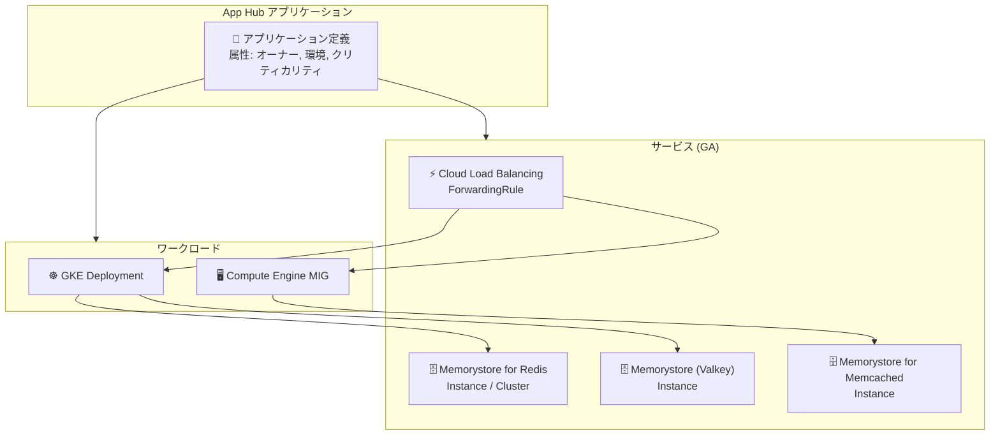

# App Hub: Memorystore リソースサポート GA

**リリース日**: 2026-06-08

**サービス**: App Hub

**機能**: Memorystore リソースサポートの一般提供 (GA)

**ステータス**: GA

📊 [このアップデートのインフォグラフィックを見る](https://takech9203.github.io/google-cloud-news-summary/20260608-app-hub-memorystore-support-ga.html)

## 概要

App Hub における Memorystore リソースのサポートが一般提供 (GA) となった。これにより、Memorystore for Redis のインスタンスおよびクラスター、Memorystore for Memcached のインスタンス、および Memorystore (Valkey) のインスタンスを App Hub アプリケーションのサービスとして登録・管理できるようになった。

App Hub は Google Cloud のインフラストラクチャリソースをアプリケーション単位で論理的にグループ化し、ビジネス機能に沿った管理を実現するサービスである。今回の GA により、キャッシュ層やセッション管理に使用される Memorystore リソースも、本番環境で安心して App Hub のアプリケーションモデルに組み込めるようになった。

このアップデートの主な対象ユーザーは、Memorystore を使用してキャッシュやセッション管理を行っているプラットフォームチームおよびアプリケーション運用者である。

**アップデート前の課題**

- Memorystore リソースを App Hub で管理する場合、Preview ステータスのため SLA が適用されず、本番環境での利用に不安があった
- キャッシュ層を含むアプリケーション全体を App Hub で一元管理する際、Memorystore 部分のみ正式サポート外となっていた
- Memorystore リソースの所有者情報やビジネスクリティカリティなどのメタデータを App Hub で管理することが本番推奨されていなかった

**アップデート後の改善**

- Memorystore リソースが GA となり、SLA 付きで本番環境での App Hub 統合が正式にサポートされた
- アプリケーション全体 (コンピュート、データベース、キャッシュ層) を App Hub で一貫して管理可能になった
- Memorystore リソースに対してもオーナーシップ、クリティカリティ、環境などの属性を安定して設定できるようになった

## アーキテクチャ図



App Hub アプリケーション内で Memorystore の各種リソース (Redis, Valkey, Memcached) をサービスとして登録し、ワークロードとの依存関係を可視化する構成を示している。

## サービスアップデートの詳細

### 主要機能

1. **Memorystore for Redis リソースの GA サポート**
   - `redis.googleapis.com/Instance` をサービスとして登録可能
   - `redis.googleapis.com/Cluster` をサービスとして登録可能
   - 登録タイプ: Exclusive (1 つのアプリケーションにのみ登録可能)

2. **Memorystore (Valkey) リソースの GA サポート**
   - `memorystore.googleapis.com/Instance` をサービスとして登録可能
   - 登録タイプ: Exclusive

3. **Memorystore for Memcached リソースの GA サポート**
   - `memcache.googleapis.com/Instance` をサービスとして登録可能
   - 登録タイプ: Exclusive

4. **自動リソース検出**
   - Memorystore リソースの作成・削除時にメタデータが自動的に App Hub に取り込まれる
   - 明示的に App Hub を有効化した場合にのみメタデータにアクセス可能

## 技術仕様

### サポートされるリソースタイプと URI 形式

| リソースタイプ | URI 形式 |
|------|------|
| Memorystore for Redis Instance | `//redis.googleapis.com/projects/PROJECT_ID/locations/LOCATION/instances/INSTANCE` |
| Memorystore for Redis Cluster | `//redis.googleapis.com/projects/PROJECT_ID/locations/LOCATION/clusters/CLUSTER` |
| Memorystore (Valkey) Instance | `//memorystore.googleapis.com/projects/PROJECT_ID/locations/LOCATION/instances/INSTANCE` |
| Memorystore for Memcached Instance | `//memcache.googleapis.com/projects/PROJECT_NUMBER/locations/LOCATION/instances/INSTANCE` |

### 登録制限

| 項目 | 詳細 |
|------|------|
| 登録タイプ | Exclusive (すべての Memorystore リソース) |
| 一度に登録可能なリソース数 | 最大 10 個 |
| アプリケーションタイプ | グローバルおよびリージョナル |

## 設定方法

### 前提条件

1. App Hub が有効化されていること
2. アプリケーション管理境界 (ホストプロジェクトまたは app-enabled フォルダー) が設定済みであること
3. Memorystore リソースが管理境界内のプロジェクトに存在すること

### 手順

#### ステップ 1: 検出済みサービスの確認

```bash
# Memorystore リソースが App Hub で検出されているか確認
gcloud apphub discovered-services list \
  --location=REGION \
  --project=MANAGEMENT_PROJECT_ID
```

#### ステップ 2: サービスとしてアプリケーションに登録

```bash
# Memorystore for Redis インスタンスをサービスとして登録
gcloud apphub services create SERVICE_ID \
  --application=APPLICATION_ID \
  --location=REGION \
  --project=MANAGEMENT_PROJECT_ID \
  --discovered-service=DISCOVERED_SERVICE_NAME \
  --display-name="Redis Cache Service" \
  --description="Primary cache layer"
```

#### ステップ 3: Terraform による登録 (オプション)

```hcl
data "google_apphub_discovered_service" "redis_cache" {
  location    = "us-central1"
  service_uri = "//redis.googleapis.com/projects/my-project/locations/us-central1/instances/my-redis"
}

resource "google_apphub_service" "redis_cache" {
  project            = "my-management-project"
  location           = "us-central1"
  application_id     = google_apphub_application.my_app.application_id
  service_id         = "redis-cache"
  discovered_service = data.google_apphub_discovered_service.redis_cache.name
  display_name       = "Redis Cache Service"
  description        = "Primary cache layer for the application"
}
```

## メリット

### ビジネス面

- **アプリケーション全体の可視化**: キャッシュ層を含めたアプリケーション全体の構成を App Hub で一元的に把握でき、ビジネスオーナーや運用チームへの説明が容易になる
- **ガバナンスの強化**: Memorystore リソースに対してオーナーシップやクリティカリティなどのビジネス属性を付与でき、組織的な管理が向上する
- **本番環境での信頼性**: GA ステータスにより SLA が適用され、ミッションクリティカルな本番環境で安心して利用可能

### 技術面

- **統合運用ダッシュボード**: Cloud Hub や Google Cloud Observability でキャッシュ層のテレメトリデータをアプリケーションコンテキストで表示可能
- **自動検出**: Memorystore リソースの作成時に自動的に App Hub に取り込まれ、手動でのインベントリ管理が不要
- **Gemini Cloud Assist 連携**: App Hub に登録した Memorystore リソースについて、Gemini によるアプリケーション設計・トラブルシューティング支援が利用可能

## デメリット・制約事項

### 制限事項

- すべての Memorystore リソースは Exclusive 登録タイプのため、1 つのアプリケーションにのみ登録可能 (複数アプリケーションで共有するキャッシュの場合、設計上の考慮が必要)
- 一度に登録可能なリソース数は最大 10 個まで
- App Hub の管理境界内にあるプロジェクトの Memorystore リソースのみが対象

### 考慮すべき点

- 既存の Preview 登録から GA への移行手順の確認が必要
- Memorystore リソースが複数アプリケーションにまたがる共有キャッシュとして使用されている場合、どのアプリケーションに登録するかの設計判断が必要

## ユースケース

### ユースケース 1: マイクロサービスアプリケーションのキャッシュ層管理

**シナリオ**: EC サイトのマイクロサービスアーキテクチャにおいて、GKE 上のワークロード群と Memorystore for Redis をキャッシュとして使用している。App Hub でアプリケーション全体を管理し、キャッシュ層の依存関係を可視化したい。

**効果**: アプリケーション全体の構成が App Hub で一元管理され、障害発生時にキャッシュ層を含めた影響範囲の特定が容易になる。Cloud Hub のダッシュボードでキャッシュのパフォーマンスもアプリケーションコンテキストで監視可能。

### ユースケース 2: マルチ環境でのリソースガバナンス

**シナリオ**: 開発・ステージング・本番の各環境で Memorystore インスタンスを使用しており、各環境のリソースに対して適切な属性 (環境名、クリティカリティ、オーナー) を付与して管理したい。

**効果**: App Hub の属性機能により、各環境の Memorystore リソースに適切なメタデータを付与でき、環境間の管理ポリシーの適用やコスト配分の把握が容易になる。

## 料金

App Hub は追加料金なしで利用可能。Memorystore リソースを App Hub に登録・管理するための追加コストは発生しない。

Memorystore 自体の料金は、使用するサービス (Redis, Valkey, Memcached) やインスタンスのサイズ、リージョンによって異なる。詳細は Memorystore の料金ページを参照。

## 関連サービス・機能

- **Cloud Hub**: App Hub で定義したアプリケーションの統合運用ダッシュボード。アラート、インシデント、パフォーマンスデータをアプリケーションコンテキストで表示
- **Google Cloud Observability**: App Hub に登録したリソースのテレメトリデータをアプリケーション単位で監視
- **Gemini Cloud Assist**: App Hub のデータモデルを活用し、アプリケーションの設計・運用・トラブルシューティングを AI が支援
- **Cloud Asset Inventory**: App Hub が使用するリソース URI 形式の基盤となるサービス
- **Memorystore**: キャッシュ、セッション管理、リアルタイムデータ処理のためのフルマネージドインメモリデータストア

## 参考リンク

- 📊 [インフォグラフィック](https://takech9203.github.io/google-cloud-news-summary/20260608-app-hub-memorystore-support-ga.html)
- [公式リリースノート](https://docs.cloud.google.com/release-notes#June_08_2026)
- [App Hub サポートリソース一覧](https://docs.cloud.google.com/app-hub/docs/supported-resources)
- [App Hub 概要](https://docs.cloud.google.com/app-hub/docs/overview)
- [App Hub セットアップガイド](https://docs.cloud.google.com/app-hub/docs/set-up-app-hub)
- [リソースの登録手順](https://docs.cloud.google.com/app-hub/docs/register-resources)
- [App Hub 料金](https://cloud.google.com/products/app-hub)

## まとめ

App Hub における Memorystore リソースサポートの GA 化により、キャッシュ層を含むアプリケーション全体を本番環境で安心して一元管理できるようになった。Memorystore for Redis、Valkey、Memcached のすべてのインスタンスタイプが対象であり、自動検出機能により運用負荷を最小限に抑えながらアプリケーションモデルに組み込める。プラットフォームチームは、App Hub を有効化し既存の Memorystore リソースをアプリケーションに登録することで、すぐにこの機能を活用できる。

---

**タグ**: #AppHub #Memorystore #GA #リソース管理
