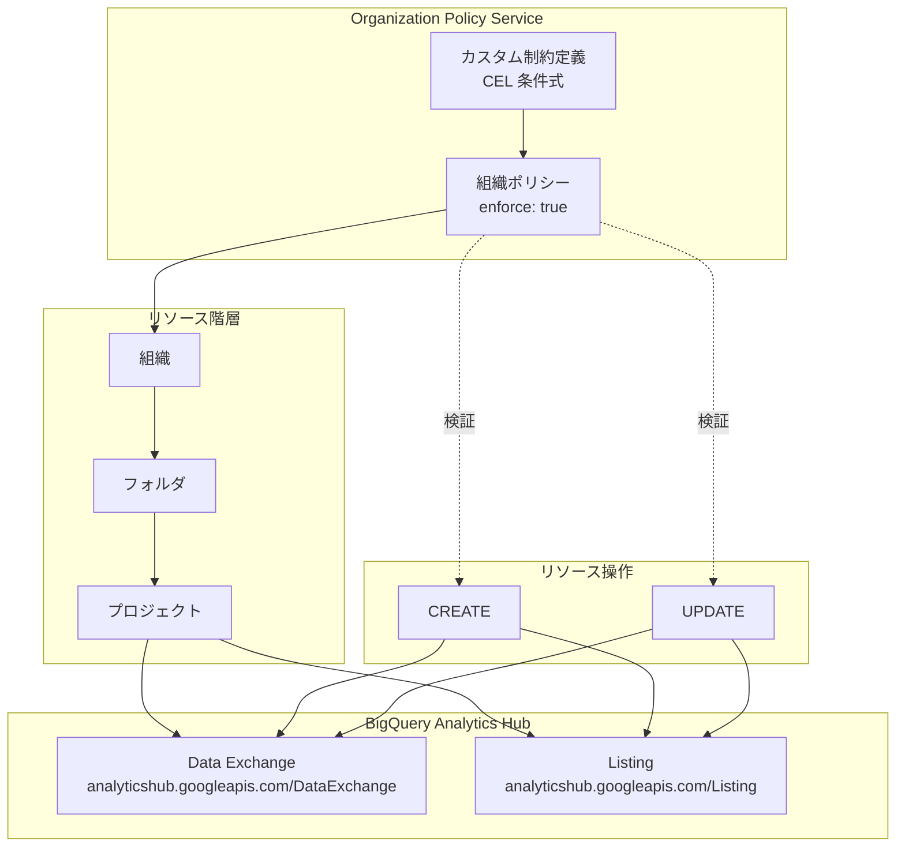

# BigQuery: Organization Policy カスタム制約によるデータ共有リソース制御

**リリース日**: 2026-06-08

**サービス**: BigQuery

**機能**: Organization Policy カスタム制約による BigQuery データ共有リソース (Data Exchange / Listing) のきめ細かな制御

**ステータス**: GA

📊 [このアップデートのインフォグラフィックを見る](https://takech9203.github.io/google-cloud-news-summary/20260608-bigquery-custom-constraints-sharing.html)

## 概要

BigQuery のデータ共有リソース (Analytics Hub の Data Exchange および Listing) に対して、Organization Policy Service のカスタム制約が GA (一般提供) となりました。これにより、組織のポリシー管理者は、データ共有リソースの特定のフィールドに対してきめ細かな制御を行うことが可能になります。

この機能は、BigQuery Analytics Hub を利用してデータを組織内外で共有する企業に対し、セキュリティ・コンプライアンス・ガバナンスの観点から強力な制御メカニズムを提供します。CEL (Common Expression Language) を用いた柔軟な条件定義により、組織のデータガバナンスポリシーをプログラマティックに適用できます。

対象ユーザーは、BigQuery Analytics Hub を利用してデータ共有を行う企業のセキュリティ管理者、ガバナンス担当者、および組織ポリシー管理者です。

**アップデート前の課題**

- Analytics Hub の Data Exchange や Listing の作成・更新に対して、組織レベルでの細かな制御ができなかった
- データ共有リソースの公開範囲やエクスポートポリシーを個別に手動で確認する必要があった
- 組織全体で一貫したデータ共有ポリシーを強制するための仕組みが限定的だった

**アップデート後の改善**

- Data Exchange と Listing の特定フィールドに対してカスタム制約を定義し、組織ポリシーとして強制可能になった
- CEL 条件を使用して、データ共有の公開範囲・エクスポート制限・データセットの場所などを組織レベルで制御可能になった
- ドライランモードによる事前検証が可能となり、既存リソースへの影響を事前に評価できるようになった

## アーキテクチャ図



Organization Policy Service のカスタム制約が、リソース階層に沿って継承され、BigQuery Analytics Hub の Data Exchange および Listing の CREATE/UPDATE 操作時にポリシー検証が実行される構成を示しています。

## サービスアップデートの詳細

### 主要機能

1. **Data Exchange のカスタム制約**
   - 公開範囲 (discoveryType) の制御 - パブリックな Data Exchange の作成を禁止可能
   - Data Clean Room (DCR) 限定の Data Exchange 作成を強制可能
   - サブスクライバーのメールログ記録を必須化可能
   - 説明文、連絡先、アイコンなどのメタデータフィールドの制御

2. **Listing のカスタム制約**
   - 公開範囲の制御 - Listing を非公開に限定可能
   - BigQuery データセットの制約 - 特定のデータセットへの参照を強制可能
   - エクスポートポリシーの制御 - restrictedExportPolicy の有効化を強制可能
   - レプリカロケーションの制御 - データの地理的配置を制限可能
   - Pub/Sub トピックのデータアフィニティリージョンの制御

3. **ポリシーの適用と検証**
   - ドライランモードによる事前検証
   - ポリシー継承による階層的な制御
   - 違反時のエラーメッセージによる明確なフィードバック

## 技術仕様

### 対象リソースとサポートフィールド

| リソースタイプ | サポートフィールド |
|------|------|
| `analyticshub.googleapis.com/DataExchange` | `resource.description`, `resource.discoveryType`, `resource.displayName`, `resource.documentation`, `resource.icon`, `resource.logLinkedDatasetQueryUserEmail`, `resource.primaryContact` |
| `analyticshub.googleapis.com/Listing` | `resource.allowOnlyMetadataSharing`, `resource.bigqueryDataset.dataset`, `resource.bigqueryDataset.replicaLocations`, `resource.bigqueryDataset.restrictedExportPolicy.enabled`, `resource.bigqueryDataset.restrictedExportPolicy.restrictDirectTableAccess`, `resource.bigqueryDataset.restrictedExportPolicy.restrictQueryResult`, `resource.bigqueryDataset.selectedResources.routine`, `resource.bigqueryDataset.selectedResources.table`, `resource.categories`, `resource.dataProvider.name`, `resource.dataProvider.primaryContact`, `resource.description`, `resource.discoveryType`, `resource.displayName`, `resource.documentation`, `resource.icon`, `resource.logLinkedDatasetQueryUserEmail`, `resource.primaryContact`, `resource.publisher.name`, `resource.publisher.primaryContact`, `resource.pubsubTopic.dataAffinityRegions`, `resource.pubsubTopic.topic`, `resource.requestAccess`, `resource.restrictedExportConfig.enabled`, `resource.restrictedExportConfig.restrictQueryResult` |

### 必要な IAM ロール

| ロール | 用途 |
|------|------|
| `roles/orgpolicy.policyAdmin` | 組織ポリシーの作成・管理 |

### カスタム制約の YAML 定義形式

```yaml
name: organizations/ORGANIZATION_ID/customConstraints/CONSTRAINT_NAME
resourceTypes:
  - analyticshub.googleapis.com/DataExchange
methodTypes:
  - CREATE
  - UPDATE
condition: "resource.discoveryType == 'DISCOVERY_TYPE_PUBLIC'"
actionType: DENY
displayName: Reject public DataExchanges.
description: All DataExchange resources must be private.
```

## 設定方法

### 前提条件

1. Google Cloud 組織が構成されていること
2. 組織 ID を把握していること
3. `roles/orgpolicy.policyAdmin` IAM ロールが付与されていること

### 手順

#### ステップ 1: カスタム制約の YAML ファイルを作成

```bash
# 例: Data Exchange をプライベートに限定する制約
cat > constraint-enforce-dataExchangeDiscovery.yaml << 'EOF'
name: organizations/ORGANIZATION_ID/customConstraints/custom.enforceDataExchangeDiscovery
resourceTypes:
  - analyticshub.googleapis.com/DataExchange
methodTypes:
  - CREATE
  - UPDATE
condition: "resource.discoveryType == 'DISCOVERY_TYPE_PUBLIC'"
actionType: DENY
displayName: Reject public DataExchanges.
description: All DataExchange resources must be private.
EOF
```

ORGANIZATION_ID を自組織の組織 ID に置き換えてください。

#### ステップ 2: カスタム制約を組織に登録

```bash
gcloud org-policies set-custom-constraint constraint-enforce-dataExchangeDiscovery.yaml
```

#### ステップ 3: 制約が登録されたことを確認

```bash
gcloud org-policies list-custom-constraints --organization=ORGANIZATION_ID
```

#### ステップ 4: 組織ポリシーを作成して適用

```bash
# ポリシー YAML を作成
cat > policy-enforce-dataExchangeDiscovery.yaml << 'EOF'
name: projects/PROJECT_ID/policies/custom.enforceDataExchangeDiscovery
spec:
  rules:
    - enforce: true
EOF

# ポリシーを適用
gcloud org-policies set-policy policy-enforce-dataExchangeDiscovery.yaml
```

ポリシーが有効になるまで最大 15 分かかります。

#### ステップ 5: (任意) ドライランモードで事前検証

```bash
# ドライランモードで適用
gcloud org-policies set-policy policy-enforce-dataExchangeDiscovery.yaml \
  --update-mask=dryRunSpec
```

## メリット

### ビジネス面

- **コンプライアンスの自動化**: データ共有に関する規制要件を組織ポリシーとして自動的に適用でき、手動レビューの負荷を軽減
- **ガバナンスの一元管理**: 組織全体で一貫したデータ共有ポリシーをトップダウンで適用可能
- **リスク軽減**: 意図しないパブリックなデータ共有やポリシー違反を事前に防止

### 技術面

- **CEL による柔軟な条件定義**: 複雑な条件式をプログラマティックに記述可能
- **階層的なポリシー継承**: 組織・フォルダ・プロジェクトの階層構造に沿った制御
- **ドライランモード**: 本番適用前に影響範囲を安全に確認可能
- **Infrastructure as Code 対応**: YAML ベースの定義により、ポリシーのバージョン管理が可能

## デメリット・制約事項

### 制限事項

- カスタム制約の設定は Google Cloud コンソールまたは gcloud CLI からのみ可能
- CREATE または UPDATE メソッドに対してのみ適用可能 (DELETE には適用不可)
- 新しいカスタム制約は既存のリソースには自動適用されない (既存リソースの更新が必要)
- 各リソースタイプにつき最大 20 個のカスタム制約まで
- Data Clean Room に公開された既存 Listing はドライランでの既存リソースチェック対象外
- 既存リソースに対する制約のシミュレーションは非対応
- `resource.bigqueryDataset.replicaLocations` フィールドの値は小文字で指定する必要がある

### 考慮すべき点

- ポリシーの適用まで最大 15 分かかる場合がある
- 過度に制限的なポリシーは、正当なデータ共有ワークフローを阻害する可能性がある
- 既存リソースへの適用には計画的な移行作業が必要

## ユースケース

### ユースケース 1: パブリック Data Exchange の禁止

**シナリオ**: 金融機関が社内データを Analytics Hub で共有する際に、誤ってパブリックに公開されることを防止したい。

**実装例**:
```yaml
name: organizations/123456789/customConstraints/custom.enforceDataExchangeDiscovery
resourceTypes:
  - analyticshub.googleapis.com/DataExchange
methodTypes:
  - CREATE
  - UPDATE
condition: "resource.discoveryType == 'DISCOVERY_TYPE_PUBLIC'"
actionType: DENY
displayName: Reject public DataExchanges.
description: All DataExchange resources must be private.
```

**効果**: 組織内のすべてのプロジェクトで、パブリックな Data Exchange の作成が自動的にブロックされる。

### ユースケース 2: データエクスポート制限の強制

**シナリオ**: 共有される Listing に対して、データのエクスポート制限ポリシーを常に有効にすることを強制したい。

**実装例**:
```yaml
name: organizations/123456789/customConstraints/custom.listingWithRestrictedExportPolicy
resourceTypes:
  - analyticshub.googleapis.com/Listing
methodTypes:
  - CREATE
  - UPDATE
condition: "has(resource.bigqueryDataset) && has(resource.bigqueryDataset.restrictedExportPolicy) && resource.bigqueryDataset.restrictedExportPolicy.enabled == true"
actionType: ALLOW
displayName: The Listing must have restricted export policy.
description: The Listing resource must have restrictedExportPolicy enabled.
```

**効果**: エクスポート制限が有効でない Listing の作成・更新が防止され、データ流出リスクを低減。

### ユースケース 3: Data Clean Room 限定のデータ交換

**シナリオ**: 組織間でのデータ共有を Data Clean Room 経由のみに限定し、分析環境のセキュリティを確保したい。

**実装例**:
```yaml
name: organizations/123456789/customConstraints/custom.analyticsHubAllowDCRDataExchange
resourceTypes:
  - analyticshub.googleapis.com/DataExchange
methodTypes:
  - CREATE
condition: "has(resource.sharingEnvironmentConfig.dcrExchangeConfig)"
actionType: ALLOW
displayName: Allow a DataExchange in a DCR.
description: Only allow the creation of a DataExchange resource in a DCR.
```

**効果**: Data Clean Room 外での Data Exchange 作成が防止され、セキュアな分析環境が保証される。

## 料金

Organization Policy Service (カスタム制約を含む) は無料で提供されています。追加料金は発生しません。

BigQuery Analytics Hub 自体の利用料金は、通常の BigQuery 料金体系に従います。

## 関連サービス・機能

- **BigQuery Analytics Hub**: データ共有のプラットフォーム。Data Exchange と Listing を管理するサービス
- **Organization Policy Service**: 組織全体のリソースに対するポリシー管理サービス。カスタム制約の基盤
- **BigQuery Data Clean Rooms**: セキュアなデータ共有・分析環境。本機能で DCR 限定の Data Exchange を強制可能
- **IAM (Identity and Access Management)**: アクセス制御。Organization Policy は IAM と補完的に機能
- **Resource Manager**: リソース階層の管理。ポリシー継承の基盤

## 参考リンク

- 📊 [インフォグラフィック](https://takech9203.github.io/google-cloud-news-summary/20260608-bigquery-custom-constraints-sharing.html)
- [公式リリースノート](https://docs.cloud.google.com/release-notes#June_08_2026)
- [Manage Sharing data exchanges and listings using custom constraints](https://docs.cloud.google.com/bigquery/docs/analytics-hub-custom-constraints)
- [Organization Policy Service 概要](https://docs.cloud.google.com/organization-policy/overview)
- [カスタム制約の作成と管理](https://docs.cloud.google.com/resource-manager/docs/organization-policy/creating-managing-custom-constraints)
- [組織ポリシー制約の一覧](https://docs.cloud.google.com/organization-policy/reference/org-policy-constraints)

## まとめ

BigQuery Analytics Hub のデータ共有リソースに対する Organization Policy カスタム制約の GA リリースにより、組織のデータガバナンスをプログラマティックかつ階層的に適用できるようになりました。データ共有の公開範囲制御、エクスポート制限の強制、Data Clean Room の利用強制など、企業のコンプライアンス要件に合わせた柔軟なポリシー設計が可能です。Organization Policy Service は無料で利用できるため、BigQuery Analytics Hub を活用する組織は、セキュリティ・ガバナンス強化のためにカスタム制約の導入を検討することを推奨します。

---

**タグ**: #BigQuery #OrganizationPolicy #カスタム制約 #データ共有 #GA
