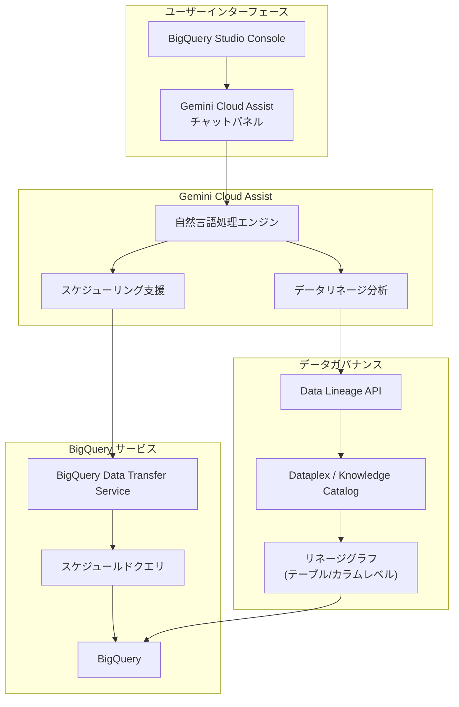

# BigQuery: Gemini Cloud Assist によるデータリネージ分析とクエリスケジューリング機能 (Preview)

**リリース日**: 2026-06-08

**サービス**: BigQuery

**機能**: Gemini Cloud Assist features for data lineage analysis and query scheduling

**ステータス**: Preview

[このアップデートのインフォグラフィックを見る](https://takech9203.github.io/google-cloud-news-summary/20260608-bigquery-gemini-cloud-assist-features.html)

## 概要

Google Cloud は BigQuery における Gemini Cloud Assist の機能を拡張し、データリネージ分析とクエリスケジューリングの 2 つの新しい Preview 機能を発表しました。これらの機能により、BigQuery ユーザーは自然言語を使用してデータの流れを理解し、定期的なクエリ実行を AI の支援のもとで簡単に設定できるようになります。

Gemini Cloud Assist は、Gemini for Google Cloud ポートフォリオの一部として、BigQuery のメタデータ、ジョブ、クエリに関する理解と作業を支援する AI アシスタントです。今回のアップデートでは、従来の SQL 生成やジョブ分析に加えて、データガバナンスの重要な要素であるリネージ分析と、運用効率を向上させるクエリスケジューリングの支援が追加されました。

対象ユーザーは、データエンジニア、データアナリスト、データガバナンス担当者、および BigQuery を日常的に使用するすべてのデータプロフェッショナルです。

**アップデート前の課題**

- データリネージの確認には Dataplex の Lineage Explorer を手動で操作し、テーブル間やカラム間の依存関係を一つずつ追跡する必要があった
- クエリスケジューリングの設定には BigQuery Data Transfer Service の構成を理解し、適切なパラメータ（cron 式、宛先テーブル、書き込みモード等）を手動で指定する必要があった
- リネージグラフから得られる情報の解釈やインパクト分析には専門知識が必要で、自然言語での問い合わせができなかった

**アップデート後の改善**

- Gemini Cloud Assist のチャットパネルから自然言語でデータリネージに関する質問ができるようになり、テーブルやカラムの上流・下流の依存関係を対話的に把握可能になった
- クエリスケジューリングの設定を Gemini Cloud Assist に自然言語で依頼でき、適切なスケジュール構成の提案や設定支援を受けられるようになった
- データガバナンスや運用自動化のワークフローが AI 支援により大幅に効率化された

## アーキテクチャ図



この図は Gemini Cloud Assist が BigQuery のデータリネージ分析とクエリスケジューリングの両機能にどのように統合されているかを示しています。ユーザーはチャットパネルを通じて自然言語で操作し、バックエンドでは Data Lineage API や BigQuery Data Transfer Service と連携して機能を提供します。

## サービスアップデートの詳細

### 主要機能

1. **データリネージ分析 (Gemini Cloud Assist)**
   - 自然言語でテーブルやカラムの依存関係を問い合わせ可能
   - テーブルレベルリネージ: データパイプライン全体の関係性を俯瞰的に把握
   - カラムレベルリネージ: 個々のカラム間のデータフローを追跡（Exact Copy / Other の依存タイプ）
   - インパクト分析: テーブルやカラムの変更が下流に与える影響を AI が説明
   - ルートコーズ分析: データ品質の問題をソースまで遡って特定

2. **クエリスケジューリング支援 (Gemini Cloud Assist)**
   - 自然言語でスケジュールドクエリの作成を依頼可能
   - 適切なスケジュール間隔やパラメータ設定の提案
   - 宛先テーブルの書き込みモード（上書き/追記）の推奨
   - `@run_time` や `@run_date` パラメータの使い方のガイダンス

3. **既存 Gemini Cloud Assist 機能との統合**
   - SQL/Python コード生成との連携（生成したクエリのスケジュール設定まで一貫して支援）
   - ジョブ分析機能との連携（失敗したスケジュールドクエリのデバッグ）
   - リソース検索機能との連携（リネージ対象テーブルの発見）

## 技術仕様

### データリネージ分析の対応範囲

| 項目 | 詳細 |
|------|------|
| リネージ粒度 | テーブルレベル、カラムレベル |
| 対応ジョブタイプ | CREATE TABLE, CREATE TABLE COPY, INSERT, UPDATE, MERGE, DELETE, SELECT (宛先テーブル指定) |
| 依存タイプ | Exact Copy（値のコピー）、Other（変換あり） |
| 必要な API | Data Lineage API, Dataplex API |
| 表示形式 | グラフビュー、リストビュー |

### クエリスケジューリングの対応範囲

| 項目 | 詳細 |
|------|------|
| クエリ言語 | GoogleSQL（DDL/DML 含む） |
| スケジュール形式 | 定期実行（毎時、毎日、毎週、カスタム cron 式） |
| 最小間隔 | 5 分 |
| パラメータ | @run_time (TIMESTAMP), @run_date (DATE) |
| 暗号化 | CMEK（顧客管理暗号鍵）対応 |
| 基盤サービス | BigQuery Data Transfer Service |

### 必要な IAM ロール

```json
{
  "lineage_analysis": {
    "required_roles": [
      "roles/dataplex.catalogViewer",
      "roles/datalineage.viewer",
      "roles/bigquery.dataViewer"
    ]
  },
  "query_scheduling": {
    "required_permissions": [
      "bigquery.transfers.update",
      "bigquery.datasets.get",
      "bigquery.jobs.create"
    ],
    "recommended_role": "roles/bigquery.admin"
  },
  "gemini_cloud_assist": {
    "setup": "管理者による Gemini Cloud Assist の有効化が必要",
    "note": "ユーザーの IAM 権限を継承して動作"
  }
}
```

## 設定方法

### 前提条件

1. Gemini Cloud Assist が対象プロジェクトまたはフォルダで有効化されていること
2. Data Lineage API が有効化されていること（リネージ分析を使用する場合）
3. BigQuery Data Transfer Service が有効化されていること（クエリスケジューリングを使用する場合）
4. 適切な IAM ロールが付与されていること

### 手順

#### ステップ 1: Gemini Cloud Assist の有効化

管理者が以下の手順で Gemini Cloud Assist をセットアップします。

```bash
# Data Lineage API の有効化
gcloud services enable datalineage.googleapis.com --project=PROJECT_ID

# Dataplex API の有効化
gcloud services enable dataplex.googleapis.com --project=PROJECT_ID

# BigQuery Data Transfer Service の有効化
gcloud services enable bigquerydatatransfer.googleapis.com --project=PROJECT_ID
```

Gemini Cloud Assist 自体の有効化は Google Cloud Console の管理画面から実施します。

#### ステップ 2: データリネージ分析の利用

```
1. Google Cloud Console で BigQuery ページを開く
2. ツールバーの Gemini Cloud Assist アイコンをクリック
3. チャットパネルで自然言語でリネージに関する質問を入力

例: 「テーブル project.dataset.table の上流データソースは何ですか？」
例: 「このカラムに影響を与えるすべての変換を表示してください」
```

#### ステップ 3: クエリスケジューリング支援の利用

```
1. BigQuery Studio でクエリを作成・実行
2. Gemini Cloud Assist チャットパネルを開く
3. スケジューリングに関するリクエストを入力

例: 「このクエリを毎日午前9時に実行するようにスケジュールしてください」
例: 「毎週月曜日にこのレポートクエリを自動実行する設定を教えてください」
```

## メリット

### ビジネス面

- **データガバナンスの強化**: 自然言語でリネージを分析できることで、非技術者を含むステークホルダーがデータの来歴と品質を容易に確認可能
- **運用コストの削減**: クエリスケジューリングの設定が AI 支援により簡素化され、設定ミスによる再作業が減少
- **コンプライアンス対応の効率化**: データの流れを迅速に追跡できることで、監査対応やプライバシー影響評価が高速化

### 技術面

- **学習コストの低減**: BigQuery Data Transfer Service や Data Lineage API の詳細な仕様を理解せずとも、自然言語で必要な操作が可能
- **インパクト分析の高速化**: テーブルやカラムの変更前に下流への影響を AI が即座に分析・説明
- **ワークフローの一貫性**: SQL 生成からスケジューリング設定まで、Gemini Cloud Assist の単一インターフェースで完結

## デメリット・制約事項

### 制限事項

- Preview 段階のため、本番環境での利用には注意が必要（Pre-GA Offerings Terms が適用）
- サポートが限定的で、機能の変更や廃止の可能性がある
- Gemini Cloud Assist は BigQuery と同じコンプライアンス・セキュリティ認定を持たないため、厳格なコンプライアンス要件があるプロジェクトでは使用不可
- AI 生成の回答は事実と異なる可能性があるため、出力の検証が推奨される

### 考慮すべき点

- リネージ情報はリアルタイムではなく、Data Lineage API を通じた同期に一定の遅延が発生する可能性がある
- スケジュールドクエリの正時実行（例: 09:00）は複数回トリガーされる可能性があるため、オフセット時刻（例: 09:03）の使用が推奨される
- Gemini Cloud Assist はユーザーの IAM 権限を継承するため、権限不足の場合はリネージ情報が表示されない

## ユースケース

### ユースケース 1: データマイグレーション前の影響分析

**シナリオ**: データベース管理者がコアデータベースのマイグレーションを計画しており、下流のすべてのレポートやダッシュボードへの影響を事前に把握したい。

**実装例**:
```
Gemini Cloud Assist への質問例:
「project.core_db.customers テーブルに依存しているすべての
下流テーブルとビューを教えてください。特にレポート用データセットへの
影響を知りたいです。」
```

**効果**: 手動でリネージグラフを探索する場合に比べ、数分で依存関係の全体像を把握でき、マイグレーション計画の精度が向上する。

### ユースケース 2: 定期レポートの自動化

**シナリオ**: データアナリストが毎週月曜日に売上サマリーレポートを手動で実行しているが、これを自動化したい。

**実装例**:
```
Gemini Cloud Assist への質問例:
「以下のクエリを毎週月曜日の午前8時に自動実行し、
結果を sales_reports.weekly_summary テーブルに上書き保存する
スケジュールを設定してください。」
```

**効果**: cron 式や BigQuery Data Transfer Service の設定パラメータを熟知していなくても、適切なスケジュール構成が数秒で完成する。

### ユースケース 3: データ品質問題のルートコーズ分析

**シナリオ**: BI ダッシュボードに表示される売上データに異常値が検出され、どの上流プロセスで問題が発生したかを特定したい。

**実装例**:
```
Gemini Cloud Assist への質問例:
「analytics.daily_sales テーブルの revenue カラムの
上流ソースをすべて表示してください。どのような変換が
適用されているかも教えてください。」
```

**効果**: カラムレベルのリネージ追跡により、変換パイプラインのどの段階で問題が混入したかを迅速に特定可能。

## 料金

Gemini Cloud Assist は Gemini for Google Cloud の一部として提供されます。

| 項目 | 詳細 |
|------|------|
| Gemini Cloud Assist | Gemini for Google Cloud サブスクリプションに含まれる |
| Data Lineage API | Dataplex の料金体系に準拠 |
| スケジュールドクエリ | BigQuery Data Transfer Service の一部（追加料金なし、クエリ実行料金は通常通り課金） |

Preview 期間中の料金については、Google Cloud の公式ドキュメントで最新情報を確認してください。

## 関連サービス・機能

- **Dataplex / Knowledge Catalog**: データリネージの基盤となるメタデータ管理・ガバナンスサービス
- **BigQuery Data Transfer Service**: スケジュールドクエリの実行基盤
- **Gemini in BigQuery**: SQL/Python コード生成、データインサイト、データキャンバスなどの AI 支援機能群
- **Dataform**: より複雑なデータ変換ワークフローのスケジューリングとオーケストレーション
- **Workflows**: イベント駆動型のマイクロサービスオーケストレーション

## 参考リンク

- [このアップデートのインフォグラフィック](https://takech9203.github.io/google-cloud-news-summary/20260608-bigquery-gemini-cloud-assist-features.html)
- [公式リリースノート](https://docs.cloud.google.com/release-notes#June_08_2026)
- [Gemini Cloud Assist ドキュメント](https://docs.cloud.google.com/bigquery/docs/use-cloud-assist)
- [データリネージ概要](https://docs.cloud.google.com/dataplex/docs/lineage-views)
- [クエリスケジューリング](https://docs.cloud.google.com/bigquery/docs/scheduling-queries)
- [Gemini in BigQuery 概要](https://docs.cloud.google.com/bigquery/docs/gemini-overview)

## まとめ

今回の Preview リリースにより、Gemini Cloud Assist は BigQuery におけるデータガバナンスと運用自動化の両面で強力な AI 支援を提供するようになりました。データリネージ分析とクエリスケジューリングの自然言語インターフェースは、技術的な障壁を下げ、より多くのチームメンバーがデータパイプラインの管理に参画できる環境を実現します。Preview 段階であることを踏まえつつ、開発環境やステージング環境での評価を開始し、GA リリースに向けた準備を進めることを推奨します。

---

**タグ**: #BigQuery #GeminiCloudAssist #DataLineage #QueryScheduling #Preview #DataGovernance #AI #Dataplex
