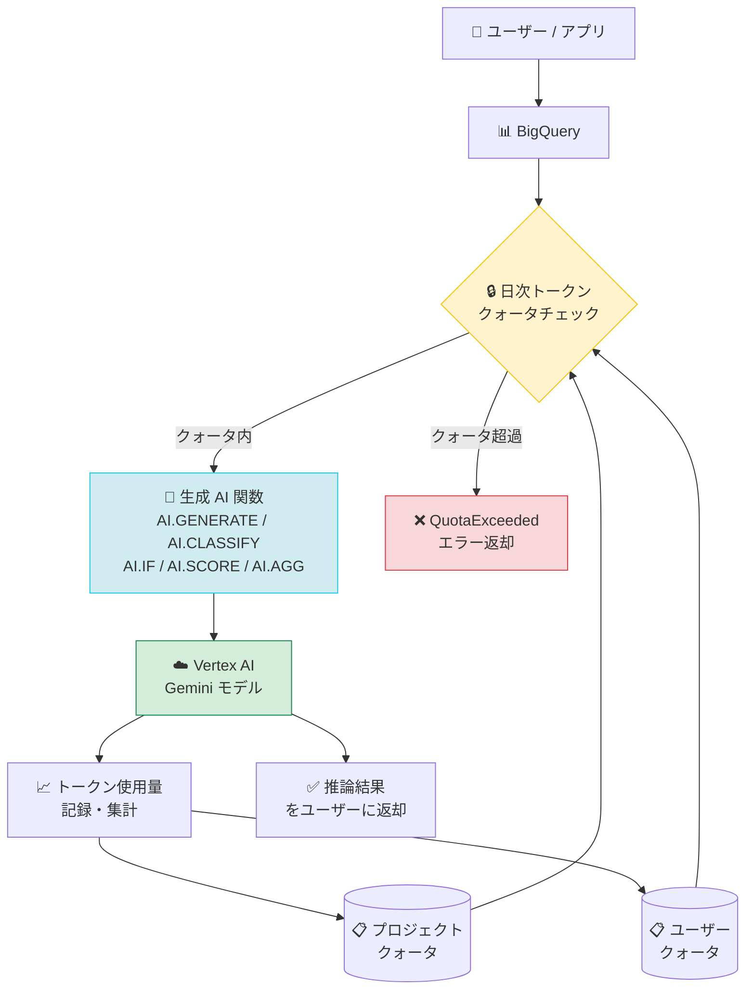

# BigQuery: 生成 AI 関数のトークンベースコスト管理 GA

**リリース日**: 2026-06-08

**サービス**: BigQuery

**機能**: 生成 AI 関数のトークンベースコスト管理 (日次トークンクォータ)

**ステータス**: GA

📊 [このアップデートのインフォグラフィックを見る](https://takech9203.github.io/google-cloud-news-summary/20260608-bigquery-genai-token-cost-management.html)

## 概要

BigQuery の生成 AI 関数 (AI.GENERATE、AI.CLASSIFY、AI.IF、AI.SCORE、AI.AGG など) に対して、日次トークンクォータを設定してコストを管理・制限する機能が一般提供 (GA) となった。この機能により、プロジェクトレベルおよびユーザーレベルで入力トークンと出力トークンの日次使用量に上限を設定でき、生成 AI 関数の利用に伴う予期しないコスト増大を防止できる。

BigQuery の生成 AI 関数は Vertex AI の Gemini モデルへリクエストを送信するため、処理するトークン数に応じて Vertex AI 側の課金が発生する。従来のバイトベースのクエリクォータ (QueryUsagePerDay) ではトークン消費量を直接制御できなかったが、今回の GA により、トークン単位での細かなコスト制御が可能になった。

**アップデート前の課題**

- BigQuery の生成 AI 関数によるトークン消費量を直接制限する手段がなく、大量データに対する AI 関数実行時にコストが予測困難だった
- 既存の QueryUsagePerDay クォータはバイトベースであり、LLM 推論のトークンコストを正確に反映していなかった
- 複雑なクエリ (JOIN や ORDER BY ... LIMIT) では実際に処理される行数が想定と異なり、トークン消費が膨らむリスクがあった

**アップデート後の改善**

- プロジェクトレベル・ユーザーレベルで入力/出力トークンの日次クォータを設定可能になった
- クエリ実行前のプリチェックで残りクォータを確認し、超過時はクエリを拒否する仕組みが導入された
- 実行中のクエリについても、クォータ超過時点で新規 LLM 呼び出しを停止し、コスト上限を守る動作が保証された

## アーキテクチャ図



BigQuery の生成 AI 関数がクエリ実行時にトークンクォータをチェックし、日次上限の範囲内でのみ Vertex AI Gemini モデルへのリクエストを許可する仕組みを示している。

## サービスアップデートの詳細

### 主要機能

1. **日次トークンクォータの設定**
   - 入力トークン (プロジェクトレベル / ユーザーレベル) の日次上限を設定
   - 出力トークン (プロジェクトレベル / ユーザーレベル) の日次上限を設定
   - Google Cloud コンソールの IAM & Admin > Quotas & System Limits から設定

2. **二段階のクォータ適用**
   - クエリ実行前のプリチェック: クォータが枯渇している場合、クエリを開始前に拒否
   - クエリ実行中の適用: 実行中にクォータ超過した場合、新規 LLM 呼び出しを停止し部分的な結果を返却 (max_error_ratio に依存)

3. **グローバルスコープでの集計**
   - トークン使用量はプロジェクトが稼働する全リージョンにわたってグローバルに集計される
   - キャッシュされたトークンはクォータカウントから除外

## 技術仕様

### クォータ一覧

| クォータ名 | 対象 | スコープ | デフォルト値 |
|------|------|------|------|
| GenAiInputTokensPerDay | 入力トークン | プロジェクト/日 | 200,000,000,000 (2000億) |
| GenAiInputTokensPerUserPerDay | 入力トークン | ユーザー/日 | 40,000,000,000 (400億) |
| GenAiOutputTokensPerDay | 出力+思考トークン | プロジェクト/日 | 20,000,000,000 (200億) |
| GenAiOutputTokensPerUserPerDay | 出力+思考トークン | ユーザー/日 | 4,000,000,000 (40億) |

### 対象となる生成 AI 関数

| 関数カテゴリ | 関数名 |
|------|------|
| 汎用推論 | AI.GENERATE, AI.GENERATE_TEXT, AI.GENERATE_TABLE, AI.GENERATE_BOOL, AI.GENERATE_DOUBLE, AI.GENERATE_INT |
| マネージド AI 関数 | AI.IF, AI.SCORE, AI.CLASSIFY, AI.AGG |
| エンベディング | AI.EMBED, AI.GENERATE_EMBEDDING |

### トークンの種類

| トークン種別 | 説明 | クォータ対象 |
|------|------|------|
| 入力トークン | モデルに送信されるプロンプトやデータ | GenAiInputTokensPerDay |
| 出力トークン | モデルが生成するテキスト (候補トークン) | GenAiOutputTokensPerDay |
| 思考トークン | モデルの内部推論ステップで生成されるトークン | GenAiOutputTokensPerDay |
| キャッシュトークン | 暗黙的にキャッシュされた入力トークン | カウント対象外 |

## 設定方法

### 前提条件

1. Google Cloud プロジェクトに課金が有効化されていること
2. BigQuery API が有効化されていること
3. Quota Administrator (`role/servicemanagement.quotaAdmin`) ロール、または `serviceusage.quotas.update` 権限を持つカスタムロールが付与されていること

### 手順

#### ステップ 1: Quotas & System Limits ページに移動

Google Cloud コンソールで **IAM & Admin** > **Quotas & System Limits** に移動する。

#### ステップ 2: BigQuery API でフィルタリング

Service フィルタで `BigQuery API` を選択し、設定したいクォータを検索する。

```
GenAiInputTokensPerDay
GenAiInputTokensPerUserPerDay
GenAiOutputTokensPerDay
GenAiOutputTokensPerUserPerDay
```

#### ステップ 3: クォータ値の編集

1. 対象のクォータを選択し、**Edit** をクリック
2. **Quota changes** パネルで新しい値を入力
3. **Submit request** をクリック

低い値への変更は数分以内に反映される。高い値への変更には承認プロセスが必要な場合がある。

## メリット

### ビジネス面

- **予算超過の防止**: 日次上限を設定することで、生成 AI 関数の利用に伴う想定外のコスト増大を防止できる
- **部門別コスト管理**: ユーザーレベルのクォータにより、チームやサービスアカウントごとの公平な利用を確保できる
- **FinOps の実現**: トークン単位の使用量可視化と上限設定により、AI ワークロードのコストガバナンスが向上する

### 技術面

- **プロアクティブな制御**: クエリ実行前にクォータ残量をチェックするため、無駄な計算リソース消費を避けられる
- **グローバル集計**: 複数リージョンにまたがる利用を一元管理でき、オペレーション負荷が軽減される
- **AI.COUNT_TOKENS との併用**: 事前にトークン数を推定してクォータ消費を予測可能

## デメリット・制約事項

### 制限事項

- クォータはグローバルスコープのみ対応であり、リージョン単位での個別設定は不可
- トークン使用量は百万トークン単位で追跡されるため、小さいクォータ値では精度が低い場合がある
- 個別のユーザーやサービスアカウントにカスタムクォータを割り当てることはできない (ユーザーレベルクォータは全ユーザーに一律適用)
- Provisioned Throughput を使用している場合、課金がトークンベースではないため、高い値に設定する必要がある (不要なクエリブロックを回避するため)

### 考慮すべき点

- クォータはプロジェクトの全ユーザーの合計を制限するため、プロジェクトレベルクォータに達すると個別ユーザーのクォータが残っていても全員がブロックされる
- クエリ実行中のクォータ超過時、部分的な結果のみ返却される可能性があるため、max_error_ratio の適切な設定が重要
- 日次クォータは太平洋時間の深夜にリセットされる

## ユースケース

### ユースケース 1: データ分析チームの予算管理

**シナリオ**: データ分析チームが BigQuery の AI.CLASSIFY や AI.GENERATE を使用して大量のテキストデータを分類・分析しているが、月次予算を超過するリスクがある。

**実装例**:
```
-- 事前にトークン数を推定
SELECT AI.COUNT_TOKENS(description, endpoint => 'gemini-2.5-flash').result AS tokens
FROM `project.dataset.products`
WHERE category IS NULL;

-- クォータ設定例 (コンソールで設定)
-- GenAiInputTokensPerDay: 10,000,000,000 (100億トークン/日)
-- GenAiOutputTokensPerDay: 1,000,000,000 (10億トークン/日)
```

**効果**: 日次のトークン消費に上限を設けることで、月次予算内に収まるよう自動的にコストが制御される。

### ユースケース 2: マルチテナント環境でのユーザー別制限

**シナリオ**: 複数のチームが同一プロジェクトで BigQuery 生成 AI 関数を利用しており、特定チームの大量利用が他チームに影響を与えないようにしたい。

**効果**: GenAiInputTokensPerUserPerDay を設定することで、各ユーザー/サービスアカウントの日次利用量が自動的に制限され、公平なリソース配分が実現される。

### ユースケース 3: 本番環境の暴走防止

**シナリオ**: バッチ処理で AI.GENERATE を数百万行に対して実行するジョブがあり、想定外の入力データ増加によるコスト暴走を防ぎたい。

**効果**: プロジェクトレベルのクォータを設定することで、たとえバッチジョブの入力行数が予想を超えても、日次のコスト上限が保証される。

## 料金

BigQuery 生成 AI 関数のコストは以下の 2 つの要素から構成される:

- **BigQuery コンピュート費用**: クエリ処理に使用されるコンピュートリソースの料金
- **Vertex AI 推論費用**: Gemini モデルへのリクエストに伴うトークンベースの課金 (入力/出力トークン数に基づく)

Gemini 2.0 以降のモデルを使用する場合、BigQuery からの呼び出しにはバッチ API レートが適用される。

詳細な料金については以下を参照:
- [BigQuery ML pricing](https://cloud.google.com/bigquery/pricing#bigquery-ml-pricing)
- [Vertex AI Generative AI pricing](https://cloud.google.com/vertex-ai/generative-ai/pricing)

## 利用可能リージョン

トークンクォータはグローバルスコープで適用されるため、BigQuery の生成 AI 関数がサポートされるすべてのリージョンで利用可能。これには US および EU マルチリージョン、および Gemini モデルをサポートする各シングルリージョンが含まれる。

## 関連サービス・機能

- **AI.COUNT_TOKENS 関数**: クエリ実行前にトークン数を推定し、クォータ消費量を事前に予測するために使用
- **Cloud Billing**: Vertex AI 側で発生する推論コストの実際の請求額を確認
- **Vertex AI Provisioned Throughput**: 一貫した高スループットが必要な場合の代替課金モデル
- **BigQuery カスタムクエリクォータ (QueryUsagePerDay)**: バイトベースの従来型クエリコスト管理 (本機能と併用可能)
- **Cloud Monitoring / Budget Alerts**: クォータ使用率の監視やアラート通知との組み合わせ

## 参考リンク

- 📊 [インフォグラフィック](https://takech9203.github.io/google-cloud-news-summary/20260608-bigquery-genai-token-cost-management.html)
- [公式リリースノート](https://cloud.google.com/release-notes#June_08_2026)
- [Control costs with token quotas - BigQuery ドキュメント](https://cloud.google.com/bigquery/docs/control-genai-costs)
- [Generative AI overview - BigQuery](https://cloud.google.com/bigquery/docs/generative-ai-overview)
- [BigQuery Quotas and limits - Generative AI functions](https://cloud.google.com/bigquery/quotas#generative_ai_functions)
- [Create custom query quotas](https://cloud.google.com/bigquery/docs/custom-quotas)
- [BigQuery ML pricing](https://cloud.google.com/bigquery/pricing#bigquery-ml-pricing)
- [Vertex AI Generative AI pricing](https://cloud.google.com/vertex-ai/generative-ai/pricing)

## まとめ

BigQuery 生成 AI 関数のトークンベースコスト管理が GA になったことで、組織は AI 関数の利用に伴うコストをプロアクティブに制御できるようになった。特に大規模データセットに対する AI 推論を実行する環境では、予算超過リスクの軽減とガバナンス強化に直結する機能であり、本番環境での BigQuery 生成 AI 関数の利用を検討しているすべてのチームが設定を検討すべきである。

---

**タグ**: #BigQuery #生成AI #コスト管理 #トークンクォータ #GA
