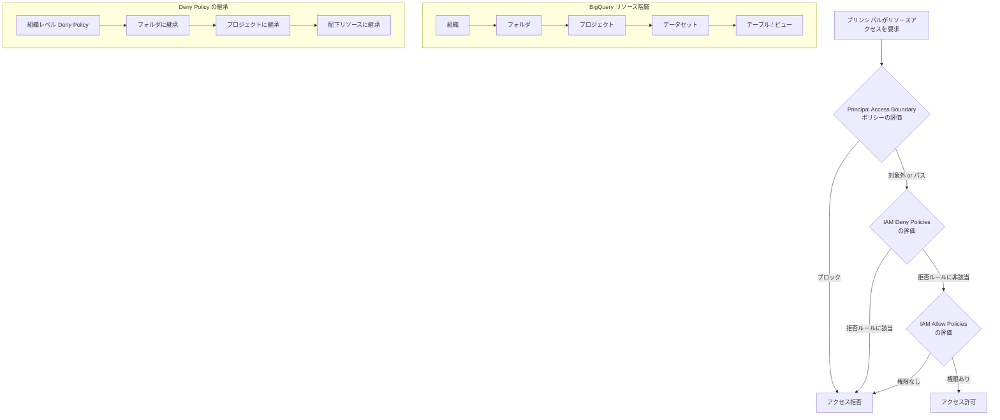

# BigQuery: IAM deny policies が GA (一般提供開始)

**リリース日**: 2026-06-08

**サービス**: BigQuery

**機能**: IAM deny policies for BigQuery

**ステータス**: GA (一般提供)

[このアップデートのインフォグラフィックを見る](https://takech9203.github.io/google-cloud-news-summary/20260608-bigquery-iam-deny-policies-ga.html)

## 概要

BigQuery における IAM deny policies (拒否ポリシー) が一般提供 (GA) となりました。これにより、BigQuery リソースへのアクセスに対して明示的な「拒否」ルールを設定し、付与されたロールに関係なく特定のプリンシパルの権限を確実にブロックできるようになります。

IAM deny policies は、従来の allow policies (許可ポリシー) だけでは実現が困難だった「ガードレール」型のアクセス制御を可能にします。組織全体でデータガバナンスを強化し、機密データへの不正アクセスを防止するための強力なセキュリティレイヤーとして機能します。

この GA リリースにより、本番環境での利用が正式にサポートされ、SLA の対象となります。データ分析基盤のセキュリティ管理者やコンプライアンス担当者にとって重要なアップデートです。

**アップデート前の課題**

- allow policies のみではプリンシパルが持つ権限を「上限なく」付与でき、意図しないアクセスが発生する可能性があった
- 組織階層の上位で付与されたロールを下位レベルで制限する手段が限定的だった
- 特定のユーザーやサービスアカウントに対して「特定の操作を絶対に許可しない」という制約を設定するには複雑なカスタムロール設計が必要だった
- Preview 段階ではプロダクション利用に SLA がなく、本番環境での採用がためらわれていた

**アップデート後の改善**

- deny policies により、allow policies で付与された権限があっても特定のアクションを明示的にブロック可能になった
- 組織・フォルダ・プロジェクトレベルで deny policies を設定し、階層全体に継承させることが可能
- GA により SLA の対象となり、本番環境で安心して利用可能
- CEL (Common Expression Language) による条件付き拒否ルールで柔軟なポリシー設計が可能

## アーキテクチャ図



この図は IAM のポリシー評価フローを示しています。Deny policies は Allow policies より先に評価され、拒否ルールに該当した場合はロール付与に関係なくアクセスがブロックされます。

## サービスアップデートの詳細

### 主要機能

1. **明示的な権限拒否**
   - 特定のプリンシパルに対して BigQuery の権限を明示的に拒否可能
   - allow policies で付与された権限であっても deny policies が優先される
   - `bigquery.googleapis.com/tables.getData` や `bigquery.googleapis.com/datasets.delete` など多数の権限が deny 対象としてサポート

2. **階層型ポリシー継承**
   - 組織、フォルダ、プロジェクトのいずれかにアタッチ可能
   - 上位リソースに設定した deny policy は配下の全リソースに自動的に継承
   - リソースあたり最大 500 の deny policies、合計 500 の deny rules を設定可能

3. **条件付き拒否ルール (Denial Conditions)**
   - CEL を使用して条件付きの拒否ルールを定義可能
   - リソースタグに基づく条件分岐が可能 (例: タグ `env:prod` のリソースのみ拒否)
   - 条件が true の場合のみ拒否ルールが適用される

4. **例外プリンシパル (Exception Principals)**
   - 拒否対象から特定のプリンシパルを除外可能
   - BigQuery の authorized resources (認可済みリソース) に対する特別な制御が可能
   - `principalSet://bigquery.googleapis.com/projects/PROJECT_NUMBER/*` 形式で BigQuery 認可済みリソースを指定

5. **権限グループによる一括拒否**
   - ワイルドカードを使用して関連する権限をまとめて拒否可能
   - `bigquery.googleapis.com/tables.*` でテーブル関連の全権限を拒否
   - 将来追加される新しい権限も自動的にカバー

## 技術仕様

### サポートされる BigQuery 権限

| 権限カテゴリ | 主要な権限例 | 用途 |
|------|------|------|
| テーブルデータ | `bigquery.googleapis.com/tables.getData` | データ読み取りの拒否 |
| テーブル管理 | `bigquery.googleapis.com/tables.delete` | テーブル削除の防止 |
| データセット管理 | `bigquery.googleapis.com/datasets.delete` | データセット削除の防止 |
| ジョブ実行 | `bigquery.googleapis.com/jobs.create` | クエリ実行の制限 |
| IAM 管理 | `bigquery.googleapis.com/datasets.setIamPolicy` | アクセス制御変更の防止 |

### Deny Policy の構造

```json
{
  "displayName": "BigQuery データ保護ポリシー",
  "rules": [
    {
      "description": "機密データセットの削除を全ユーザーに対して拒否",
      "denyRule": {
        "deniedPrincipals": [
          "principalSet://goog/public:all"
        ],
        "exceptionPrincipals": [
          "principal://iam.googleapis.com/projects/-/serviceAccounts/admin@project.iam.gserviceaccount.com"
        ],
        "deniedPermissions": [
          "bigquery.googleapis.com/datasets.delete",
          "bigquery.googleapis.com/tables.delete"
        ],
        "denialCondition": {
          "expression": "resource.matchTag('123456/env', 'production')"
        }
      }
    }
  ]
}
```

## 設定方法

### 前提条件

1. IAM deny policies を管理するための権限 (`iam.denypolicies.create`, `iam.denypolicies.update`) が付与されていること
2. 対象プロジェクト、フォルダ、または組織への適切なアクセス権があること
3. gcloud CLI が最新バージョンにアップデートされていること

### 手順

#### ステップ 1: Deny Policy の JSON ファイルを作成

```json
{
  "displayName": "BigQuery テーブル削除防止ポリシー",
  "rules": [
    {
      "description": "本番環境のテーブル削除を拒否",
      "denyRule": {
        "deniedPrincipals": ["principalSet://goog/public:all"],
        "deniedPermissions": [
          "bigquery.googleapis.com/tables.delete",
          "bigquery.googleapis.com/datasets.delete"
        ],
        "denialCondition": {
          "expression": "resource.matchTag('YOUR_ORG_ID/env', 'production')"
        }
      }
    }
  ]
}
```

このファイルを `policy.json` として保存します。

#### ステップ 2: Deny Policy を作成

```bash
gcloud iam policies create my-bq-deny-policy \
  --attachment-point=cloudresourcemanager.googleapis.com/projects/my-project \
  --kind=denypolicies \
  --policy-file=policy.json
```

プロジェクト `my-project` に deny policy がアタッチされ、配下の全 BigQuery リソースに適用されます。

#### ステップ 3: Deny Policy の確認

```bash
gcloud iam policies get my-bq-deny-policy \
  --attachment-point=cloudresourcemanager.googleapis.com/projects/my-project \
  --kind=denypolicies \
  --format=json
```

#### ステップ 4: Terraform による管理 (オプション)

```hcl
resource "google_iam_deny_policy" "bq_protection" {
  provider     = google-beta
  parent       = urlencode("cloudresourcemanager.googleapis.com/projects/${var.project_id}")
  name         = "bq-table-protection"
  display_name = "BigQuery テーブル保護ポリシー"

  rules {
    deny_rule {
      denied_principals  = ["principalSet://goog/public:all"]
      denied_permissions = ["bigquery.googleapis.com/tables.delete"]
    }
  }
}
```

## メリット

### ビジネス面

- **コンプライアンス強化**: 規制要件に基づくデータアクセス制限を組織全体で一貫して適用可能
- **リスク軽減**: 誤った権限付与によるデータ漏洩や破壊のリスクを根本的に排除
- **監査対応の簡素化**: deny policies により「何が禁止されているか」が明確に文書化され、監査対応が容易に

### 技術面

- **防御的セキュリティ**: allow policies と組み合わせた多層防御アーキテクチャの実現
- **運用負荷の軽減**: 複雑なカスタムロール設計が不要に、deny policy で一括制御が可能
- **将来の権限追加への自動対応**: 権限グループ (ワイルドカード) 使用時、新規追加される権限も自動的に拒否対象に

## デメリット・制約事項

### 制限事項

- deny policies の変更反映は結果整合性 (eventually consistent) であり、即座に反映されない場合がある
- BigQuery のキャッシュ結果 (24時間) に対しては `bigquery.tables.getData` の deny だけではブロックできず、`bigquery.jobs.create` の deny も必要
- 認可済みリソース (authorized views/routines/datasets) は通常の deny では制御できず、特別なプリンシパル指定が必要
- リソースあたり deny policies は最大 500、deny rules の合計も最大 500 という上限がある

### 考慮すべき点

- deny policies は allow policies より先に評価されるため、過度に広範な deny rule は正当なアクセスもブロックする可能性がある
- 条件 (denialCondition) はリソースタグ関数のみサポートしており、他の条件属性は使用不可
- 既存のデータセットサブスクリプションは deny policies の影響を受けない場合があるため、別途確認が必要
- deny policies のデバッグには Policy Troubleshooter や Policy Analyzer の活用が推奨される

## ユースケース

### ユースケース 1: 本番データセットの誤削除防止

**シナリオ**: 大規模な分析チームで複数のエンジニアが BigQuery を利用しており、本番環境のデータセットやテーブルが誤って削除されるリスクがある。

**実装例**:
```json
{
  "displayName": "本番データセット保護",
  "rules": [
    {
      "denyRule": {
        "deniedPrincipals": ["principalSet://goog/public:all"],
        "exceptionPrincipals": [
          "principalSet://goog/group/platform-admins@example.com"
        ],
        "deniedPermissions": [
          "bigquery.googleapis.com/datasets.delete",
          "bigquery.googleapis.com/tables.delete"
        ],
        "denialCondition": {
          "expression": "resource.matchTag('123456789/env', 'production')"
        }
      }
    }
  ]
}
```

**効果**: platform-admins グループ以外の全ユーザーが、`env:production` タグ付きリソースを削除できなくなり、誤操作による本番データの喪失を防止できる。

### ユースケース 2: 機密データへのアクセス制御強化

**シナリオ**: PII (個人識別情報) を含むテーブルに対し、特定の部署以外からのデータ読み取りを組織レベルで禁止したい。

**実装例**:
```json
{
  "displayName": "PII データアクセス制限",
  "rules": [
    {
      "denyRule": {
        "deniedPrincipals": ["principalSet://goog/public:all"],
        "exceptionPrincipals": [
          "principalSet://goog/group/data-privacy-team@example.com"
        ],
        "deniedPermissions": [
          "bigquery.googleapis.com/tables.getData"
        ],
        "denialCondition": {
          "expression": "resource.matchTag('123456789/sensitivity', 'pii')"
        }
      }
    }
  ]
}
```

**効果**: data-privacy-team 以外のユーザーが PII タグ付きテーブルのデータを読み取ることが不可能になり、データプライバシー規制への準拠が強制される。

### ユースケース 3: IAM ポリシーの不正変更防止

**シナリオ**: プロジェクト内の BigQuery データセットの IAM ポリシーが無断で変更されることを防ぎ、セキュリティチームのみが権限管理を行えるようにしたい。

**効果**: セキュリティチーム以外によるアクセス制御の変更が不可能になり、権限エスカレーション攻撃のリスクが大幅に低減される。

## 料金

IAM deny policies の利用自体には追加料金は発生しません。BigQuery の通常の料金体系 (ストレージ、クエリ処理) がそのまま適用されます。

## 利用可能リージョン

IAM deny policies はグローバルリソースであり、BigQuery が利用可能な全てのリージョンで使用できます。deny policy は組織、フォルダ、またはプロジェクトにアタッチされ、リージョンに依存しません。

## 関連サービス・機能

- **IAM Allow Policies**: deny policies と組み合わせて多層防御を実現する従来のアクセス制御メカニズム
- **BigQuery Row-Level Security**: テーブル内の行単位でアクセスを制御するためのポリシー
- **BigQuery Column-Level Security (Data Policies)**: 列単位でのデータマスキングやアクセス制御
- **VPC Service Controls**: ネットワークレベルでの BigQuery データ流出防止
- **Organization Policy Service**: 組織全体のリソース構成を制御するガバナンスツール
- **IAM Conditions**: allow policies や deny policies に条件ロジックを追加する仕組み

## 参考リンク

- [インフォグラフィック](https://takech9203.github.io/google-cloud-news-summary/20260608-bigquery-iam-deny-policies-ga.html)
- [公式リリースノート](https://docs.cloud.google.com/release-notes#June_08_2026)
- [BigQuery アクセス制御ドキュメント](https://docs.cloud.google.com/bigquery/docs/control-access-to-resources-iam)
- [IAM Deny Policies 概要](https://docs.cloud.google.com/iam/docs/deny-overview)
- [IAM Deny Policies の作成・管理](https://docs.cloud.google.com/iam/docs/deny-access)
- [Deny Policies でサポートされる権限一覧](https://docs.cloud.google.com/iam/docs/deny-permissions-support)

## まとめ

BigQuery における IAM deny policies の GA リリースは、エンタープライズ環境でのデータガバナンスを大幅に強化する重要なアップデートです。allow policies だけでは実現困難だった「確実な拒否」が可能になり、誤操作や権限エスカレーションからの保護が組織レベルで実装できます。データセキュリティ要件の厳しい組織では、既存の allow policies と組み合わせて deny policies を導入し、多層防御アーキテクチャを構築することを推奨します。

---

**タグ**: #BigQuery #IAM #DenyPolicies #セキュリティ #アクセス制御 #データガバナンス #GA
