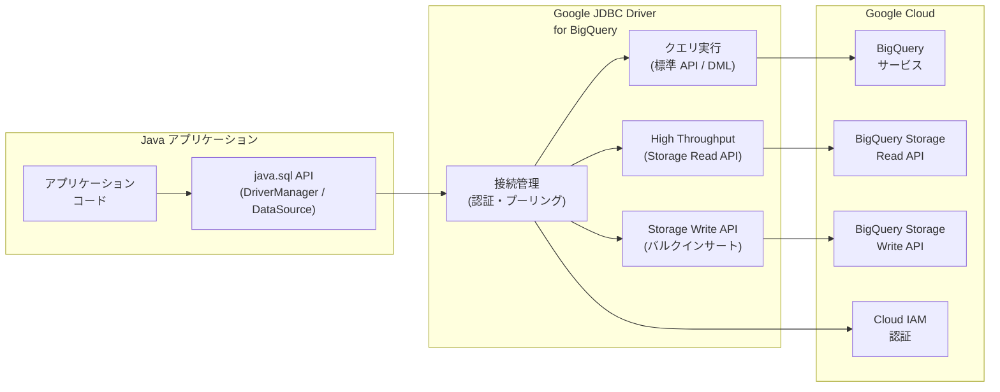

# BigQuery: Java Database Connectivity (JDBC) ドライバーが GA

**リリース日**: 2026-06-08

**サービス**: BigQuery

**機能**: Java Database Connectivity (JDBC) driver for BigQuery

**ステータス**: GA (一般提供開始)

[このアップデートのインフォグラフィックを見る](https://takech9203.github.io/google-cloud-news-summary/20260608-bigquery-jdbc-driver-ga.html)

## 概要

Google が開発したオープンソースの JDBC (Java Database Connectivity) ドライバーが一般提供 (GA) となった。このドライバーにより、Java アプリケーションから標準的な JDBC インターフェースを通じて BigQuery に接続し、クエリの実行やデータ操作が可能になる。

従来、Java アプリケーションから BigQuery に JDBC で接続する場合は、サードパーティ (insightsoftware) 製の Simba JDBC ドライバーを使用する必要があった。今回 GA となった Google 製 JDBC ドライバーは、Google が直接開発・メンテナンスするオープンソースのドライバーであり、BigQuery の最新機能への迅速な対応、Maven Central からの容易な導入、Storage Read API による高スループット読み取りなど、多くの利点を提供する。

このドライバーは、既存の Java/JDBC エコシステムを活用して BigQuery と統合したい開発者、BI ツール管理者、データエンジニアを主な対象としている。

**アップデート前の課題**

- Java アプリケーションから BigQuery に JDBC で接続するには、サードパーティ製の Simba JDBC ドライバーに依存する必要があった
- Simba ドライバーは BigQuery ロード機能やエクスポート機能をサポートしておらず、一部機能に制限があった
- Google 製 JDBC ドライバーは Preview 段階であり、本番環境での利用に SLA が保証されていなかった
- サードパーティ製ドライバーでは、BigQuery の新機能への対応にタイムラグが発生する可能性があった

**アップデート後の改善**

- Google が直接開発・サポートする JDBC ドライバーが本番環境対応 (GA) となり、SLA が保証される
- Maven Central から簡単に依存関係として追加でき、Gradle/Maven で標準的なワークフローで利用可能
- Storage Read API (High Throughput API) を利用した高速なデータ読み取りが可能
- オープンソースとして公開されており、透明性とコミュニティ貢献が可能
- 接続プーリング、セッション管理、バルクインサートなど充実した機能セット

## アーキテクチャ図



Java アプリケーションは標準の `java.sql` API を通じて Google JDBC ドライバーに接続し、ドライバーが BigQuery の各 API (標準クエリ API、Storage Read API、Storage Write API) を適切に使い分けてデータアクセスを行う。

## サービスアップデートの詳細

### 主要機能

1. **標準 JDBC インターフェース準拠**
   - `DriverManager` または `DataSource` クラスによる接続確立
   - `PreparedStatement` によるパラメータ化クエリのサポート
   - `ResultSet` による標準的なデータ取得
   - `executeBatch` によるバルクインサート操作

2. **多様な認証方式のサポート**
   - サービスアカウント認証 (キーファイル)
   - Google ユーザーアカウント認証
   - 事前生成リフレッシュ/アクセストークン認証
   - Application Default Credentials (ADC)
   - Workload Identity Federation (BYOID)

3. **高スループットデータ読み取り (Storage Read API)**
   - `EnableHighThroughputAPI` プロパティで有効化
   - 大量データの読み取りパフォーマンスを大幅に向上
   - アクティベーション閾値のカスタマイズ可能

4. **Storage Write API によるバルクインサート**
   - `EnableWriteAPI` プロパティで有効化
   - 大量データの効率的な書き込み
   - `executeBatch` メソッドとの組み合わせで高速インサート

5. **オープンソース**
   - Google が開発・メンテナンス
   - Maven Central で公開 (`com.google.cloud:google-cloud-bigquery-jdbc`)
   - Shaded Uber JAR も利用可能

## 技術仕様

### 接続文字列フォーマット

```
jdbc:bigquery://HOST:PORT;ProjectId=PROJECT_ID;OAuthType=AUTH_TYPE;AUTH_PROPS;OTHER_PROPS
```

### データ型マッピング

| GoogleSQL 型 | Java 型 |
|------|------|
| ARRAY | Array |
| BIGNUMERIC | BigDecimal |
| BOOL | Boolean |
| BYTES | byte[] |
| DATE | Date |
| DATETIME | String |
| FLOAT64 | Double |
| GEOGRAPHY | String |
| INT64 | Long |
| INTERVAL | String |
| JSON | String |
| NUMERIC | BigDecimal |
| STRING | String |
| STRUCT | Struct |
| TIME | Time |
| TIMESTAMP | Timestamp |

### 主要接続プロパティ

| プロパティ | 説明 | デフォルト値 |
|------|------|------|
| ProjectId | BigQuery プロジェクト ID | (必須) |
| OAuthType | 認証タイプ (0-4) | (必須) |
| DefaultDataset | デフォルトデータセット | N/A |
| EnableHighThroughputAPI | Storage Read API の使用 | FALSE |
| EnableWriteAPI | Storage Write API の使用 | FALSE |
| ConnectionPoolSize | 接続プールサイズ | 10 |
| EnableSession | セッションの有効化 | FALSE |
| JobCreationMode | ジョブ作成モード (1: 常に作成, 2: ジョブなし可) | 2 |
| Location | データセットのロケーション | 自動判定 |
| LogLevel | ログレベル (0-8) | 0 (OFF) |

## 設定方法

### 前提条件

1. Java Runtime Environment (JRE) 8.0 以降がインストールされていること
2. BigQuery への認証が設定されていること
3. Apache Maven または Gradle プロジェクト (推奨)

### 手順

#### ステップ 1: 依存関係の追加

**Maven の場合:**

```xml
<dependency>
  <groupId>com.google.cloud</groupId>
  <artifactId>google-cloud-bigquery-jdbc</artifactId>
  <version>0.3.0</version>
</dependency>
```

**Gradle の場合:**

```groovy
dependencies {
    implementation("com.google.cloud:google-cloud-bigquery-jdbc:0.3.0")
}
```

**スタンドアロン JAR の場合:**

Shaded Uber JAR をダウンロードしてクラスパスに追加する。

#### ステップ 2: 接続の確立

**DriverManager を使用する場合:**

```java
import java.sql.Connection;
import java.sql.DriverManager;

private static Connection getConnection() {
    String url = "jdbc:bigquery://https://www.googleapis.com/bigquery/v2:443;"
        + "ProjectId=my-project;"
        + "OAuthType=3;"; // Application Default Credentials
    Connection connection = DriverManager.getConnection(url);
    return connection;
}
```

**DataSource を使用する場合:**

```java
import com.google.cloud.bigquery.jdbc.DataSource;
import java.sql.Connection;

private static Connection getConnection() throws SQLException {
    DataSource ds = new DataSource();
    ds.setURL("jdbc:bigquery://https://www.googleapis.com/bigquery/v2:443;");
    ds.setAuthType(3); // Application Default Credentials
    ds.setProjectId("my-project");
    ds.setEnableHighThroughputAPI(true);
    return ds.getConnection();
}
```

#### ステップ 3: クエリの実行

```java
import java.sql.ResultSet;
import java.sql.Statement;

Statement statement = connection.createStatement();
ResultSet resultSet = statement.executeQuery(
    "SELECT name, age FROM `my-project.my_dataset.my_table` LIMIT 100"
);

while (resultSet.next()) {
    String name = resultSet.getString("name");
    long age = resultSet.getLong("age");
    System.out.println(name + ": " + age);
}
```

## メリット

### ビジネス面

- **ベンダーロックイン軽減**: Google 製オープンソースドライバーにより、サードパーティへの依存を排除
- **本番環境対応**: GA ステータスにより SLA が保証され、エンタープライズ利用に安心
- **コスト効率**: ドライバー自体は無料で利用可能 (BigQuery の標準料金のみ)

### 技術面

- **高パフォーマンス**: Storage Read API による高スループット読み取りで大量データ処理を高速化
- **標準準拠**: java.sql パッケージの標準インターフェースに準拠し、既存コードの移行が容易
- **柔軟な配布形式**: Maven Central、Gradle、Shaded Uber JAR の 3 形式で提供
- **豊富な認証オプション**: ADC、サービスアカウント、Workload Identity Federation など多様な認証方式をサポート

## デメリット・制約事項

### 制限事項

- BigQuery 専用ドライバーであり、他の Google Cloud サービスやデータベースには使用不可
- INTERVAL データ型は BigQuery Storage Read API 使用時にサポートされない
- BigQuery の DML (Data Manipulation Language) に関するすべての制限事項が適用される

### 考慮すべき点

- Simba JDBC ドライバーからの移行時は接続文字列のフォーマットが異なるため、設定変更が必要
- High Throughput API (Storage Read API) を使用する場合、`roles/bigquery.readSessionUser` ロールが追加で必要
- ドライバーのバージョン管理と依存関係の競合に注意が必要

## ユースケース

### ユースケース 1: 既存 Java アプリケーションの BigQuery 統合

**シナリオ**: RDBMS を使用している既存の Java アプリケーションで、分析クエリを BigQuery に移行したい場合。

**実装例**:
```java
// 既存の JDBC コードを最小限の変更で BigQuery に接続
String bqUrl = "jdbc:bigquery://https://www.googleapis.com/bigquery/v2:443;"
    + "ProjectId=analytics-project;"
    + "OAuthType=3;"
    + "DefaultDataset=sales_data;";

Connection conn = DriverManager.getConnection(bqUrl);
PreparedStatement ps = conn.prepareStatement(
    "SELECT region, SUM(revenue) as total FROM sales WHERE date = ? GROUP BY region"
);
ps.setDate(1, java.sql.Date.valueOf("2026-06-01"));
ResultSet rs = ps.executeQuery();
```

**効果**: 既存の DAO (Data Access Object) レイヤーを大幅に書き換えることなく、BigQuery の分析能力を活用できる。

### ユースケース 2: BI ツール・レポーティングツールとの接続

**シナリオ**: JDBC 接続をサポートする BI ツール (JasperReports、BIRT、DBeaver など) から BigQuery のデータにアクセスしたい場合。

**効果**: JDBC ドライバーの JAR をツールに追加するだけで、GUI ベースのクエリ作成やレポート生成が BigQuery 上で可能になる。

### ユースケース 3: バルクデータ投入パイプライン

**シナリオ**: Java バッチ処理で大量のデータを BigQuery にロードする必要がある場合。

**実装例**:
```java
// Storage Write API を使ったバルクインサート
DataSource ds = new DataSource();
ds.setURL("jdbc:bigquery://https://www.googleapis.com/bigquery/v2:443;");
ds.setProjectId("etl-project");
ds.setAuthType(3);
ds.setEnableWriteAPI(true);

Connection conn = ds.getConnection();
PreparedStatement ps = conn.prepareStatement(
    "INSERT INTO `etl-project.warehouse.events` (event_id, timestamp, payload) VALUES (?, ?, ?)"
);

for (Event event : events) {
    ps.setString(1, event.getId());
    ps.setTimestamp(2, event.getTimestamp());
    ps.setString(3, event.getPayload());
    ps.addBatch();
}
ps.executeBatch();
```

**効果**: Storage Write API を活用し、数千件単位のバッチインサートを効率的に実行できる。

## 料金

JDBC ドライバー自体は無料でダウンロード・使用可能。追加ライセンスも不要。ただし、ドライバーを通じた BigQuery の利用には標準の BigQuery 料金が適用される。

| 項目 | 料金体系 |
|------|------|
| JDBC ドライバー | 無料 |
| BigQuery クエリ (オンデマンド) | $7.50 / TB (スキャンデータ量) |
| BigQuery Storage Read API | $1.10 / TB (読み取りデータ量) |
| BigQuery ストレージ | $0.02 / GB / 月 (アクティブ) |

詳細は [BigQuery 料金ページ](https://cloud.google.com/bigquery/pricing) を参照。

## 関連サービス・機能

- **BigQuery Storage Read API**: High Throughput API として JDBC ドライバーから利用可能。大量データの読み取り高速化に使用
- **BigQuery Storage Write API**: バルクインサート時に使用され、大量書き込みのパフォーマンスを向上
- **Simba ODBC/JDBC ドライバー**: 従来のサードパーティ製ドライバー。非 Java アプリケーションでは引き続き ODBC ドライバーを使用
- **Cloud IAM**: 認証・認可の基盤。サービスアカウント、Workload Identity Federation による安全なアクセス制御
- **BigQuery Connection API**: 外部データソースへの接続管理

## 参考リンク

- [インフォグラフィック](https://takech9203.github.io/google-cloud-news-summary/20260608-bigquery-jdbc-driver-ga.html)
- [公式リリースノート](https://docs.cloud.google.com/release-notes#June_08_2026)
- [JDBC ドライバー ドキュメント](https://docs.cloud.google.com/bigquery/docs/jdbc-for-bigquery)
- [Simba ODBC/JDBC ドライバー](https://docs.cloud.google.com/bigquery/docs/reference/odbc-jdbc-drivers)
- [Maven Central - google-cloud-bigquery-jdbc](https://mvnrepository.com/artifact/com.google.cloud/google-cloud-bigquery-jdbc)
- [BigQuery 料金ページ](https://cloud.google.com/bigquery/pricing)

## まとめ

Google 製の BigQuery 用 JDBC ドライバーが GA となり、Java エコシステムから BigQuery への接続が公式にサポートされた本番品質のソリューションとなった。Simba JDBC ドライバーからの移行を検討している組織や、新規に Java アプリケーションと BigQuery を統合するプロジェクトでは、この Google 製ドライバーの採用を推奨する。まずは Maven/Gradle の依存関係に追加し、Application Default Credentials で接続を試みることから始めるとよい。

---

**タグ**: #BigQuery #JDBC #Java #GA #データベース接続 #オープンソース #StorageReadAPI #ドライバー
