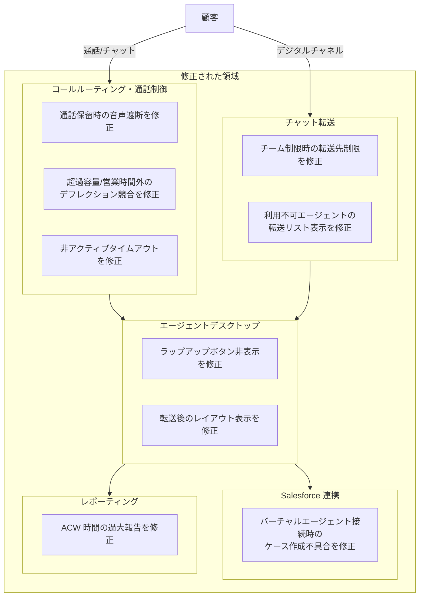

# Google Cloud CCaaS: バグ修正リリース (2026年6月8日)

**リリース日**: 2026-06-08
**サービス**: Google Cloud Contact Center as a Service (CCaaS)
**機能**: バグ修正リリース
**ステータス**: Fixed

📊 [このアップデートのインフォグラフィックを見る](https://takech9203.github.io/google-cloud-news-summary/20260608-ccaas-bug-fixes-june-8.html)

## 概要

Google Cloud Contact Center as a Service (CCaaS) のバグ修正リリースが 2026 年 6 月 8 日に公開された。本リリースでは、コールルーティング、エージェントデスクトップ、Salesforce 連携、チャット転送、レポーティングなど、プラットフォーム全体にわたる 9 件の不具合が修正されている。

CCaaS は Google Cloud が提供するエンタープライズ向けのフルスタック型オムニチャネルコンタクトセンターソリューションであり、AI 駆動のルーティング、バーチャルエージェント、エージェントアシスト機能を統合した CRM ネイティブなプラットフォームである。今回の修正は、日常的なコンタクトセンター運用において発生していた実務上の障害を解消するものであり、エージェントの業務効率とカスタマーエクスペリエンスの両面で改善が見込まれる。

本リリースは新機能の追加を含まないメンテナンスリリースであるが、通話保留機能の不具合やラップアップボタンの非表示、転送リストの誤表示など、エージェントの業務フローに直接影響する重要な修正が多数含まれている。

**アップデート前の課題**

- Salesforce 連携時、バーチャルエージェントが通話に接続した場合にケースが作成されなかった
- 転送制限のあるチームのエージェントが、チーム未所属のエージェントへチャットを転送できなかった
- 通話保留時にエージェントと発信者の間で音声が聞こえ続ける状態が発生していた
- アウトバウンドコール完了後にラップアップ送信ボタンが表示されなかった
- 転送先キューのレイアウトではなく転送元キューのレイアウトが受信エージェントに表示されていた

**アップデート後の改善**

- Salesforce 連携においてバーチャルエージェント接続時にもケースが正常に作成されるようになった
- チーム転送制限のあるエージェントもチーム未所属のエージェントへチャット転送が可能になった
- 通話保留が正常に機能し、エージェント・発信者間の音声が適切に遮断されるようになった
- アウトバウンドコール完了後にラップアップ送信ボタンが正常に表示されるようになった
- 通話転送後に受信エージェントへ正しい転送先キューのレイアウトが表示されるようになった

## アーキテクチャ図

本図は今回のバグ修正が影響する CCaaS プラットフォームの主要コンポーネントを示している。コールルーティング・通話制御、チャット転送、エージェントデスクトップ、Salesforce 連携、レポーティングの 5 つの領域にわたり修正が行われた。

## サービスアップデートの詳細

### Salesforce 連携の修正

1. **バーチャルエージェント接続時のケース作成不具合**
   - バーチャルエージェントが通話に接続した際に Salesforce 上でケースが作成されない問題を修正
   - CRM 連携において通話記録の一貫性が確保された

### コールルーティング・通話制御の修正

2. **通話保留時の音声漏洩**
   - エージェントが発信者を保留にした後も双方の音声が聞こえ続ける問題を修正
   - 保留中のプライバシーとセキュリティが確保された

3. **超過容量デフレクションと営業時間外デフレクションの競合**
   - 超過容量デフレクション設定が営業時間外デフレクションに干渉し、通話が誤ってキューに入れられる問題を修正
   - デフレクションルールの優先順位が正しく適用されるようになった

4. **非アクティブタイムアウトの不具合**
   - 設定通りに非アクティブタイムアウトが機能しない問題を修正
   - タイムアウト設定が期待通りに動作するようになった

### チャット転送の修正

5. **チーム転送制限時のエージェント間転送**
   - 転送制限のあるチームに所属するエージェントが、チーム未所属のエージェントへチャットを転送できない問題を修正
   - チーム制限のルールが正しく適用され、意図した転送先への転送が可能になった

6. **利用不可エージェントの転送リスト表示**
   - チャット転送に利用できないエージェントが転送リストに表示され続け、転送試行が失敗する問題を修正
   - 転送リストにはチャット転送可能なエージェントのみが表示されるようになった

### エージェントデスクトップの修正

7. **アウトバウンドコール後のラップアップボタン非表示**
   - アウトバウンドコール完了後にコールアダプター上でラップアップ送信ボタンが表示されない問題を修正
   - エージェントが正常にラップアップ作業を完了できるようになった

8. **通話転送後のデスクトップレイアウト表示**
   - 通話を別のキューに転送した後、受信エージェントに転送先キューのレイアウトではなく転送元キューのレイアウトが表示される問題を修正
   - 受信エージェントに対して正しいキューのデスクトップレイアウトが表示されるようになった

### レポーティングの修正

9. **ACW (After Call Work) 時間の過大報告**
   - サードパーティへの転送通話において ACW 時間が実際より高く報告される問題を修正
   - レポートの正確性が向上し、パフォーマンス指標の信頼性が改善された

## 技術仕様

### 修正対象コンポーネント一覧

| 修正領域 | 影響範囲 | 重要度 |
|---------|---------|--------|
| Salesforce CRM 連携 | バーチャルエージェント経由の通話記録 | 高 |
| 通話保留機能 | 全ての保留操作 | 高 |
| エージェントデスクトップ UI | アウトバウンドコールのラップアップ | 中 |
| エージェントデスクトップ UI | キュー転送後のレイアウト | 中 |
| チャット転送ロジック | チーム制限付きエージェントの転送 | 中 |
| チャット転送リスト | エージェント可用性のフィルタリング | 中 |
| デフレクション設定 | 超過容量/営業時間外ルールの優先順位 | 高 |
| タイムアウト制御 | 非アクティブセッションの管理 | 中 |
| レポーティング | ACW メトリクスの算出 | 中 |

### CCaaS プラットフォームの SLA

| 項目 | 詳細 |
|------|------|
| 対象サービス | Google Cloud CCaaS インスタンス |
| 月間稼働率目標 | 99.9% 以上 |
| ダウンタイム定義 | 5% 以上のエラーレートが 5 分以上連続 |

## メリット

### ビジネス面

- **CRM データの完全性向上**: Salesforce 連携の修正により、バーチャルエージェント経由の通話も含め全ての顧客インタラクションが CRM に正確に記録される
- **レポーティング精度の改善**: ACW 時間の過大報告が修正され、エージェントのパフォーマンス評価やワークフォース計画の精度が向上する
- **営業時間外対応の正常化**: デフレクション設定の競合が解消され、営業時間外の顧客対応フローが意図通りに動作する

### 技術面

- **通話制御の信頼性向上**: 保留機能の不具合修正により、通話制御の基本機能が確実に動作する
- **エージェントワークフローの改善**: ラップアップボタンの表示修正とレイアウト表示の修正により、エージェントの操作ミスや混乱が減少する
- **転送機能の正確性向上**: チャット転送リストの正確な表示により、転送失敗が解消され、顧客の待ち時間が短縮される

## 関連サービス・機能

- **Salesforce CRM 連携**: CCaaS の主要 CRM 連携パートナーの一つ。今回のリリースでバーチャルエージェント経由のケース作成不具合が修正された
- **Conversational Agents (Dialogflow CX)**: CCaaS のバーチャルエージェント機能を提供するコンポーネント。今回の Salesforce 連携修正はバーチャルエージェントの通話接続に関連する
- **Agent Assist**: エージェント支援機能を提供する Gemini Enterprise for CX のコンポーネント。エージェントデスクトップ上で動作する
- **Customer Experience Insights**: コンタクトセンターのレポーティング・分析機能。ACW 時間の修正はこの領域のデータ精度に影響する

## 参考リンク

- 📊 [インフォグラフィック](https://takech9203.github.io/google-cloud-news-summary/20260608-ccaas-bug-fixes-june-8.html)
- [Google Cloud Release Notes](https://docs.cloud.google.com/release-notes#June_08_2026)
- [CCaaS ドキュメント](https://docs.cloud.google.com/contact-center/ccai-platform/docs)
- [CCaaS ソリューション概要](https://cloud.google.com/solutions/contact-center-as-a-service)
- [CCaaS SLA](https://cloud.google.com/terms/contact-center/ccai-platform/sla)

## まとめ

今回の Google Cloud CCaaS バグ修正リリースは、コンタクトセンター運用の核となる通話制御、エージェントデスクトップ、CRM 連携、チャット転送、レポーティングの 5 つの領域にわたる 9 件の不具合を解消するものである。特に通話保留時の音声漏洩、Salesforce ケース未作成、デフレクション設定の競合は運用上の重大な問題であり、本修正により CCaaS プラットフォームの信頼性が大幅に向上する。CCaaS を利用中のコンタクトセンターは、修正が適用されたことを確認し、影響のあった業務フローが正常に動作していることを検証することを推奨する。

---

**タグ**: #CCaaS #コンタクトセンター #バグ修正 #Salesforce連携
