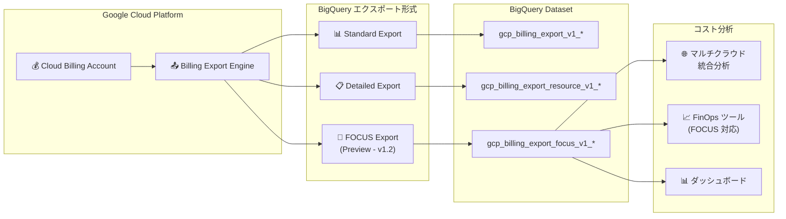

# Cloud Billing: FOCUS 課金データエクスポート (Preview)

**リリース日**: 2026-06-08

**サービス**: Cloud Billing

**機能**: FOCUS 課金データエクスポート to BigQuery

**ステータス**: Preview

📊 [このアップデートのインフォグラフィックを見る](https://takech9203.github.io/google-cloud-news-summary/20260608-cloud-billing-focus-export-preview.html)

## 概要

Cloud Billing の BigQuery へのデータエクスポートに、FinOps Open Cost and Usage Specification (FOCUS) に準拠した新しいエクスポート形式が Preview として追加された。FOCUS は、テクノロジー課金データの生成者が一貫性のあるコストと使用量のデータセットを生成するための明確な要件を定義するオープン仕様であり、マルチクラウド環境でのコスト管理を標準化するために FinOps Foundation が策定したものである。

Google Cloud の FOCUS データエクスポートは FOCUS バージョン 1.2 までのカラムに対応しており、既存の Standard/Detailed エクスポートに加えて、業界標準に準拠した形式でコストデータを BigQuery に出力できるようになった。これにより、マルチクラウド環境を運用する組織は、プロバイダごとに異なるデータ形式を変換することなく、統一的なコスト分析が可能になる。

**アップデート前の課題**

- マルチクラウド環境では各プロバイダが独自のスキーマで課金データを出力するため、統合的なコスト分析に変換処理が必要だった
- Google Cloud 固有のエクスポート形式 (Standard/Detailed) では、他のクラウドプロバイダのデータと直接比較できなかった
- FinOps チームは各プロバイダのデータ構造を個別に理解し、正規化する追加工数が必要だった

**アップデート後の改善**

- FOCUS 仕様に準拠した標準化されたカラム構造で課金データをエクスポートできるようになった
- マルチクラウドのコストデータを同一スキーマで扱えるため、統合分析やダッシュボード構築が容易になった
- FOCUS バージョン 1.2 までのカラムに対応し、業界標準に沿ったコスト管理プラクティスを実践できるようになった

## アーキテクチャ図



Cloud Billing アカウントから BigQuery へ、従来の Standard/Detailed エクスポートに加え、FOCUS 仕様に準拠した新しいテーブル形式でデータをエクスポートするアーキテクチャ。

## サービスアップデートの詳細

### 主要機能

1. **FOCUS 準拠データエクスポート**
   - FinOps Open Cost and Usage Specification (FOCUS) バージョン 1.2 までのカラムに対応
   - BigQuery データセットに FOCUS 形式のテーブルを自動生成
   - 既存の Standard/Detailed エクスポートと並行して利用可能

2. **標準化されたカラム構造**
   - FOCUS 仕様で定義されたカラム名と型でデータを出力
   - プロバイダ間で共通のデータモデルを提供
   - コスト、使用量、クレジット、調整などの情報を標準フォーマットで格納

3. **FOCUS 適合性レポート**
   - Google Cloud の FOCUS エクスポートがどの程度仕様に準拠しているかを確認するレポートを提供
   - 適合性の詳細と対応状況を透明性をもって公開

## 技術仕様

### FOCUS 仕様の主要カラム (バージョン 1.2)

| カテゴリ | 代表的なカラム | 説明 |
|----------|---------------|------|
| 課金 | BilledCost, EffectiveCost | 請求コストと実効コスト |
| 使用量 | UsageQuantity, UsageUnit | 使用量と単位 |
| リソース | ResourceId, ResourceName | リソースの識別情報 |
| サービス | ServiceName, ServiceCategory | サービス名とカテゴリ |
| 料金 | ListUnitPrice, ContractedUnitPrice | リスト価格と契約価格 |
| 期間 | BillingPeriodStart, BillingPeriodEnd | 課金期間 |
| プロバイダ | Provider, Publisher | プロバイダとパブリッシャー情報 |
| コミットメント | CommitmentDiscountId, CommitmentDiscountType | CUD 関連情報 |

### エクスポートの種類比較

| 項目 | Standard Export | Detailed Export | FOCUS Export (Preview) |
|------|---------------|-----------------|----------------------|
| スキーマ | Google Cloud 固有 | Google Cloud 固有 (拡張) | FOCUS 標準仕様 |
| リソースレベル | なし | あり | あり |
| マルチクラウド互換 | なし | なし | あり |
| 準拠バージョン | - | - | FOCUS 1.2 |
| ステータス | GA | GA | Preview |

### 必要な権限

| ロール | 用途 |
|--------|------|
| Billing Account Costs Manager | FOCUS エクスポートの有効化 |
| Billing Account Administrator | FOCUS エクスポートの有効化 |
| BigQuery User | BigQuery データセットへのアクセス |

## 設定方法

### 前提条件

1. Cloud Billing アカウントへの管理者権限 (Billing Account Administrator または Billing Account Costs Manager)
2. BigQuery データセットを含む Google Cloud プロジェクト
3. BigQuery User ロールが付与されていること
4. BigQuery データセットが作成済みであること

### 手順

#### ステップ 1: BigQuery データセットの作成 (未作成の場合)

```bash
# BigQuery データセットを作成
bq mk --dataset \
  --location=US \
  --description="Cloud Billing FOCUS export" \
  PROJECT_ID:billing_focus_dataset
```

マルチリージョン (US または EU) を推奨。データの遡及エクスポートが利用可能になる。

#### ステップ 2: FOCUS エクスポートの有効化

Google Cloud コンソールで以下の操作を実行:

1. [Billing export] ページに移動
2. 対象の Cloud Billing アカウントを選択
3. [BigQuery export] タブを開く
4. FOCUS データエクスポートの [Edit settings] をクリック
5. プロジェクトとデータセットを選択
6. [Save] をクリック

#### ステップ 3: エクスポートデータの確認

```sql
-- FOCUS テーブルのサンプルクエリ
SELECT
  BillingPeriodStart,
  ServiceName,
  ResourceId,
  BilledCost,
  EffectiveCost,
  UsageQuantity,
  UsageUnit
FROM
  `project.dataset.gcp_billing_export_focus_v1_XXXXXX_XXXXXX_XXXXXX`
WHERE
  BillingPeriodStart >= '2026-06-01'
ORDER BY
  BilledCost DESC
LIMIT 100;
```

## メリット

### ビジネス面

- **マルチクラウドコスト管理の統一化**: AWS、Azure、Google Cloud のコストデータを同一フォーマットで分析可能になり、統合 FinOps ダッシュボードの構築が容易に
- **FinOps ツールとの互換性向上**: FOCUS 対応の FinOps ツール (CloudHealth、Apptio Cloudability など) との連携がシームレスに
- **コスト配分の標準化**: 組織横断的なコスト配分ルールを一貫した形で適用可能

### 技術面

- **ETL 処理の簡素化**: プロバイダ固有のデータ変換が不要になり、パイプラインの複雑さが軽減
- **クエリの共通化**: マルチクラウド対応のクエリテンプレートを作成でき、分析の再利用性が向上
- **データガバナンスの強化**: 標準仕様に準拠したデータにより、監査性と透明性が向上

## デメリット・制約事項

### 制限事項

- 現時点では Preview ステータスであり、本番環境での利用は推奨されない
- Preview 期間中はスキーマや機能が変更される可能性がある
- FOCUS バージョン 1.2 までの対応であり、すべての FOCUS カラムが含まれているわけではない (適合性レポートで確認可能)

### 考慮すべき点

- 既存の Standard/Detailed エクスポート用に作成したクエリやダッシュボードは、FOCUS 形式では直接使用できないため、移行作業が必要
- BigQuery のストレージ・クエリコストが FOCUS テーブル分追加で発生する
- Preview から GA への移行時にスキーマ変更が発生する可能性があるため、自動化パイプラインの構築時は注意が必要

## ユースケース

### ユースケース 1: マルチクラウドのコスト統合分析

**シナリオ**: AWS と Google Cloud を併用する企業が、両プロバイダのコストを統一的に分析したい

**実装例**:
```sql
-- Google Cloud FOCUS データと AWS FOCUS データの統合ビュー
CREATE VIEW `project.dataset.multicloud_costs` AS
SELECT
  Provider,
  ServiceName,
  ServiceCategory,
  SUM(BilledCost) AS total_billed_cost,
  SUM(EffectiveCost) AS total_effective_cost
FROM (
  -- Google Cloud FOCUS export
  SELECT * FROM `project.dataset.gcp_billing_export_focus_v1_*`
  UNION ALL
  -- AWS CUR (FOCUS 形式に変換済み)
  SELECT * FROM `project.dataset.aws_focus_export`
)
WHERE BillingPeriodStart >= '2026-06-01'
GROUP BY Provider, ServiceName, ServiceCategory
ORDER BY total_effective_cost DESC;
```

**効果**: プロバイダ間でのコスト比較が同一カラム構造で実現でき、最適なサービス選択やコスト最適化の意思決定が加速される

### ユースケース 2: FinOps チームのレポート自動化

**シナリオ**: FinOps チームが毎月のコストレポートを組織全体に配信する際に、標準化されたメトリクスで報告したい

**効果**: FOCUS 仕様の標準カラムを使用することで、業界共通の FinOps 用語とメトリクスでレポートを生成でき、経営層への報告品質が向上する

### ユースケース 3: コミットメント (CUD) の効果分析

**シナリオ**: 購入した Committed Use Discounts の実効コストへの影響を FOCUS 標準メトリクスで評価したい

**実装例**:
```sql
-- CUD の削減効果を FOCUS 形式で分析
SELECT
  ServiceName,
  CommitmentDiscountType,
  SUM(BilledCost) AS billed_cost,
  SUM(EffectiveCost) AS effective_cost,
  SUM(BilledCost) - SUM(EffectiveCost) AS savings
FROM
  `project.dataset.gcp_billing_export_focus_v1_XXXXXX_XXXXXX_XXXXXX`
WHERE
  CommitmentDiscountId IS NOT NULL
  AND BillingPeriodStart >= '2026-01-01'
GROUP BY ServiceName, CommitmentDiscountType
ORDER BY savings DESC;
```

**効果**: CUD による実際の削減額を標準メトリクスで定量化し、投資対効果を明確に可視化できる

## 料金

Cloud Billing データエクスポート自体には追加料金は発生しない。ただし、エクスポート先の BigQuery の利用に対して以下の費用が発生する:

- **BigQuery ストレージ**: FOCUS テーブルのデータ保存量に応じた料金
- **BigQuery クエリ**: FOCUS テーブルに対するクエリ処理量に応じた料金

BigQuery の料金詳細は [BigQuery pricing](https://cloud.google.com/bigquery/pricing) を参照。

## 関連サービス・機能

- **BigQuery**: エクスポート先のデータウェアハウス。FOCUS データの保存と分析に使用
- **Cloud Billing Standard Export**: Google Cloud 固有形式の標準コストデータエクスポート (GA)
- **Cloud Billing Detailed Export**: リソースレベルの詳細コストデータエクスポート (GA)
- **Cloud Billing Pricing Export**: SKU 価格データのエクスポート (GA)
- **FinOps Hub**: コスト最適化の推奨事項とインサイトを提供するダッシュボード (GA)
- **Looker / Looker Studio**: FOCUS データに対する可視化とダッシュボード構築

## 参考リンク

- 📊 [インフォグラフィック](https://takech9203.github.io/google-cloud-news-summary/20260608-cloud-billing-focus-export-preview.html)
- [公式リリースノート](https://cloud.google.com/release-notes#June_08_2026)
- [Set up FOCUS Cloud Billing data export to BigQuery](https://cloud.google.com/billing/docs/how-to/export-data-bigquery-setup-focus)
- [Structure of the FOCUS data export](https://cloud.google.com/billing/docs/how-to/export-data-bigquery-tables/focus)
- [FOCUS conformance report](https://cloud.google.com/billing/docs/how-to/export-data-bigquery-tables/focus-conformance)
- [Query examples for FOCUS use cases](https://cloud.google.com/billing/docs/how-to/bq-examples-focus)
- [Cloud Billing data export to BigQuery overview](https://cloud.google.com/billing/docs/how-to/export-data-bigquery)
- [FOCUS specification (FinOps Foundation)](https://focus.finops.org/)
- [BigQuery pricing](https://cloud.google.com/bigquery/pricing)

## まとめ

Cloud Billing の FOCUS データエクスポートは、マルチクラウド環境を運用する組織にとって重要な一歩である。業界標準のオープン仕様に準拠したコストデータを BigQuery で直接利用できるようになることで、プロバイダを横断した統合的なコスト管理が大幅に簡素化される。現在は Preview 段階のため本番運用への適用は慎重に判断すべきだが、FinOps プラクティスの成熟度を高めたい組織は、早期に評価を開始し、GA 時にスムーズに移行できるよう準備することを推奨する。

---

**タグ**: #CloudBilling #FOCUS #FinOps #BigQuery #Preview
