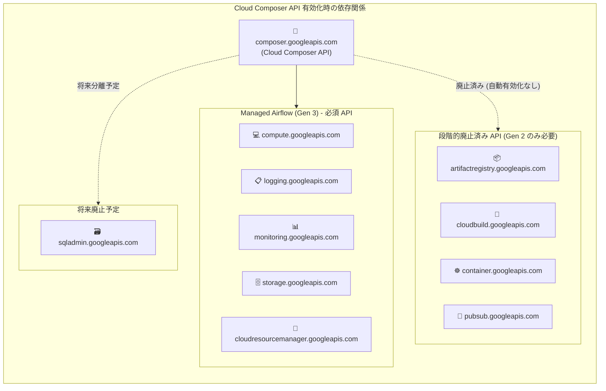

# Cloud Composer: Managed Airflow (Gen 3) API 依存関係の段階的廃止

**リリース日**: 2026-06-08

**サービス**: Cloud Composer

**機能**: Managed Airflow (Gen 3) で不要な API 依存関係の段階的廃止

**ステータス**: Change

📊 [このアップデートのインフォグラフィックを見る](https://takech9203.github.io/google-cloud-news-summary/20260608-cloud-composer-api-dependencies-phase-out.html)

## 概要

Cloud Composer (Managed Service for Apache Airflow) において、Managed Airflow (Gen 3) で不要となった API 依存関係が段階的に廃止された。これにより、新規プロジェクトで Cloud Composer API を有効化した際に、Gen 3 では不要な API が自動的に有効化されなくなる。

Gen 3 ではインフラストラクチャコンポーネント（環境クラスタや依存サービス）が隠蔽されるアーキテクチャに移行しており、従来 Gen 2 で必要だった Artifact Registry、Cloud Build、Google Kubernetes Engine (container)、Pub/Sub の各 API が不要となった。今回の変更は、この新しいアーキテクチャを反映し、プロジェクトの API 構成を簡素化するものである。

**アップデート前の課題**

- Cloud Composer API を有効化すると、Gen 3 では不要な API (Artifact Registry、Cloud Build、Container、Pub/Sub、Cloud SQL Admin) も自動的に有効化されていた
- 不要な API が有効化されていることで、プロジェクトのセキュリティポリシーや API 管理が複雑になっていた
- 組織レベルで API の制限ポリシーを適用している場合、不要な API の存在が混乱を招いていた

**アップデート後の改善**

- Gen 3 のみを使用するプロジェクトでは、不要な API を手動で無効化できるようになった
- 新規プロジェクトでは Gen 3 に不要な API が自動有効化されなくなり、最小権限の原則に沿った構成が可能になった
- プロジェクトの API 構成が簡素化され、管理が容易になった

## アーキテクチャ図



Gen 3 では環境クラスタがユーザープロジェクト外のテナントプロジェクトで実行されるため、GKE (container)、Cloud Build、Artifact Registry、Pub/Sub への直接依存が不要となった。

## サービスアップデートの詳細

### 主要機能

1. **API 依存関係の段階的廃止**
   - 以下の API が Cloud Composer API から分離され、Gen 3 環境では不要となった
   - `artifactregistry.googleapis.com` - コンテナイメージの管理（Gen 3 ではテナントプロジェクト側で管理）
   - `cloudbuild.googleapis.com` - ビルドプロセス（Gen 3 ではテナントプロジェクト側で実行）
   - `container.googleapis.com` - GKE クラスタ（Gen 3 ではユーザープロジェクトにクラスタが配置されない）
   - `pubsub.googleapis.com` - メッセージング（Gen 3 アーキテクチャでは不要）

2. **将来の分離予定**
   - `sqladmin.googleapis.com` (Cloud SQL Admin API) は現時点では未分離
   - 将来のアップデートで分離される予定

3. **既存環境への影響なし**
   - 既に Cloud Composer API が有効化されているプロジェクトの既存環境には影響なし
   - Gen 2 環境を持つプロジェクトでは、これらの API を有効なまま維持する必要がある

## 技術仕様

### Gen 2 と Gen 3 のアーキテクチャ比較

| 項目 | Managed Airflow (Gen 2) | Managed Airflow (Gen 3) |
|------|------------------------|------------------------|
| 環境クラスタ | ユーザープロジェクト内の GKE Autopilot クラスタ | テナントプロジェクト内（ユーザープロジェクトに配置されない） |
| コンテナイメージ管理 | Artifact Registry が必要 | テナントプロジェクト側で管理 |
| ビルドプロセス | Cloud Build が必要 | テナントプロジェクト側で実行 |
| メッセージング | Pub/Sub が必要 | 不要 |
| データベース | Cloud SQL (sqladmin 必要) | Cloud SQL (テナントプロジェクト、将来分離予定) |

### 段階的廃止のタイムライン

| 日付 | 変更内容 |
|------|----------|
| 2026-02-27 | API が完全に分離可能に（無効化しても Cloud Composer API は無効化されない） |
| 2026-05-27 | Cloud Composer API 有効化時に自動有効化されなくなる |
| 2026-06-08 | Release Notes での正式告知（本アップデート） |
| 将来 | `sqladmin.googleapis.com` の分離 |

## 設定方法

### Gen 3 のみのプロジェクトで不要な API を無効化する場合

#### ステップ 1: プロジェクトの環境を確認

```bash
# プロジェクト内の Cloud Composer 環境一覧を確認
gcloud composer environments list --locations=-
```

Gen 3 環境のみであることを確認する。

#### ステップ 2: 不要な API を無効化

```bash
# Gen 3 では不要な API を無効化
gcloud services disable artifactregistry.googleapis.com
gcloud services disable cloudbuild.googleapis.com
gcloud services disable container.googleapis.com
gcloud services disable pubsub.googleapis.com
```

### 新規プロジェクトで Gen 2 環境を作成する場合

#### ステップ 1: Cloud Composer API を有効化

```bash
gcloud services enable composer.googleapis.com
```

#### ステップ 2: Gen 2 に必要な API を手動で有効化

```bash
# Gen 2 環境に必要な API を追加で有効化
gcloud services enable artifactregistry.googleapis.com
gcloud services enable cloudbuild.googleapis.com
gcloud services enable container.googleapis.com
gcloud services enable pubsub.googleapis.com
gcloud services enable sqladmin.googleapis.com
```

## メリット

### ビジネス面

- **最小権限の原則**: Gen 3 のみのプロジェクトでは不要な API を無効化でき、セキュリティポリシーの遵守が容易になる
- **管理の簡素化**: プロジェクト内の有効な API 数を減らすことで、API 管理の負荷が軽減される

### 技術面

- **アーキテクチャの明確化**: Gen 3 のテナントプロジェクトベースのアーキテクチャに合致した API 構成が実現
- **組織ポリシーとの整合性**: `constraints/serviceuser.services` などの組織ポリシーで API 制限を行っている場合、不要な API の許可が不要に
- **自動化スクリプトの更新**: Gen 2 環境のプロビジョニングスクリプトで明示的に API を有効化する形に統一

## デメリット・制約事項

### 制限事項

- `sqladmin.googleapis.com` はまだ分離されておらず、引き続き Cloud Composer API と連動する
- Gen 2 環境を持つプロジェクトでは、分離された API を無効化すると環境が正常に動作しなくなる可能性がある

### 考慮すべき点

- 既存の IaC (Terraform、Deployment Manager) スクリプトで Gen 2 環境を新規プロジェクトにプロビジョニングしている場合、API の明示的な有効化を追加する必要がある
- CI/CD パイプラインで新規プロジェクトに Gen 2 環境を自動作成している場合、パイプラインの更新が必要
- Gen 2 から Gen 3 への移行を計画している場合は、移行完了後に不要な API を無効化するのが望ましい

## ユースケース

### ユースケース 1: Gen 3 のみのプロジェクトでの API 最適化

**シナリオ**: 既に Gen 3 に移行済みのプロジェクトで、セキュリティチームから不要な API の無効化を求められている場合。

**実装例**:
```bash
# 現在の環境が Gen 3 のみであることを確認
gcloud composer environments list --locations=- --format="table(name,config.softwareConfig.imageVersion)"

# 不要な API を無効化
gcloud services disable artifactregistry.googleapis.com \
  cloudbuild.googleapis.com \
  container.googleapis.com \
  pubsub.googleapis.com
```

**効果**: プロジェクトの API 構成が最小化され、セキュリティ監査要件を満たしやすくなる。

### ユースケース 2: 新規プロジェクトでの Gen 2 環境プロビジョニング

**シナリオ**: 自動化スクリプトで新規プロジェクトに Gen 2 環境を作成しているチームが、今回の変更に対応する場合。

**実装例**:
```bash
# Terraform の場合: google_project_service リソースで明示的に API を有効化
resource "google_project_service" "composer" {
  service = "composer.googleapis.com"
}

resource "google_project_service" "composer_deps" {
  for_each = toset([
    "artifactregistry.googleapis.com",
    "cloudbuild.googleapis.com",
    "container.googleapis.com",
    "pubsub.googleapis.com",
    "sqladmin.googleapis.com",
  ])
  service = each.value
}
```

**効果**: 新規プロジェクトでも Gen 2 環境を問題なく作成できる。

## 料金

本アップデート自体に料金の変更はない。Cloud Composer の料金は従量課金制で、vCPU/時間、GB/月、転送データ GB/月に基づく。

不要な API を無効化すること自体に料金は発生しないが、Gen 3 への移行により GKE クラスタのコストが不要となる点は間接的なコスト削減要因となる。

詳細は [Cloud Composer 料金ページ](https://cloud.google.com/composer/pricing) を参照。

## 関連サービス・機能

- **Google Kubernetes Engine (GKE)**: Gen 2 では環境クラスタとして使用されるが、Gen 3 ではテナントプロジェクト側で管理
- **Artifact Registry**: Gen 2 ではコンテナイメージの保管に使用
- **Cloud Build**: Gen 2 では環境のビルドプロセスに使用
- **Pub/Sub**: Gen 2 での環境内メッセージングに使用
- **Cloud SQL**: Airflow メタデータデータベースとして全バージョンで使用（Gen 3 では将来分離予定）

## 参考リンク

- 📊 [インフォグラフィック](https://takech9203.github.io/google-cloud-news-summary/20260608-cloud-composer-api-dependencies-phase-out.html)
- [公式リリースノート](https://docs.cloud.google.com/release-notes#June_08_2026)
- [Cloud Composer API の有効化と無効化 (Gen 3)](https://docs.cloud.google.com/composer/docs/composer-3/enable-composer-service)
- [Cloud Composer バージョニング概要](https://docs.cloud.google.com/composer/docs/composer-versioning-overview)
- [Managed Airflow (Gen 3) 環境アーキテクチャ](https://docs.cloud.google.com/composer/docs/composer-3/environment-architecture)
- [Cloud Composer 料金ページ](https://cloud.google.com/composer/pricing)

## まとめ

Managed Airflow (Gen 3) のテナントプロジェクトベースのアーキテクチャにより不要となった API 依存関係が正式に分離された。Gen 3 のみを使用するプロジェクトでは API 構成を最小化でき、セキュリティと管理の面で改善される。一方、Gen 2 環境を持つプロジェクトや新規プロジェクトでの Gen 2 環境作成には、これらの API の明示的な有効化が必要となるため、IaC スクリプトや CI/CD パイプラインの確認・更新を推奨する。

---

**タグ**: #CloudComposer #ManagedAirflow #Gen3 #API依存関係 #変更
