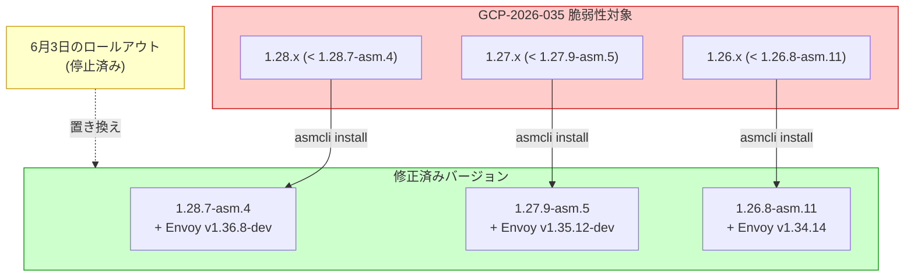

# Cloud Service Mesh: GCP-2026-035 セキュリティパッチリリース

**リリース日**: 2026-06-08

**サービス**: Cloud Service Mesh

**機能**: セキュリティ脆弱性 GCP-2026-035 の修正パッチ

**ステータス**: Security

[このアップデートのインフォグラフィックを見る](https://takech9203.github.io/google-cloud-news-summary/20260608-cloud-service-mesh-security-gcp-2026-035.html)

## 概要

Google Cloud は、Cloud Service Mesh のインクラスター版に対してセキュリティパッチをリリースした。このパッチは、セキュリティ情報 GCP-2026-035 に記載された脆弱性を修正するものであり、サポート対象の全バージョンライン (1.26.x、1.27.x、1.28.x) に対して提供されている。

今回のリリースは、2026年6月3日に発表されていた以前のロールアウトを置き換える形で提供されている。以前のパッチに含まれていた修正に加えて、GCP-2026-035 の脆弱性修正も統合されているため、6月3日のパッチを未適用の環境でも今回のバージョンに直接アップグレードすることで両方の修正を取得できる。

各パッチバージョンでは Envoy プロキシも更新されており、セキュリティ脆弱性に対するより包括的な保護が提供されている。セキュリティパッチであるため、インクラスター Cloud Service Mesh を利用している全ての環境で速やかなアップグレードが推奨される。

**アップデート前の課題**

- GCP-2026-035 に記載されたセキュリティ脆弱性がインクラスター Cloud Service Mesh に存在していた
- 6月3日に発表されたロールアウトでは GCP-2026-035 の修正が含まれていなかった
- 旧バージョンの Envoy プロキシを使用しているため、セキュリティリスクが残存していた

**アップデート後の改善**

- GCP-2026-035 の脆弱性が全サポートバージョンで修正された
- 6月3日のパッチ内容も統合されており、1回のアップグレードで全修正を適用可能
- 最新の Envoy プロキシバージョンにより、セキュリティ保護が強化された

## アーキテクチャ図



この図は、GCP-2026-035 脆弱性の影響を受けるバージョンから修正済みバージョンへのアップグレードパスを示している。6月3日に発表されたロールアウトは停止され、今回のリリースに置き換えられた。

## サービスアップデートの詳細

### 主要機能

1. **セキュリティ脆弱性 GCP-2026-035 の修正**
   - インクラスター Cloud Service Mesh の全サポートバージョンに対する修正パッチ
   - セキュリティ情報の詳細は GCP-2026-035 セキュリティ速報に記載

2. **6月3日ロールアウトの統合**
   - 以前発表されていたロールアウトが停止され、今回のリリースに統合
   - 6月3日のパッチに含まれていた修正も全て含まれている
   - 未適用環境は今回のバージョンに直接アップグレード可能

3. **Envoy プロキシの更新**
   - 各バージョンラインで Envoy が最新のセキュリティ修正版に更新
   - Envoy の脆弱性修正も含まれている可能性がある

## 技術仕様

### パッチバージョン一覧

| バージョンライン | パッチバージョン | Envoy バージョン | 備考 |
|------------------|------------------|------------------|------|
| 1.28.x | 1.28.7-asm.4 | v1.36.8-dev | 最新メジャーライン |
| 1.27.x | 1.27.9-asm.5 | v1.35.12-dev | |
| 1.26.x | 1.26.8-asm.11 | v1.34.14 | 安定版 Envoy |

### EOL (サポート終了) に関する注意

過去のセキュリティパッチパターンから、Cloud Service Mesh v1.25 以前はサポート終了 (End of Life) となっており、セキュリティ修正がバックポートされない。v1.25 以前を利用している場合は v1.26 以上へのアップグレードが必要。

## 設定方法

### 前提条件

1. GKE クラスタにインクラスター Cloud Service Mesh がインストールされていること
2. `asmcli` ツールが利用可能であること
3. クラスタへの管理者アクセス権限があること

### 手順

#### ステップ 1: 現在のバージョンを確認

```bash
# インストールされている Cloud Service Mesh のバージョンを確認
kubectl get pods -n istio-system -o jsonpath='{.items[*].spec.containers[*].image}' | tr ' ' '\n' | sort -u
```

#### ステップ 2: asmcli でアップグレードを実行

```bash
# Cloud Service Mesh のアップグレード (例: 1.28.7-asm.4)
./asmcli install \
  --project_id PROJECT_ID \
  --cluster_name CLUSTER_NAME \
  --cluster_location CLUSTER_LOCATION \
  --output_dir OUTPUT_DIR \
  --enable_all
```

#### ステップ 3: ワークロードの再デプロイ

```bash
# サイドカープロキシの更新のため、ワークロードをローリング再起動
kubectl rollout restart deployment -n YOUR_NAMESPACE
```

アップグレード後、サイドカープロキシが自動的に新しいバージョンに更新される。StatefulSet や Job は手動での再起動が必要。

## メリット

### セキュリティ面

- **脆弱性の解消**: GCP-2026-035 に記載されたセキュリティリスクが排除される
- **統合パッチ**: 6月3日のパッチ内容も含まれており、1回の作業で全ての修正を適用可能
- **Envoy の最新化**: データプレーンのセキュリティが最新状態に更新される

### 運用面

- **簡素化されたアップグレードパス**: 停止されたロールアウトを気にせず、最新版に直接アップグレード可能
- **全バージョンラインのカバー**: サポート対象の全バージョン (1.26、1.27、1.28) にパッチが提供されている

## デメリット・制約事項

### 制限事項

- インクラスター Cloud Service Mesh のみが対象 (マネージド Cloud Service Mesh は自動更新)
- v1.25 以前はサポート終了のため、本パッチの対象外
- アップグレードにはワークロードの再起動が必要

### 考慮すべき点

- セキュリティパッチのため、検証環境での確認後、速やかに本番環境への適用を推奨
- マルチクラスタメッシュの場合、全クラスタで順次アップグレードが必要
- StatefulSet や Job は自動更新されないため、手動での再起動を忘れずに実施する必要がある
- Envoy v1.36.8-dev および v1.35.12-dev は開発版タグが付いているが、Google がセキュリティ検証済みのビルドである

## ユースケース

### ユースケース 1: 本番環境の緊急セキュリティ対応

**シナリオ**: インクラスター Cloud Service Mesh 1.28.5-asm.9 を運用している本番環境で、GCP-2026-035 のセキュリティ通知を受けた場合

**実装例**:
```bash
# 1. 現在のバージョン確認
kubectl get pods -n istio-system -l app=istiod -o jsonpath='{.items[0].metadata.labels.istio\.io/rev}'

# 2. 新しいコントロールプレーンのインストール
./asmcli install \
  --project_id my-project \
  --cluster_name my-cluster \
  --cluster_location us-central1 \
  --output_dir ./asm-output \
  --enable_all

# 3. カナリアアップグレードで段階的に移行
kubectl label namespace my-app istio.io/rev=asm-1287-4 --overwrite
kubectl rollout restart deployment -n my-app
```

**効果**: GCP-2026-035 の脆弱性が解消され、6月3日のパッチ内容も同時に適用される

### ユースケース 2: 6月3日パッチ未適用環境の一括対応

**シナリオ**: 6月3日に発表されたロールアウトの適用を待っていた環境で、当該ロールアウトが停止された場合

**効果**: 今回のパッチ1つで6月3日分の修正と GCP-2026-035 の修正を同時に適用でき、作業が一本化される

## 関連サービス・機能

- **Google Kubernetes Engine (GKE)**: Cloud Service Mesh のホスト基盤。GKE クラスタ上でインクラスターコントロールプレーンが動作する
- **Envoy Proxy**: Cloud Service Mesh のデータプレーン。今回のパッチで各バージョンラインの Envoy が更新される
- **Cloud Service Mesh セキュリティ速報**: GCP-2026-035 の脆弱性詳細が公開されるページ
- **Fleet (フリート)**: マルチクラスタメッシュ環境でのアップグレード調整に使用

## 参考リンク

- [このアップデートのインフォグラフィック](https://takech9203.github.io/google-cloud-news-summary/20260608-cloud-service-mesh-security-gcp-2026-035.html)
- [公式リリースノート](https://docs.cloud.google.com/release-notes#June_08_2026)
- [Cloud Service Mesh セキュリティ速報](https://docs.cloud.google.com/service-mesh/docs/security-bulletins#gcp-2026-035)
- [Cloud Service Mesh アップグレードガイド](https://docs.cloud.google.com/service-mesh/docs/upgrade/upgrade)
- [Cloud Service Mesh リリースノート](https://docs.cloud.google.com/service-mesh/docs/release-notes)

## まとめ

Cloud Service Mesh のインクラスター版に対して、GCP-2026-035 セキュリティ脆弱性を修正する緊急パッチがリリースされた。このパッチは6月3日に発表された以前のロールアウトも統合しており、全サポートバージョン (1.26.x、1.27.x、1.28.x) が対象となっている。セキュリティパッチのため、インクラスター Cloud Service Mesh を運用している環境では速やかなアップグレードを推奨する。

---

**タグ**: #CloudServiceMesh #Security #GCP-2026-035 #Envoy #ServiceMesh #Istio #GKE #SecurityPatch
