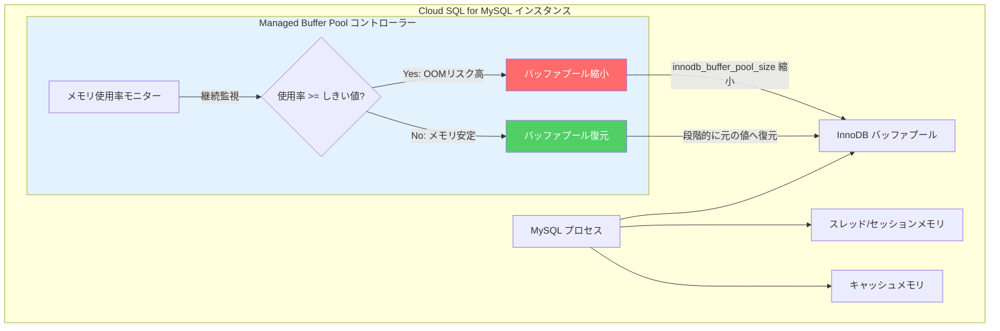

# Cloud SQL for MySQL: Managed Buffer Pool が GA (一般提供) に

**リリース日**: 2026-06-08

**サービス**: Cloud SQL for MySQL

**機能**: Managed Buffer Pool (マネージド バッファプール)

**ステータス**: GA (一般提供)

[このアップデートのインフォグラフィックを見る](https://takech9203.github.io/google-cloud-news-summary/20260608-cloud-sql-mysql-managed-buffer-pool-ga.html)

## 概要

Cloud SQL for MySQL の Managed Buffer Pool (マネージド バッファプール) が一般提供 (GA) になりました。この機能は、Cloud SQL インスタンスのメモリ使用率が高くなった際に、`innodb_buffer_pool_size` を動的に縮小することで、Out-of-Memory (OOM) イベントの発生を防止するものです。

InnoDB バッファプールは MySQL インスタンスにおいて最大のメモリ消費コンポーネントであり、テーブルデータやインデックスのキャッシュとして機能します。Cloud SQL ではインスタンスメモリの最大 72% がバッファプールに割り当てられるため、ワークロードの急増時にはメモリ不足に陥るリスクがあります。Managed Buffer Pool はこの問題を自動的に軽減し、データベースの安定稼働を支援します。

GA リリースにより、本番環境での利用が正式にサポートされ、SLA の対象となります。これまで Preview として提供されていた本機能が、全ての Cloud SQL for MySQL 8.0 以降のユーザーに対して安定したサービスとして利用可能になりました。

**アップデート前の課題**

- メモリ使用率が急上昇した場合、OOM イベントによりインスタンスが停止・再起動し、データベースのダウンタイムが発生していた
- `innodb_buffer_pool_size` は静的な設定値であり、ワークロードの変動に応じた動的な調整が困難だった
- OOM を防ぐためにバッファプールサイズを過度に小さく設定すると、通常時のクエリパフォーマンスが低下していた
- メモリ使用量の監視とバッファプールサイズの手動調整に運用負荷がかかっていた

**アップデート後の改善**

- メモリ使用率がしきい値 (デフォルト 95%) を超えた際に、`innodb_buffer_pool_size` が自動的に縮小される
- メモリ使用率が安定した後、バッファプールサイズが段階的に元の値に復元される
- インスタンスの再起動なしで機能の有効化・しきい値の変更が可能
- GA リリースにより SLA 対象となり、本番環境での安心した利用が可能に

## アーキテクチャ図



Managed Buffer Pool コントローラーがメモリ使用率を継続的に監視し、しきい値超過時にバッファプールサイズを動的に調整することで OOM を防止します。メモリが安定した後は段階的にサイズを復元し、パフォーマンスへの影響を最小限に抑えます。

## サービスアップデートの詳細

### 主要機能

1. **動的バッファプールサイズ調整**
   - メモリ使用率がしきい値を超えると、`innodb_buffer_pool_size` を自動的に縮小
   - メモリが安定した後、段階的に元のサイズへ復元
   - 急激なメモリ消費の増加にも対応し、OOM イベントを未然に防止

2. **カスタマイズ可能なしきい値**
   - デフォルトのしきい値は 95% (メモリ使用率)
   - `innodb_cloudsql_managed_buffer_pool_threshold_pct` フラグで 50〜99% の範囲で調整可能
   - ワークロード特性に応じた最適なしきい値設定が可能

3. **無停止での有効化・設定変更**
   - `innodb_cloudsql_managed_buffer_pool` フラグの変更にインスタンス再起動不要
   - しきい値の変更も再起動不要
   - 本番環境に影響を与えずに設定を適用可能

## 技術仕様

### データベースフラグ

| 項目 | 詳細 |
|------|------|
| 有効化フラグ | `innodb_cloudsql_managed_buffer_pool` |
| フラグ値 | `on` / `off` (デフォルト: `off`) |
| しきい値フラグ | `innodb_cloudsql_managed_buffer_pool_threshold_pct` |
| しきい値範囲 | 50〜99 (デフォルト: 95) |
| 再起動要否 | 不要 |
| 対応バージョン | MySQL 8.0 以降 |
| 非対応構成 | 共有コアインスタンス、MySQL 5.6、MySQL 5.7 |

### メモリ動作の仕組み

Cloud SQL for MySQL のメモリは以下の主要コンポーネントで構成されます:

| コンポーネント | 説明 | Managed Buffer Pool の影響 |
|--------------|------|--------------------------|
| InnoDB バッファプール | テーブルデータ・インデックスのキャッシュ (最大72%) | 直接制御対象 |
| スレッド/セッションメモリ | 各接続が使用する動的メモリ | 間接的に空きメモリを確保 |
| InnoDB ログバッファ | Redo ログ書き込み用バッファ (16MB) | 影響なし |
| キャッシュメモリ | binlog キャッシュ等 | 影響なし |

## 設定方法

### 前提条件

1. Cloud SQL for MySQL 8.0 以降のインスタンスであること
2. 専用コアインスタンスであること (共有コアは非対応)
3. 適切な IAM 権限 (`cloudsql.instances.update`) を持つこと

### 手順

#### ステップ 1: Managed Buffer Pool の有効化

```bash
gcloud sql instances patch INSTANCE_NAME \
  --database-flags=innodb_cloudsql_managed_buffer_pool=on
```

インスタンスの再起動は不要です。既存のデータベースフラグがある場合は、それらも含めて指定してください。

#### ステップ 2: しきい値のカスタマイズ (オプション)

```bash
gcloud sql instances patch INSTANCE_NAME \
  --database-flags=innodb_cloudsql_managed_buffer_pool=on,innodb_cloudsql_managed_buffer_pool_threshold_pct=97
```

デフォルトの 95% から変更する場合に実行します。メモリに余裕がある場合は 97〜99%、早めに対応したい場合は 90% 程度に設定します。

#### ステップ 3: 現在のバッファプールサイズの確認

```sql
SHOW GLOBAL VARIABLES LIKE 'innodb_buffer_pool_size';
```

Managed Buffer Pool がサイズを調整している場合、Google Cloud コンソールのフラグ値には反映されないため、MySQL クライアントから直接確認する必要があります。

## メリット

### ビジネス面

- **ダウンタイムの削減**: OOM によるインスタンス停止を防止し、サービスの可用性を向上
- **運用コストの削減**: メモリ使用量の手動監視・調整が不要になり、運用負荷を軽減
- **過剰プロビジョニングの回避**: OOM 対策のためにインスタンスサイズを過度に大きくする必要がなくなり、コスト最適化に貢献

### 技術面

- **自動メモリ管理**: ワークロードの変動に応じた動的なバッファプール調整により、安定したデータベース運用を実現
- **無停止設定変更**: フラグの有効化・しきい値変更がインスタンス再起動なしで可能
- **段階的復元**: メモリ安定後にバッファプールサイズを徐々に戻すことで、パフォーマンスへの影響を最小化
- **GA品質のサポート**: SLA 対象となり、本番ワークロードでの安心した利用が可能

## デメリット・制約事項

### 制限事項

- 共有コアインスタンスでは利用不可
- MySQL 5.6 および MySQL 5.7 では利用不可
- バッファプールサイズの縮小だけでは全ての OOM を防止できない (急激なメモリ増加、インスタンスの過小プロビジョニング等)
- 他のメモリ関連フラグの設定ミスには対応不可

### 考慮すべき点

- バッファプールサイズが縮小されている間は、クエリレイテンシやパフォーマンスに影響が出る可能性がある
- Google Cloud コンソールのフラグ値には動的な変更が反映されないため、実際の値は MySQL クライアントで確認する必要がある
- Managed Buffer Pool は根本的な解決策ではなく、メモリ不足が頻発する場合はインスタンスサイズの変更やワークロードの最適化を検討すべき

## ユースケース

### ユースケース 1: トラフィックスパイクが発生する Web アプリケーション

**シナリオ**: EC サイトのセール時やニュース速報時に突発的なアクセス増加が発生し、セッションメモリの急増により OOM が起きていた。

**実装例**:
```bash
# Managed Buffer Pool を有効化し、やや低めのしきい値を設定
gcloud sql instances patch my-web-db \
  --database-flags=innodb_cloudsql_managed_buffer_pool=on,innodb_cloudsql_managed_buffer_pool_threshold_pct=90
```

**効果**: トラフィックスパイク時にバッファプールが自動縮小され、セッションメモリに十分な空きが確保されることで OOM を回避。スパイク収束後は自動的にバッファプールが復元され、通常時のパフォーマンスも維持。

### ユースケース 2: バッチ処理と OLTP が混在するハイブリッドワークロード

**シナリオ**: 日中は OLTP 処理、夜間はバッチ処理(大量の JOIN/SORT 操作)が実行される環境で、バッチ処理時のメモリ使用量増加により OOM が発生していた。

**効果**: バッチ処理開始時にメモリ使用率が上昇した際、Managed Buffer Pool がバッファプールを縮小してバッチ処理用のメモリを確保。バッチ完了後は段階的にバッファプールが復元され、OLTP パフォーマンスが回復。

### ユースケース 3: 成長するスタートアップのデータベース

**シナリオ**: ユーザー数の急成長に伴い接続数が増加し、セッションメモリの総量が予測を超えて OOM が発生していた。インスタンスサイズの変更までの時間稼ぎが必要。

**効果**: Managed Buffer Pool により OOM を一時的に防止しつつ、計画的なインスタンスサイズの変更やアーキテクチャの見直しを行う猶予を確保。

## 料金

Managed Buffer Pool の利用自体に追加料金は発生しません。通常の Cloud SQL for MySQL インスタンスの料金体系が適用されます。

## 利用可能リージョン

Cloud SQL for MySQL が利用可能な全てのリージョンで、Managed Buffer Pool を使用できます。

## 関連サービス・機能

- **Cloud SQL Insights**: メモリ使用量の詳細なモニタリングと分析
- **Cloud Monitoring**: `database/memory/components.usage` メトリクスによるメモリ使用率の監視とアラート設定
- **Cloud SQL Enterprise Plus Edition**: `innodb_cloudsql_optimized_write` による書き込みパフォーマンス最適化
- **Cloud SQL for MySQL ベクトル検索**: `cloudsql_vector` フラグによるベクトル検索機能 (メモリ使用量に影響)

## 参考リンク

- [インフォグラフィック](https://takech9203.github.io/google-cloud-news-summary/20260608-cloud-sql-mysql-managed-buffer-pool-ga.html)
- [公式リリースノート](https://docs.cloud.google.com/release-notes#June_08_2026)
- [Cloud SQL for MySQL メモリ最適化ドキュメント](https://docs.cloud.google.com/sql/docs/mysql/optimize-high-memory-usage)
- [Cloud SQL for MySQL データベースフラグ](https://docs.cloud.google.com/sql/docs/mysql/flags)
- [Cloud SQL 料金ページ](https://cloud.google.com/sql/pricing)

## まとめ

Cloud SQL for MySQL の Managed Buffer Pool が GA となったことで、メモリ管理の自動化が本番環境で正式にサポートされました。OOM イベントによるデータベースダウンタイムのリスクを大幅に低減できるため、特にトラフィック変動が大きいワークロードや、メモリ使用量の予測が困難な環境で積極的に有効化することを推奨します。設定はインスタンス再起動不要で、`innodb_cloudsql_managed_buffer_pool=on` を設定するだけで利用開始できます。

---

**タグ**: #CloudSQL #MySQL #ManagedBufferPool #OOM #メモリ管理 #GA #InnoDB #データベース #パフォーマンス
