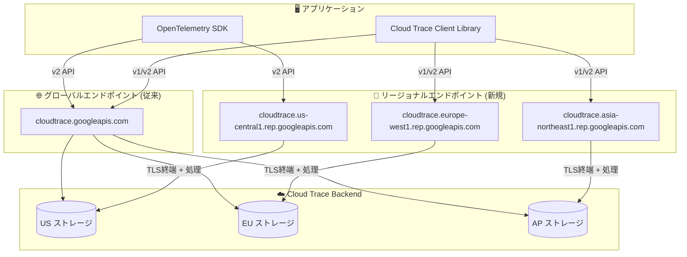

# Cloud Trace: Trace API がリージョナルエンドポイントをサポート

**リリース日**: 2026-06-08

**サービス**: Cloud Trace

**機能**: Trace API リージョナルエンドポイント対応

**ステータス**: Feature

📊 [このアップデートのインフォグラフィックを見る](https://takech9203.github.io/google-cloud-news-summary/20260608-cloud-trace-regional-endpoints.html)

## 概要

Cloud Trace API がリージョナルエンドポイントをサポートするようになった。これにより、トレースデータの送受信を特定のリージョン内で完結させることが可能になり、データレジデンシー要件への準拠やリージョン分離が実現される。v1 REST API および v2 REST API の両方でリージョナルエンドポイントが利用可能である。

リージョナルエンドポイントは、API リクエストのネットワークアドレスを特定のリージョンにスコープすることで、TLS セッションの終端を含むリクエスト処理全体がそのリージョン内で行われることを保証する。これは、規制要件やコンプライアンスポリシーに基づいてデータの処理・保存場所を制御する必要がある組織にとって重要な機能強化である。

**アップデート前の課題**

- Cloud Trace API はグローバルエンドポイント (`cloudtrace.googleapis.com`) のみを提供しており、トレースデータがどのリージョンで処理されるかを制御できなかった
- データレジデンシー要件がある組織では、トレースデータの送信先リージョンを保証する手段がなかった
- 規制の厳しい業界 (金融、医療、政府機関など) ではデータの地理的な処理場所を証明することが困難だった

**アップデート後の改善**

- リージョナルエンドポイントを使用することで、トレースデータの処理がリクエスト先のリージョン内で完結する
- TLS セッションの終端が指定リージョン内で行われ、転送中のデータのリージョナルレジデンシーが保証される
- VPC Service Controls や組織ポリシーと組み合わせることで、包括的なデータレジデンシー制御が実現可能になった

## アーキテクチャ図



リージョナルエンドポイントを使用することで、トレースデータの送信からストレージへの書き込みまで、指定リージョン内で処理が完結する。グローバルエンドポイントは引き続き利用可能であり、リージョンを意識しない従来の利用方法も維持される。

## サービスアップデートの詳細

### 主要機能

1. **リージョナルエンドポイントの提供**
   - Cloud Trace API (v1/v2) でリージョナルエンドポイントが利用可能
   - エンドポイント形式: `cloudtrace.REGION.rep.googleapis.com` (REGION はサポートされるリージョン)
   - TLS セッションの終端が指定リージョン内で行われることを保証

2. **v1 / v2 API 両対応**
   - v1 REST API: `patchTraces` (スパン送信)、`get` / `list` (トレース取得) がリージョナルエンドポイントで利用可能
   - v2 REST API: `batchWrite` (スパンバッチ書き込み)、`createSpan` (スパン作成) がリージョナルエンドポイントで利用可能
   - v2beta1: `traceSinks` リソースの操作もサポート

3. **データレジデンシーの保証**
   - リクエストの処理パスとサービスフロントエンド全体がリージョナル化
   - プライベート接続 (Private Google Access) とパブリックインターネットの両方で適用
   - VPC Service Controls との互換性あり

### API バージョン別の機能対応

| API バージョン | メソッド | 用途 |
|---|---|---|
| v1 | `patchTraces` | トレーススパンの送信 |
| v1 | `get`, `list` | トレースデータの取得 |
| v2 | `batchWrite` | スパンのバッチ書き込み |
| v2 | `createSpan` | 個別スパンの作成 |
| v2beta1 | `traceSinks` CRUD | トレースシンクの管理 |

## 技術仕様

### エンドポイント形式

| エンドポイント種別 | 形式 | 用途 |
|---|---|---|
| グローバル (従来) | `cloudtrace.googleapis.com` | リージョン制約なし、低レイテンシ優先 |
| リージョナル (新規) | `cloudtrace.REGION.rep.googleapis.com` | データレジデンシー、リージョン分離 |

### クォータと制限 (Cloud Trace API)

| カテゴリ | クォータ |
|---|---|
| Read 操作 (GetTrace, ListTraces, ListSpan) | 300 クォータユニット / 60 秒 |
| Write 操作 (PatchTraces, BatchWrite, CreateSpan) | 4,800 クォータユニット / 60 秒 |
| スパン取り込み | 3,000,000 - 5,000,000,000 / 日 |

### 関連する組織ポリシー

| ポリシー | 機能 |
|---|---|
| `constraints/gcp.restrictEndpointUsage` | グローバルエンドポイントへのアクセスを拒否し、リージョナルエンドポイントの使用を強制 |
| `constraints/gcp.resourceLocations` | リソースの作成・保存先リージョンを制限 |

## 設定方法

### 前提条件

1. Cloud Trace API が有効化されていること
2. 適切な IAM ロール (`roles/cloudtrace.agent` または `roles/cloudtrace.admin`) が付与されていること
3. 使用するリージョンがリージョナルエンドポイントでサポートされていること

### 手順

#### ステップ 1: リージョナルエンドポイントの使用 (REST API)

```bash
# v2 API でリージョナルエンドポイントを使用してスパンを送信
curl -X POST \
  "https://cloudtrace.us-central1.rep.googleapis.com/v2/projects/PROJECT_ID/traces:batchWrite" \
  -H "Authorization: Bearer $(gcloud auth print-access-token)" \
  -H "Content-Type: application/json" \
  -d '{
    "spans": [
      {
        "name": "projects/PROJECT_ID/traces/TRACE_ID/spans/SPAN_ID",
        "spanId": "SPAN_ID",
        "displayName": { "value": "example-span" },
        "startTime": "2026-06-08T10:00:00Z",
        "endTime": "2026-06-08T10:00:01Z"
      }
    ]
  }'
```

リージョナルエンドポイントのホスト名を指定することで、そのリージョン内でリクエストが処理される。

#### ステップ 2: 組織ポリシーでグローバルエンドポイントを制限 (オプション)

```bash
# グローバルエンドポイントの使用を制限する組織ポリシーの設定
gcloud resource-manager org-policies set-policy \
  --organization=ORGANIZATION_ID \
  policy.yaml
```

`policy.yaml` で `constraints/gcp.restrictEndpointUsage` を設定し、グローバルエンドポイントへのアクセスを拒否リストに追加する。

#### ステップ 3: VPC Service Controls との組み合わせ (オプション)

```bash
# VPC Service Controls ペリメーター内からリージョナルエンドポイントにアクセスする場合
# Private Service Connect を使用してプライベートエンドポイントを作成
gcloud network-connectivity regional-endpoints create ENDPOINT_NAME \
  --region=REGION \
  --target-google-api="cloudtrace.REGION.rep.googleapis.com"
```

VPC ペリメーター内からリージョナルエンドポイントにアクセスするには、Private Service Connect を使用したプライベートエンドポイントの作成が必要。

## メリット

### ビジネス面

- **コンプライアンス対応**: GDPR、HIPAA、各国のデータ保護法など、データの地理的な処理・保存場所を制御する規制要件への対応が容易になる
- **監査対応の簡素化**: リージョナルエンドポイントの使用により、データがどのリージョンで処理されたかの証跡が明確になり、監査対応が容易になる

### 技術面

- **データレジデンシー**: TLS 終端を含むリクエスト処理全体が指定リージョン内で完結し、転送中のデータのリージョナルレジデンシーが保証される
- **リージョン分離**: クロスリージョン依存が排除され、他リージョンの障害による影響を低減
- **セキュリティ強化**: VPC Service Controls と組み合わせることで、データ漏洩防止とリージョン制御を統合的に実現

## デメリット・制約事項

### 制限事項

- サポートされるリージョンは限定的であり、すべての Google Cloud リージョンでリージョナルエンドポイントが利用可能とは限らない (対応リージョンの最新リストは REST API リファレンスを参照)
- リージョナルエンドポイントでは、指定リージョン外のリソースに対する操作は通常サポートされない
- VPC Service Controls ペリメーター内からリージョナルエンドポイントにアクセスするには、Private Service Connect を使用したプライベートエンドポイントの作成が必要

### 考慮すべき点

- グローバルエンドポイントから移行する場合、アプリケーションコードやクライアントライブラリの設定変更が必要
- リージョナルエンドポイントは特定リージョン内での処理を保証するが、観測バケットの作成場所には影響しない (Telemetry API の類似動作から推定)
- OpenTelemetry SDK を使用している場合、エクスポーターのエンドポイント設定を変更する必要がある

## ユースケース

### ユースケース 1: EU データレジデンシー要件への対応

**シナリオ**: 欧州で事業を展開する企業が、GDPR に基づきトレースデータを EU 内で処理・保存する必要がある。

**実装例**:
```bash
# EU リージョンのエンドポイントを使用
export TRACE_ENDPOINT="https://cloudtrace.europe-west1.rep.googleapis.com"

# 組織ポリシーでグローバルエンドポイントを制限
# constraints/gcp.restrictEndpointUsage で cloudtrace.googleapis.com を deny
```

**効果**: トレースデータが EU 内のリージョンで処理されることが保証され、GDPR のデータ移転制限に準拠できる。

### ユースケース 2: 金融機関の規制対応

**シナリオ**: 国内の金融規制により、システムのオブザーバビリティデータを国内で処理・保管する必要がある金融機関。

**効果**: リージョナルエンドポイントと組織ポリシーの組み合わせにより、トレースデータの処理場所を特定リージョンに限定でき、金融規制当局への説明責任を果たせる。

### ユースケース 3: マルチリージョンアプリケーションのリージョン分離

**シナリオ**: 複数リージョンにデプロイされたマイクロサービスアーキテクチャで、各リージョンのトレースデータを独立して管理したい。

**効果**: 各リージョンからのトレースデータがそれぞれのリージョナルエンドポイントで処理されるため、他リージョンの障害がトレースデータの収集に影響しない。リージョン単位での障害分離が実現する。

## 料金

Cloud Trace の料金体系はリージョナルエンドポイントの利用によって変更されない。従来と同じ料金体系が適用される。

### 料金例

| 項目 | 料金 | 無料枠 |
|------|------|--------|
| トレーススパン取り込み | $0.20 / 100 万スパン | 月間 250 万スパン (無料) |

パブリックリージョナルエンドポイントへの Ingress トラフィックは課金されない。Egress トラフィックは Standard Tier ネットワーク料金に基づいて課金される。VPC ペリメーター内からプライベートリージョナルエンドポイントを使用する場合は、Private Service Connect の料金が別途発生する。

## 利用可能リージョン

対応リージョンの最新リストは以下の REST API リファレンスページを参照:

- [v1 REST リファレンス](https://docs.cloud.google.com/trace/docs/reference/v1/rest)
- [v2 REST リファレンス](https://docs.cloud.google.com/trace/docs/reference/v2/rest)

Google Cloud の他のオブザーバビリティサービス (Cloud Logging、Telemetry API) のリージョナルエンドポイントの対応状況から、主要リージョン (US、EU、アジア太平洋) が対象になると想定される。

## 関連サービス・機能

- **Telemetry (OTLP) API**: OpenTelemetry プロトコルを実装した API で、同様にリージョナルエンドポイント (`telemetry.REGION.rep.googleapis.com`) をサポート。Cloud Trace API より寛大なクォータ制限を持つ
- **Cloud Logging**: 同じくリージョナルエンドポイントをサポートしており、ログとトレースの両方でデータレジデンシーを統一的に管理可能
- **Observability API**: オブザーバビリティバケットの設定やスコープ管理を行う API で、リージョナルエンドポイントをサポート
- **VPC Service Controls**: リージョナルエンドポイントと組み合わせてデータ漏洩防止を実現。ペリメーター内からのアクセスには Private Service Connect が必要
- **OpenTelemetry SDK**: Cloud Trace へのトレースデータ送信に推奨される計装方法。エクスポーターのエンドポイント設定でリージョナルエンドポイントを指定可能

## 参考リンク

- 📊 [インフォグラフィック](https://takech9203.github.io/google-cloud-news-summary/20260608-cloud-trace-regional-endpoints.html)
- [公式リリースノート](https://docs.cloud.google.com/release-notes#June_08_2026)
- [Cloud Trace API v1 REST リファレンス](https://docs.cloud.google.com/trace/docs/reference/v1/rest)
- [Cloud Trace API v2 REST リファレンス](https://docs.cloud.google.com/trace/docs/reference/v2/rest)
- [Cloud Trace ドキュメント](https://docs.cloud.google.com/trace/docs/reference)
- [Cloud Trace クォータと制限](https://docs.cloud.google.com/trace/docs/quotas)
- [リージョナルエンドポイントについて](https://docs.cloud.google.com/docs/security/compliance/about-regional-endpoints)
- [料金ページ](https://cloud.google.com/products/observability/pricing)

## まとめ

Cloud Trace API のリージョナルエンドポイント対応は、データレジデンシー要件がある組織にとって重要な機能強化である。特に GDPR や各国のデータ保護規制に対応する必要がある環境では、トレースデータの処理場所をリージョン単位で制御できるようになったことで、コンプライアンス対応が大幅に容易になる。既存のグローバルエンドポイントは引き続き利用可能であるため、段階的な移行が可能であり、組織ポリシーと組み合わせることで強制的なリージョン制御も実現できる。

---

**タグ**: #CloudTrace #RegionalEndpoints #DataResidency #Observability #Compliance #API
