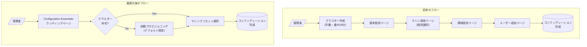

# Cloud Workstations: コンフィグレーション作成ページの最適化

**リリース日**: 2026-06-08

**サービス**: Cloud Workstations

**機能**: マシンプリセットによるコンフィグレーション作成の簡素化

**ステータス**: GA

📊 [このアップデートのインフォグラフィックを見る](https://takech9203.github.io/google-cloud-news-summary/20260608-cloud-workstations-configuration-presets.html)

## 概要

Google Cloud コンソールにおける Cloud Workstations のワークステーション コンフィグレーション作成ページが最適化され、コンフィグレーションの作成がより高速かつ簡単になった。一般的なマシン設定が選択可能なマシンプリセットとしてグループ化され、頻繁に使用される設定が「Configuration essentials」ランディングページに集約された。また、選択したリージョンにクラスターが存在しない場合、デフォルト設定でペンディングクラスターが自動的にプロビジョニングされるようになった。

これまで Cloud Workstations のコンフィグレーション作成は、マシンタイプ、ゾーン、ディスクサイズ、コンテナイメージなど多数の設定項目を個別に選択する必要があり、特に初回セットアップ時には事前にクラスターを作成しておく必要があった。今回の最適化により、プラットフォームチームや管理者が開発者向けのワークステーション環境を迅速にプロビジョニングできるようになる。

**アップデート前の課題**

- マシンタイプの選択時に、E2、N1、N2、C4 など多数のマシンシリーズから個別に適切なインスタンスを選択する必要があった
- コンフィグレーション作成前に、対象リージョンにワークステーション クラスターを事前に作成（最大 20 分）しておく必要があった
- 設定項目が複数ページに分散しており、基本的な設定を行うだけでも 4 ステップ（基本設定、マシン設定、環境カスタマイズ、ユーザー追加）を順に進める必要があった

**アップデート後の改善**

- マシンプリセットにより、ワークロードに適した構成を事前定義されたプリセットから選択するだけで完了するようになった
- クラスターが存在しないリージョンでも、デフォルト設定のクラスターが自動プロビジョニングされるため、事前準備が不要になった
- 「Configuration essentials」ランディングページにより、頻繁に使用される設定が 1 ページに集約され、最短経路でコンフィグレーションを作成できるようになった

## アーキテクチャ図



従来は 4 ステップ＋事前のクラスター作成が必要だったフローが、Configuration essentials ページとマシンプリセット、自動クラスター プロビジョニングにより大幅に簡素化された。

## サービスアップデートの詳細

### 主要機能

1. **マシンプリセット (Machine Presets)**
   - 一般的なマシン設定が事前定義されたプリセットとしてグループ化
   - ワークロード特性（汎用、高 CPU、高メモリなど）に応じた推奨構成を選択可能
   - 個別のマシンタイプ、vCPU 数、メモリ量を手動で組み合わせる必要がなくなった

2. **Configuration Essentials ランディングページ**
   - 頻繁に使用される設定項目が 1 つのランディングページに集約
   - 基本的なコンフィグレーション作成に必要な最小限の設定を 1 画面で完了可能
   - 詳細設定が必要な場合は、従来通りの詳細ページに遷移可能

3. **自動クラスター プロビジョニング**
   - 選択したリージョンにクラスターが存在しない場合、デフォルト設定でペンディングクラスターが自動作成される
   - 事前のクラスター作成ステップが不要になり、コンフィグレーション作成と同時にクラスター準備が進行
   - クラスター作成は従来通り最大 20 分程度かかるが、コンフィグレーション作成フローを中断せずに並行して実行される

## 技術仕様

### 利用可能なマシンタイプ

Cloud Workstations で利用可能な主要マシンシリーズは以下の通り。マシンプリセットはこれらの中から一般的な構成をグループ化したもの。

| マシンシリーズ | vCPU 範囲 | メモリ範囲 | 特徴 |
|--------------|-----------|-----------|------|
| E2 | 2-32 | 4-128 GB | 最もコスト効率が高い汎用タイプ |
| N1 | 1-96 | 3.75-360 GB | GPU 対応、ネスト仮想化対応 |
| N2 | 2-32 | 8-128 GB | バランス型汎用タイプ |
| N4D | 2-96 | 8-768 GB | 最新世代の高性能汎用タイプ |
| C4 | 2-192 | 7-1488 GB | コンピューティング最適化 |
| T2D | 1-60 | 4-240 GB | Arm ベース (AMD EPYC) |
| A2/A3 | 12-208 | 85-1872 GB | GPU アクセラレータ搭載 |

### ワークステーション クラスターの構成要素

| コンポーネント | 説明 |
|--------------|------|
| Controller | VM インスタンスおよびワークステーションリソースのライフサイクル管理。Private Service Connect を使用 |
| Gateway | クライアントからのトラフィックを受信し、適切な VM インスタンスに転送 |
| VPC 接続 | ワークステーションはユーザーの VPC 内に作成され、ネットワークリソースにシームレスにアクセス |

## 設定方法

### 前提条件

1. Google Cloud プロジェクトで課金が有効であること
2. Cloud Workstations API が有効化されていること
3. Cloud Workstations Admin IAM ロール (`roles/workstations.admin`) が付与されていること
4. `constraints/compute.trustedimageProjects` ポリシーが適用されている場合は、`projects/cos-cloud` を許可リストに追加

### 手順

#### ステップ 1: コンフィグレーション作成ページにアクセス

```
Google Cloud コンソール > Cloud Workstations > Workstation configurations > Create
```

#### ステップ 2: Configuration Essentials で基本設定

新しい「Configuration essentials」ランディングページで以下を設定:
- コンフィグレーション名を入力
- リージョンを選択（クラスターが存在しない場合は自動プロビジョニングが開始される）
- マシンプリセットからワークロードに適した構成を選択

#### ステップ 3: 詳細設定（任意）

必要に応じて以下の詳細設定をカスタマイズ:
- Quick start workstations（高速起動用 VM プール）
- ネットワークタグ
- パブリック IP の無効化
- コンテナイメージのカスタマイズ
- 永続ディスクのサイズとタイプ

#### ステップ 4: ユーザーの追加と作成

- IAM ポリシーでユーザーまたは Google グループを追加
- 「Create」をクリックしてコンフィグレーションを作成

## メリット

### ビジネス面

- **初期セットアップ時間の短縮**: プラットフォームチームが新しいリージョンに開発環境を展開する際のリードタイムが大幅に短縮
- **オンボーディングの効率化**: 新規開発者向けのワークステーション環境を迅速にプロビジョニング可能
- **運用コストの削減**: 管理者が設定に費やす時間が減少し、セルフサービス化が促進

### 技術面

- **設定ミスの軽減**: プリセットにより推奨構成が提示されるため、不適切なマシンタイプ選択のリスクが低減
- **フロー簡素化**: クラスター作成とコンフィグレーション作成が並行実行され、依存関係が解消
- **一貫性の向上**: プリセットを活用することで、チーム内のワークステーション構成を標準化しやすくなった

## デメリット・制約事項

### 制限事項

- 自動プロビジョニングされるクラスターはデフォルト設定のため、VPC 設定やプライベートゲートウェイなどのカスタムネットワーク構成が必要な場合は従来通り手動でクラスターを作成する必要がある
- クラスター作成自体には依然として最大 20 分程度かかる（プロセスが自動化されただけで所要時間は変わらない）
- マシンプリセットの選択肢は Google が定義したものであり、完全にカスタムな組み合わせが必要な場合は詳細設定に進む必要がある

### 考慮すべき点

- 既存のクラスターを使用している環境では UI の変更のみであり、バックエンド動作に変更はない
- 自動プロビジョニングされたクラスターの設定を後から変更する場合は、クラスター管理ページから個別に設定を変更する
- 組織ポリシーによりデフォルトネットワーク設定が制限されている場合、自動プロビジョニングが失敗する可能性がある

## ユースケース

### ユースケース 1: 新規プロジェクトの迅速な開発環境セットアップ

**シナリオ**: 新規プロジェクトの開始時に、10 名の開発チーム向けの Cloud Workstations 環境を短時間で構築したい。

**効果**: Configuration essentials ページでリージョンとマシンプリセットを選択するだけで、クラスターの自動作成からコンフィグレーション作成までが一度のフローで完了。従来のクラスター作成待ち→コンフィグレーション作成という 2 段階フローが不要になる。

### ユースケース 2: マルチリージョン展開

**シナリオ**: グローバルチームのために複数リージョン（asia-northeast1、us-central1、europe-west1）にワークステーション環境を展開する必要がある。

**効果**: 各リージョンでコンフィグレーション作成時にクラスターが自動プロビジョニングされるため、事前に各リージョンのクラスターを個別に作成・管理する手間が省ける。プリセットを活用することでリージョン間の構成一貫性も確保しやすい。

### ユースケース 3: セルフサービス型開発者プラットフォーム

**シナリオ**: プラットフォームチームがワークステーション構成のテンプレートをプリセットベースで標準化し、開発者がセルフサービスでワークステーションを作成できるようにしたい。

**効果**: プリセットにより推奨構成が明確に提示されるため、開発者が適切なリソースサイズを自分で判断でき、プラットフォームチームへの問い合わせが減少する。

## 料金

Cloud Workstations の料金は、使用する Compute Engine リソース（vCPU、メモリ、ディスク）に基づく従量課金制で請求される。今回の UI 最適化自体による追加料金は発生しない。

主な課金要素:
- **Compute Engine VM**: ワークステーション起動中の vCPU とメモリに対する秒単位の課金（最低 1 分）
- **永続ディスク**: ワークステーションのホームディレクトリ用ディスクストレージ
- **Quick start pool**: 高速起動用に常時稼働するプリスタート VM（有効にした場合）
- **ネットワーク**: Egress トラフィック

割引オプション:
- Sustained Use Discounts (SUD): 月間使用率 25% 超で最大 30% 割引
- Committed Use Discounts (CUD): 1 年契約で最大 55% 割引、3 年契約で最大 70% 割引

詳細な料金については[Cloud Workstations の料金ページ](https://cloud.google.com/workstations/pricing)を参照。

## 利用可能リージョン

Cloud Workstations は以下のリージョンで利用可能（計 31 リージョン）:

| 地域 | リージョン |
|------|-----------|
| APAC | asia-east1, asia-east2, asia-northeast1, asia-northeast3, asia-south1, asia-southeast1, australia-southeast1, australia-southeast2 |
| Europe | europe-central2, europe-north1, europe-north2, europe-southwest1, europe-west1, europe-west2, europe-west3, europe-west4, europe-west6, europe-west8, europe-west9, europe-west12 |
| Middle East | me-central2, me-west1 |
| South America | southamerica-east1, southamerica-west1 |
| North America | northamerica-northeast1, us-central1, us-east1, us-east4, us-east5, us-west1, us-west4 |

## 関連サービス・機能

- **Compute Engine**: Cloud Workstations の基盤となる VM インスタンスを提供。マシンプリセットは Compute Engine のマシンタイプを抽象化したもの
- **VPC (Virtual Private Cloud)**: ワークステーション クラスターが接続するネットワークを提供。自動プロビジョニングではデフォルト VPC が使用される
- **Private Service Connect**: ワークステーション コントローラーと VPC 間の接続に使用
- **Cloud IAM**: ワークステーション コンフィグレーションへのアクセス制御
- **Container-Optimized OS (COS)**: ワークステーション VM のブートイメージとして使用
- **Artifact Registry**: カスタムコンテナイメージの格納先

## 参考リンク

- 📊 [インフォグラフィック](https://takech9203.github.io/google-cloud-news-summary/20260608-cloud-workstations-configuration-presets.html)
- [公式リリースノート](https://docs.cloud.google.com/release-notes#June_08_2026)
- [コンフィグレーション作成ガイド](https://cloud.google.com/workstations/docs/create-configuration)
- [ワークステーション クラスター作成](https://cloud.google.com/workstations/docs/create-cluster)
- [利用可能なマシンタイプ](https://cloud.google.com/workstations/docs/available-machine-types)
- [Cloud Workstations の料金](https://cloud.google.com/workstations/pricing)
- [Cloud Workstations のリージョン](https://cloud.google.com/workstations/docs/locations)
- [Cloud Workstations アーキテクチャ](https://cloud.google.com/workstations/docs/architecture)

## まとめ

今回の Cloud Workstations コンフィグレーション作成ページの最適化は、特にプラットフォームチームや管理者にとって、開発環境のプロビジョニング効率を大幅に向上させるアップデートである。マシンプリセット、Configuration essentials ランディングページ、自動クラスター プロビジョニングの 3 つの改善により、初期セットアップのハードルが下がり、Cloud Workstations の導入・展開が加速することが期待される。既存環境への影響はなく、新規コンフィグレーション作成時に改善された UI が適用されるため、既存ユーザーも安心して利用できる。

---

**タグ**: #CloudWorkstations #DeveloperExperience #MachinePresets #CloudIDE #RemoteDevelopment #PlatformEngineering
