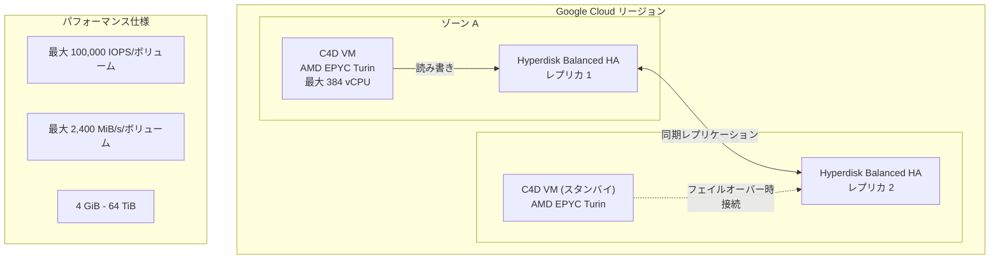

# Compute Engine: C4D マシンシリーズが Hyperdisk Balanced High Availability ディスクをサポート (GA)

**リリース日**: 2026-06-08

**サービス**: Compute Engine

**機能**: C4D machine series supports Hyperdisk Balanced High Availability disks

**ステータス**: GA (一般提供)

📊 [このアップデートのインフォグラフィックを見る](https://takech9203.github.io/google-cloud-news-summary/20260608-compute-engine-c4d-hyperdisk-balanced-ha.html)

## 概要

Google Cloud は、C4D マシンシリーズにおける Hyperdisk Balanced High Availability (HA) ディスクのサポートを一般提供 (GA) として発表しました。これにより、AMD EPYC Turin プロセッサを搭載した高性能な C4D VM で、ゾーン間の同期レプリケーションによる高可用性ブロックストレージを利用できるようになります。

Hyperdisk Balanced HA は、同一リージョン内の 2 つのゾーンにデータを同期的にレプリケートすることで、ゾーン障害からアプリケーションを保護するディスクタイプです。C4D マシンシリーズとの組み合わせにより、ミッションクリティカルなワークロードに対して高性能かつ高可用性のストレージ基盤を提供します。

C4D は第 5 世代 AMD EPYC Turin プロセッサと Google Titanium を搭載し、最大 384 vCPU、3,024 GB の DDR5 メモリをサポートする汎用マシンシリーズです。今回の Hyperdisk Balanced HA サポートにより、C4D の高い計算性能と耐障害性の高いストレージを組み合わせた構成が可能になりました。

**アップデート前の課題**

- C4D マシンシリーズでは Hyperdisk Balanced HA を利用できず、ゾーン障害に対する同期レプリケーションを活用できなかった
- ミッションクリティカルなワークロードで C4D の高性能を活かしつつ高可用性ストレージを使いたい場合、他のマシンシリーズを選択する必要があった
- C4D で高可用性を実現するには、アプリケーションレベルでのレプリケーションを独自に実装する必要があった

**アップデート後の改善**

- C4D マシンシリーズで Hyperdisk Balanced HA を直接利用可能になり、インフラレベルでの同期レプリケーションが利用可能に
- C4D の高い計算性能 (最大 384 vCPU) と高可用性ストレージを一つの構成で実現可能に
- 最大 320,000 IOPS、10,000 MiB/s のスループットを C4D-384 インスタンスで利用可能に

## アーキテクチャ図



C4D VM が Hyperdisk Balanced HA を使用する際のアーキテクチャを示しています。同一リージョン内の 2 ゾーンにデータが同期的にレプリケートされ、ゾーン障害時にはもう一方のゾーンのレプリカにフェイルオーバーすることで高可用性を実現します。

## サービスアップデートの詳細

### 主要機能

1. **同期レプリケーション (ゾーン間)**
   - 同一リージョン内の 2 つのゾーンにデータを同期的に複製
   - ゾーン障害時もデータの可用性を維持
   - RPO (Recovery Point Objective) ゼロを実現

2. **マルチライターモード**
   - 同じ Hyperdisk Balanced HA ボリュームを複数の VM に同時接続可能
   - 各インスタンスが書き込みアクセスを維持
   - 1 秒未満の RTO (Recovery Time Objective) でのフェイルオーバーが可能

3. **プロビジョン可能なパフォーマンス**
   - IOPS とスループットを個別に指定可能
   - ワークロードに合わせたパフォーマンスチューニングが可能
   - 作成後もパフォーマンスやサイズの変更が可能 (4 時間に 1 回まで)

4. **非同期レプリケーション (リージョン間)**
   - 別リージョンへのデータ複製でリージョン障害にも対応
   - 同期レプリケーションと組み合わせた多層的な保護が可能

## 技術仕様

### C4D マシンシリーズでの Hyperdisk Balanced HA パフォーマンス上限

| マシンタイプ | 最大 IOPS | 最大スループット (MiB/s) |
|------|------|------|
| c4d-*-2 | 22,500 | 400 |
| c4d-*-4 | 50,000 | 400 |
| c4d-*-8 | 50,000 | 800 |
| c4d-*-16 | 75,000 | 1,200 |
| c4d-*-32 | 75,000 | 1,600 |
| c4d-*-48 | 75,000 | 1,600 |
| c4d-*-64 | 160,000 | 2,400 |
| c4d-*-96 | 160,000 | 2,800 |
| c4d-*-192 | 240,000 | 4,800 |
| c4d-*-384 | 320,000 | 10,000 |

### Hyperdisk Balanced HA ボリューム仕様

| 項目 | 詳細 |
|------|------|
| 最大 IOPS (単一ボリューム) | 100,000 |
| 最大スループット (単一ボリューム) | 2,400 MiB/s |
| サイズ範囲 | 4 GiB - 64 TiB |
| デフォルトサイズ | 100 GiB |
| ベースラインパフォーマンス (無料) | 3,000 IOPS / 140 MiB/s |
| レプリケーション方式 | 同一リージョン内 2 ゾーン間の同期レプリケーション |
| I/O サイズ (IOPS 最大化) | 4 KB |
| I/O サイズ (スループット最大化) | 256 KB 以上 |

### C4D マシンシリーズの主要スペック

| 項目 | 詳細 |
|------|------|
| プロセッサ | 第 5 世代 AMD EPYC Turin |
| 最大ブースト周波数 | 4.1 GHz |
| 最大 vCPU 数 | 384 |
| 最大メモリ | 3,024 GB (DDR5) |
| ネットワーク帯域幅 | 最大 200 Gbps (Tier_1) |
| ローカル SSD | 最大 12 TiB (Titanium SSD) |
| セキュリティ | Confidential VM (AMD SEV) サポート |

## 設定方法

### 前提条件

1. C4D マシンシリーズが利用可能なリージョン・ゾーンであること
2. Hyperdisk Balanced HA のクォータが十分にあること
3. 2 つのゾーンを指定して Regional Disk として作成すること

### 手順

#### ステップ 1: Hyperdisk Balanced HA ボリュームの作成

```bash
gcloud compute disks create my-ha-disk \
    --type=hyperdisk-balanced-high-availability \
    --size=500GB \
    --provisioned-iops=10000 \
    --provisioned-throughput=500 \
    --region=us-central1 \
    --replica-zones=us-central1-a,us-central1-b
```

同期レプリケーション用に 2 つのレプリカゾーンを指定してリージョナルディスクとして作成します。

#### ステップ 2: C4D インスタンスの作成とディスクの接続

```bash
gcloud compute instances create my-c4d-vm \
    --machine-type=c4d-standard-64 \
    --zone=us-central1-a \
    --disk=name=my-ha-disk,scope=regional

```

C4D インスタンスを作成し、先ほど作成した Hyperdisk Balanced HA ボリュームを接続します。

## メリット

### ビジネス面

- **ダウンタイムの最小化**: ゾーン障害時もデータ損失なくフェイルオーバーが可能で、SLA の向上に寄与
- **コスト最適化**: C4D の高い性能密度 (C3D 比 30% のパフォーマンス向上) により、少ないリソースで高可用性を実現
- **コンプライアンス対応**: データレプリケーションの規制要件に対応可能

### 技術面

- **高パフォーマンスと高可用性の両立**: 最大 320,000 IOPS / 10,000 MiB/s を C4D-384 で実現しつつ、同期レプリケーションで保護
- **シンプルなインフラ構成**: アプリケーションレベルのレプリケーション実装が不要
- **Steady State パフォーマンス**: C4D-64 以上のマシンタイプでは最大性能を安定的に維持

## デメリット・制約事項

### 制限事項

- マシンイメージの作成不可: Hyperdisk Balanced HA ボリュームからマシンイメージを作成できない
- パフォーマンス変更頻度制限: サイズやパフォーマンスの変更は 4 時間に 1 回まで
- AI ゾーンでの作成不可: AI ゾーンでは Hyperdisk Balanced HA を作成できない
- Persistent Disk 非サポート: C4D は Hyperdisk のみをサポートし、従来の Persistent Disk は使用不可

### 考慮すべき点

- 半二重パフォーマンス: IOPS とスループットは読み取りと書き込みの合計であり、片方向での最大値ではない
- 単一ボリュームの上限: 100,000 IOPS / 2,400 MiB/s を超えるパフォーマンスには複数ボリュームの接続が必要
- コスト: プロビジョンされたサイズ・IOPS・スループットの全てに課金されるため、適切なサイジングが重要

## ユースケース

### ユースケース 1: Microsoft SQL Server Failover Cluster Instances (FCI)

**シナリオ**: 基幹業務系 SQL Server データベースで高可用性が必要だが、Always On Availability Groups のライセンスコストを抑えたい場合。

**効果**: Hyperdisk Balanced HA のマルチライターモードと同期レプリケーションにより、インフラレイヤーでのフェイルオーバーを実現。1 秒未満の RTO でサービスを継続できます。

### ユースケース 2: 高パフォーマンス Web/アプリケーションサーバー

**シナリオ**: 大規模なトラフィックを処理する Web アプリケーションで、ゾーン障害時にもサービスを中断させたくない場合。C4D の高い CPU 性能 (C3D 比 80% のスループット向上) を活かしつつ、ストレージの高可用性も確保。

**効果**: C4D-64 以上のインスタンスで安定した 350,000 IOPS を維持しながら、ゾーン間フェイルオーバーにより高い SLA を実現。

### ユースケース 3: データ分析・インメモリデータベース

**シナリオ**: Redis や Memcached などのインメモリデータベースの永続化レイヤーとして使用し、ゾーン障害時もデータを保護する場合。C4D は Memorystore for Redis ワークロードで C3D 比 35% 高い ops/sec を実現。

**効果**: 高い I/O 性能と同期レプリケーションの組み合わせにより、パフォーマンスを犠牲にすることなくデータ保護を実現。

## 料金

Hyperdisk Balanced HA は、プロビジョンされたサイズ、IOPS、スループットのそれぞれに課金されます。ディスクがインスタンスに接続されていない場合や、インスタンスが停止中でも課金が発生します。

ベースラインパフォーマンス (3,000 IOPS / 140 MiB/s) は無料で提供され、それを超える分のみが課金対象です。

詳細な料金については [Disk pricing](https://docs.google.com/compute/disks-image-pricing#disk) を参照してください。

## 関連サービス・機能

- **Hyperdisk Balanced**: 高可用性機能なしの標準 Hyperdisk。コスト重視のワークロード向け
- **Hyperdisk Extreme**: さらに高い IOPS (最大 350,000) を提供。C4D-64 以上で利用可能
- **非同期レプリケーション**: リージョン間のデータ複製。Hyperdisk Balanced HA と組み合わせて多層防御を構成可能
- **インスタントスナップショット**: Hyperdisk Balanced HA のポイントインタイムバックアップに対応
- **Confidential VM (AMD SEV)**: C4D で利用可能なセキュリティ機能。暗号化されたメモリでワークロードを保護

## 参考リンク

- 📊 [インフォグラフィック](https://takech9203.github.io/google-cloud-news-summary/20260608-compute-engine-c4d-hyperdisk-balanced-ha.html)
- [公式リリースノート](https://docs.cloud.google.com/release-notes#June_08_2026)
- [About Hyperdisk Balanced High Availability](https://docs.cloud.google.com/compute/docs/disks/hd-types/hyperdisk-balanced-ha)
- [Performance limits for machine series](https://docs.cloud.google.com/compute/docs/disks/hyperdisk-perf-limits)
- [C4D machine series](https://docs.cloud.google.com/compute/docs/general-purpose-machines#c4d_series)
- [料金ページ](https://cloud.google.com/compute/disks-image-pricing#disk)

## まとめ

C4D マシンシリーズでの Hyperdisk Balanced HA サポート (GA) は、AMD EPYC Turin の高い計算性能と、ゾーン間同期レプリケーションによる高可用性ストレージを組み合わせることを可能にする重要なアップデートです。ミッションクリティカルなデータベースや高トラフィック Web アプリケーションを運用するユーザーは、C4D への移行またはストレージの Hyperdisk Balanced HA への切り替えを検討することを推奨します。

---

**タグ**: #ComputeEngine #C4D #HyperdiskBalancedHA #高可用性 #同期レプリケーション #AMDEPYCTurin #GA #ブロックストレージ #ディザスタリカバリ
