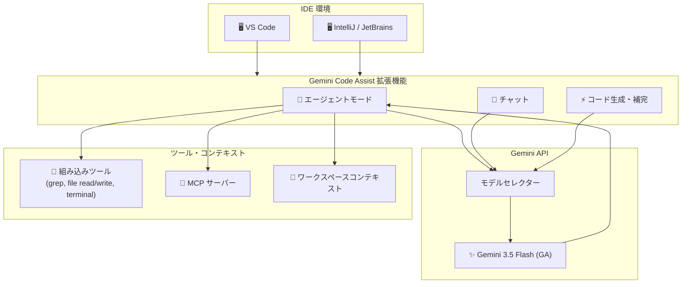

# Gemini: Gemini 3.5 Flash - Code Assist GA

**リリース日**: 2026-06-08

**サービス**: Gemini

**機能**: Gemini 3.5 Flash が Gemini Code Assist で一般提供開始

**ステータス**: GA

📊 [このアップデートのインフォグラフィックを見る](https://takech9203.github.io/google-cloud-news-summary/20260608-gemini-3-5-flash-code-assist-ga.html)

## 概要

Gemini 3.5 Flash が Gemini Code Assist ユーザー向けに一般提供 (GA) となった。VS Code および IntelliJ (JetBrains IDE) でこのモデルを利用でき、エージェントモード、チャット、コード生成の全機能で使用可能である。

Gemini 3.5 Flash は、高速な応答性能と高品質なコード生成を両立するモデルとして、開発者の日常的なコーディングワークフローを大幅に効率化する。以前は Preview として一部ユーザーに限定提供されていたが、今回の GA 昇格により、Gemini Code Assist の全エディション (Standard / Enterprise) のユーザーが安定版として利用できるようになった。

**アップデート前の課題**

- Gemini 3.5 Flash は Preview 段階であり、Enterprise / Standard ユーザーは管理者が Preview リリースチャネルを設定しないと利用できなかった
- Preview 段階のため SLA が適用されず、本番環境での利用に不安があった
- エージェントモードで使用するモデルの選択肢が限られていた

**アップデート後の改善**

- Gemini 3.5 Flash が GA となり、全ユーザーが追加設定なしで利用可能になった
- GA ステータスにより SLA が適用され、本番ワークフローでの利用に適した安定性が保証された
- エージェントモード、チャット、コード生成の全機能で Gemini 3.5 Flash を選択可能になった

## アーキテクチャ図

Gemini 3.5 Flash は Gemini Code Assist の拡張機能を通じて IDE と統合され、エージェントモード実行時にはワークスペースコンテキスト、組み込みツール、MCP サーバーを活用して高品質なコード生成を行う。

## サービスアップデートの詳細

### 主要機能

1. **エージェントモード対応**
   - 複数ステップの複雑なタスクを自律的に実行
   - ファイルの読み書き、grep、ターミナル操作などの組み込みツールを活用
   - MCP サーバーとの連携による拡張機能
   - 計画の提示と承認フローによる安全な実行

2. **チャット機能**
   - コードに関する質問への回答
   - アーキテクチャの説明や理解支援
   - モデルセレクターから Gemini 3.5 Flash を選択可能

3. **コード生成・補完**
   - インラインコード補完 (タイピング中の自動提案)
   - コメントからの関数・コードブロック生成
   - コード変換によるクイックフィックス
   - 21 以上の検証済みプログラミング言語に対応

### 対応 IDE

| IDE | エージェントモード | チャット | コード生成 |
|-----|-------------------|---------|-----------|
| VS Code | 対応 | 対応 | 対応 |
| IntelliJ IDEA | 対応 | 対応 | 対応 |
| その他 JetBrains IDE (GoLand, PyCharm 等) | 対応 | 対応 | 対応 |

## 技術仕様

### エージェントモードのコンテキスト取得

| IDE | コンテキストソース |
|-----|-------------------|
| VS Code | ワークスペースファイル、ツール応答 (grep, terminal, file read/write)、Google 検索、URL コンテンツ、Markdown コンテキストファイル |
| IntelliJ | プロジェクトファイル、インデックスされたシンボル、ツール応答 (grep, file read/write)、バージョン管理、MCP サーバー、Markdown コンテキストファイル |

### 対応エディション

| エディション | Gemini 3.5 Flash 利用可否 |
|-------------|--------------------------|
| Gemini Code Assist Standard | GA として全ユーザーに提供 |
| Gemini Code Assist Enterprise | GA として全ユーザーに提供 |
| Google AI Pro | 利用可能 |
| Google AI Ultra | 利用可能 |

## 設定方法

### 前提条件

1. Gemini Code Assist Standard または Enterprise のサブスクリプションが有効であること
2. VS Code または JetBrains IDE がインストールされていること
3. Gemini Code Assist 拡張機能がインストール・有効化されていること

### 手順

#### ステップ 1: VS Code での利用

Gemini 3.5 Flash が GA として利用可能な場合、チャットおよびコード生成で自動的に選択される。チャット内のモデルセレクターから手動で別のモデルに切り替えることも可能。

#### ステップ 2: IntelliJ での利用

Gemini 3.5 Flash が GA として利用可能な場合、エージェントモード、チャット、コード生成で自動的に選択される。チャット内のモデルセレクターから手動で別のモデルに切り替え可能 (エージェントモードを含む)。

## メリット

### ビジネス面

- **開発速度の向上**: エージェントモードによる複雑なタスクの自動化で、開発サイクルを短縮
- **GA による信頼性**: SLA が適用されるため、チーム全体の開発ワークフローに組み込みやすい
- **学習コストの低減**: IDE に統合されたインターフェースで、追加の学習なしに AI アシスタンスを活用可能

### 技術面

- **高速レスポンス**: Flash モデルの特性により、コード補完やチャット応答が高速
- **広範な言語サポート**: 21 以上のプログラミング言語で検証済みの品質
- **MCP サーバー連携**: 外部ツールとの連携によりエージェントの能力を拡張可能
- **ローカルコードベース認識**: 大規模コンテキストウィンドウによるプロジェクト全体の理解

## デメリット・制約事項

### 制限事項

- Gemini Code Assist for individuals (無料版) は 2026 年 6 月 18 日にサービス終了予定。Antigravity への移行が必要
- エージェントモードの VS Code では、Gemini CLI が自動的にモデルを選択するため、手動でのモデル選択不可
- AI 生成コードは事実と異なる可能性があるため、出力の検証が推奨される

### 考慮すべき点

- リクエスト数の上限: Standard で 1,500 リクエスト/日、Enterprise で 2,000 リクエスト/日 (Gemini CLI と共有)
- 企業利用の場合、管理者によるサブスクリプション設定が必要
- コードカスタマイズ (プライベートリポジトリベースの提案) は Enterprise エディションのみ対応

## ユースケース

### ユースケース 1: 複雑なリファクタリング作業

**シナリオ**: レガシーコードベースの特定モジュールをリファクタリングし、新しいデザインパターンを適用する必要がある。

**効果**: エージェントモードで「この関数を Strategy パターンにリファクタリングして」と指示するだけで、関連ファイルの読み取り、変更計画の提示、コード修正をモデルが自律的に実行する。

### ユースケース 2: 新規機能の高速プロトタイピング

**シナリオ**: REST API のエンドポイントを新規追加する際に、ルーティング、バリデーション、テストコードを一括生成したい。

**効果**: エージェントモードに設計仕様を伝えることで、プロジェクトの既存コード構造を理解した上で、一貫性のあるコードを複数ファイルにわたって生成する。

### ユースケース 3: コードレビュー前のセルフチェック

**シナリオ**: プルリクエストを作成する前に、変更内容の品質を確認したい。

**効果**: チャット機能で変更差分について質問し、潜在的なバグやパフォーマンス問題について Gemini 3.5 Flash の高速な応答で即座にフィードバックを得られる。

## 料金

Gemini Code Assist の料金体系は以下の通り。Gemini 3.5 Flash の利用に追加料金は発生しない (サブスクリプション料金に含まれる)。

| エディション | 料金 |
|-------------|------|
| Gemini Code Assist Standard | Google Cloud サブスクリプションに含まれる (詳細は料金ページ参照) |
| Gemini Code Assist Enterprise | Google Cloud サブスクリプションに含まれる (詳細は料金ページ参照) |
| Google Developer Program Premium (月額) | $24.99/月 |
| Google Developer Program Premium (年額) | $299/年 |

詳細な料金情報: [Gemini Code Assist pricing](https://docs.cloud.google.com/products/gemini/pricing)

## 関連サービス・機能

- **Gemini CLI**: ターミナルから直接 Gemini を利用するオープンソースの AI エージェント。Code Assist とリクエスト数を共有
- **Antigravity**: Google が統合を進めるマルチエージェントプラットフォーム。2026 年 6 月 18 日以降、個人向けユーザーの移行先
- **Gemini Cloud Assist**: Google Cloud コンソール内での AI アシスタンス (Enterprise エディションで利用可能)
- **Cloud Workstations**: クラウドベースの開発環境。Gemini Code Assist がデフォルトで利用可能
- **Cloud Shell Editor**: ブラウザベースの開発環境。Gemini Code Assist がデフォルトで利用可能

## 参考リンク

- 📊 [インフォグラフィック](https://takech9203.github.io/google-cloud-news-summary/20260608-gemini-3-5-flash-code-assist-ga.html)
- [公式リリースノート](https://docs.cloud.google.com/release-notes#June_08_2026)
- [Gemini Code Assist 概要ドキュメント](https://docs.cloud.google.com/gemini/docs/codeassist/overview)
- [エージェントモード ドキュメント](https://developers.google.com/gemini-code-assist/docs/agent-mode)
- [対応言語・IDE 一覧](https://docs.cloud.google.com/gemini/docs/codeassist/supported-languages)
- [料金ページ](https://docs.cloud.google.com/products/gemini/pricing)
- [Gemini Code Assist セットアップガイド](https://docs.cloud.google.com/gemini/docs/codeassist/set-up-gemini)

## まとめ

Gemini 3.5 Flash の GA 昇格により、Gemini Code Assist ユーザーは VS Code および IntelliJ で高速かつ高品質な AI コーディング支援を安定版として利用できるようになった。エージェントモード、チャット、コード生成の全機能で利用可能であり、特にエージェントモードでの複雑なタスク自動化は開発生産性の大幅な向上が期待される。Standard または Enterprise サブスクリプションをお持ちの組織は、追加設定なしで即座に Gemini 3.5 Flash を活用開始できる。

---

**タグ**: #Gemini #GeminiCodeAssist #Gemini35Flash #GA #IDE
