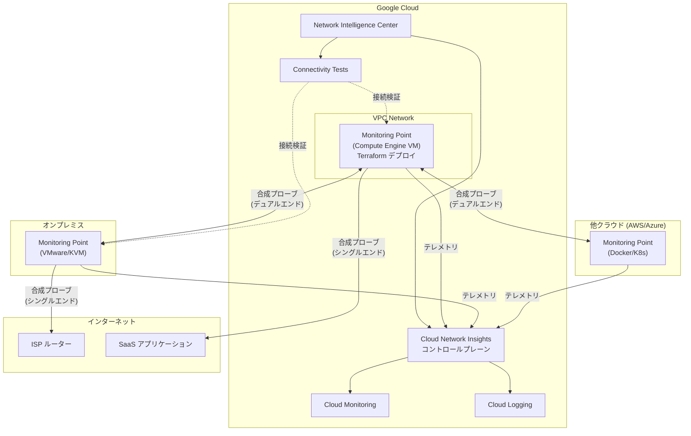

# Network Intelligence Center: Cloud Network Insights GA

**リリース日**: 2026-06-08

**サービス**: Network Intelligence Center

**機能**: Cloud Network Insights の一般提供開始 (GA)

**ステータス**: GA

📊 [このアップデートのインフォグラフィックを見る](https://takech9203.github.io/google-cloud-news-summary/20260608-network-intelligence-center-cloud-network-insights-ga.html)

## 概要

Cloud Network Insights が一般提供 (GA) となった。Cloud Network Insights は、AppNeta by Broadcom とのパートナーシップにより提供されるネットワーク監視ソリューションで、マルチクラウドおよびハイブリッドネットワーク環境全体のネットワークヘルスとウェブアプリケーションパフォーマンスの可視化を実現する。

Cloud Network Insights は、アクティブな合成プロービング (Synthetic Probing) を使用してリアルタイムのパフォーマンステレメトリを収集し、Google Cloud、サードパーティのクラウドサービスプロバイダー、オンプレミスへのラストマイル接続、インターネットなど、所有していないネットワークを含むパス全体を監視する。ユーザートラフィックが存在しない場合でもネットワークルートを監視できるため、ユーザーに影響が出る前に潜在的な問題を検出できる。

今回の GA リリースでは、Compute Engine VM Monitoring Points (Terraform によるデプロイ) および Connectivity Tests サポート (Cloud Network Insights からの接続テスト実行) が新たに追加されている。

**アップデート前の課題**

- Cloud Network Insights は Preview 段階であり、本番環境での利用には SLA が提供されなかった
- Google Cloud インフラストラクチャへの Monitoring Point デプロイは、コンテナ (Docker/Kubernetes) や仮想アプライアンス (VMware/KVM) のみに対応しており、Compute Engine VM への直接デプロイは不可だった
- ネットワークパスの監視と接続検証テストが別々のツールで管理されており、統合的なネットワーク診断が困難だった

**アップデート後の改善**

- GA により SLA が適用され、本番環境での利用が正式にサポートされた
- Compute Engine VM Monitoring Points により、Terraform を使用して Google Cloud インフラストラクチャに最適化された Monitoring Point を直接デプロイ可能になった
- Connectivity Tests との統合により、Cloud Network Insights から直接 Connectivity Tests を実行してデュアルエンドのネットワークパスのエンドポイント間接続を検証可能になった

## アーキテクチャ図



Cloud Network Insights は各環境にデプロイされた Monitoring Point からアクティブな合成プロービングを実行し、マルチクラウド・ハイブリッド環境全体のネットワークパフォーマンスを可視化する。今回の GA リリースで Compute Engine VM への Terraform デプロイと Connectivity Tests との統合が追加された。

## サービスアップデートの詳細

### 主要機能

1. **Compute Engine VM Monitoring Points**
   - Google Cloud インフラストラクチャに最適化された Monitoring Point を Compute Engine VM として直接デプロイ可能
   - Terraform による Infrastructure as Code (IaC) デプロイをサポート
   - Google Cloud コンソールから Terraform 構成ファイルをダウンロードするか、Google Cloud Marketplace から取得可能
   - デプロイ後 2〜5 分で Monitoring Point がアクティブ状態になる

2. **Connectivity Tests サポート**
   - Cloud Network Insights から直接 Connectivity Tests を実行可能
   - デュアルエンドのネットワークパスのエンドポイント間接続を検証
   - 構成分析とライブデータプレーン分析の両方を活用した接続性診断

3. **ネットワークパス監視**
   - シングルエンドパス: 外部ターゲット (SaaS、パブリック IP) への ICMP/TCP/UDP プロービング
   - デュアルエンドパス: Monitoring Point 間の精密な片方向レイテンシ、ジッター、非対称ルーティング検出
   - ホップバイホップのネットワーク経路可視化 (レイヤー 3/4)

4. **ウェブパス監視**
   - ブラウザモード: Selenium による実ブラウザエンジンでのフルページロード測定
   - HTTP モード: 軽量な HTTP/HTTPS リクエストによるサーバー可用性・応答時間チェック
   - DNS 解決時間、TTFB (Time to First Byte)、HTTP ステータスコードの測定

5. **Google Cloud Observability 統合**
   - Cloud Monitoring へのメトリクスエクスポート (RTT、パケットロス、ジッター)
   - Cloud Logging へのアラーム・イベントエクスポート
   - 事前定義されたアラートポリシーテンプレート
   - Slack、PagerDuty、Email、SMS、Pub/Sub による通知

## 技術仕様

### Monitoring Point タイプ

| タイプ | 対象環境 | デプロイ方法 |
|--------|----------|-------------|
| Compute Engine VM | Google Cloud | Terraform |
| Docker コンテナ (c50) | Linux VM、GCE インスタンス、Docker 対応ホスト | Docker/Podman |
| Kubernetes (Helm) (c50) | GKE、Amazon EKS、Azure AKS、オンプレミス K8s | Helm チャート |
| VMware (v35) | オンプレミスデータセンター (ESXi/vCenter) | OVA |
| KVM (v35) | Linux ベース仮想化環境 (OpenStack など) | QCOW2 |

### ファイアウォール要件

| プロトコル | ポート | 説明 |
|-----------|--------|------|
| TCP | 443 (HTTPS) | 必須。Cloud Network Insights コントロールプレーンへの接続 |
| UDP | 123 (NTP) | 必須。時刻同期 |
| UDP/TCP | 53 (DNS) | 必須。DNS 名前解決 |
| UDP | 3239, 33434 | テストトラフィック。デュアルエンドのネットワークパス監視に必要 |
| ICMP | Type 8 (echo request) | テストトラフィック。シングルエンドパスに必要 |

### 収集メトリクス

| カテゴリ | メトリクス |
|---------|-----------|
| ネットワークヘルス | RTT (最小/平均/最大)、パケットロス率、ジッター |
| ウェブエクスペリエンス | トランザクション時間、DNS ルックアップ時間、TTFB、HTTP ステータスコード |

### IAM ロール

| ロール | 用途 |
|--------|------|
| `roles/networkmanagement.CloudNetworkInsightsEditor` | Cloud Network Insights の設定・管理 |
| `roles/compute.admin` | Compute Engine VM Monitoring Point の Terraform デプロイ |

## 設定方法

### 前提条件

1. Google Cloud プロジェクトで Network Intelligence Center API が有効化されていること
2. `roles/networkmanagement.CloudNetworkInsightsEditor` ロールが付与されていること
3. Compute Engine VM デプロイの場合は `roles/compute.admin` ロールも必要
4. Monitoring Point からインターネットへのアウトバウンドアクセスが許可されていること

### 手順

#### ステップ 1: Compute Engine VM Monitoring Point のデプロイ

Google Cloud コンソールから Terraform 構成ファイルを取得してデプロイする。

1. Google Cloud コンソールで **Network Intelligence > Cloud Network Insights > Monitoring Points** に移動
2. **Add monitoring point** をクリック
3. **Platform Type** で **Google Cloud** を選択し、**Continue** をクリック
4. VM のホスト名を入力
5. デプロイオプションで **Terraform** を選択
6. インストールバンドルをダウンロード

```bash
# ダウンロードした Terraform 構成ファイルを展開
unzip monitoring-point-terraform.zip -d ./monitoring-point

# Terraform で Monitoring Point をデプロイ
cd ./monitoring-point
terraform init
terraform plan
terraform apply
```

#### ステップ 2: モニタリングポリシーの設定

Monitoring Point がアクティブになったら、監視対象と頻度を定義するモニタリングポリシーを作成する。

1. Google Cloud コンソールで **Cloud Network Insights** に移動
2. **Monitoring Policies** からネットワークパスまたはウェブパスのポリシーを作成
3. ソース (Monitoring Point) とターゲットを指定
4. テスト頻度を設定

#### ステップ 3: アラームとアラートの設定

```bash
# Cloud Logging でアラームログを確認
gcloud logging read 'resource.type="networkmanagement.googleapis.com/insights_alarm"' \
  --project=PROJECT_ID \
  --limit=10
```

## メリット

### ビジネス面

- **SLA 検証**: ISP やサードパーティのサービスプロバイダーが SLA を遵守しているかを客観的なメトリクスで検証可能
- **ダウンタイム削減**: ユーザーに影響が出る前にネットワーク問題をプロアクティブに検出し、平均修復時間 (MTTR) を短縮
- **マルチクラウド運用の簡素化**: 複数のクラウドプロバイダーやオンプレミス環境を単一のコンソールから統合的に監視可能

### 技術面

- **エンドツーエンドの可視性**: 所有していないネットワーク (ISP リンク、サードパーティクラウド) を含むパス全体のホップバイホップ可視化
- **Infrastructure as Code**: Terraform による Monitoring Point のデプロイで、再現性のあるインフラ管理を実現
- **Google Cloud Observability との統合**: Cloud Monitoring と Cloud Logging を活用した統合ダッシュボードとアラート
- **トラフィック不要の監視**: アクティブな合成プロービングにより、ユーザートラフィックがない状態でもネットワーク経路を継続監視

## デメリット・制約事項

### 制限事項

- AppNeta by Broadcom とのパートナーシップによるサービスのため、一部設定は AppNeta のインターフェースで行う必要がある
- Monitoring Point からのアウトバウンドインターネットアクセスが必須 (コントロールプレーンとの通信に TCP 443 が必要)
- Connectivity Tests のサポートはデュアルエンドのネットワークパスの一部に限定される

### 考慮すべき点

- Monitoring Point は監視対象ワークロードと同じ VM/コンテナにデプロイしないことが推奨される (リソース競合回避のため)
- Cloud Network Insights を有効化したプロジェクトと同じプロジェクトへの Monitoring Point デプロイは推奨されない
- ネットワークプロキシ環境では追加のプロキシ設定が必要

## ユースケース

### ユースケース 1: マルチクラウド環境のネットワークパフォーマンス監視

**シナリオ**: Google Cloud と AWS を併用するハイブリッド環境で、クラウド間のネットワーク接続品質を常時監視したい

**効果**: 両クラウドの VPC に Monitoring Point をデプロイし、デュアルエンドパスで片方向レイテンシ・ジッター・非対称ルーティングを継続監視。ISP やクラウドインターコネクトの品質劣化を即座に検出し、SLA 違反を客観的に証明可能

### ユースケース 2: オンプレミスからクラウドへの移行時のネットワーク品質保証

**シナリオ**: オンプレミスデータセンターから Google Cloud への移行プロジェクトにおいて、Cloud VPN / Cloud Interconnect 経由の接続品質を検証したい

**効果**: オンプレミスに VMware/KVM の Monitoring Point、Google Cloud に Compute Engine VM の Monitoring Point をデプロイし、ハイブリッド接続のレイテンシ・パケットロスをベースライン化。移行中の性能劣化を早期検知

### ユースケース 3: SaaS アプリケーションのユーザー体験監視

**シナリオ**: 全社で利用する SaaS アプリケーション (Salesforce、Microsoft 365 など) へのアクセス品質をリージョンごとに監視したい

**効果**: 各拠点やリージョンの Monitoring Point からウェブパス監視 (ブラウザモード) を設定し、ページロード時間・DNS 解決時間・TTFB を継続測定。エンドユーザー体験の劣化を即座に検出し、原因がネットワークかアプリケーションかを切り分け

## 料金

Network Intelligence Center の料金はモジュールごとに異なる。Cloud Network Insights の詳細な料金体系については公式料金ページを参照。

- [Network Intelligence Center 料金ページ](https://cloud.google.com/products/network-intelligence-center/pricing)

## 関連サービス・機能

- **Cloud Monitoring**: Cloud Network Insights からエクスポートされるメトリクスの可視化・ダッシュボード作成に使用
- **Cloud Logging**: アラームイベントやネットワーク状態変更ログの記録・分析に使用
- **Connectivity Tests**: Cloud Network Insights と統合されたネットワーク接続診断ツール。構成分析とデータプレーン分析を提供
- **Network Analyzer**: VPC ネットワーク構成の自動監視と誤設定の検出
- **Flow Analyzer**: VPC Flow Logs を使用したトラフィック分析
- **Performance Dashboard**: Google Cloud ネットワーク全体のパフォーマンス可視化

## 参考リンク

- 📊 [インフォグラフィック](https://takech9203.github.io/google-cloud-news-summary/20260608-network-intelligence-center-cloud-network-insights-ga.html)
- [公式リリースノート](https://docs.cloud.google.com/release-notes#June_08_2026)
- [Cloud Network Insights 概要ドキュメント](https://docs.cloud.google.com/network-intelligence-center/docs/cloud-network-insights/overview)
- [Monitoring Points のデプロイ](https://docs.cloud.google.com/network-intelligence-center/docs/cloud-network-insights/add-monitoring-points)
- [モニタリングポリシーの設定](https://docs.cloud.google.com/network-intelligence-center/docs/cloud-network-insights/configure-policies)
- [ベストプラクティス](https://docs.cloud.google.com/network-intelligence-center/docs/cloud-network-insights/best-practices)
- [Network Intelligence Center 料金ページ](https://cloud.google.com/products/network-intelligence-center/pricing)
- [Network Intelligence Center 製品ページ](https://cloud.google.com/network-intelligence-center)

## まとめ

Cloud Network Insights の GA リリースにより、マルチクラウド・ハイブリッド環境全体のネットワークパフォーマンス監視が本番環境で正式にサポートされた。Compute Engine VM Monitoring Points の Terraform デプロイと Connectivity Tests との統合により、Google Cloud ネイティブなネットワーク監視体験が大幅に強化されている。ハイブリッド・マルチクラウド環境を運用しているチームは、ネットワーク障害のプロアクティブな検出と迅速な根本原因分析のために導入を検討すべきである。

---

**タグ**: #NetworkIntelligenceCenter #CloudNetworkInsights #ネットワーク監視 #マルチクラウド #GA
