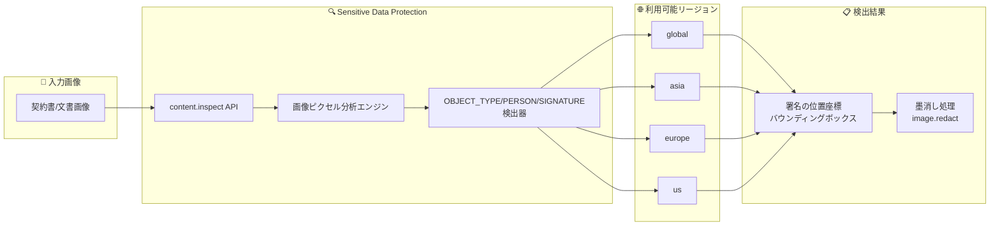

# Sensitive Data Protection: PERSON/SIGNATURE infoType 検出器のリージョン拡大

**リリース日**: 2026-06-08

**サービス**: Sensitive Data Protection

**機能**: OBJECT_TYPE/PERSON/SIGNATURE infoType 検出器のグローバルおよびマルチリージョン対応

**ステータス**: Feature

📊 [このアップデートのインフォグラフィックを見る](https://takech9203.github.io/google-cloud-news-summary/20260608-sensitive-data-protection-person-signature-infotype.html)

## 概要

Sensitive Data Protection の画像ベース infoType 検出器である `OBJECT_TYPE/PERSON/SIGNATURE` が、グローバル (global) および asia、europe、us の各マルチリージョンで利用可能になった。この検出器は、画像内の手書き署名を検出するもので、契約書や法的文書などに含まれる署名の個人情報保護に活用できる。

`OBJECT_TYPE/PERSON/SIGNATURE` は、画像のピクセルと特徴を直接分析する画像ベース infoType 検出器のカテゴリに属する。テキストベースの infoType 検出器が OCR でテキストを抽出してから分析するのに対し、この検出器は画像内のオブジェクトを直接認識・分類する。これにより、文書画像のスキャンやアーカイブされた契約書からの署名検出が可能になる。

**アップデート前の課題**

- `OBJECT_TYPE/PERSON/SIGNATURE` 検出器は限定されたリージョンでのみ利用可能だった
- グローバルエンドポイントやマルチリージョンでの署名検出ができなかった
- マルチリージョンに分散したデータに対して統一的な署名検出ポリシーを適用することが困難だった

**アップデート後の改善**

- global、asia、europe、us のマルチリージョンで `OBJECT_TYPE/PERSON/SIGNATURE` が利用可能になった
- グローバルエンドポイントを使用した署名検出が可能になり、リージョンを意識しない検査設定が実現
- マルチリージョンに分散したストレージ内の文書画像に対して、統一的な署名検出・墨消しポリシーを適用可能になった

## アーキテクチャ図



Sensitive Data Protection が画像を受け取り、ピクセル分析エンジンで SIGNATURE 検出器を実行し、指定されたマルチリージョンで処理を行った後、署名の位置情報を返すフローを示している。

## サービスアップデートの詳細

### 主要機能

1. **OBJECT_TYPE/PERSON/SIGNATURE 検出器**
   - 画像内の手書き署名を検出する画像ベース infoType 検出器
   - `OBJECT_TYPE/PERSON` ファミリーに属し、人物に関連するオブジェクト検出の一部
   - 検出結果としてバウンディングボックス (位置座標) を返す

2. **マルチリージョン対応**
   - global: グローバルエンドポイントでの処理
   - asia: アジア圏のデータセンターでの処理
   - europe: EU 加盟国内のデータセンターでの処理
   - us: 米国内のデータセンターでの処理

3. **画像検査・墨消し機能との統合**
   - `content.inspect` メソッドによる署名の検出 (位置特定)
   - `image.redact` メソッドによる署名の墨消し (不透明な矩形でマスク)
   - 他の OBJECT_TYPE 検出器 (PERSON、FACE、PASSPORT、PHOTO_ID_CARD) と組み合わせた包括的検査が可能

## 技術仕様

### OBJECT_TYPE/PERSON ファミリーの infoType 一覧

| infoType 名 | 説明 | 感度スコア | 利用可能リージョン |
|---|---|---|---|
| OBJECT_TYPE/PERSON | 人物像 (全身、顔、その他の身体部位) | SENSITIVITY_MODERATE | asia, europe, global, us, us-east4 |
| OBJECT_TYPE/PERSON/FACE | 人物の顔画像 (Preview) | SENSITIVITY_HIGH | asia, europe, global, us, us-east4 |
| OBJECT_TYPE/PERSON/PASSPORT | パスポート画像 | SENSITIVITY_HIGH | asia, europe, global, us, us-east4 |
| OBJECT_TYPE/PERSON/PHOTO_ID_CARD | 写真付き身分証明書 | SENSITIVITY_HIGH | asia, europe, global, us, us-east4 |
| OBJECT_TYPE/PERSON/SIGNATURE | 手書き署名 (今回追加) | - | asia, europe, global, us |

### API リクエスト例

```json
{
  "item": {
    "byteItem": {
      "data": "BASE64_ENCODED_IMAGE",
      "type": "IMAGE_PNG"
    }
  },
  "inspectConfig": {
    "infoTypes": [
      {
        "name": "OBJECT_TYPE/PERSON/SIGNATURE"
      }
    ]
  }
}
```

## 設定方法

### 前提条件

1. Google Cloud プロジェクトが有効であること
2. Sensitive Data Protection API (DLP API) が有効化されていること
3. 適切な IAM 権限 (`roles/dlp.user` 以上) が付与されていること

### 手順

#### ステップ 1: 画像を Base64 エンコードする

```bash
# Linux
base64 input_document.png > encoded_image.txt

# macOS
base64 -i input_document.png -o encoded_image.txt
```

#### ステップ 2: content.inspect API を呼び出す

```bash
curl -s \
  -H "Authorization: Bearer $(gcloud auth print-access-token)" \
  -H "Content-Type: application/json" \
  "https://dlp.googleapis.com/v2/projects/${PROJECT_ID}/locations/global/content:inspect" \
  -d '{
    "item": {
      "byteItem": {
        "data": "'$(cat encoded_image.txt)'",
        "type": "IMAGE_PNG"
      }
    },
    "inspectConfig": {
      "infoTypes": [
        {"name": "OBJECT_TYPE/PERSON/SIGNATURE"}
      ]
    }
  }'
```

マルチリージョンを指定する場合は、URL 内の `global` を `asia`、`europe`、`us` に置き換える。

#### ステップ 3: 署名を墨消しする (オプション)

```bash
curl -s \
  -H "Authorization: Bearer $(gcloud auth print-access-token)" \
  -H "Content-Type: application/json" \
  "https://dlp.googleapis.com/v2/projects/${PROJECT_ID}/locations/global/image:redact" \
  -d '{
    "byteItem": {
      "data": "'$(cat encoded_image.txt)'",
      "type": "IMAGE_PNG"
    },
    "imageRedactionConfigs": [
      {
        "infoType": {"name": "OBJECT_TYPE/PERSON/SIGNATURE"},
        "redactionColor": {"red": 0, "green": 0, "blue": 0}
      }
    ]
  }'
```

## メリット

### ビジネス面

- **コンプライアンス対応の強化**: 契約書や法的文書に含まれる署名を自動的に検出・保護することで、個人情報保護規制 (GDPR、個人情報保護法等) への対応が容易になる
- **グローバル展開の容易さ**: asia、europe、us のマルチリージョンで利用可能なため、データレジデンシー要件を満たしながら署名検出を実行できる

### 技術面

- **統一的なポリシー適用**: グローバルエンドポイントを使用することで、リージョンを意識せずに署名検出ポリシーを適用可能
- **既存ワークフローとの統合**: 他の OBJECT_TYPE 検出器と同じ API インターフェースで利用でき、既存の DLP パイプラインに追加が容易
- **画像墨消し機能との連携**: 検出した署名を自動的に墨消し処理することで、文書の匿名化パイプラインを構築可能

## デメリット・制約事項

### 制限事項

- 画像検査・墨消しは global、asia、europe、us のマルチリージョンのみでサポートされており、個別リージョン (us-central1 等) では利用不可
- 画像スキャン非対応リージョンで画像を含むファイルを検査すると、バイナリファイルとして処理される
- 検出結果には quote (引用テキスト) が含まれない (オブジェクト検出の仕様)

### 考慮すべき点

- AI 生成画像に対する検出精度は、実世界の画像と比較して低い可能性がある
- バウンディングボックスの精度は画像品質やスキャン解像度に依存する
- データのコロケーション (処理場所とストレージの一致) を考慮した設計が推奨される

## ユースケース

### ユースケース 1: 契約書アーカイブの署名保護

**シナリオ**: 法務部門が Cloud Storage に保管している大量のスキャン済み契約書から、署名部分を自動検出して墨消しし、匿名化されたコピーを作成する。

**実装例**:
```json
{
  "inspectConfig": {
    "infoTypes": [
      {"name": "OBJECT_TYPE/PERSON/SIGNATURE"},
      {"name": "OBJECT_TYPE/PERSON/PHOTO_ID_CARD"},
      {"name": "PERSON_NAME"}
    ]
  },
  "actions": [
    {
      "deidentify": {
        "transformationConfig": {}
      }
    }
  ]
}
```

**効果**: 署名、身分証明書画像、氏名を包括的に保護し、GDPR のデータ最小化原則に適合したアーカイブを実現

### ユースケース 2: 国際的なドキュメント処理パイプライン

**シナリオ**: グローバルに展開する企業が、各地域で受領した署名付き文書を処理する際に、データレジデンシー要件を遵守しながら統一的な署名検出を実行する。

**効果**: europe マルチリージョンで EU のデータを処理し、asia マルチリージョンでアジアのデータを処理することで、各地域のデータ主権要件を満たしつつ統一的なセキュリティポリシーを適用

## 料金

Sensitive Data Protection の料金は処理されたバイト数に基づく従量課金制である。

| カテゴリ | 料金 (USD) |
|---|---|
| 最初の 1 GB | 無料 |
| Google Cloud ストレージシステムの検査 | $1/GB〜 (ボリュームディスカウントあり) |
| ハイブリッド検査 (外部ソースのデータ) | $3/GB〜 (ボリュームディスカウントあり) |
| インライン コンテンツ検査 | $3/GB〜 (ボリュームディスカウントあり) |
| インライン コンテンツ匿名化 | $2/GB〜 (ボリュームディスカウントあり) |

詳細は [Sensitive Data Protection の料金ページ](https://cloud.google.com/sensitive-data-protection/pricing) を参照。

## 利用可能リージョン

`OBJECT_TYPE/PERSON/SIGNATURE` infoType 検出器は以下のロケーションで利用可能:

| ロケーション | タイプ | 説明 |
|---|---|---|
| global | グローバル | グローバルエンドポイント |
| asia | マルチリージョン | アジアのデータセンター |
| europe | マルチリージョン | EU 加盟国のデータセンター |
| us | マルチリージョン | 米国のデータセンター |

画像検査・墨消しが対応しているロケーションと一致している。個別リージョン (us-central1、asia-northeast1 等) での画像スキャンは非対応。

## 関連サービス・機能

- **Cloud Storage**: スキャン対象の画像ファイルの保管先。ストレージ検査ジョブで署名検出を実行可能
- **BigQuery**: 検出結果の保存・分析に利用。検出 findings のエクスポート先として設定可能
- **Security Command Center**: Sensitive Data Protection の検出結果を統合し、セキュリティ体制の把握に活用
- **Cloud Run functions**: Cloud Storage へのアップロードをトリガーとした自動署名検出パイプラインの構築に利用
- **Pub/Sub**: DLP ジョブの完了通知やリアルタイム検出結果の配信に活用

## 参考リンク

- 📊 [インフォグラフィック](https://takech9203.github.io/google-cloud-news-summary/20260608-sensitive-data-protection-person-signature-infotype.html)
- [公式リリースノート](https://cloud.google.com/release-notes#June_08_2026)
- [InfoType 検出器リファレンス](https://cloud.google.com/sensitive-data-protection/docs/infotypes-reference)
- [画像内の機密データの検査](https://cloud.google.com/sensitive-data-protection/docs/inspecting-images)
- [画像内の機密データの墨消し](https://cloud.google.com/sensitive-data-protection/docs/redacting-sensitive-data-images)
- [Sensitive Data Protection のロケーション](https://cloud.google.com/sensitive-data-protection/docs/locations)
- [料金ページ](https://cloud.google.com/sensitive-data-protection/pricing)

## まとめ

`OBJECT_TYPE/PERSON/SIGNATURE` infoType 検出器がグローバルおよび主要マルチリージョン (asia、europe、us) で利用可能になったことで、画像内の手書き署名の検出・墨消しを世界規模で統一的に実行できるようになった。契約書や法的文書を大量に扱う組織は、既存の DLP パイプラインにこの検出器を追加することで、署名を含む個人情報の保護を強化することを推奨する。

---

**タグ**: #SensitiveDataProtection #DLP #infoType #署名検出 #マルチリージョン
