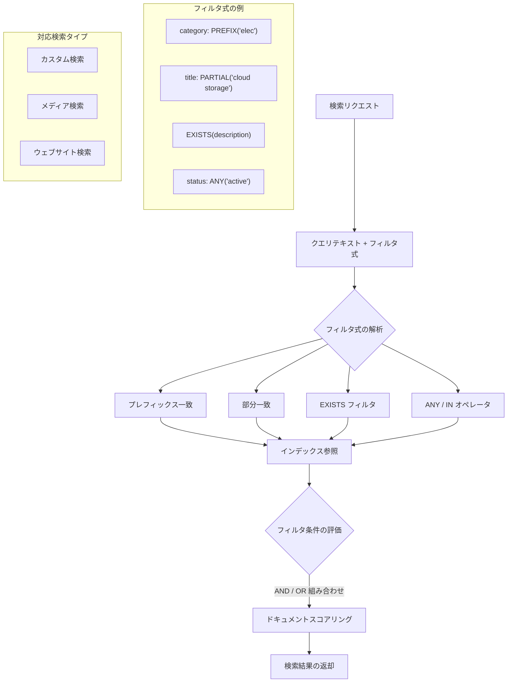

# Vertex AI Search (Agent Search): プレフィックス/部分一致および EXISTS フィルタによる検索クエリフィルタリング

**リリース日**: 2026-06-08

**サービス**: Vertex AI Search (Agent Search)

**機能**: Prefix/partial matching and EXISTS filter for search queries (Preview)

**ステータス**: Public Preview

[このアップデートのインフォグラフィックを見る](https://takech9203.github.io/google-cloud-news-summary/20260608-vertex-ai-search-prefix-partial-exists-filter.html)

## 概要

Google Cloud は Vertex AI Search (Agent Search) において、検索クエリのフィルタリング機能を大幅に強化する2つの新機能をパブリックプレビューとして発表しました。1つ目はプレフィックス一致（前方一致）と部分一致のサポート、2つ目は EXISTS フィルタです。

これらの機能により、開発者はスキーマフィールドに対してより柔軟なフィルタ式を構築できるようになります。プレフィックス一致ではフィールド値が特定の文字列で始まるかどうかでフィルタリングでき、部分一致ではクエリがフィールド値の一部の単語を含むかどうかで結果を絞り込めます。EXISTS フィルタはドキュメントのフィールドに値が存在し、デフォルト値でないことを条件にフィルタリングを行います。

対象ユーザーは、Vertex AI Search を利用してカスタム検索、メディア検索、ウェブサイト検索を構築している開発者および検索エンジニアです。特に EC サイト、コンテンツ管理システム、メディアプラットフォームなどで検索精度の向上を目指すチームに有用です。

**アップデート前の課題**

- フィルタ式で完全一致（ANY オペレータ）しか使用できず、フィールド値の先頭部分での絞り込みができなかった
- ユーザーがフィールド値の一部しか知らない場合、完全一致が求められるため検索結果が返らないケースがあった
- フィールドに値が設定されていないドキュメントを除外する標準的な方法がなく、NULL チェックのためにワークアラウンドが必要だった
- 複雑なフィルタ条件の組み合わせが制限されており、きめ細かい検索結果の制御が困難だった

**アップデート後の改善**

- プレフィックス一致により、フィールド値の先頭文字列に基づく効率的なフィルタリングが可能になった
- 部分一致により、ANY オペレータのような完全一致を要求せず、フィールド値の一部の単語でマッチングできるようになった
- EXISTS フィルタにより、フィールドに有効な値が存在するドキュメントのみを返すことが簡単に実現できるようになった
- ANY、IN、EXISTS などのフィルタを組み合わせた高度なフィルタ式が構築可能になった

## アーキテクチャ図



Agent Search のクエリパイプラインにおけるフィルタ式の処理フローを示しています。検索リクエストに含まれるフィルタ式は解析され、プレフィックス一致、部分一致、EXISTS、従来の ANY/IN オペレータに分岐して評価された後、インデックスを参照してドキュメントの絞り込みが行われます。

## サービスアップデートの詳細

### 主要機能

1. **プレフィックス一致（Prefix Matching）**
   - フィールド値が特定の文字列で始まるかどうかに基づいて検索結果をフィルタリング
   - スキーマフィールドの設定でプレフィックス一致を有効化する必要がある
   - カテゴリの階層構造やプロダクトコードの先頭部分での検索に最適
   - Configure field settings でフィールドごとにプレフィックス一致をサポートするよう設定可能

2. **部分一致（Partial Matching）**
   - クエリがフィールド値に含まれる単語の一部と一致するかどうかで結果をフィルタリング
   - ANY オペレータとは異なり、完全一致を必要としない柔軟なマッチング
   - フィールド値が複数単語で構成される場合に、一部の単語だけでマッチ可能
   - ユーザーが正確な値を覚えていない場合のファジーフィルタリングに有効

3. **EXISTS フィルタ**
   - ドキュメントのフィールドに値が存在し、かつデフォルト値でないことを条件にフィルタリング
   - カスタム検索とメディア検索の両方で利用可能
   - ANY や IN など他のフィルタと組み合わせて使用可能
   - データ品質の担保やオプショナルフィールドの有無による絞り込みに最適

## 技術仕様

### フィルタ式の比較

| フィルタタイプ | 動作 | 完全一致要求 | 対応検索タイプ |
|------|------|------|------|
| ANY オペレータ | フィールド値が指定値のいずれかと完全一致 | はい | カスタム、メディア、ウェブサイト |
| PREFIX 一致 | フィールド値が指定文字列で始まる | いいえ（先頭一致） | カスタム、メディア |
| PARTIAL 一致 | フィールド値の一部の単語がクエリに含まれる | いいえ（部分一致） | カスタム、メディア |
| EXISTS フィルタ | フィールドに非デフォルト値が存在する | N/A | カスタム、メディア |
| IN オペレータ | 数値フィールドが指定範囲内 | N/A（範囲指定） | カスタム、メディア |

### スキーマフィールド設定

プレフィックス一致および部分一致を利用するには、対象フィールドのスキーマ設定で明示的にこれらの機能を有効化する必要があります。

```json
{
  "structSchema": {
    "$schema": "https://json-schema.org/draft/2020-12/schema",
    "properties": {
      "category": {
        "type": "string",
        "indexable": true,
        "retrievable": true,
        "prefixMatchable": true,
        "partialMatchable": true
      },
      "product_code": {
        "type": "string",
        "indexable": true,
        "prefixMatchable": true
      },
      "description": {
        "type": "string",
        "indexable": true,
        "searchable": true
      }
    },
    "type": "object"
  }
}
```

## 設定方法

### 前提条件

1. Google Cloud プロジェクトで Vertex AI Search (Agent Search) が有効化されていること
2. 検索アプリとデータストアが作成済みであること
3. 構造化データまたはメタデータ付き非構造化データがインポート済みであること
4. フィルタリングに使用するフィールドが indexable に設定されていること

### 手順

#### ステップ 1: スキーマフィールドの設定

Google Cloud Console の AI Applications ページでフィールド設定を更新します。

```bash
# API を使用してスキーマを更新する例
curl -X PATCH \
  -H "Authorization: Bearer $(gcloud auth print-access-token)" \
  -H "Content-Type: application/json" \
  "https://discoveryengine.googleapis.com/v1/projects/PROJECT_ID/locations/global/collections/default_collection/dataStores/DATA_STORE_ID/schemas/default_schema" \
  -d '{
    "structSchema": {
      "properties": {
        "category": {
          "type": "string",
          "indexable": true,
          "prefixMatchable": true,
          "partialMatchable": true
        }
      }
    }
  }'
```

フィールドの `prefixMatchable` および `partialMatchable` プロパティを `true` に設定することで、そのフィールドでプレフィックス一致と部分一致が利用可能になります。

#### ステップ 2: フィルタ付き検索リクエストの実行

```bash
# プレフィックス一致フィルタを使用した検索
curl -X POST \
  -H "Authorization: Bearer $(gcloud auth print-access-token)" \
  -H "Content-Type: application/json" \
  "https://discoveryengine.googleapis.com/v1/projects/PROJECT_ID/locations/global/collections/default_collection/engines/APP_ID/servingConfigs/default_search:search" \
  -d '{
    "query": "search query",
    "filter": "category: PREFIX(\"elec\")"
  }'
```

```bash
# EXISTS フィルタと ANY を組み合わせた検索
curl -X POST \
  -H "Authorization: Bearer $(gcloud auth print-access-token)" \
  -H "Content-Type: application/json" \
  "https://discoveryengine.googleapis.com/v1/projects/PROJECT_ID/locations/global/collections/default_collection/engines/APP_ID/servingConfigs/default_search:search" \
  -d '{
    "query": "search query",
    "filter": "EXISTS(description) AND status: ANY(\"active\", \"pending\")"
  }'
```

フィルタ式では AND / OR を使用して複数の条件を組み合わせることができます。

## メリット

### ビジネス面

- **検索精度の向上**: ユーザーがフィールド値の完全な値を知らなくても、プレフィックスや部分一致で適切な結果を得られるため、検索体験が向上する
- **データ品質の制御**: EXISTS フィルタにより、必須情報が欠落しているドキュメントを検索結果から排除でき、ユーザーに高品質な結果のみを提供できる
- **EC サイトの商品検索改善**: 商品カテゴリやブランドの先頭文字列での絞り込みにより、ファセット検索を超えた柔軟なナビゲーションが実現できる

### 技術面

- **フィルタ式の表現力向上**: プレフィックス、部分一致、EXISTS を ANY/IN と組み合わせることで、従来は実現できなかった複雑なフィルタ条件を単一の式で表現可能
- **クエリ処理の効率化**: インデックスレベルでのプレフィックス一致により、アプリケーション側での後処理フィルタリングが不要になる
- **NULL 安全なクエリ設計**: EXISTS フィルタにより、フィールドの存在チェックをデータベースレベルで行えるため、アプリケーション側のエラーハンドリングが簡素化される

## デメリット・制約事項

### 制限事項

- 現在パブリックプレビュー段階であり、GA（一般提供）時に仕様が変更される可能性がある
- プレフィックス一致と部分一致を利用するには、スキーマフィールドの事前設定が必要（既存フィールドの設定変更にはリインデックスが発生する可能性がある）
- フィールド設定で indexable に設定できるフィールドは最大 50 個までの制限がある
- EXISTS フィルタはカスタム検索とメディア検索で利用可能だが、すべての検索タイプでの対応状況は公式ドキュメントで確認が必要

### 考慮すべき点

- プレフィックス一致はワイルドカード検索に似た動作をするが、フィールド値の先頭からのみ一致するため、中間一致や後方一致には対応しない
- 部分一致を多用すると、意図しないドキュメントがマッチする可能性があるため、適切なフィルタ設計が重要
- スキーマ変更後のリインデックスには時間がかかる場合があり、大規模データストアでは計画的な移行が必要
- Preview 機能のため、本番環境での使用にはサービス利用規約の「Pre-GA Offerings Terms」が適用される

## ユースケース

### ユースケース 1: EC サイトでの商品カテゴリフィルタリング

**シナリオ**: 大規模な EC サイトで、商品カテゴリの階層構造（例: "electronics/smartphones/android"）に基づいて商品を絞り込みたい場合。ユーザーがカテゴリの先頭部分だけを指定して、配下のすべての商品を検索結果に含めたい。

**実装例**:
```json
{
  "query": "最新モデル",
  "filter": "category: PREFIX(\"electronics/smartphones\")"
}
```

**効果**: "electronics/smartphones/android"、"electronics/smartphones/ios" など、スマートフォンカテゴリ配下のすべての商品が検索結果に含まれる。従来の ANY オペレータでは各サブカテゴリを個別に列挙する必要があったが、プレフィックス一致により単一のフィルタ式で実現可能。

### ユースケース 2: メディアプラットフォームでの品質フィルタリング

**シナリオ**: 動画配信プラットフォームで、説明文や評価が設定されているコンテンツのみを検索結果に表示したい場合。未入力のメタデータがあるコンテンツを除外して、ユーザーに充実した情報を提供する。

**実装例**:
```json
{
  "query": "料理レシピ",
  "filter": "EXISTS(description) AND EXISTS(media_content_rating) AND category: ANY(\"cooking\")"
}
```

**効果**: 説明文とコンテンツ評価の両方が設定されたドキュメントのみが返されるため、検索結果の品質が一定以上に保たれる。不完全なメタデータのコンテンツがユーザーに表示されるのを防止できる。

### ユースケース 3: 企業内文書検索での部分一致活用

**シナリオ**: 企業のナレッジベースで、部門名やプロジェクト名が長い場合に、ユーザーが正確な名称を覚えていなくても目的の文書を見つけられるようにしたい。

**実装例**:
```json
{
  "query": "セキュリティガイドライン",
  "filter": "department: PARTIAL(\"クラウド インフラ\")"
}
```

**効果**: "クラウド インフラストラクチャ運用部" や "クラウド インフラ設計チーム" など、部分的にマッチする部門のドキュメントが返される。ANY オペレータのように完全一致を要求しないため、ユーザーの記憶があいまいでも検索結果を得られる。

## 料金

Vertex AI Search の検索クエリ料金に準じます。フィルタ機能自体に追加料金は発生しませんが、検索クエリの実行回数に応じた課金が適用されます。

| 使用量 | 月額料金 (概算) |
|--------|-----------------|
| 検索クエリ 1,000 回 | $4.00 |
| サイト検索インデックス（高度な検索） | $5.00/GB/月〜 |

## 関連サービス・機能

- **Vertex AI Search 自然言語クエリフィルタ**: 自然言語のクエリから自動的にフィルタ式を生成する機能（GA）。今回のプレフィックス/部分一致と組み合わせることでさらに柔軟な検索が可能
- **Vertex AI Search サービングコントロール**: フィルタ条件を事前定義してルールベースで適用する機能。プレフィックス一致や EXISTS と組み合わせて高度な検索制御を実現
- **Configure field settings**: スキーマフィールドの indexable、searchable、retrievable 等の設定を管理する機能。プレフィックス/部分一致の有効化にはこの設定が必須

## 参考リンク

- [インフォグラフィック](https://takech9203.github.io/google-cloud-news-summary/20260608-vertex-ai-search-prefix-partial-exists-filter.html)
- [公式リリースノート](https://docs.cloud.google.com/release-notes#June_08_2026)
- [Filter custom search for structured or unstructured data](https://docs.cloud.google.com/generative-ai-app-builder/docs/filter-search-metadata)
- [Filter website search](https://docs.cloud.google.com/generative-ai-app-builder/docs/filter-website-search)
- [Configure field settings](https://docs.cloud.google.com/generative-ai-app-builder/docs/configure-field-settings)

## まとめ

今回の Vertex AI Search におけるプレフィックス一致、部分一致、EXISTS フィルタの追加は、検索クエリのフィルタリング機能を根本的に強化するアップデートです。従来の完全一致ベースのフィルタリングの制約を解消し、より柔軟で実用的な検索体験の構築を可能にします。現在パブリックプレビュー段階ですが、EC サイトやコンテンツプラットフォームでの検索精度向上に直結する機能であるため、早期の検証と GA 時の本番導入計画を推奨します。

---

**タグ**: #VertexAI #VertexAISearch #AgentSearch #FilterExpressions #PrefixMatching #PartialMatching #EXISTS #SearchQuery #Preview
