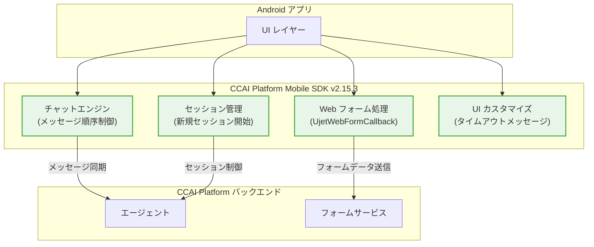

# Google Cloud CCaaS (CCAI Platform): Mobile SDK for Android 2.15.3 パッチリリース

**リリース日**: 2026-06-09

**サービス**: Google Cloud Contact Center as a Service (CCaaS) / CCAI Platform

**機能**: Mobile SDK for Android バージョン 2.15.3 パッチ

**ステータス**: Fixed (パッチリリース)

:bar_chart: [このアップデートのインフォグラフィックを見る](https://takech9203.github.io/google-cloud-news-summary/20260609-ccaas-mobile-sdk-android-2-15-3.html)

## 概要

Google Cloud Contact Center as a Service (CCaaS / CCAI Platform) の Android 向け Mobile SDK バージョン 2.15.3 パッチがリリースされました。本パッチは複数のバグ修正を含む品質改善リリースであり、Web フォームのコールバック処理、チャットメッセージの表示順序、セッション管理、およびタイムアウトメッセージのカスタマイズに関する問題が修正されています。

CCAI Platform の Mobile SDK は、Android アプリ内に音声通話やチャットによるカスタマーサポート機能を直接組み込むためのライブラリです。今回のパッチは、エンドユーザーのチャット体験とフォーム連携の信頼性を大幅に向上させるものであり、CCaaS を導入している企業の開発チームおよび CX (カスタマーエクスペリエンス) チームに影響があります。

**アップデート前の課題**

- `UjetWebFormCallback` に必要なメソッドが不足しており、Web フォームからのデータを SDK に正しく渡すことができなかった
- チャットメッセージとコンテンツカードが時系列順に正しく表示されず、会話の流れが不明瞭になっていた
- 前回のチャットセッション終了後に新しいセッションを開始できず、アプリの再起動が必要になる場合があった
- タイムアウトメッセージの表示をカスタマイズする手段がなく、エンドユーザーに対して適切なフィードバックを提供できなかった

**アップデート後の改善**

- `UjetWebFormCallback` に必要なメソッドが追加され、フォームデータの受け渡しが正常に動作するようになった
- チャットメッセージとコンテンツカードが正しい時系列順で表示されるようになった
- セッション終了後に新規チャットセッションが正常に開始されるようになった
- タイムアウトメッセージの表示内容をカスタマイズできるようになった

## アーキテクチャ図



この図は、Mobile SDK 2.15.3 で修正された 4 つのコンポーネント (緑色) と、それらが Android アプリおよび CCAI Platform バックエンドとどのように連携するかを示しています。

## サービスアップデートの詳細

### 修正内容

1. **UjetWebFormCallback のメソッド不足修正**
   - `UjetWebFormCallback` インターフェースに、フォームデータを SDK に渡すために必要なメソッドが追加されました
   - Web フォームを使用したスマートアクション連携において、`onEvent(formDataEvent)` および `onError()` コールバックが正常に機能するようになりました
   - HMAC-SHA256 署名付きのフォームデータを正しく処理できるようになりました

2. **チャットメッセージ・コンテンツカードの表示順序修正**
   - チャットメッセージとコンテンツカード (リッチメッセージ) が送信時刻に基づいて正しい順序で表示されるようになりました
   - エージェントとエンドユーザー間の会話の流れが時系列に沿って正確に再現されます
   - コンテンツカード (画像、ボタン、リンクなどのリッチコンテンツ) がメッセージストリーム内の適切な位置に配置されます

3. **セッション終了後の新規チャットセッション開始修正**
   - 前回のチャットセッションが `SessionEnded` イベントで正常終了した後、新しいセッションを `Ujet.start()` で開始できるようになりました
   - `Ujet.getStatus()` が `UjetStatus.None` を正しく返すようになり、セッション状態の整合性が保たれます
   - アプリを再起動せずに連続したサポートセッションの利用が可能になりました

4. **タイムアウトメッセージのカスタマイズ対応**
   - エンドユーザーに表示されるタイムアウトメッセージ (待機時間超過時など) のテキストをカスタマイズできるようになりました
   - ブランドガイドラインに沿ったメッセージ表現や多言語対応が可能になりました

## 技術仕様

### 修正対象コンポーネント

| コンポーネント | 修正内容 | 影響範囲 |
|---------------|---------|---------|
| UjetWebFormCallback | メソッド追加 (フォームデータ受け渡し) | スマートアクション・Web フォーム連携 |
| チャットメッセージエンジン | メッセージ順序制御ロジック修正 | テキストチャット・コンテンツカード表示 |
| セッションマネージャー | セッション状態遷移修正 | セッション終了後の再接続 |
| UI カスタマイズ層 | タイムアウトメッセージ設定追加 | エンドユーザー向け通知表示 |

### SDK バージョン情報

| 項目 | 詳細 |
|------|------|
| バージョン | 2.15.3 |
| リリースタイプ | パッチリリース (バグ修正) |
| 前バージョン | 2.15.2 |
| 対象プラットフォーム | Android (minSdkVersion: 25 / Android 7.1.1+) |
| 配布リポジトリ | `maven { url "https://sdk.ujet.co/android/" }` |

## 設定方法

### 前提条件

1. CCAI Platform ポータルの Company Key と Company Secret が取得済みであること
2. Android 7.1.1 (API レベル 25) 以降のデバイスが対象であること
3. Firebase Cloud Messaging (FCM) がプッシュ通知用に設定済みであること
4. アプリが AndroidX に移行済みであること

### 手順

#### ステップ 1: SDK バージョンの更新

```gradle
// build.gradle (module: app)
dependencies {
    def ujetSdkVersion = "2.15.3"
    implementation "co.ujet.android:ujet-android:$ujetSdkVersion"
}
```

`build.gradle` の依存関係を 2.15.3 に更新し、Gradle Sync を実行します。

#### ステップ 2: UjetWebFormCallback の実装確認 (Web フォーム利用時)

```kotlin
class UjetWebFormListenerImpl : UjetWebFormListener {
    override fun ujetWebFormDidReceive(
        event: Map<String, Any?>,
        callback: UjetWebFormCallback
    ) {
        try {
            val smartActionId = event["smart_action_id"]
            val externalFormId = event["external_form_id"]
            val formUri = generateFormUri(externalFormId)

            val data = mapOf(
                "external_form_id" to externalFormId,
                "smart_action_id" to smartActionId,
                "uri" to formUri
            )
            val signature = generateHmacSha256(data)
            val formDataEvent = mapOf(
                "type" to "form_data",
                "signature" to signature,
                "data" to data
            )
            callback.onEvent(formDataEvent)
        } catch (e: Throwable) {
            callback.onError()
        }
    }
}

// SDK にリスナーを登録
Ujet.setUjetWebFormListener(UjetWebFormListenerImpl())
```

Web フォーム連携を使用している場合は、`UjetWebFormCallback` の新しいメソッドが利用可能になっていることを確認します。

#### ステップ 3: ビルドとテスト

```bash
# アプリをビルド
./gradlew assembleDebug

# テスト実行
./gradlew connectedAndroidTest
```

ビルド後、以下の動作を確認してください:
- Web フォームからのデータ送信が正常に動作すること
- チャットメッセージが正しい順序で表示されること
- セッション終了後に新しいチャットを開始できること
- タイムアウト時のメッセージが期待通りに表示されること

## メリット

### ビジネス面

- **カスタマーエクスペリエンスの向上**: チャットメッセージの正しい表示順序により、エンドユーザーの混乱が解消され、サポート品質が向上する
- **ブランド一貫性**: タイムアウトメッセージのカスタマイズにより、企業のブランドガイドラインに沿った UX を提供できる
- **サポート効率の改善**: セッション再開問題の修正により、エンドユーザーがアプリ再起動なしに連続してサポートを受けられる

### 技術面

- **Web フォーム連携の信頼性向上**: `UjetWebFormCallback` の修正により、スマートアクションを介したフォームデータ連携が安定動作する
- **セッション状態管理の正常化**: セッションライフサイクルが正しく管理され、状態不整合によるエラーが解消される
- **UI 表示ロジックの改善**: メッセージ順序制御の修正により、リアルタイムチャットの表示品質が向上する

## デメリット・制約事項

### 制限事項

- 本パッチは Android SDK のみが対象であり、iOS SDK には適用されない
- minSdkVersion は 2.15.2 から引き続き API レベル 25 (Android 7.1.1) が最低要件
- Web フォーム連携には HMAC-SHA256 署名の実装がサーバー側で必要

### 考慮すべき点

- バージョン 2.15.2 から 2.15.3 へのアップデートは後方互換性のあるパッチリリースだが、Web フォーム関連の実装がある場合はコールバックの動作変更を確認すること
- チャットメッセージの表示順序が修正されたため、既存のカスタム UI 実装がある場合は表示レイアウトへの影響を確認すること

## ユースケース

### ユースケース 1: カスタマーサポートアプリでの Web フォーム連携

**シナリオ**: 金融機関がモバイルアプリ内のカスタマーサポート機能で、本人確認フォームをチャット中に表示してデータを収集する

**実装例**:
```kotlin
// スマートアクションによるフォーム表示・データ収集
Ujet.setUjetWebFormListener(object : UjetWebFormListener {
    override fun ujetWebFormDidReceive(
        event: Map<String, Any?>,
        callback: UjetWebFormCallback
    ) {
        val formId = event["external_form_id"] as String
        val formData = identityVerificationService.getFormData(formId)
        callback.onEvent(formData)
    }
})
```

**効果**: v2.15.3 の修正により、フォームデータが確実に SDK 経由でバックエンドに送信され、エージェントが本人確認情報をリアルタイムで受け取れるようになる

### ユースケース 2: 連続サポートセッション

**シナリオ**: EC サイトのアプリで、ユーザーが注文に関する問い合わせを終えた後、続けて返品に関する別の問い合わせを開始したい

**効果**: v2.15.3 の修正により、最初のセッション終了後にアプリを再起動せずに新しいチャットセッションを開始できる。ユーザーの離脱を防ぎ、サポート完了率が向上する

### ユースケース 3: 多言語対応のタイムアウトメッセージ

**シナリオ**: グローバル展開している企業が、ユーザーの言語設定に応じてタイムアウトメッセージを各言語で表示したい

**効果**: v2.15.3 の修正により、タイムアウトメッセージのカスタマイズが可能になり、日本語・英語・中国語などユーザーのロケールに合わせた適切なメッセージを表示できる

## 料金

CCaaS (Contact Center as a Service) の料金は、エージェント数やチャネル構成に基づく個別見積もりとなります。Mobile SDK 自体の利用に追加料金は発生しません。

詳細は [Google Cloud CCaaS の問い合わせページ](https://cloud.google.com/contact-center/ccai-platform/docs) をご参照ください。

## 関連サービス・機能

- **CCAI Platform iOS SDK**: 同様の機能を iOS 向けに提供する Mobile SDK (v2.15.4 が最新)
- **CCAI Platform Web SDK v3**: ブラウザ向けの Web SDK。同様のチャット・音声通話機能を Web アプリに組み込める
- **Conversational Agents (Dialogflow CX)**: CCAI Platform と連携して仮想エージェントによる自動応答を提供
- **Cloud Monitoring**: SDK のパフォーマンスやエラー率の監視に活用可能
- **Firebase Cloud Messaging (FCM)**: プッシュ通知によるチャット着信通知に必要

## 参考リンク

- :bar_chart: [インフォグラフィック](https://takech9203.github.io/google-cloud-news-summary/20260609-ccaas-mobile-sdk-android-2-15-3.html)
- [公式リリースノート](https://docs.cloud.google.com/release-notes#June_09_2026)
- [Android SDK ガイド](https://docs.cloud.google.com/contact-center/ccai-platform/docs/android-sdk-guide)
- [Mobile SDK 概要](https://docs.cloud.google.com/contact-center/ccai-platform/docs/mobileSDK-overview)
- [CCaaS 製品ページ](https://cloud.google.com/solutions/contact-center-as-a-service)

## まとめ

Mobile SDK for Android 2.15.3 は、Web フォーム連携、チャット表示順序、セッション管理、UI カスタマイズの 4 つの重要なバグを修正するパッチリリースです。特にチャットメッセージの表示順序とセッション再開の問題は、エンドユーザーの体験に直接影響する問題であったため、CCaaS を導入している組織は速やかにアップデートを適用することを推奨します。2.15.2 からの後方互換性が保たれているため、Gradle の依存関係バージョンを更新するだけでアップグレードが可能です。

---

**タグ**: #CCaaS #CCAI-Platform #Mobile-SDK #Android #バグ修正 #パッチリリース #チャット #UjetWebFormCallback #セッション管理
