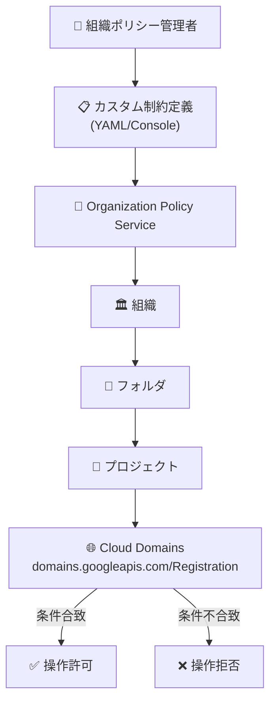

# Cloud Domains: Organization Policy Service カスタム制約が GA

**リリース日**: 2026-06-09

**サービス**: Cloud Domains

**機能**: Organization Policy Service カスタム制約 (Custom Constraints)

**ステータス**: GA (一般提供)

📊 [このアップデートのインフォグラフィックを見る](https://takech9203.github.io/google-cloud-news-summary/20260609-cloud-domains-custom-org-policies-ga.html)

## 概要

Cloud Domains において、Organization Policy Service のカスタム制約 (Custom Constraints) が一般提供 (GA) となった。これにより、組織管理者は Cloud Domains のドメイン登録リソースに対して、独自の組織ポリシー制約を定義し、ドメイン登録のガバナンスをより細かく制御できるようになった。

カスタム組織ポリシーを使用することで、CEL (Common Expression Language) ベースの条件式を記述し、ドメイン名のパターン制限や更新方法の強制など、組織固有のセキュリティおよびコンプライアンス要件に沿ったポリシーを適用できる。この機能は、組織階層 (Organization、Folder、Project) レベルで適用可能であり、ポリシーの継承も標準的な Organization Policy の仕組みに従う。

**アップデート前の課題**

- Cloud Domains のドメイン登録に対して組み込みの制約のみが利用可能で、組織固有の要件に対応する細かい制御ができなかった
- ドメイン名の命名規則や更新ポリシーを組織全体で強制する標準的な方法がなかった
- 個別のプロジェクトレベルでの手動管理や IAM のみに依存したガバナンスが必要だった

**アップデート後の改善**

- `domains.googleapis.com/Registration` リソースに対してカスタム制約を作成し、CREATE および UPDATE 操作を制御可能になった
- CEL 条件式によるドメイン名のパターン制限 (特定ドメインのみ許可/拒否) が可能になった
- ドメインの自動更新設定を組織ポリシーとして強制できるようになった
- 組織・フォルダ・プロジェクト階層でのポリシー継承による一貫したガバナンスが実現した

## アーキテクチャ図



組織ポリシー管理者がカスタム制約を定義し、Organization Policy Service を通じて組織階層全体に適用する。Cloud Domains のドメイン登録操作は CEL 条件式で評価され、条件に合致しない場合は拒否される。

## サービスアップデートの詳細

### 主要機能

1. **カスタム制約の作成**
   - Cloud Domains の `domains.googleapis.com/Registration` リソースに対してカスタム制約を定義可能
   - YAML ファイルまたは Google Cloud Console から作成
   - 組織ごとに最大 20 個のカスタム制約を設定可能

2. **サポートされるリソースフィールド**
   - `resource.domainName`: ドメイン名に対する条件を指定
   - `resource.managementSettings.preferredRenewalMethod`: 更新方法に対する条件を指定

3. **対応する REST メソッド**
   - `CREATE`: ドメイン登録の作成時に制約を適用
   - `UPDATE`: ドメイン登録の更新時に制約を適用

4. **ポリシーの継承**
   - 組織レベルで設定したポリシーはフォルダ・プロジェクトに自動継承
   - 継承の無効化や条件付き適用も可能

## 技術仕様

### サポートされるリソースとフィールド

| リソースタイプ | フィールド | 説明 |
|--------------|-----------|------|
| `domains.googleapis.com/Registration` | `resource.domainName` | 登録するドメイン名 |
| `domains.googleapis.com/Registration` | `resource.managementSettings.preferredRenewalMethod` | 優先する更新方法 |

### カスタム制約の仕様

| 項目 | 詳細 |
|------|------|
| 制約名の最大文字数 | 70 文字 (custom. プレフィックスを除く) |
| 条件式の最大文字数 | 1,000 文字 |
| 表示名の最大文字数 | 200 文字 |
| 説明の最大文字数 | 2,000 文字 |
| リソースタイプあたりの最大制約数 | 20 |
| アクションタイプ | ALLOW / DENY |
| 条件式言語 | CEL (Common Expression Language) |

## 設定方法

### 前提条件

1. 組織 ID の確認
2. Organization Policy Administrator (`roles/orgpolicy.policyAdmin`) IAM ロールの付与
3. 対象プロジェクト ID の確認

### 手順

#### ステップ 1: カスタム制約の定義

```yaml
# constraint-restrict-domain-name.yaml
name: organizations/ORGANIZATION_ID/customConstraints/custom.restrictDomainName
resourceTypes:
  - domains.googleapis.com/Registration
methodTypes:
  - CREATE
  - UPDATE
condition: "resource.domainName.contains('allowed')"
actionType: ALLOW
displayName: Restrict domain names
description: Only domain names containing 'allowed' are permitted.
```

#### ステップ 2: カスタム制約の適用

```bash
# 制約を組織に適用
gcloud org-policies set-custom-constraint ~/constraint-restrict-domain-name.yaml

# 制約が作成されたことを確認
gcloud org-policies list-custom-constraints --organization=ORGANIZATION_ID
```

#### ステップ 3: 組織ポリシーの作成

```yaml
# policy-restrict-domain-name.yaml
name: projects/PROJECT_ID/policies/custom.restrictDomainName
spec:
  rules:
    - enforce: true
```

#### ステップ 4: 組織ポリシーの適用

```bash
# ポリシーを適用
gcloud org-policies set-policy ~/policy-restrict-domain-name.yaml

# ポリシーが適用されたことを確認
gcloud org-policies list --project=PROJECT_ID
```

ポリシー適用後、約 2 分で Google Cloud がポリシーの適用を開始する。

## メリット

### ビジネス面

- **コンプライアンス強化**: 組織のドメイン命名規則やセキュリティ要件をポリシーとして自動的に強制できる
- **ガバナンスの一元管理**: 組織全体で一貫したドメイン管理ポリシーを階層的に適用可能
- **運用負荷の軽減**: 手動での承認フローや事後チェックが不要になり、ポリシー違反を事前に防止

### 技術面

- **CEL による柔軟な条件定義**: 文字列操作、正規表現的なマッチングなど、複雑な条件を表現可能
- **自動継承**: 組織階層に沿ったポリシーの自動適用により、設定漏れを防止
- **GA の信頼性**: SLA による保証、本番環境での安定利用が可能

## デメリット・制約事項

### 制限事項

- リソースタイプあたり最大 20 個のカスタム制約まで (超過するとオペレーションが失敗する)
- ポリシー変更は既存のリソースに遡及適用されない (新規作成・更新時のみ評価)
- 制約可能なフィールドは `resource.domainName` と `resource.managementSettings.preferredRenewalMethod` の 2 つのみ
- ポリシー適用後、反映まで約 2 分の遅延がある

### 考慮すべき点

- 既存のドメイン登録がポリシーに違反している場合、そのリソースの更新がブロックされる可能性がある (違反を解消する変更を除く)
- ポリシーの事前テストには Policy Simulator for Organization Policy の利用を推奨
- Cloud Domains は Squarespace によるドメイン登録の取得 (2023 年 9 月) 以降、一部機能が非推奨となっている点に注意

## ユースケース

### ユースケース 1: 社内ドメインの命名規則の強制

**シナリオ**: 大規模な組織で、社内プロジェクトが登録するドメインを企業ドメイン配下に限定したい。

**実装例**:
```yaml
name: organizations/123456789/customConstraints/custom.restrictToCompanyDomain
resourceTypes:
  - domains.googleapis.com/Registration
methodTypes:
  - CREATE
  - UPDATE
condition: "resource.domainName.endsWith('.example-corp.com')"
actionType: ALLOW
displayName: Restrict to company domains
description: Only domains under example-corp.com are permitted.
```

**効果**: 承認されていないドメインの登録を自動的にブロックし、シャドー IT によるドメイン取得を防止できる。

### ユースケース 2: ドメイン自動更新の強制

**シナリオ**: 重要なドメインの更新忘れによるサービス停止を防ぐため、自動更新の無効化を禁止したい。

**実装例**:
```yaml
name: organizations/123456789/customConstraints/custom.enforceAutomaticRenewal
resourceTypes:
  - domains.googleapis.com/Registration
methodTypes:
  - CREATE
  - UPDATE
condition: "resource.managementSettings.preferredRenewalMethod == 'RENEWAL_DISABLED'"
actionType: DENY
displayName: Enforce automatic renewal
description: Automatic renewal is required and cannot be disabled.
```

**効果**: すべてのドメイン登録で自動更新が有効な状態を組織全体で保証し、ドメイン失効のリスクを排除できる。

## 料金

Organization Policy Service のカスタム制約自体には追加料金は発生しない。Cloud Domains の料金はドメインの TLD (トップレベルドメイン) に応じて異なる年間登録料が課金される。

詳細は公式料金ページを参照: [Cloud Domains Pricing](https://cloud.google.com/domains/pricing)

## 利用可能リージョン

Cloud Domains は Google Cloud が利用可能なすべての国で利用可能。Organization Policy Service はグローバルサービスであり、リージョンの制約なく利用できる。

## 関連サービス・機能

- **Organization Policy Service**: カスタム制約の基盤となるサービス。組織全体のリソース制御を提供
- **Cloud DNS**: Cloud Domains と連携するDNS プロバイダー。ドメイン登録後のネームサーバー設定に使用
- **IAM (Identity and Access Management)**: ドメイン登録の操作権限管理。Organization Policy と組み合わせてガバナンスを強化
- **Resource Manager**: 組織、フォルダ、プロジェクトの階層構造を管理。ポリシー継承の基盤
- **Policy Simulator for Organization Policy**: ポリシー適用前の影響シミュレーション。既存リソースへの影響を事前確認

## 参考リンク

- 📊 [インフォグラフィック](https://takech9203.github.io/google-cloud-news-summary/20260609-cloud-domains-custom-org-policies-ga.html)
- [公式リリースノート](https://docs.cloud.google.com/release-notes#June_09_2026)
- [Cloud Domains カスタム制約ドキュメント](https://docs.cloud.google.com/domains/docs/custom-constraints)
- [Organization Policy カスタム制約対応サービス一覧](https://docs.cloud.google.com/organization-policy/reference/custom-constraint-supported-services)
- [Organization Policy Service 概要](https://docs.cloud.google.com/organization-policy/overview)
- [カスタム制約の作成と管理](https://docs.cloud.google.com/organization-policy/create-custom-constraints)
- [Cloud Domains 概要](https://docs.cloud.google.com/domains/docs/overview)
- [Cloud Domains 料金](https://cloud.google.com/domains/pricing)

## まとめ

Cloud Domains における Organization Policy Service カスタム制約の GA は、エンタープライズ環境でのドメイン登録ガバナンスを強化する重要なアップデートである。ドメイン名の命名規則や更新ポリシーを組織全体で強制できるようになり、コンプライアンス要件への対応が容易になった。Solutions Architect は、既存のドメイン管理ポリシーをカスタム制約として定義し、Policy Simulator で影響をテストした上で段階的に導入することを推奨する。

---

**タグ**: #CloudDomains #OrganizationPolicy #CustomConstraints #Governance #GA
