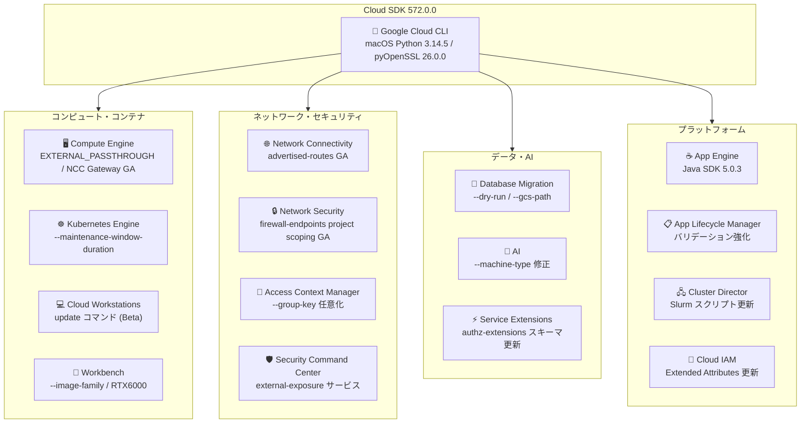

# Cloud SDK: バージョン 572.0.0 リリース

**リリース日**: 2026-06-09

**サービス**: Cloud SDK (Google Cloud CLI)

**機能**: Cloud SDK 572.0.0 - 多数のサービスにわたるアップデート

**ステータス**: GA / Beta (サービスにより異なる)

📊 [このアップデートのインフォグラフィックを見る](https://takech9203.github.io/google-cloud-news-summary/20260609-cloud-sdk-572-0-0.html)

## 概要

Cloud SDK 572.0.0 は、Google Cloud CLI の基盤アップデートから各種サービスの機能追加・GA 昇格まで、16 のサービスにわたる包括的なリリースである。ネットワーク、コンピュート、データベース移行、ワークステーション管理、コンテナオーケストレーション、セキュリティなど多岐にわたる領域で改善が行われている。

特に注目すべきは、Compute Engine の EXTERNAL_PASSTHROUGH ロードバランシングスキームオプションの Beta 追加、GKE のメンテナンスウィンドウ期間指定フラグ（--maintenance-window-duration）、Database Migration Service のドライラン機能と Cloud Storage からのシーディング対応、Cloud Workstations の永続ディレクトリディスクサイズ変更コマンド、Network Connectivity の NCC Gateway advertised-routes の GA 昇格である。

対象ユーザーは、Google Cloud CLI を日常的に利用するインフラエンジニア、ネットワークエンジニア、データベース管理者、DevOps エンジニア、および Kubernetes 運用者である。

**アップデート前の課題**

- GKE のメンテナンスウィンドウ設定で開始時刻と終了時刻の両方を RFC-5545 形式で指定する必要があり、直感的でなかった
- Database Migration Service の conversion workspace 適用時に、事前検証なしで本番データベースに変更を加えるリスクがあった
- conversion workspace のシーディングに直接接続が必要で、Cloud Storage 経由での入力ができなかった
- Cloud Workstations の永続ディレクトリのディスクサイズを変更するには再作成が必要だった
- NCC Gateway の advertised-routes コマンドが Beta のみで利用可能だった
- Compute Engine のパススルー Network Load Balancer で --load-balancing-scheme に EXTERNAL_PASSTHROUGH オプションが CLI から直接指定できなかった

**アップデート後の改善**

- `--maintenance-window-duration` フラグにより、開始時刻と期間だけでメンテナンスウィンドウを簡潔に定義可能になった
- `--dry-run` フラグにより、変換ワークスペースの適用をコピー先データベースのコピーに対して検証できるようになった
- `--gcs-path` フラグにより、Cloud Storage バケットから変換ワークスペースのシーディングが可能になった
- `gcloud beta workstations update` コマンドで永続ディレクトリのディスクサイズを再作成なしで変更可能になった
- NCC Gateway advertised-routes コマンドグループが GA に昇格し、本番環境で安心して利用可能になった
- EXTERNAL_PASSTHROUGH オプションが forwarding-rules と backend-services の両方で Beta として利用可能になった

## アーキテクチャ図



Cloud SDK 572.0.0 で更新された 16 サービスの全体像を示す。コンピュート/コンテナ、ネットワーク/セキュリティ、データ/AI、プラットフォームの 4 つの領域にわたる広範なアップデートが行われている。

## サービスアップデートの詳細

### 1. Google Cloud CLI - macOS Python 環境の更新

- macOS Python Virtualenv を 3.14.5 に更新
- pyOpenSSL 26.0.0 および cryptography 46.0.7 を含む
- TLS/SSL 関連の最新セキュリティ修正が適用される

### 2. AI - Gemini on GDC デプロイメントの修正

- `gcloud ai endpoints deploy-model` コマンドで `--machine-type` フラグが正しく反映されるよう修正
- GDC (Google Distributed Cloud) connected デプロイメントにおいて、以前はこのフラグが暗黙的に無視されていた
- Gemini モデルを GDC にデプロイする際のマシンタイプ指定が意図通りに動作するようになった

### 3. App Engine - Java SDK 5.0.3

- Java SDK をバージョン 5.0.3 に更新
- オープンソースプロジェクト [appengine-java-standard](https://github.com/GoogleCloudPlatform/appengine-java-standard/releases/tag/v5.0.3) からのビルド
- [Issue #503](https://github.com/GoogleCloudPlatform/appengine-java-standard/issues/503) の修正を含む

### 4. App Lifecycle Manager - バリデーション強化

- releases、unit-kinds、unit-operations コマンドの引数に対して、必須サブフィールドのバリデーションを追加
- 不完全なパラメータでのコマンド実行を事前に検出し、エラーメッセージで通知

### 5. Cloud Access Context Manager - --group-key のオプション化

- `gcloud access-context-manager cloud-bindings create` コマンドの `--group-key` フラグが任意に変更
- 以前は必須だったため、グループキーが不要なユースケースでも指定する必要があった

### 6. Cloud IAM - Extended Attributes の更新

- Extended Attributes パラメータから deprecated 表記を削除
- Extended Attributes は restricted としてマーク
- 利用には適切な権限とアクセス制御が必要

### 7. Cloud Workstations - update コマンドの追加 (Beta)

- `gcloud beta workstations update` コマンドが新規追加
- ワークステーションの永続ディレクトリのディスクサイズを変更可能
- `/home` にマウントされる永続ディレクトリの容量を、ワークステーションを再作成せずに拡張できる
- リサイズ操作時に自動的にスナップショットが作成される（3 週間後に自動削除）
- ファイルシステムの拡張は次回ワークステーション起動時に反映される

```bash
# 永続ディレクトリを 500GB に拡張
gcloud beta workstations update my-workstation \
  --pd-disk-size=500 \
  --cluster=my-cluster \
  --config=my-config \
  --region=us-central1
```

### 8. Cluster Director - Slurm スクリプト更新のサポート

- Slurm の prolog、epilog、task prolog、task epilog スクリプトの更新をサポート
- HPC (High Performance Computing) ワークロードのジョブ前後処理のカスタマイズが容易に

### 9. Compute Engine - 複数の機能追加と GA 昇格

**EXTERNAL_PASSTHROUGH オプション (Beta)**:
- `gcloud compute forwarding-rules` の `--load-balancing-scheme` フラグに `EXTERNAL_PASSTHROUGH` オプションを追加
- `gcloud compute backend-services` の `--load-balancing-scheme` フラグにも同オプションを追加
- リージョナル外部パススルー Network Load Balancer の構成を CLI から明示的に指定可能

**--ip_addresses フラグの Beta 昇格**:
- `gcloud compute forwarding-rules` の `--ip_addresses` フラグが Beta に昇格

**フォルダ共有のサポート**:
- `gcloud compute reservations update` にフォルダ共有サポートを追加
- 組織内のフォルダ間で予約の共有が可能に

**--ncc-gateway フラグの GA 昇格**:
- NCC Gateway に関連するフラグが GA に昇格
- Network Connectivity Center と Compute Engine の連携が正式サポート

### 10. Database Migration - 3 つの重要な改善

**Cloud Storage からのシーディング**:
- `gcloud database-migration conversion-workspaces seed` コマンドに `--gcs-path` フラグを追加
- Cloud Storage バケットに格納されたスキーマ定義から変換ワークスペースにシーディング可能
- 直接的なソースデータベース接続なしでスキーマ移行の準備が可能

**ドライラン機能**:
- `gcloud database-migration conversion-workspaces apply` コマンドに `--dry-run` フラグを追加
- 宛先データベースのコピーに対してドラフトバージョンを適用し、適用プロセスを検証
- 本番データベースに影響を与えずに変換結果のテストが可能
- PostgreSQL 宛先接続プロファイルでのみ動作

```bash
# ドライランで適用プロセスを検証
gcloud database-migration conversion-workspaces apply my-workspace \
  --region=us-central1 \
  --destination-connection-profile=projects/my-project/locations/us-central1/connectionProfiles/dest-profile \
  --dry-run
```

**接続プロファイルの柔軟化**:
- `gcloud database-migration connection-profiles create postgresql` で `--host` と `--port` の同時指定要件を緩和
- Cloud SQL または AlloyDB を利用する宛先接続プロファイルの場合、ホストとポートの個別指定が不要に

### 11. Kubernetes Engine - メンテナンスウィンドウ期間指定

- `gcloud container clusters create` と `gcloud container clusters update` に `--maintenance-window-duration` フラグを追加
- `--maintenance-window-end` の代替として使用可能
- 開始時刻と期間（duration）でメンテナンスウィンドウを定義でき、終了時刻を計算する必要がなくなった

```bash
# メンテナンスウィンドウを期間で指定（例: 4時間）
gcloud container clusters create my-cluster \
  --zone=us-central1-a \
  --maintenance-window-start=2026-06-15T02:00:00Z \
  --maintenance-window-duration=4h \
  --maintenance-window-recurrence='FREQ=WEEKLY;BYDAY=SA,SU'

# 既存クラスタの更新
gcloud container clusters update my-cluster \
  --zone=us-central1-a \
  --maintenance-window-start=2026-06-15T02:00:00Z \
  --maintenance-window-duration=6h \
  --maintenance-window-recurrence='FREQ=WEEKLY;BYDAY=SA'
```

### 12. Network Connectivity - advertised-routes の GA 昇格

- `gcloud network-connectivity spokes gateways advertised-routes` コマンドグループが GA に昇格
- 対象コマンド: `create`、`delete`、`describe`、`list`
- NCC Gateway の advertised route を管理するコマンドが正式サポート
- 各 advertised route は NCC Hub のルートテーブルにインストールされ、NCC Gateway スポークが次ホップとなる
- VPC ネットワーク間のトラフィックルーティングを NCC Gateway 経由で制御可能

```bash
# NCC Gateway advertised route の作成
gcloud network-connectivity spokes gateways advertised-routes create my-route \
  --region=us-central1 \
  --spoke=my-gateway-spoke \
  --ip-range=10.0.0.0/8 \
  --priority=100 \
  --advertise-to-hub
```

### 13. Network Security - firewall-endpoints プロジェクトスコーピングの GA 昇格

- `gcloud network-security firewall-endpoints` コマンドのプロジェクトスコーピングが GA に昇格
- 対象コマンド: `create`、`delete`、`describe`、`list`、`update`
- 組織レベルだけでなく、プロジェクトレベルでのファイアウォールエンドポイント管理が正式サポート
- プロジェクト管理者が組織レベルの権限なしでファイアウォールエンドポイントを作成・管理可能

### 14. Security Command Center - external-exposure サービスの追加

- SUPPORTED_SERVICES リストに `external-exposure` サービスを追加
- 外部公開リスクの検出と管理が Security Command Center の標準サービスとして統合

### 15. Service Extensions - authz-extensions スキーマ更新

- `gcloud service-extensions authz-extensions` のインポートおよびエクスポートスキーマを更新
- 認可拡張機能の構成管理における互換性が改善

### 16. Workbench - イメージファミリー指定と RTX6000 対応

**--image-family フラグの追加**:
- `gcloud workbench instances upgrade` コマンドに `--image-family` フラグを追加
- イメージファミリーを跨いだアップグレードが可能に（例: レガシーのリリーストラックから新しいトラックへの移行）
- 指定しない場合は現在のイメージファミリー内の最新バージョンにアップグレード

```bash
# イメージファミリーを指定してアップグレード
gcloud workbench instances upgrade my-instance \
  --location=us-central1 \
  --image-family=projects/deeplearning-platform-release/global/images/family/workbench-instances-2603
```

**NVIDIA RTX6000 アクセラレータの追加**:
- `gcloud workbench instances create` と `update` の `--accelerator-type` 選択肢に `NVIDIA_RTX6000` を追加
- プロフェッショナルグラフィックスや AI/ML ワークロード向けの GPU オプションが拡充

## 技術仕様

### Cloud SDK 572.0.0 更新コンポーネント一覧

| コンポーネント | 変更内容 | ステージ |
|------|------|------|
| Google Cloud CLI | macOS Python 3.14.5, pyOpenSSL 26.0.0, cryptography 46.0.7 | GA |
| AI | --machine-type フラグ修正 (GDC) | GA |
| App Engine | Java SDK 5.0.3 | GA |
| App Lifecycle Manager | 引数バリデーション強化 | GA |
| Cloud Access Context Manager | --group-key オプション化 | GA |
| Cloud IAM | Extended Attributes 更新 | GA |
| Cloud Workstations | update コマンド追加 | Beta |
| Cluster Director | Slurm スクリプト更新 | GA |
| Compute Engine | EXTERNAL_PASSTHROUGH, --ip_addresses, フォルダ共有, --ncc-gateway | Beta / GA |
| Database Migration | --gcs-path, --dry-run, 接続プロファイル柔軟化 | GA |
| Kubernetes Engine | --maintenance-window-duration | GA |
| Network Connectivity | advertised-routes GA 昇格 | GA |
| Network Security | firewall-endpoints project scoping GA | GA |
| Security Command Center | external-exposure サービス追加 | GA |
| Service Extensions | authz-extensions スキーマ更新 | GA |
| Workbench | --image-family, NVIDIA_RTX6000 | GA |

### GKE メンテナンスウィンドウの指定方法比較

| 方式 | 必要なフラグ | 説明 |
|------|------|------|
| 従来方式 (end 指定) | `--maintenance-window-start` + `--maintenance-window-end` + `--maintenance-window-recurrence` | 開始日時と終了日時から期間を算出 |
| 新方式 (duration 指定) | `--maintenance-window-start` + `--maintenance-window-duration` + `--maintenance-window-recurrence` | 開始日時と期間を直接指定 |

### Database Migration ドライラン仕様

| 項目 | 詳細 |
|------|------|
| フラグ名 | `--dry-run` |
| 対応宛先 | PostgreSQL 宛先接続プロファイルのみ |
| 動作 | ドラフトバージョンを宛先データベースのコピーに適用 |
| 影響 | 本番宛先データベースには変更を加えない |
| 用途 | 変換結果の事前検証、問題の早期発見 |

### Compute Engine EXTERNAL_PASSTHROUGH の位置付け

| ロードバランシングスキーム | 用途 | 対象プロダクト |
|------|------|------|
| EXTERNAL | リージョナル外部パススルー NLB (レガシー) | target-pool ベース |
| EXTERNAL_PASSTHROUGH | リージョナル外部パススルー NLB (推奨) | backend-service ベース |
| EXTERNAL_MANAGED | 外部 Application LB / プロキシ NLB | HTTP(S) LB, TCP Proxy |
| INTERNAL | 内部パススルー NLB | 内部 TCP/UDP LB |
| INTERNAL_MANAGED | 内部 Application LB / プロキシ NLB | 内部 HTTP(S) LB |

## 設定方法

### 前提条件

1. Cloud SDK がインストール済みであること
2. 認証が完了していること (`gcloud auth login`)

### 手順

#### ステップ 1: Cloud SDK のアップデート

```bash
# Cloud SDK を最新バージョンに更新
gcloud components update

# バージョン確認
gcloud version
# Google Cloud SDK 572.0.0
```

#### ステップ 2: Cloud Workstations の永続ディレクトリサイズ変更

```bash
# ワークステーションを停止
gcloud workstations stop my-workstation \
  --cluster=my-cluster \
  --config=my-config \
  --region=us-central1

# 永続ディレクトリを 500GB に拡張
gcloud beta workstations update my-workstation \
  --pd-disk-size=500 \
  --cluster=my-cluster \
  --config=my-config \
  --region=us-central1

# ワークステーションを起動（ファイルシステム拡張が反映される）
gcloud workstations start my-workstation \
  --cluster=my-cluster \
  --config=my-config \
  --region=us-central1
```

#### ステップ 3: Database Migration のドライラン実行

```bash
# Cloud Storage からのシーディング
gcloud database-migration conversion-workspaces seed my-workspace \
  --region=us-central1 \
  --gcs-path=gs://my-bucket/schema-definitions/

# ドライランで適用を検証
gcloud database-migration conversion-workspaces apply my-workspace \
  --region=us-central1 \
  --destination-connection-profile=projects/my-project/locations/us-central1/connectionProfiles/dest-profile \
  --dry-run
```

#### ステップ 4: GKE メンテナンスウィンドウを期間で設定

```bash
# 新規クラスタ作成時に期間でメンテナンスウィンドウを指定
gcloud container clusters create my-cluster \
  --zone=us-central1-a \
  --maintenance-window-start=2026-06-15T02:00:00Z \
  --maintenance-window-duration=4h \
  --maintenance-window-recurrence='FREQ=WEEKLY;BYDAY=SA,SU'
```

#### ステップ 5: NCC Gateway advertised route の作成

```bash
# advertised route を作成
gcloud network-connectivity spokes gateways advertised-routes create my-route \
  --region=us-central1 \
  --spoke=my-gateway-spoke \
  --ip-range=10.0.0.0/8 \
  --priority=100 \
  --advertise-to-hub

# 一覧表示
gcloud network-connectivity spokes gateways advertised-routes list \
  --region=us-central1 \
  --spoke=my-gateway-spoke
```

## メリット

### ビジネス面

- **データベース移行リスクの低減**: ドライラン機能により、本番適用前に変換結果を検証でき、移行失敗のリスクを大幅に削減
- **運用効率の向上**: Cloud Workstations のディスクサイズ変更がワークステーション再作成なしで可能になり、開発者の作業中断を最小化
- **ネットワーク管理の成熟**: NCC Gateway advertised-routes の GA 昇格により、本番環境でのハイブリッド接続ルーティング管理が安定

### 技術面

- **GKE メンテナンス管理の簡素化**: --maintenance-window-duration により、終了時刻の計算が不要になり、設定ミスを防止
- **ロードバランシング構成の明確化**: EXTERNAL_PASSTHROUGH の明示的なスキーム指定により、レガシーの EXTERNAL スキームとの区別が容易に
- **セキュリティ管理の分散化**: firewall-endpoints のプロジェクトスコーピング GA 化により、プロジェクトチームが独自にファイアウォールエンドポイントを管理可能

## デメリット・制約事項

### 制限事項

- `--dry-run` フラグは PostgreSQL 宛先接続プロファイルのみで動作（他のデータベースエンジンは非対応）
- Cloud Workstations の `update` コマンドは Beta であり、今後のリリースで変更される可能性がある
- EXTERNAL_PASSTHROUGH オプションは Beta であり、本番ワークロードでの利用には注意が必要
- Cloud Workstations のディスクサイズは拡張のみ可能で、縮小はサポートされていない
- NCC Gateway の advertised route が Hub ルートテーブルに伝搬されるためには、アクティブな SSE ゲートウェイが必要

### 考慮すべき点

- EXTERNAL_PASSTHROUGH を使用する新規ロードバランサの構築時は、既存の EXTERNAL スキームとの互換性を確認すること
- Cloud Workstations のディスクリサイズ後、ファイルシステムの拡張はワークステーション起動時に行われるため、即座には反映されない
- GKE の `--maintenance-window-duration` と `--maintenance-window-end` は排他的であり、両方を同時に指定することはできない
- Database Migration の `--gcs-path` を使用する場合、Cloud Storage バケットへの適切な IAM 権限設定が必要

## ユースケース

### ユースケース 1: 安全なデータベーススキーマ移行

**シナリオ**: Oracle から Cloud SQL for PostgreSQL へのスキーマ移行において、本番適用前に変換結果を検証したい。

**実装例**:
```bash
# 1. Cloud Storage からスキーマ定義をシーディング
gcloud database-migration conversion-workspaces seed oracle-to-pg \
  --region=us-central1 \
  --gcs-path=gs://migration-schemas/oracle-export/

# 2. 変換を実行
gcloud database-migration conversion-workspaces convert oracle-to-pg \
  --region=us-central1

# 3. ドライランで検証
gcloud database-migration conversion-workspaces apply oracle-to-pg \
  --region=us-central1 \
  --destination-connection-profile=projects/my-project/locations/us-central1/connectionProfiles/csql-dest \
  --dry-run

# 4. 問題がなければ本番適用
gcloud database-migration conversion-workspaces apply oracle-to-pg \
  --region=us-central1 \
  --destination-connection-profile=projects/my-project/locations/us-central1/connectionProfiles/csql-dest
```

**効果**: 本番データベースに影響を与えずに変換結果を検証でき、問題の早期発見と修正が可能。移行の成功率が向上する。

### ユースケース 2: GKE クラスタの運用時間最適化

**シナリオ**: 週末に 6 時間のメンテナンスウィンドウを設定し、自動アップグレードによるダウンタイムを業務外に限定したい。

**実装例**:
```bash
# 毎週土曜日の深夜 2:00 から 6 時間のメンテナンスウィンドウ
gcloud container clusters update production-cluster \
  --zone=asia-northeast1-a \
  --maintenance-window-start=2026-06-14T02:00:00+09:00 \
  --maintenance-window-duration=6h \
  --maintenance-window-recurrence='FREQ=WEEKLY;BYDAY=SA'
```

**効果**: 終了時刻を計算する必要がなく、直感的にメンテナンスウィンドウの長さを指定できる。設定ミスのリスクが低減される。

### ユースケース 3: ハイブリッドネットワークでの NCC Gateway ルーティング

**シナリオ**: オンプレミスと Google Cloud を Cloud Interconnect で接続し、NCC Gateway を経由してセキュリティ検査を行うルートを定義したい。

**実装例**:
```bash
# NCC Gateway 経由のルートを作成
gcloud network-connectivity spokes gateways advertised-routes create on-prem-route \
  --region=us-central1 \
  --spoke=security-gateway-spoke \
  --ip-range=192.168.0.0/16 \
  --priority=100 \
  --advertise-to-hub
```

**効果**: VPC ネットワーク内のリソースが NCC Gateway 経由でオンプレミスネットワークにアクセスする際、セキュリティ検査が自動的に適用される。

## 料金

Cloud SDK 自体は無料で利用可能。各サービスの料金は個別のサービス料金体系に従う。

- [Compute Engine 料金](https://cloud.google.com/compute/pricing)
- [GKE 料金](https://cloud.google.com/kubernetes-engine/pricing)
- [Database Migration Service 料金](https://cloud.google.com/database-migration/pricing)
- [Cloud Workstations 料金](https://cloud.google.com/workstations/pricing)
- [Network Connectivity Center 料金](https://cloud.google.com/network-connectivity/pricing)
- [Workbench 料金](https://cloud.google.com/vertex-ai/pricing#notebooks)

## 関連サービス・機能

- **Network Connectivity Center (NCC)**: NCC Gateway の advertised-routes GA 昇格の基盤サービス。ハイブリッド接続のルーティングを一元管理
- **Cloud NGFW (Next Generation Firewall)**: firewall-endpoints のプロジェクトスコーピングと連携し、L7 レベルのトラフィック検査を提供
- **Cloud Load Balancing**: EXTERNAL_PASSTHROUGH スキームを含む、Google Cloud のロードバランシングサービス群
- **Database Migration Service**: conversion workspace の --dry-run と --gcs-path により、スキーマ移行のライフサイクル全体をカバー
- **Vertex AI Workbench**: --image-family による柔軟なアップグレードパスと NVIDIA RTX6000 GPU サポートの追加
- **Security Service Edge (SSE)**: NCC Gateway と連携し、クラウドネイティブなセキュリティ検査を提供

## 参考リンク

- 📊 [インフォグラフィック](https://takech9203.github.io/google-cloud-news-summary/20260609-cloud-sdk-572-0-0.html)
- [公式リリースノート](https://docs.cloud.google.com/release-notes#June_09_2026)
- [Cloud SDK リリースノート](https://cloud.google.com/sdk/docs/release-notes)
- [GKE メンテナンスウィンドウの設定](https://cloud.google.com/kubernetes-engine/docs/how-to/maintenance-windows-and-exclusions)
- [Cloud Workstations 永続ディレクトリのリサイズ](https://cloud.google.com/workstations/docs/resize-workstation-persistent-directories)
- [Database Migration conversion workspace の適用](https://cloud.google.com/database-migration/docs/oracle-to-postgresql/work-with-conversion-workspaces)
- [NCC Gateway advertised route の管理](https://cloud.google.com/network-connectivity/docs/network-connectivity-center/how-to/ncc-gateway/create-manage-advertised-routes)
- [Cloud Load Balancing フォワーディングルールの概要](https://cloud.google.com/load-balancing/docs/forwarding-rule-concepts)
- [Cloud NGFW ファイアウォールエンドポイント](https://cloud.google.com/firewall/docs/about-firewall-endpoints)
- [Workbench インスタンスのアップグレード](https://cloud.google.com/vertex-ai/docs/workbench/instances/upgrade)

## まとめ

Cloud SDK 572.0.0 は、ネットワーク/セキュリティの GA 昇格（NCC Gateway advertised-routes、firewall-endpoints プロジェクトスコーピング）、データベース移行のワークフロー改善（--dry-run、--gcs-path）、運用効率化（GKE --maintenance-window-duration、Cloud Workstations update）を中心とした実用的なリリースである。特に Database Migration Service のドライラン機能は本番移行のリスク低減に直結し、Solutions Architect としてはデータベース移行プロジェクトにおいて積極的に活用すべき機能である。EXTERNAL_PASSTHROUGH や Cloud Workstations update は Beta であるため、本番利用前にはステージの変更を注視することを推奨する。

---

**タグ**: #CloudSDK #gcloud #CLI #ComputeEngine #GKE #DatabaseMigration #NetworkConnectivity #CloudWorkstations #NetworkSecurity #Workbench #AppEngine #ClusterDirector #SecurityCommandCenter #ServiceExtensions
