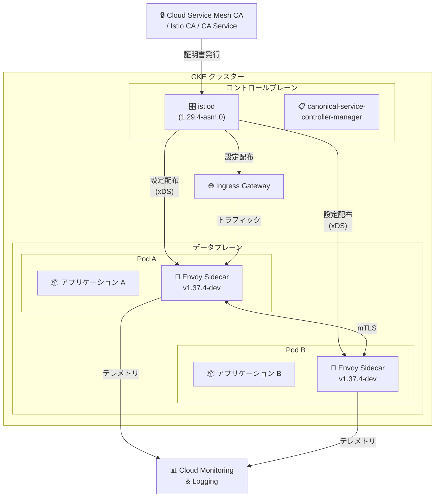

# Cloud Service Mesh: バージョン 1.29.4-asm.0 リリース

**リリース日**: 2026-06-09

**サービス**: Cloud Service Mesh

**機能**: In-cluster Cloud Service Mesh 1.29.4-asm.0

**ステータス**: GA

📊 [このアップデートのインフォグラフィックを見る](https://takech9203.github.io/google-cloud-news-summary/20260609-cloud-service-mesh-1-29-4-asm-0.html)

## 概要

Cloud Service Mesh のインクラスター版として、バージョン 1.29.4-asm.0 がリリースされた。本バージョンは Istio 1.29.4 の機能を基盤としており、Cloud Service Mesh がサポートする機能リストに準拠した形で利用可能である。データプレーンには Envoy v1.37.4-dev が採用されている。

本リリースは、GKE クラスター上でサービスメッシュを運用する組織に向けた安定性とセキュリティの向上を目的としたパッチリリースである。asmcli ツールを使用して新規インストールまたはアップグレードが可能であり、GKE Standard クラスター（Google Cloud 上）および Google Cloud 外の Kubernetes 環境（GKE Enterprise on-premises、GKE on AWS、Amazon EKS、Microsoft AKS）で利用できる。

なお、同時に Cloud Service Mesh 1.26 のインクラスター版がサポート終了となったことも発表されている。1.26 を使用中のユーザーは、サポートされているバージョンへの早急なアップグレードが推奨される。

**アップデート前の課題**

- 以前のパッチバージョン（1.29.3-asm.x 以前）に含まれていたバグやセキュリティの問題が存在していた
- Istio 1.29.4 で修正されたセキュリティ脆弱性への対応が未適用の状態であった
- Cloud Service Mesh 1.26 ユーザーはサポートされていたが、セキュリティパッチの提供が限定的であった

**アップデート後の改善**

- Istio 1.29.4 に含まれるバグ修正とセキュリティパッチが適用された
- Envoy v1.37.4-dev による最新のプロキシ機能とパフォーマンス改善が利用可能になった
- ENABLE_AUTO_SNI フラグが引き続きサポートされ、レガシー動作との互換性が維持されている

## アーキテクチャ図



Cloud Service Mesh 1.29.4-asm.0 のインクラスター構成を示す。istiod コントロールプレーンが Envoy サイドカープロキシに xDS 経由で設定を配布し、サービス間通信は mTLS で暗号化される。

## サービスアップデートの詳細

### 主要機能

1. **Istio 1.29.4 ベースの機能セット**
   - Cloud Service Mesh がサポートする機能リストに準拠した Istio 1.29.4 の機能を利用可能
   - トラフィック管理（カナリアデプロイ、Blue/Green デプロイ、負荷分散、サーキットブレーカー）
   - セキュリティ（mTLS、認証ポリシー、認可ポリシー、JWT 認証）
   - オブザーバビリティ（Cloud Monitoring、Cloud Logging、Cloud Trace との統合）

2. **Envoy v1.37.4-dev データプレーン**
   - 最新の Envoy プロキシバージョンを採用
   - パフォーマンスとセキュリティの改善を含む

3. **ENABLE_AUTO_SNI フラグの継続サポート**
   - レガシー動作との互換性を維持するため、ENABLE_AUTO_SNI フラグが引き続きサポート
   - 既存の設定を変更することなくアップグレードが可能

4. **複数環境での対応**
   - GKE Standard クラスター（Google Cloud 上）
   - Google Distributed Cloud（VMware / ベアメタル）
   - GKE on AWS
   - Amazon EKS
   - Microsoft AKS

### 非サポート項目（環境変数、ラベル、アノテーション）

以下の環境変数、ラベル、アノテーションは Cloud Service Mesh 1.29.4-asm.0 ではサポートされない:

| カテゴリ | 非サポート項目 | 説明 |
|----------|---------------|------|
| パイロット設定 | `PILOT_IGNORE_RESOURCES` / `PILOT_INCLUDE_RESOURCES` | リソースフィルタリング制御 |
| パイロット設定 | `PILOT_SPAWN_UPSTREAM_SPAN_FOR_GATEWAY` | ゲートウェイ向けアップストリームスパン生成 |
| パイロット設定 | `PILOT_DNS_JITTER_DURATION` | DNS ジッター制御 |
| パイロット設定 | `PILOT_IP_AUTOALLOCATE_IPV4_PREFIX` / `PILOT_IP_AUTOALLOCATE_IPV6_PREFIX` | IP 自動割り当てプレフィックス |
| パイロット設定 | `PILOT_DNS_CARES_UDP_MAX_QUERIES` | DNS UDP クエリ上限 |
| リトライ制御 | `RetryIgnorePreviousHosts` | 以前のホストを無視するリトライ |
| テンプレート | `omit_empty_values` | 空の値の省略 |
| 接続制御 | `MAX_CONNECTIONS_PER_SOCKET_EVENT_LOOP` (値: 1) | ソケットイベントループ当たりの最大接続数 |
| サイドカー | `ENABLE_NATIVE_SIDECARS` (値: true) | ネイティブサイドカー機能 |
| セキュリティ | `ENABLE_WILDCARD_HOST_SERVICE_ENTRIES_FOR_TLS` | ワイルドカードホスト ServiceEntry（TLS 向け） |
| セキュリティ | `BLOCKED_CIDRS_IN_JWKS_URIS` | JWKS URI の CIDR ブロック |
| セキュリティ | `ENABLE_DEBUG_ENDPOINT_AUTH` | デバッグエンドポイント認証 |
| メトリクス | `DISABLE_TRACK_REMAINING_CB_METRICS` | サーキットブレーカー残メトリクスの追跡無効化 |
| ゲートウェイ | `gateway.istio.io/tls-cipher-suites` | TLS 暗号スイートの指定 |
| ProxyConfig | `fileFlushMinSizeKB` / `fileFlushInterval` | ファイルフラッシュ設定 |
| ローカリティ | `topology.istio.io/locality` | ローカリティアノテーション |
| ProxyConfig | `statsCompression` | 統計圧縮オプション |
| アノテーション | `proxy.istio.io/config`（メトリック圧縮オーバーライド） | メトリック圧縮設定の上書き |

### その他の非サポート機能

- **Envoy 統計の遅延サブセット作成**: Istio の実験的機能である Envoy 統計のレイジーサブセット作成はサポートされない
- **Telemetry CRD の formatter オプション**: `spec.tracing[].customTags` フィールド内の formatter オプション（`telemetry.istio.io`）は非サポート
- **istiod_remote_cluster_sync_status メトリクス**: istiod コントロールプレーンのメトリクスエンドポイント（ポート 15014 `/metrics`）で公開される Prometheus ゲージメトリクスは非サポート
- **Proxyless gRPC クライアント向け**:
  - `LEAST_REQUEST` ロードバランシングポリシーの設定（DestinationRule の `spec.trafficPolicy.loadBalancer.simple` フィールド）
  - `http2MaxRequests` サーキットブレーカーの設定（DestinationRule の `spec.trafficPolicy.connectionPool.http.http2MaxRequests` フィールド）

## 技術仕様

### バージョン情報

| 項目 | 詳細 |
|------|------|
| Cloud Service Mesh バージョン | 1.29.4-asm.0 |
| ベース Istio バージョン | 1.29.4 |
| Envoy バージョン | v1.37.4-dev |
| インストールツール | asmcli |
| コントロールプレーン | istiod（インクラスター） |
| デプロイ方式 | サイドカーパターン |

### クラスター要件

| 項目 | 要件 |
|------|------|
| GKE クラスタータイプ | Standard（Autopilot はマネージド版のみ対応） |
| マシンタイプ | 4 vCPU 以上（例: e2-standard-4） |
| 最小ノード数 | 4 vCPU の場合は 2 ノード以上、8 vCPU の場合は 1 ノード以上 |
| 最小 vCPU | 合計 8 vCPU |
| Workload Identity | 必須 |
| プライベートクラスター | ポート 15017 の開放が必要 |

### サポートされるプロトコル

| プロトコル | サポート状況 |
|-----------|-------------|
| IPv4 | サポート |
| IPv6 | サポート |
| HTTP/1.1 | サポート |
| HTTP/2 | サポート |
| gRPC | サポート |
| TCP バイトストリーム | サポート（メトリクスなし） |
| DualStack | サポート |

## 設定方法

### 前提条件

1. GKE Standard クラスターが稼働していること（4 vCPU 以上のマシンタイプ）
2. GKE Workload Identity が有効化されていること
3. クラスターがフリートに登録されていること
4. `gcloud` CLI がインストール・認証済みであること
5. `kubectl` がクラスターに接続可能であること

### 手順

#### ステップ 1: asmcli のダウンロード

```bash
# 最新の asmcli をダウンロード
curl https://storage.googleapis.com/csm-artifacts/asm/asmcli > asmcli

# 実行権限を付与
chmod +x asmcli
```

#### ステップ 2: gcloud の設定

```bash
# 認証
gcloud auth login --project PROJECT_ID

# kubectl の設定
gcloud container clusters get-credentials CLUSTER_NAME \
  --zone CLUSTER_LOCATION \
  --project PROJECT_ID
```

#### ステップ 3: Cloud Service Mesh のインストール（Google Cloud 上の GKE）

```bash
./asmcli install \
  --project_id PROJECT_ID \
  --cluster_name CLUSTER_NAME \
  --cluster_location CLUSTER_LOCATION \
  --fleet_id FLEET_PROJECT_ID \
  --output_dir DIR_PATH \
  --enable_all \
  --ca mesh_ca
```

#### ステップ 4: Cloud Service Mesh のインストール（Google Cloud 外）

```bash
./asmcli install \
  --fleet_id FLEET_PROJECT_ID \
  --kubeconfig KUBECONFIG_FILE \
  --output_dir DIR_PATH \
  --platform multicloud \
  --enable_all \
  --ca mesh_ca \
  --custom_overlay OVERLAY_FILE
```

#### ステップ 5: ゲートウェイのアップグレード（既存環境の場合）

既にゲートウェイがデプロイされている場合は、[Install and upgrade gateways](https://docs.cloud.google.com/service-mesh/docs/operate-and-maintain/gateways#in-place_upgrades) ガイドに従ってゲートウェイもアップグレードする。

#### ステップ 6: ワークロードの再デプロイ

サイドカープロキシを注入するため、ワークロードを再デプロイする:

```bash
# namespace にラベルを付与
kubectl label namespace NAMESPACE istio-injection=enabled --overwrite

# ワークロードのローリング再起動
kubectl rollout restart deployment -n NAMESPACE
```

## メリット

### ビジネス面

- **セキュリティ強化**: 最新のセキュリティパッチが適用され、既知の脆弱性から保護される
- **サポート継続**: 1.26 のサポート終了に伴い、サポートされるバージョンへの移行により SLA が維持される
- **マルチクラウド対応**: Google Cloud 外の環境でも同一のサービスメッシュ機能を利用可能

### 技術面

- **Istio 1.29.4 互換**: 最新の Istio コミュニティの修正を取り込んだ安定版
- **Envoy v1.37.4-dev**: 最新のデータプレーンによるパフォーマンスとセキュリティの向上
- **レガシー互換性**: ENABLE_AUTO_SNI フラグの継続サポートにより、既存設定からの移行が容易
- **フリート統合**: GKE Enterprise のフリート機能と統合され、マルチクラスター管理が可能

## デメリット・制約事項

### 制限事項

- **GKE Autopilot 非対応**: インクラスター版は GKE Standard のみ対応。Autopilot クラスターではマネージド Cloud Service Mesh を使用する必要がある
- **多数の非サポート環境変数**: 上記の通り、多くの Istio の環境変数・ラベル・アノテーションが利用不可
- **ネイティブサイドカー非対応**: `ENABLE_NATIVE_SIDECARS` が非サポートのため、Kubernetes 1.28+ のネイティブサイドカーコンテナ機能は利用不可
- **Proxyless gRPC の制限**: LEAST_REQUEST ロードバランシングと http2MaxRequests サーキットブレーカーが利用不可
- **フリート登録必須**: すべての Cloud Service Mesh クラスターが同一フリートに登録されている必要がある
- **asmcli は Linux のみ**: インストールツールの asmcli は Linux OS でのみ動作

### 考慮すべき点

- アップグレード時にゲートウェイの個別アップグレードが必要になる場合がある
- `PILOT_DNS_JITTER_DURATION` が非サポートのため、DNS 解決のジッター制御が標準動作に固定される
- `topology.istio.io/locality` が非サポートのため、ローカリティベースのルーティングをアノテーションで個別に制御することは不可（DestinationRule でのローカリティ負荷分散は引き続きサポート）
- Telemetry CRD の customTags における formatter が使えないため、トレーシングタグのカスタムフォーマットに制約がある

## ユースケース

### ユースケース 1: マイクロサービスのゼロトラスト通信

**シナリオ**: 複数のマイクロサービスで構成された e コマースアプリケーションにおいて、サービス間通信を暗号化し、認証・認可を適用する。

**実装例**:
```yaml
apiVersion: security.istio.io/v1beta1
kind: PeerAuthentication
metadata:
  name: default
  namespace: ecommerce
spec:
  mtls:
    mode: STRICT
---
apiVersion: security.istio.io/v1beta1
kind: AuthorizationPolicy
metadata:
  name: order-service-policy
  namespace: ecommerce
spec:
  selector:
    matchLabels:
      app: order-service
  rules:
  - from:
    - source:
        principals: ["cluster.local/ns/ecommerce/sa/checkout-service"]
```

**効果**: サービス間通信が mTLS で暗号化され、認可されたサービスのみが通信可能になるゼロトラスト環境が実現される。

### ユースケース 2: カナリアデプロイによる安全なリリース

**シナリオ**: 新バージョンのサービスを段階的にロールアウトし、問題が検出された場合に即座にロールバックする。

**実装例**:
```yaml
apiVersion: networking.istio.io/v1beta1
kind: VirtualService
metadata:
  name: payment-service
spec:
  hosts:
  - payment-service
  http:
  - route:
    - destination:
        host: payment-service
        subset: v1
      weight: 90
    - destination:
        host: payment-service
        subset: v2
      weight: 10
```

**効果**: トラフィックの 10% のみを新バージョンに振り分け、メトリクスを監視しながら段階的に割合を増やすことで、リリースリスクを最小化できる。

### ユースケース 3: マルチクラスター環境でのサービスメッシュ統合

**シナリオ**: 複数リージョンの GKE クラスターでサービスメッシュを統合し、リージョン障害時のフェイルオーバーを実現する。

**効果**: フリートに登録されたクラスター間でサービスディスカバリが統合され、単一リージョン障害時に他リージョンのサービスにトラフィックが自動的にフェイルオーバーされる。

## 料金

Cloud Service Mesh の料金は GKE Enterprise ライセンスに含まれる。詳細は [Cloud Service Mesh 料金ページ](https://cloud.google.com/service-mesh/pricing) を参照。

## 関連サービス・機能

- **Google Kubernetes Engine (GKE)**: Cloud Service Mesh の実行基盤。GKE Standard クラスター上にインクラスターコントロールプレーンをデプロイする
- **GKE Enterprise**: フリート管理、マルチクラスター対応を含む Enterprise 機能の一部として Cloud Service Mesh が提供される
- **Cloud Monitoring / Cloud Logging / Cloud Trace**: サービスメッシュのオブザーバビリティスタック。メトリクス、ログ、トレースの自動収集
- **Certificate Authority Service**: Cloud Service Mesh CA の代替として使用可能な証明書管理サービス
- **Cloud IAP (Identity-Aware Proxy)**: Cloud Service Mesh と統合してエンドユーザー認証を提供
- **Managed Cloud Service Mesh**: インクラスター版の代替として、Google がコントロールプレーンを管理するマネージド版。GKE Autopilot クラスターではこちらを使用

## 参考リンク

- 📊 [インフォグラフィック](https://takech9203.github.io/google-cloud-news-summary/20260609-cloud-service-mesh-1-29-4-asm-0.html)
- [公式リリースノート](https://docs.cloud.google.com/release-notes#June_09_2026)
- [Cloud Service Mesh リリースノート](https://docs.cloud.google.com/service-mesh/docs/release-notes)
- [Istio 1.29.4 リリースノート](https://istio.io/latest/news/releases/1.29.x/announcing-1.29.4/)
- [Cloud Service Mesh ドキュメント](https://cloud.google.com/service-mesh/docs)
- [In-cluster サポート機能一覧](https://docs.cloud.google.com/service-mesh/docs/supported-features-in-cluster)
- [インストールガイド（GKE）](https://docs.cloud.google.com/service-mesh/legacy/in-cluster/install-in-cluster-cloud-service-mesh)
- [アップグレードガイド](https://docs.cloud.google.com/service-mesh/docs/upgrade/upgrade)
- [料金ページ](https://cloud.google.com/service-mesh/pricing)

## まとめ

Cloud Service Mesh 1.29.4-asm.0 は、Istio 1.29.4 をベースとしたセキュリティ・安定性向上のためのパッチリリースである。特に Cloud Service Mesh 1.26 がサポート終了となったため、該当バージョンを使用中のユーザーは早急にアップグレードを計画すべきである。非サポート項目（特にネイティブサイドカー、Proxyless gRPC の一部機能）について事前に影響を確認し、asmcli を使用した標準的なアップグレード手順に従って移行することを推奨する。

---

**タグ**: #CloudServiceMesh #Istio #ServiceMesh #Envoy #Kubernetes #Networking #GKE #mTLS #Security
