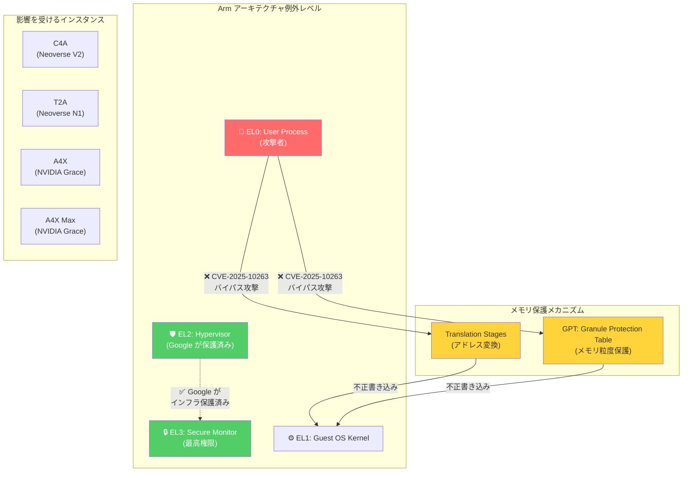

# Compute Engine: セキュリティ脆弱性 CVE-2025-10263 (Arm プロセッサ)

**リリース日**: 2026-06-09

**サービス**: Compute Engine

**機能**: セキュリティ脆弱性対応 (GCP-2026-036)

**ステータス**: Security

📊 [このアップデートのインフォグラフィックを見る](https://takech9203.github.io/google-cloud-news-summary/20260609-compute-engine-cve-2025-10263-arm.html)

## 概要

ARM が Arm コアファミリーに影響するアーキテクチャレベルの脆弱性 CVE-2025-10263 を公表した。この脆弱性は、特定の条件下でアドレス変換ステージ (Translation Stages) または GPT (Granule Protection Table) 保護をバイパスすることを可能にし、低い例外レベル (Exception Level) の攻撃者が高い例外レベルが所有するメモリに書き込みを行うことで、権限昇格を実現できる。メモリの読み取りには影響しない。

Google は VM 間攻撃およびVM からハイパーバイザーへの攻撃に対してインフラストラクチャを保護済みだが、ゲスト環境内での脅威 (プロセス間攻撃やプロセスからカーネルへの攻撃) に対しては、ユーザーが OS ベンダーからゲスト OS レベルのパッチを取得して適用する必要がある。

影響を受ける Google Cloud の Arm コアファミリーは Neoverse V1、V2、N1 であり、対象のマシンシリーズは C4A、T2A、A4X、A4X Max となる。Container-Optimized OS 向けのゲスト緩和策は現在進行中である。

**アップデート前の課題**

- Arm コアの一部ファミリーにおいて、Translation Stages または GPT 保護のバイパスが可能な状態であった
- 低い例外レベルからの不正なメモリ書き込みによる権限昇格のリスクが存在していた
- ゲスト OS 内でのプロセス間攻撃やプロセスからカーネルへの攻撃に対する防御が不十分であった

**アップデート後の改善**

- Google インフラストラクチャレベルでの VM 間およびハイパーバイザー攻撃への対策が完了
- セキュリティ情報の公開により、ユーザーが適切なゲスト OS パッチを適用可能になった
- Container-Optimized OS 向けのパッチが準備中であり、提供後は自動的に保護が強化される

## アーキテクチャ図



この図は Arm の例外レベル階層における CVE-2025-10263 の攻撃経路を示している。攻撃者は EL0 (ユーザープロセス) から Translation Stages または GPT 保護をバイパスし、EL1 (カーネル) のメモリに不正に書き込むことで権限昇格を達成する。Google はハイパーバイザー (EL2) レベルでの保護を完了しているが、ゲスト OS 内の保護にはユーザーによるパッチ適用が必要である。

## サービスアップデートの詳細

### 主要機能

1. **脆弱性の内容: Translation Stages / GPT 保護のバイパス**
   - Arm コアの一部ファミリーにおけるアーキテクチャレベルの脆弱性
   - 低い例外レベル (EL0/EL1) から高い例外レベルが所有するメモリへの不正な書き込みが可能
   - メモリの読み取りには影響しない (書き込みのみ)
   - 権限昇格 (Privilege Escalation) の実現が可能

2. **Google インフラストラクチャでの対策完了**
   - VM 間攻撃 (VM-to-VM) への対策済み
   - VM からハイパーバイザーへの攻撃 (VM-to-Hypervisor) への対策済み
   - ハイパーバイザーレベルでの保護によりテナント間の分離を維持

3. **ゲスト OS レベルでの対策が必要**
   - プロセス間攻撃 (Process-to-Process) への防御
   - プロセスからカーネルへの攻撃 (Process-to-Kernel) への防御
   - OS ベンダーからのパッチ取得が必須
   - Container-Optimized OS のパッチは準備中

## 技術仕様

### 影響を受けるコアファミリーとマシンシリーズ

| Arm コア | マシンシリーズ | プロセッサ | 用途 |
|----------|---------------|-----------|------|
| Neoverse V2 | C4A | Google Axion | 汎用コンピューティング (最大 72 vCPU / 576 GB) |
| Neoverse N1 | T2A | Ampere Altra | スケールアウトワークロード (最大 48 vCPU) |
| NVIDIA Grace (Arm) | A4X | NVIDIA GB200 Superchip | ML/HPC (最大 140 vCPU / 884 GB) |
| NVIDIA Grace (Arm) | A4X Max | NVIDIA GB300 Superchip | ML/HPC (最大 144 vCPU / 960 GB) |

### 脆弱性の技術的詳細

| 項目 | 詳細 |
|------|------|
| CVE ID | CVE-2025-10263 |
| セキュリティ情報 | GCP-2026-036 |
| 深刻度 | High |
| 攻撃ベクトル | ローカル (ゲスト OS 内) |
| 攻撃の種類 | 権限昇格 (Privilege Escalation) |
| 影響範囲 | メモリの書き込みのみ (読み取りは影響なし) |
| Google インフラ対策 | 完了 (VM 間/ハイパーバイザー保護) |
| ゲスト OS 対策 | ユーザーによるパッチ適用が必要 |

### GPT (Granule Protection Table) について

GPT は Arm アーキテクチャにおけるメモリ保護メカニズムの一つで、物理メモリをグラニュール単位で保護し、各メモリ領域にアクセス権限を設定する。Arm Realm Management Extension (RME) の一部として、Confidential Computing のようなセキュリティ機能の基盤となっている。

## 対応方法

### 前提条件

1. 影響を受けるマシンシリーズ (C4A、T2A、A4X、A4X Max) で Arm ベースのインスタンスを実行している
2. ゲスト OS のパッチ管理体制が整っている

### 手順

#### ステップ 1: 影響を受けるインスタンスの特定

```bash
# C4A、T2A、A4X、A4X Max インスタンスを一覧表示
gcloud compute instances list \
  --filter="machineType:(c4a-* OR t2a-* OR a4x-*)" \
  --format="table(name,zone,machineType,status)"
```

プロジェクト内で Arm ベースのインスタンスを使用しているかどうかを確認する。

#### ステップ 2: ゲスト OS のパッチ確認と適用

```bash
# Container-Optimized OS の場合、COS リリースノートで最新パッチを確認
# https://docs.cloud.google.com/container-optimized-os/docs/release-notes

# Debian/Ubuntu の場合
sudo apt update && sudo apt upgrade -y

# RHEL/CentOS の場合
sudo yum update -y
```

OS ベンダーが CVE-2025-10263 に対応するパッチをリリースしたら、速やかに適用する。

#### ステップ 3: OS パッチ管理の自動化 (推奨)

```bash
# OS Patch Management を使用してパッチジョブを作成
gcloud compute os-config patch-jobs execute \
  --instance-filter-names="zones/us-central1-a/instances/my-arm-instance" \
  --description="CVE-2025-10263 patch" \
  --reboot-config=DEFAULT
```

Google Cloud の OS Patch Management を活用して、パッチ適用の自動化を推奨する。

## メリット

### ビジネス面

- **テナント分離の維持**: Google インフラレベルでの対策により、マルチテナント環境での他顧客からの攻撃リスクが排除されている
- **段階的な対応が可能**: ゲスト OS パッチの適用を計画的に実施でき、即時のサービス停止は不要

### 技術面

- **VM 間分離の保証**: ハイパーバイザーレベルでの保護により、脆弱性を悪用した VM エスケープは不可能
- **書き込みのみの影響**: メモリ読み取りは影響を受けないため、情報漏洩のリスクは限定的

## デメリット・制約事項

### 制限事項

- ゲスト OS 内での権限昇格はユーザーが対策する必要がある
- Container-Optimized OS のパッチはまだリリースされていない (準備中)
- パッチ適用にはインスタンスの再起動が必要になる可能性がある

### 考慮すべき点

- マルチテナントのコンテナワークロードでは、コンテナエスケープと組み合わせた攻撃シナリオに注意
- GKE で Arm ノードプール (T2A/C4A) を使用している場合、ノードの更新が必要
- パッチが利用可能になるまでの間、信頼できないコードの実行を制限することを検討
- Confidential Computing を使用しているワークロードでは追加の評価が必要

## ユースケース

### ユースケース 1: GKE Arm ノードプールの保護

**シナリオ**: GKE クラスタで T2A または C4A ノードプールを使用してコンテナワークロードを実行している場合

**実装例**:
```bash
# GKE ノードプールのイメージを最新に更新
gcloud container clusters upgrade my-cluster \
  --node-pool=arm-pool \
  --cluster-version=latest \
  --location=us-central1

# ノードの自動アップグレードを有効化
gcloud container node-pools update arm-pool \
  --cluster=my-cluster \
  --enable-autoupgrade \
  --location=us-central1
```

**効果**: COS パッチが利用可能になり次第、ノードが自動的に更新され、ゲスト OS レベルの保護が適用される

### ユースケース 2: ML/HPC ワークロード (A4X) の保護

**シナリオ**: A4X / A4X Max インスタンスで機械学習トレーニングや HPC ワークロードを実行している場合

**効果**: OS パッチの適用により、マルチユーザー環境での権限昇格リスクを排除。特に共有クラスタでは重要な対策となる

## 料金

本セキュリティアップデートに伴う追加料金は発生しない。パッチ適用のためのインスタンス再起動中のダウンタイムについては、ワークロードの可用性設計に応じて考慮する必要がある。

## 利用可能リージョン

影響を受けるマシンシリーズが利用可能な主要リージョン:

| マシンシリーズ | 主要リージョン |
|---------------|---------------|
| C4A | us-central1, us-east1, us-east4, europe-west1, asia-east1 など |
| T2A | us-central1 (b, f ゾーン) |
| A4X | us-central1-a |
| A4X Max | us-central1-b |

全リージョンの詳細は [Compute Engine リージョンとゾーン](https://cloud.google.com/compute/docs/regions-zones) を参照。

## 関連サービス・機能

- **Container-Optimized OS**: Arm ベース COS イメージのパッチが準備中。パッチ提供後は COS リリースノートで通知される
- **GKE (Google Kubernetes Engine)**: Arm ノードプール (T2A/C4A) を使用している場合、ノードイメージの更新が必要
- **OS Patch Management**: ゲスト OS パッチの自動適用を管理するためのサービス
- **Security Command Center**: 脆弱性のあるインスタンスの検出と追跡に活用可能
- **Cloud Monitoring**: パッチ適用状況のモニタリングとアラート設定に使用

## 参考リンク

- 📊 [インフォグラフィック](https://takech9203.github.io/google-cloud-news-summary/20260609-compute-engine-cve-2025-10263-arm.html)
- [公式リリースノート](https://docs.google.com/release-notes#June_09_2026)
- [Compute Engine セキュリティ情報 GCP-2026-036](https://docs.cloud.google.com/compute/docs/security-bulletins#gcp-2026-036)
- [Google Cloud セキュリティ情報](https://docs.cloud.google.com/support/bulletins)
- [CVE-2025-10263](https://cve.mitre.org/cgi-bin/cvename.cgi?name=CVE-2025-10263)
- [Compute Engine の Arm インスタンス](https://docs.cloud.google.com/compute/docs/instances/arm-on-compute)
- [Container-Optimized OS リリースノート](https://docs.cloud.google.com/container-optimized-os/docs/release-notes)
- [OS Patch Management](https://cloud.google.com/compute/docs/os-patch-management)

## まとめ

CVE-2025-10263 は Arm アーキテクチャの Translation Stages / GPT 保護に影響する深刻度 High の脆弱性であり、Google Cloud では C4A、T2A、A4X、A4X Max の全 Arm ベースインスタンスが対象となる。Google はインフラレベルでの VM 間保護を完了しているため、直ちにサービスを停止する必要はないが、ゲスト OS 内での権限昇格を防ぐためにOS ベンダーからのパッチを早急に適用することを強く推奨する。特に、マルチテナントコンテナ環境や信頼できないコードを実行する環境では、パッチが利用可能になり次第、速やかに適用すべきである。

---

**タグ**: #ComputeEngine #Security #Arm #CVE-2025-10263 #GCP-2026-036 #NeoVerseV2 #NeoVerseN1 #C4A #T2A #A4X #PrivilegeEscalation #GPT #TranslationStages
