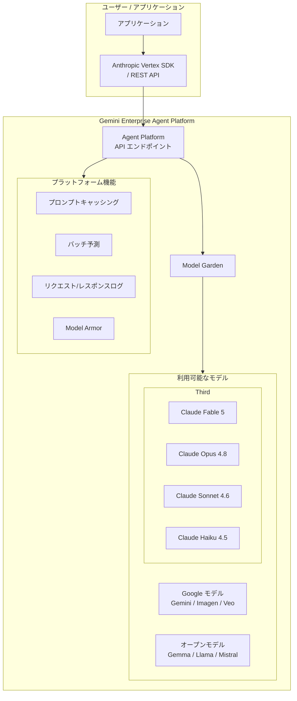

# Gemini Enterprise Agent Platform: Claude Fable 5 が Model Garden で利用可能に

**リリース日**: 2026-06-09

**サービス**: Gemini Enterprise Agent Platform

**機能**: Anthropic の Claude Fable 5 が Model Garden で利用可能に

**ステータス**: Feature

[このアップデートのインフォグラフィックを見る](https://takech9203.github.io/google-cloud-news-summary/20260609-gemini-enterprise-claude-fable-5.html)

## 概要

Anthropic の最新モデル「Claude Fable 5」が Google Cloud の Gemini Enterprise Agent Platform 上の Model Garden で利用可能になりました。Model Garden はサードパーティモデルをマネージド API として提供するプラットフォームであり、ユーザーはインフラストラクチャの管理なしに Claude Fable 5 を利用できます。

Model Garden は Google Cloud 上で 200 以上の AI/ML モデルを一箇所で発見、テスト、カスタマイズ、デプロイできるモデルライブラリです。サードパーティモデルは Model as a Service (MaaS) として提供され、サーバーレスで利用できるため、プロビジョニングやインフラ管理が不要です。

Claude Fable 5 の追加により、エンタープライズユーザーは Anthropic の最新世代のモデルを Google Cloud のセキュリティ、コンプライアンス、データガバナンスの枠組み内で活用できるようになります。

**アップデート前の課題**

- Claude Fable 5 を利用するには Anthropic の API を直接使用する必要があり、Google Cloud のセキュリティ境界外でのデータ処理となっていた
- 既存の Google Cloud ワークフローとの統合に追加の設定や中間レイヤーが必要だった
- Google Cloud の IAM、監査ログ、VPC Service Controls などのエンタープライズ機能を活用できなかった

**アップデート後の改善**

- Gemini Enterprise Agent Platform のエンドポイントを通じて Claude Fable 5 に直接リクエストを送信可能
- Google Cloud のセキュリティ基盤（IAM、Model Armor、Security Command Center）内で利用可能
- 従量課金（Pay-as-you-go）または Provisioned Throughput による固定料金での利用が選択可能
- プロンプトキャッシング、バッチ予測、ストリーミング、グローバルエンドポイントなどの最適化機能を活用可能

## アーキテクチャ図



Model Garden がサードパーティモデルへの統一されたアクセスレイヤーとして機能し、Google Cloud のエンタープライズ機能と組み合わせてマネージド API を提供する構成を示しています。

## サービスアップデートの詳細

### 主要機能

1. **マネージド API としての提供**
   - サーバーレスアーキテクチャにより、インフラのプロビジョニングや管理が不要
   - Gemini Enterprise Agent Platform のエンドポイントを通じて直接リクエストを送信
   - ストリーミングレスポンス（Server-Sent Events）に対応し、レイテンシの体感を低減

2. **エンタープライズセキュリティとの統合**
   - FedRAMP High 要件に準拠
   - Google Cloud の IAM によるアクセス制御
   - Model Armor によるプロンプトインジェクション等の AI 脅威からの保護
   - 30 日間のリクエスト/レスポンスログ記録に対応

3. **パフォーマンス最適化機能**
   - グローバルエンドポイントによる高可用性
   - プロンプトキャッシング（柔軟な TTL 設定）
   - バッチ予測による大量リクエストの効率的処理
   - Provisioned Throughput によるピーク時の安定したパフォーマンス

## 技術仕様

### モデルアクセス方法

| 項目 | 詳細 |
|------|------|
| プラットフォーム | Gemini Enterprise Agent Platform (旧 Vertex AI) |
| 提供形態 | Model as a Service (MaaS) - マネージド API |
| SDK | Anthropic Vertex SDK (Python / TypeScript) |
| 認証 | Google Cloud IAM / Application Default Credentials |
| ストリーミング | Server-Sent Events (SSE) 対応 |
| コンテキストウィンドウ | 最大 1M トークン（プレビュー） |

### 利用可能な Claude モデルファミリー

| モデル | モデル ID |
|------|------|
| Claude Opus 4.8 | `claude-opus-4-8` |
| Claude Opus 4.7 | `claude-opus-4-7` |
| Claude Opus 4.6 | `claude-opus-4-6` |
| Claude Sonnet 4.6 | `claude-sonnet-4-6` |
| Claude Haiku 4.5 | `claude-haiku-4-5` |
| Claude Fable 5 | (リリースノート参照) |

## 設定方法

### 前提条件

1. Google Cloud プロジェクトで Agent Platform API (`aiplatform.googleapis.com`) が有効であること
2. Model Garden で Claude Fable 5 モデルを有効化していること
3. パートナーモデルの利用に必要な IAM 権限が付与されていること

### 手順

#### ステップ 1: SDK のインストール

```bash
pip3 install --upgrade google-cloud-aiplatform
pip3 install -U 'anthropic[vertex]'
```

#### ステップ 2: 認証の設定

```bash
gcloud auth application-default login
```

#### ステップ 3: Python SDK を使用したリクエスト送信

```python
from anthropic import AnthropicVertex

# プロジェクト ID とリージョンを設定
PROJECT_ID = "your-project-id"

client = AnthropicVertex(project_id=PROJECT_ID, region="us-east5")

message = client.messages.create(
    model="claude-fable-5",  # モデル ID はドキュメントで確認
    max_tokens=1024,
    messages=[
        {
            "role": "user",
            "content": "あなたの質問をここに入力",
        }
    ],
)

print(message.model_dump_json(indent=2))
```

**注意**: 上記のモデル ID (`claude-fable-5`) は想定される名称です。正式なモデル ID は公式ドキュメントで確認してください。

#### ステップ 4: ストリーミングレスポンスの使用（オプション）

```python
from anthropic import AnthropicVertex

client = AnthropicVertex(project_id=PROJECT_ID, region="us-east5")

with client.messages.stream(
    model="claude-fable-5",
    max_tokens=1024,
    messages=[
        {
            "role": "user",
            "content": "あなたの質問をここに入力",
        }
    ],
) as stream:
    for text in stream.text_stream:
        print(text, end="", flush=True)
```

## メリット

### ビジネス面

- **統合されたプラットフォーム**: Google Cloud の既存ワークフローに Claude Fable 5 をシームレスに統合でき、マルチモデル戦略の実現が容易
- **コスト最適化**: 従量課金と Provisioned Throughput の選択により、ワークロードに応じた最適なコスト構造を実現
- **コンプライアンス対応**: FedRAMP High 準拠環境内でサードパーティモデルを利用可能

### 技術面

- **サーバーレス運用**: モデルのデプロイやスケーリングを Google Cloud が管理するため、ML Ops の負担を軽減
- **高可用性**: グローバルエンドポイントにより、リージョン障害時にも安定したサービス提供
- **エコシステム統合**: BigQuery、Agent Engine、Colab Enterprise など Google Cloud サービスとの連携が容易

## デメリット・制約事項

### 制限事項

- 画像ファイルの最大サイズは 5 MB、1 リクエストあたり最大 100 画像
- 一部のリセラー経由の請求アカウントでは Terms of Service の受諾や Claude モデルの有効化ができない場合がある
- Claude Fable 5 の具体的な制限事項については公式ドキュメントを参照

### 考慮すべき点

- リリース直後はリージョンの可用性が限定される可能性がある
- 料金体系はモデルによって異なるため、事前に Pricing ページで確認が必要
- Assured Workloads 境界内での利用には追加の例外設定が必要な場合がある

## ユースケース

### ユースケース 1: マルチモデルエージェントワークフロー

**シナリオ**: 企業が Agent Platform 上で複数のモデルを組み合わせたエージェントシステムを構築。タスクの複雑さに応じて Gemini と Claude Fable 5 を使い分ける。

**効果**: 各タスクに最適なモデルを選択することで、コストとパフォーマンスのバランスを最適化。単一プラットフォーム上での管理により運用効率が向上。

### ユースケース 2: エンタープライズ AI アプリケーション

**シナリオ**: 金融機関がコンプライアンス要件を満たしながら、Claude Fable 5 の高度な推論能力を活用して文書分析やリスク評価を実施。

**効果**: Google Cloud のセキュリティ基盤内でサードパーティ AI モデルを安全に利用でき、監査要件にも対応可能。

## 料金

Claude Fable 5 の具体的な料金については、公式の料金ページを参照してください。一般的に、Anthropic モデルの料金体系は以下の 2 つの方式があります。

| 課金方式 | 説明 |
|----------|------|
| 従量課金 (Pay-as-you-go) | 入力/出力トークン数に基づく課金 |
| Provisioned Throughput | 固定料金で専用容量を予約 |

詳細な料金情報: [Gemini Enterprise Agent Platform 料金ページ](https://docs.cloud.google.com/gemini-enterprise-agent-platform/pricing#partner-models)

## 利用可能リージョン

Claude モデルは複数のリージョンで利用可能です。サンプルコードでは `us-east5` が使用されていますが、グローバルエンドポイントやマルチリージョンエンドポイントも利用できます。Claude Fable 5 の具体的なリージョン可用性については公式ドキュメントを確認してください。

## 関連サービス・機能

- **Model Garden**: AI/ML モデルの発見、テスト、カスタマイズ、デプロイを一元管理するライブラリ
- **Agent Engine**: エージェントのデプロイとスケーリングを行うサーバーレス環境（Memory Bank、Sessions 機能付き）
- **Model Armor**: プロンプトインジェクションやツールポイズニングなどの AI 脅威からの保護
- **BigQuery**: Claude モデルと連携したデータ分析・インサイト抽出
- **Provisioned Throughput**: ピーク需要時のパフォーマンス安定化のための専用容量予約

## 参考リンク

- [インフォグラフィック](https://takech9203.github.io/google-cloud-news-summary/20260609-gemini-enterprise-claude-fable-5.html)
- [公式リリースノート](https://docs.cloud.google.com/release-notes#June_09_2026)
- [Model Garden - Claude モデル](https://cloud.google.com/products/model-garden/claude)
- [Claude モデルの使用方法](https://docs.cloud.google.com/gemini-enterprise-agent-platform/models/partner-models/claude/use-claude)
- [パートナーモデルの概要](https://docs.cloud.google.com/gemini-enterprise-agent-platform/models/partner-models/use-partner-models)
- [料金ページ](https://docs.cloud.google.com/gemini-enterprise-agent-platform/pricing#partner-models)

## まとめ

Claude Fable 5 の Model Garden での提供開始により、Google Cloud ユーザーは Anthropic の最新モデルをエンタープライズグレードのセキュリティとガバナンスの下で利用できるようになりました。Gemini Enterprise Agent Platform 上でマルチモデル戦略を推進する組織にとって、重要な選択肢の追加となります。利用を開始するには、Google Cloud コンソールの Model Garden から Claude Fable 5 を有効化し、Anthropic Vertex SDK を使用してリクエストを送信してください。

---

**タグ**: #GeminiEnterpriseAgentPlatform #ModelGarden #Claude #Anthropic #ClaudeFable5 #ThirdPartyModels #MaaS #AI #ML
