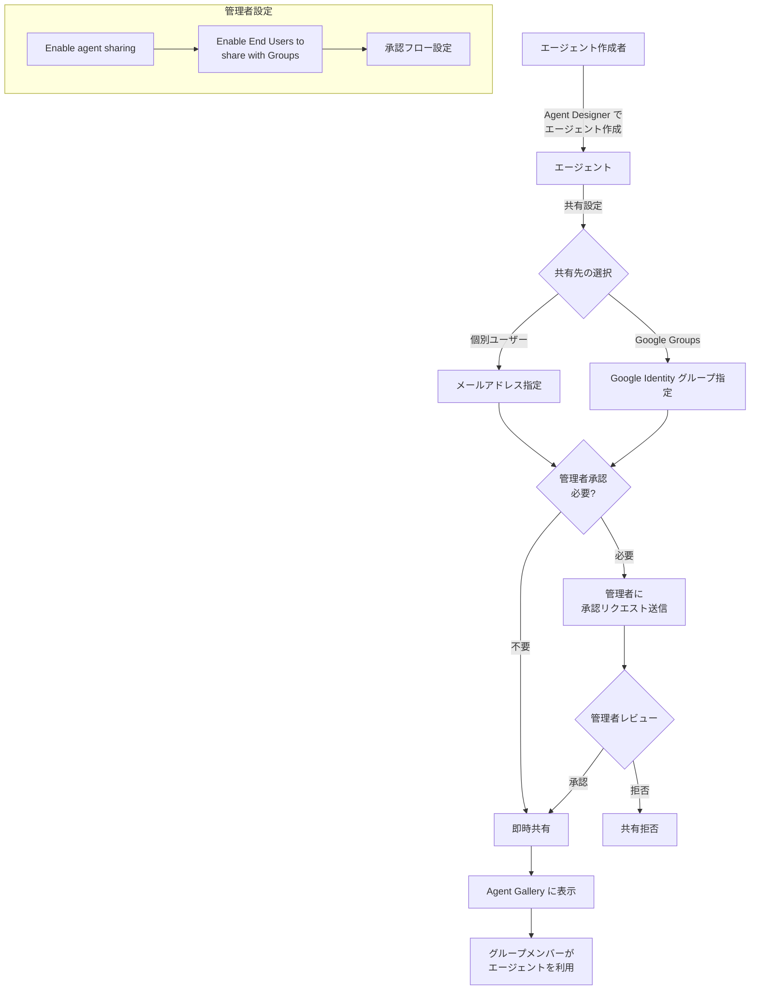

# Gemini Enterprise: Agent Designer で作成したエージェントを Google Groups と共有

**リリース日**: 2026-06-09

**サービス**: Gemini Enterprise

**機能**: Agent Designer エージェントの Google Groups 共有

**ステータス**: 一般提供 (GA)

[このアップデートのインフォグラフィックを見る](https://takech9203.github.io/google-cloud-news-summary/20260609-gemini-enterprise-share-agents-google-groups.html)

## 概要

Gemini Enterprise の Agent Designer で作成したエージェントを、Google Identity グループ（Google Groups）と共有できる機能が一般提供（GA）となりました。これにより、エンドユーザーは個別のメールアドレスだけでなく、組織内の Google Identity グループを指定してエージェントを共有できるようになります。

この機能を利用するには、Gemini Enterprise アプリの管理者が「Enable End Users to share with Groups (Google Identity only)」設定を有効にする必要があります。管理者は必要に応じて、共有時に管理者承認を要求するかどうかも制御できます。

Agent Designer はノーコード・ローコードでカスタムエージェントを作成できるプラットフォームであり、今回のグループ共有機能により、組織全体でのエージェント活用がより効率的になります。部門やチーム単位でのエージェント配布が容易になり、エンタープライズでのAIエージェント運用のスケーラビリティが大幅に向上します。

**アップデート前の課題**

- エージェントの共有は個別のメールアドレスを1つずつ指定する必要があり、大人数への配布が煩雑だった
- チームや部門単位でエージェントを共有するには、管理者がGoogle Cloud コンソールから手動で設定する必要があった
- エンドユーザー側からグループへの共有ができず、管理者に依頼するワークフローが必要だった

**アップデート後の改善**

- エンドユーザーが直接 Google Identity グループを指定してエージェントを共有可能になった
- 部門やプロジェクトチーム単位での一括共有が容易になった
- 管理者の承認フローと組み合わせることで、セキュリティを維持しながらスケーラブルな共有が実現された

## アーキテクチャ図



Agent Designer で作成されたエージェントが、Google Identity グループを通じて組織内のユーザーに共有されるまでのフローを示しています。管理者の設定によって、承認フローの有無が制御されます。

## サービスアップデートの詳細

### 主要機能

1. **Google Identity グループへのエージェント共有**
   - Agent Gallery ページからエージェントの共有ダイアログでグループのメールアドレスを入力可能
   - Google Identity グループのみサポート（Workforce Identity Federation グループは管理者のみ操作可能）
   - 共有リンクの生成も可能

2. **管理者による共有制御**
   - 「Enable End Users to share with Groups (Google Identity only)」トグルで機能の有効化/無効化
   - 管理者承認の要否を別途設定可能
   - 承認リクエストの確認・承認・拒否のワークフロー

3. **エージェントのライフサイクル管理**
   - ドラフト状態のエージェントは共有不可（作成完了後のみ共有可能）
   - エージェント所有者はいつでもアクセスリストからユーザーやグループを削除可能
   - 管理者もアクセスリストの追加・削除が随時可能

## 技術仕様

### 共有設定の制御フラグ

| 設定項目 | 説明 | デフォルト |
|----------|------|------------|
| Enable agent sharing | ユーザーによるエージェント共有の有効化 | 有効 |
| Enable agent sharing without admin approval | 管理者承認なしでの共有を許可 | 有効 |
| Enable End Users to share with Groups (Google Identity only) | グループへの共有を許可 | 無効 |

### 共有対象と権限

| 共有対象 | エンドユーザーが共有可能 | 管理者が共有可能 |
|----------|--------------------------|------------------|
| 個別ユーザー（メールアドレス） | はい | はい |
| Google Identity グループ | はい（管理者が有効化した場合） | はい |
| Workforce Identity Federation (WIF) | いいえ | はい |
| 全ユーザー | いいえ | はい |

### 必要な IAM ロール

```
# エージェント共有の承認に必要なロール
roles/discoveryengine.agentspaceAdmin  # Gemini Enterprise Admin
```

## 設定方法

### 前提条件

1. Gemini Enterprise アプリが作成済みであること
2. Agent Designer が有効化されていること
3. 管理者が「Enable End Users to share with Groups」設定を有効にしていること

### 手順

#### ステップ 1: 管理者がグループ共有を有効化

1. Google Cloud コンソールで **Gemini Enterprise > Apps** ページに移動
2. アプリ名をクリック
3. ナビゲーションメニューから **Features** を選択
4. 「End user features」セクションで以下を設定:
   - 「Enable agent sharing」を有効化
   - 「Enable End Users to share with Groups (Google Identity only)」を有効化
   - 必要に応じて「Enable agent sharing without admin approval」を設定

#### ステップ 2: エンドユーザーがエージェントを共有

1. Gemini Enterprise ウェブアプリを開く
2. **Agent Gallery** ページに移動
3. 「Your Agents」セクションで共有したいエージェントを探す
4. アクションメニュー（3点メニュー）から **Share** を選択
5. 共有ダイアログで Google Identity グループのメールアドレスを入力
6. **Done** をクリック

#### ステップ 3: 管理者による承認（設定されている場合）

1. Google Cloud コンソールの **Gemini Enterprise > Apps** ページに移動
2. アプリ名をクリックし、**Agents** を選択
3. 「User permissions」列に「Review share request」が表示されたエージェントを探す
4. **Review share request** をクリック
5. アクセスリストを確認し、**Approve and enable** または **Deny** を選択

## メリット

### ビジネス面

- **運用効率の向上**: 部門やチーム単位で一括してエージェントを共有できるため、個別配布の手間が大幅に削減される
- **スケーラブルな AI 活用**: 組織の成長に合わせてエージェントの利用者を効率的に拡大できる
- **ガバナンスの維持**: 管理者承認フローとの組み合わせにより、セキュリティポリシーに準拠した共有が可能

### 技術面

- **Google Identity 統合**: 既存の Google Groups インフラを活用するため、追加の ID 管理システムが不要
- **きめ細かなアクセス制御**: グループ単位と個別ユーザー単位の共有を柔軟に組み合わせ可能
- **管理負荷の軽減**: エンドユーザーが自律的に共有できるため、管理者への依頼が減少

## デメリット・制約事項

### 制限事項

- Google Identity グループのみサポートされ、Workforce Identity Federation (WIF) グループへのエンドユーザーからの共有は不可
- ドラフト状態のエージェントは共有できない
- エージェントを共有すると、関連するすべてのデータソースとファイルへのアクセスも共有される（データの過剰公開リスク）

### 考慮すべき点

- 機密情報を含むナレッジファイルをアップロードしたエージェントを共有する場合、共有先のグループメンバー全員がその内容にアクセスできるようになる
- 管理者承認を無効化すると、エンドユーザーが意図せず広範囲にエージェントを共有してしまうリスクがある
- グループメンバーシップの変更がエージェントアクセスに即時反映されるため、グループ管理の適切な運用が重要

## ユースケース

### ユースケース 1: 部門ナレッジエージェントの共有

**シナリオ**: 人事部の担当者が、社内規定や福利厚生に関するナレッジを搭載したエージェントを Agent Designer で作成し、人事部全員が所属する Google Group に共有する。

**効果**: 個別にメールアドレスを入力する必要がなく、新メンバーが人事部グループに追加されると自動的にエージェントにアクセスできるようになる。

### ユースケース 2: プロジェクトチームへの専用エージェント配布

**シナリオ**: 開発チームリーダーが、プロジェクト固有のドキュメントやAPIリファレンスを参照するエージェントを作成し、プロジェクトメンバーの Google Group に共有する。

**効果**: プロジェクトメンバーの入れ替わりに対してグループメンバーシップで自動的に対応でき、エージェントのアクセス管理が簡素化される。

### ユースケース 3: 管理者承認付きの全社エージェント公開

**シナリオ**: 社内ツールの使い方を案内するエージェントを作成し、全社横断のグループに共有する。管理者承認を有効にして、公開前にコンテンツの適切性をレビューする。

**効果**: エンドユーザーの自律性を維持しながら、全社規模での共有に対しては管理者のガバナンスを確保できる。

## 料金

Gemini Enterprise の料金体系に含まれます。エージェント共有機能自体に追加料金は発生しません。

| プラン | 料金 |
|--------|------|
| Gemini Enterprise | ユーザーあたり月額料金に含まれる |

エージェントの利用に伴う API コールやデータソースアクセスは、Gemini Enterprise のライセンスに基づいて課金されます。

## 利用可能リージョン

Gemini Enterprise が利用可能な全リージョンで本機能を利用できます。Google Identity グループの管理は Google Workspace / Cloud Identity の設定に依存します。

## 関連サービス・機能

- **Agent Designer**: エージェントの作成・管理を行うノーコード・ローコードプラットフォーム
- **Google Cloud Identity**: Google Identity グループの管理基盤
- **Gemini Enterprise Agent Gallery**: 共有されたエージェントの発見・利用を行うインターフェース
- **IAM (Identity and Access Management)**: エージェント管理に必要な権限制御

## 参考リンク

- [インフォグラフィック](https://takech9203.github.io/google-cloud-news-summary/20260609-gemini-enterprise-share-agents-google-groups.html)
- [公式リリースノート](https://docs.cloud.google.com/release-notes#June_09_2026)
- [ドキュメント: Share an agent](https://docs.cloud.google.com/gemini/enterprise/docs/agent-designer/share-agent)
- [ドキュメント: Manage web app features](https://docs.cloud.google.com/gemini/enterprise/docs/manage-web-app-features)
- [ドキュメント: Agent Designer overview](https://docs.cloud.google.com/gemini/enterprise/docs/agent-designer)

## まとめ

Gemini Enterprise の Agent Designer で作成したエージェントを Google Identity グループに共有できる機能が GA となり、組織内でのエージェント配布・活用のスケーラビリティが大幅に向上しました。管理者は「Enable End Users to share with Groups」設定を有効にすることで本機能を利用開始でき、承認フローの設定と組み合わせることでガバナンスを維持したまま効率的なエージェント運用が可能です。既に Agent Designer を活用している組織は、チーム単位でのエージェント共有によりAI活用の促進を検討することを推奨します。

---

**タグ**: #GeminiEnterprise #AgentDesigner #GoogleGroups #エージェント共有 #GA #コラボレーション #IAM
