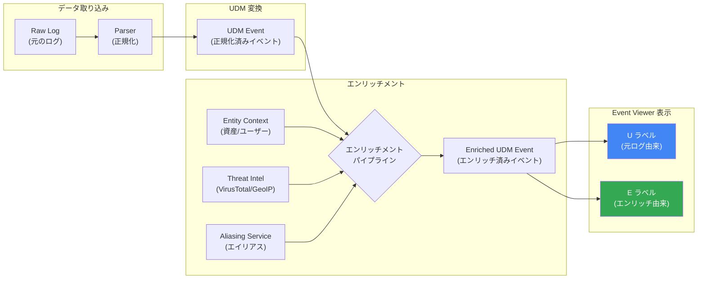

# Google SecOps (SIEM): UDM フィールドにエンリッチメント状態ラベルを表示

**リリース日**: 2026-06-09

**サービス**: Google SecOps (SIEM)

**機能**: UDM fields now show whether data is enriched or not

**ステータス**: Feature

[このアップデートのインフォグラフィックを見る](https://takech9203.github.io/google-cloud-news-summary/20260609-google-secops-udm-enrichment-labels.html)

## 概要

Google SecOps の Event Viewer において、UDM (Unified Data Model) フィールドにデータソースを示すアイコンラベルが追加された。各フィールドに「U」(Unenriched: 未エンリッチ) または「E」(Enriched: エンリッチ済み) のアイコンが表示されることで、セキュリティアナリストはフィールド値の出処を即座に判別できるようになった。

エンリッチフィールドには、Google SecOps が環境内のアーティファクトに関する追加コンテキストを提供するために生成した値が格納される。これにより、元のログデータから直接パースされた値と、Google SecOps のエンリッチメントパイプラインによって付与された追加情報を明確に区別することが可能になった。

この機能は、インシデント調査時のデータ出自の透明性を向上させ、監査・コンプライアンス要件への対応を容易にする。また、エンリッチメントソースによるフィルタリング機能も提供されるため、特定のデータソースに基づくフィールドのみを選択的に表示することができる。

**アップデート前の課題**

- UDM フィールドの値がオリジナルのログから取得されたものか、Google SecOps のエンリッチメントプロセスで付与されたものか、UI 上で区別する手段がなかった
- エンリッチメントデータの出自を確認するには、元のログとエンリッチ後のイベントを手動で比較する必要があった
- 監査やコンプライアンス対応時に、データの正確な出処を証明することが困難だった
- トラブルシューティング時に、意図しないエンリッチメントによる値の上書きを特定するのが煩雑だった

**アップデート後の改善**

- 各 UDM フィールドに「U」(未エンリッチ) /「E」(エンリッチ済み) のアイコンが表示され、データソースを即座に判別可能に
- エンリッチフィールドについて、すべての関連ソースを確認可能に
- フィルタ機能で「未エンリッチフィールドのみ表示」「エンリッチフィールドのみ表示」「抽出フィールドのみ表示」など、データソース別の絞り込みが可能に
- 監査・コンプライアンス対応でデータの出自を証明する際のエビデンスとして活用可能に

## アーキテクチャ図

Google SecOps のデータパイプラインにおけるエンリッチメントの流れと、Event Viewer での U/E ラベル表示の関係を示す。Raw Log がパースされて UDM Event に変換された後、エンリッチメントパイプラインで追加コンテキストが付与され、最終的に Event Viewer で各フィールドのデータソースがラベルとして可視化される。

## サービスアップデートの詳細

### 主要機能

1. **U/E アイコンラベル表示**
   - 各 UDM フィールドにデータソースを示すアイコンを表示
   - 「U」(Unenriched): 正規化プロセスで元のログから取得された値
   - 「E」(Enriched): Google SecOps のエンリッチメントパイプラインが生成した追加コンテキスト値

2. **エンリッチメントソースの表示**
   - エンリッチフィールドについて、関連するすべてのデータソースを確認可能
   - バリデーション、トラブルシューティング、監査目的に活用可能
   - エンリッチメントソースによるフィルタリング機能

3. **フィルタリング機能の強化**
   - Event Fields タブで以下のフィルタが利用可能:
     - 未エンリッチフィールドの表示/非表示
     - エンリッチフィールドの表示/非表示
     - 追加フィールドの表示/非表示
     - 抽出フィールドの表示/非表示

## 技術仕様

### UDM エンリッチメントの種類

Google SecOps は以下のエンリッチメントタイプを UDM イベントに適用する:

| エンリッチメントタイプ | ロジックパターン | 説明 |
|---|---|---|
| アーティファクト (ファイルハッシュ) | First-match | 優先順位リストに従い、最初に見つかった値のみ使用 |
| 資産 (Asset) | Merged | 複数フィールドのデータを統合して単一のレコードを構築 |
| ユーザー | Preference of order | 優先順位に基づき識別子を選択 |
| プロセス | Mapping & overwrite | 一意 ID でエンティティを解決し、エイリアスデータで上書き |
| GeoIP | Global | パブリック IP アドレスに位置情報を付与 |
| VirusTotal | Global | ファイルハッシュに脅威インテリジェンスメタデータを付与 |

### UDM メタデータフィールド (エンリッチメント関連)

| フィールド | 型 | 説明 |
|---|---|---|
| `metadata.enrichment_state` | EnrichmentState (Enum) | エンリッチメント状態を示す |
| `metadata.enrichment_labels` | DataAccessLabels | エンリッチメントに使用されたコンテキストイベントのアクセスラベル |
| `metadata.base_labels` | DataAccessLabels | ベースイベントのデータアクセスラベル |

### エンリッチメントの対象

Google SecOps がサポートするエンリッチメント対象:

- **資産** (Asset): ホスト名、MAC アドレス、asset_id、IP アドレス
- **ユーザー** (User): メールアドレス、Windows SID、ユーザー ID、従業員 ID
- **プロセス** (Process): PSPI (Product Specific Process ID) による解決
- **ファイルハッシュメタデータ** (VirusTotal): SHA256、SHA1、MD5
- **地理的位置情報** (GeoIP): パブリック IP アドレス
- **クラウドリソース**: クラウド環境のリソース情報

## メリット

### ビジネス面

- **コンプライアンス対応の強化**: データの出自を UI 上で明確に示すことで、監査証跡の確保が容易になる
- **インシデント対応の迅速化**: エンリッチデータの出処を即座に判別でき、調査時間を短縮
- **レポーティングの信頼性向上**: エンリッチソースを明示することで、セキュリティレポートの根拠を明確化

### 技術面

- **トラブルシューティングの効率化**: エンリッチメントパイプラインの問題を特定しやすくなる (例: 意図しない値の上書き)
- **検知ルール作成の精度向上**: エンリッチフィールドと未エンリッチフィールドを区別した検知ルール (YARA-L) の設計が可能
- **データ品質管理**: どのフィールドが元データに由来し、どのフィールドが推論結果かを把握可能

## ユースケース

### ユースケース 1: インシデント調査時のデータ検証

**シナリオ**: セキュリティアナリストがアラートを調査中に、特定の IP アドレスに紐づく地理情報やレピュテーション情報がエンリッチメントによる付与か、元ログに含まれていた情報かを確認したい場合。

**効果**: 「E」ラベルにより GeoIP エンリッチメントで付与されたフィールドと、元のファイアウォールログから取得されたフィールドを即座に区別でき、調査の正確性が向上する。

### ユースケース 2: 監査対応時のデータ出自証明

**シナリオ**: コンプライアンス監査で、SIEM に格納されたデータの正確性と出自を証明する必要がある場合。

**効果**: エンリッチフィールドのソース情報を表示し、フィルタ機能でエンリッチソース別に絞り込むことで、データの出自を明確にドキュメント化できる。

### ユースケース 3: エンリッチメントパイプラインのトラブルシューティング

**シナリオ**: 特定のアセットイベントで期待されるエンリッチメントデータが表示されない場合の原因調査。

**効果**: 「U」ラベルのみのフィールドをフィルタリングし、エンリッチメントが適用されていないフィールドを特定。公式ドキュメントのエンリッチメントロジック (First-match、Merged、Conditional fallback) と照合して原因を特定できる。

## 料金

Google SecOps は以下のパッケージで提供されており、データ取り込み量に基づく課金モデルを採用している。エンリッチメント機能はすべてのパッケージに含まれる。

| パッケージ | エンリッチメント機能 | 備考 |
|---|---|---|
| Standard | 基本エンリッチメント | BYOTI (自前の脅威インテリジェンス) |
| Enterprise | 拡張エンリッチメント | オープンソース脅威インテリジェンスのキュレーション含む |
| Enterprise Plus | 完全エンリッチメント | Google Threat Intelligence (Mandiant/VirusTotal/Google) 含む |

具体的な料金は営業担当に要問い合わせ。

## 関連サービス・機能

- **UDM Search**: エンリッチデータを活用した UDM イベント検索機能。U/E ラベルと組み合わせることで、検索結果の出自を確認可能
- **YARA-L 検知ルール**: エンリッチフィールドを条件に含む検知ルールの作成が可能
- **Entity Context Graph (ECG)**: 検索時のリアルタイムエンリッチメント機能。Prevalence、First seen/Last seen などの計算属性を提供
- **Data Tables**: クエリ時に UDM イベントと結合されるルックアップテーブル機能
- **VirusTotal**: ファイルハッシュメタデータのエンリッチメントソースとして統合
- **Google Threat Intelligence**: Applied Threat Intelligence による IoC マッチングと ML ベースの優先度付け

## 参考リンク

- [インフォグラフィック](https://takech9203.github.io/google-cloud-news-summary/20260609-google-secops-udm-enrichment-labels.html)
- [公式リリースノート](https://docs.google.com/release-notes#June_09_2026)
- [UDM エンリッチメントとエイリアシングの概要](https://docs.cloud.google.com/chronicle/docs/event-processing/overview-of-aliasing-and-enrichment)
- [データエンリッチメント](https://docs.cloud.google.com/chronicle/docs/event-processing/data-enrichment)
- [UDM Search - Event Viewer](https://docs.cloud.google.com/chronicle/docs/investigation/udm-search)
- [Unified Data Model の概要](https://docs.cloud.google.com/chronicle/docs/event-processing/udm-overview)
- [Google SecOps 料金](https://cloud.google.com/security/products/security-information-event-management)

## まとめ

Google SecOps の UDM フィールドへの U/E ラベル追加は、セキュリティデータの透明性を大幅に向上させるアップデートである。セキュリティアナリストはイベント調査時にデータの出自を即座に把握でき、エンリッチメントパイプラインのトラブルシューティングや監査対応が効率化される。既存の Google SecOps ユーザーは Event Viewer の Event Fields タブで新しいフィルタ機能を活用し、エンリッチメント状態に基づくデータの可視化を確認することを推奨する。

---

**タグ**: #GoogleSecOps #SIEM #UDM #Enrichment #SecurityAnalytics #DataLineage #EventViewer
