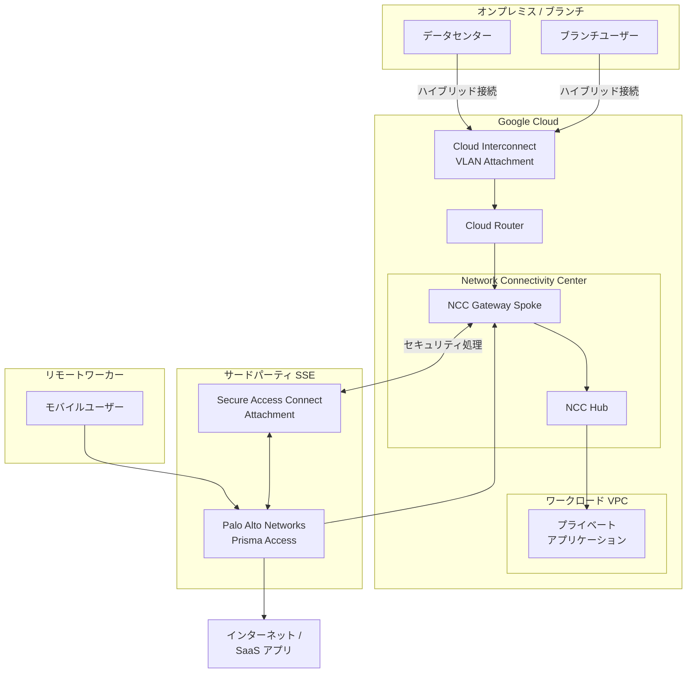

# Network Connectivity Center: NCC Gateway 一般提供開始 (GA)

**リリース日**: 2026-06-09

**サービス**: Network Connectivity Center

**機能**: NCC Gateway

**ステータス**: 一般提供 (GA)

[このアップデートのインフォグラフィックを見る](https://takech9203.github.io/google-cloud-news-summary/20260609-ncc-gateway-ga.html)

## 概要

Google Cloud は Network Connectivity Center (NCC) Gateway の一般提供 (GA) を発表しました。NCC Gateway は、NCC ハブに接続できるスポークタイプであり、クロスクラウドネットワークトラフィックに対してサードパーティの Security Service Edge (SSE) などのセキュリティ機能を有効化するリージョナルプロダクトです。

NCC Gateway を Secure Access Connect と組み合わせることで、リモートワーカーを Google Cloud、オンプレミス、または他のクラウドプロバイダー上のプライベートアプリケーション、および Palo Alto Networks Prisma Access のようなパブリックアプリケーションに安全に接続できます。これにより、SASE (Secure Access Service Edge) アーキテクチャの実現が大幅に簡素化されます。

この GA リリースにより、NCC Gateway は 99.9% のアップタイム SLA を提供し、エンタープライズ環境での本番利用に対応した信頼性を確保しています。

**アップデート前の課題**

NCC Gateway が GA 以前は、クロスクラウド環境でのセキュリティ統合に以下の課題がありました。

- サードパーティ SSE サービスとの統合に複雑なネットワーク構成が必要で、設定ミスによるセキュリティギャップが発生しやすかった
- ブランチオフィスやリモートワーカーからプライベートアプリケーションへの安全なアクセスを確立するために、複数のポイントソリューションを組み合わせる必要があった
- クロスクラウドトラフィックに対する一元的なセキュリティポリシー適用が困難で、セキュリティスタックが分散し管理コストが増大していた

**アップデート後の改善**

今回の GA リリースにより、以下の改善が実現されました。

- NCC Gateway を介してサードパーティ SSE (Palo Alto Networks Prisma Access、Symantec Cloud SWG) をシームレスに統合し、透過的なトラフィックステアリングが可能になった
- Secure Access Connect により、リモートワーカーからプライベート/パブリックアプリケーションへの安全な接続が単一のアーキテクチャで実現可能になった
- 99.9% のアップタイム SLA により、本番環境での利用に対する信頼性が保証され、プロダクションワークロードへの適用が可能になった

## アーキテクチャ図



NCC Gateway がクロスクラウドトラフィックのセキュリティハブとして機能し、Secure Access Connect を通じてサードパーティ SSE (Palo Alto Networks Prisma Access) と連携することで、ブランチユーザー、モバイルユーザー双方からのトラフィックに統一的なセキュリティポリシーを適用するアーキテクチャを示しています。

## サービスアップデートの詳細

### 主要機能

1. **シームレスな SSE 統合**
   - Palo Alto Networks Prisma Access との GA レベルの統合
   - Symantec Cloud Secure Web Gateway (Cloud SWG) との統合 (Preview)
   - 透過的なトラフィックステアリングによるユーザー-アプリケーション間の保護とパフォーマンス向上

2. **高可用性 (99.9% SLA)**
   - アクティブなデータプレーンプロービングによるエンドツーエンドのヘルスモニタリング
   - 異常検知時の BGP セッション自動シャットダウンと復旧
   - Cloud Monitoring メトリクスによるヘルスステータスのアラート設定

3. **リージョナルデプロイメント**
   - 最大 100 Gbps の処理容量を提供
   - データセンター、SSE プロバイダー、他クラウドプロバイダーへの物理的近接性に基づいたリージョン選択
   - Google のプライベートバックボーンを活用したリージョン間トラフィック管理

4. **Secure Access Connect**
   - グローバルリソースとしての Realm とリージョナルリソースとしての Attachment で構成
   - SSE サービスを NCC Gateway に接続してセキュリティ処理とセキュアなインターネットアクセスを提供
   - gcloud CLI および REST API による管理が可能

## 技術仕様

### サポートされる構成

| 項目 | 詳細 |
|------|------|
| スポークタイプ | NCC Gateway Spoke |
| 接続方式 | Cloud Interconnect VLAN Attachment のみ |
| トポロジー | Hybrid Inspection Topology (新規)、Star / Full Mesh (既存) |
| 処理容量 | 1 Gbps / 10 Gbps / 100 Gbps |
| MTU | 1500 バイト (固定) |
| SLA | 99.9% アップタイム |
| スポーク数 | リージョンごとに 1 NCC Gateway Spoke |

### サポートされる SSE プロバイダー

| プロバイダー | ステータス |
|-------------|-----------|
| Palo Alto Networks Prisma Access | GA |
| Symantec Cloud Secure Web Gateway (Cloud SWG) | Preview |

### トラフィックフローパターン

| ユースケース | トラフィック経路 |
|-------------|----------------|
| ブランチ → インターネット | オンプレミス → NCC Gateway → SSE → インターネット |
| ブランチ → プライベートアプリ | オンプレミス → NCC Gateway → SSE → NCC Gateway → VPC |
| プライベートアプリ → インターネット | VPC → NCC Gateway → SSE → インターネット |
| モバイル → プライベートアプリ | モバイル → SSE → NCC Gateway → VPC |

## 設定方法

### 前提条件

1. Google Cloud プロジェクトが作成済みであること
2. Network Connectivity API が有効化されていること
3. Cloud Interconnect 接続が設定済みであること
4. SSE プロバイダー (Palo Alto Networks Prisma Access 等) のアカウントが作成済みであること

### 手順

#### ステップ 1: NCC Hub の作成

```bash
gcloud network-connectivity hubs create my-ncc-hub \
    --description="NCC Hub for Gateway deployment" \
    --preset-topology=HYBRID_INSPECTION
```

Hybrid Inspection トポロジーを使用した NCC Hub を作成します。

#### ステップ 2: NCC Gateway Spoke の作成

```bash
gcloud network-connectivity spokes linked-ncc-gateways create my-gateway-spoke \
    --hub=my-ncc-hub \
    --location=us-east4 \
    --spoke-group=gateways \
    --processing-capacity=10G
```

指定したリージョンに NCC Gateway Spoke を作成し、処理容量を設定します。

#### ステップ 3: Secure Access Connect Realm の作成

```bash
gcloud beta network-security secure-access-connect realms create my-realm \
    --provider=PALO_ALTO_NETWORKS
```

SSE プロバイダーとの接続に必要な Secure Access Connect Realm を作成します。

#### ステップ 4: Secure Access Connect Attachment の作成

```bash
gcloud beta network-security secure-access-connect attachments create my-attachment \
    --realm=my-realm \
    --location=us-east4 \
    --ncc-gateway-spoke=my-gateway-spoke
```

NCC Gateway Spoke に Secure Access Connect Attachment を関連付けます。

#### ステップ 5: VLAN Attachment の追加

```bash
gcloud compute interconnects attachments create my-vlan-attachment \
    --router=my-cloud-router \
    --interconnect=my-interconnect \
    --region=us-east4 \
    --bandwidth=10g
```

Cloud Interconnect VLAN Attachment を作成し、NCC Gateway にリンクされた Cloud Router に関連付けます。

## メリット

### ビジネス面

- **統合セキュリティ管理**: 単一のセキュリティスタックでブランチ、モバイル、クラウド間の全トラフィックを保護でき、運用コストを削減
- **SASE アーキテクチャの実現**: サードパーティ SSE との統合により、ゼロトラストセキュリティモデルへの移行が容易に
- **ベンダーロックインの軽減**: 複数の SSE プロバイダーから選択可能で、既存のセキュリティ投資を活用できる

### 技術面

- **低レイテンシ**: Google のプライベートバックボーンを活用した高帯域幅接続で、SSE サービスへのアクセスが最適化
- **高可用性**: 99.9% SLA とアクティブヘルスモニタリングにより、ミッションクリティカルなワークロードに対応
- **スケーラビリティ**: リージョンあたり最大 100 Gbps の処理容量を提供し、大規模トラフィックにも対応可能

## デメリット・制約事項

### 制限事項

- Cloud Interconnect VLAN Attachment のみサポート (Cloud VPN トンネルやルーターアプライアンスは非対応)
- リージョンあたり 1 つの NCC Gateway Spoke のみ作成可能
- NCC Gateway Spoke 作成後に IP アドレス範囲の変更は不可
- 1 つの NCC Gateway に同時に接続できる SSE サービスは 1 つのみ
- VLAN Attachment の MTU は 1500 バイト固定
- トラフィックの一部を NCC Gateway からバイパスするステアリングポリシーは未対応

### 考慮すべき点

- 処理容量の計算にはトラフィックフローの方向を考慮する必要がある (双方向で 2 倍の容量が必要になるケースあり)
- 一部のリージョンまたはパートナーでは 100 Gbps をサポートしていない場合がある
- Secure Access Connect の Realm と Attachment は作成後に編集不可 (変更には削除・再作成が必要)
- Gateway Advertised Route を使用する場合、アクティブな SSE ゲートウェイが必要

## ユースケース

### ユースケース 1: リモートワーカーのセキュアなプライベートアプリケーションアクセス

**シナリオ**: グローバルに分散したリモートワーカーが、Google Cloud 上のプライベートアプリケーションに安全にアクセスする必要がある組織。従来は VPN を経由していたが、パフォーマンスとセキュリティの課題があった。

**実装例**:
```
ブランチオフィス → Cloud Interconnect → NCC Gateway → Palo Alto Prisma Access (SSE) → NCC Gateway → VPC (プライベートアプリ)
```

**効果**: Prisma Access による統一セキュリティポリシー適用と、Google バックボーンによる低レイテンシアクセスにより、VPN ベースの構成と比較してセキュリティとパフォーマンスの両方が向上。

### ユースケース 2: マルチクラウド環境でのセキュアなインターネットブレイクアウト

**シナリオ**: オンプレミスのデータセンターと Google Cloud の両方からインターネットへのアクセスが必要で、全トラフィックに対してセキュリティ検査を適用したい組織。

**実装例**:
```
オンプレミス/GCP → NCC Gateway → SSE (セキュリティ検査) → インターネット/SaaS
```

**効果**: 全てのインターネット向けトラフィックが SSE を通過することで、一元的な脅威検知、DLP、URL フィルタリングを実現。インターネットへのイングレス/エグレスポイントを制限し、攻撃表面を最小化。

### ユースケース 3: 既存 NCC デプロイメントへの段階的セキュリティ追加

**シナリオ**: 既に NCC の Star または Full Mesh トポロジーでハイブリッド接続を運用している組織が、セキュリティレイヤーを追加したい。

**効果**: 既存のトポロジーを維持したまま (Brownfield デプロイメント)、NCC Gateway Spoke を追加することで段階的にセキュリティ機能を導入可能。大規模な再構築なしに SASE アーキテクチャへの移行を開始できる。

## 料金

NCC Gateway の料金は、ゲートウェイ使用料とデータ処理料の 2 つのコンポーネントで構成されます。

| コンポーネント | 料金 |
|---------------|------|
| NCC Gateway 使用料 | $0.05/ゲートウェイ/時間 |
| データ処理料 | $0.02/GB |

### 料金例

| 使用量 | 月額料金 (概算) |
|--------|-----------------|
| 1 Gateway + 1 TB/月のデータ処理 | $36.50 (使用料) + $20.48 (データ処理) = 約 $57/月 |
| 1 Gateway + 10 TB/月のデータ処理 | $36.50 (使用料) + $204.80 (データ処理) = 約 $241/月 |
| 1 Gateway + 100 TB/月のデータ処理 | $36.50 (使用料) + $2,048 (データ処理) = 約 $2,085/月 |

**注意**: 上記に加えて、Cloud Interconnect のポート/VLAN 料金、標準のネットワークエグレス料金が別途発生する場合があります。

## 利用可能リージョン

| リージョン | ロケーション | 最大容量 |
|-----------|------------|---------|
| asia-south1 | ムンバイ (インド) | 100 Gbps |
| europe-west3 | フランクフルト (ドイツ) | 100 Gbps |
| southamerica-west1 | サンティアゴ (チリ) | 100 Gbps |
| us-central1 | デンバー (米国コロラド州) | 100 Gbps |
| us-east1 | アトランタ (米国ジョージア州) | 100 Gbps |
| us-east4 | アッシュバーン (米国バージニア州) | 100 Gbps |
| us-west1 | ポートランド (米国オレゴン州) | 100 Gbps |
| us-west2 | ロサンゼルス (米国カリフォルニア州) | 100 Gbps |
| us-west3 | ソルトレイクシティ (米国ユタ州) | 100 Gbps |

## 関連サービス・機能

- **Network Connectivity Center (NCC)**: NCC Gateway の親サービスであるハブ&スポークアーキテクチャのネットワーク管理プラットフォーム
- **Cloud Interconnect**: NCC Gateway への接続に必須の専用接続サービス (VLAN Attachment 経由)
- **Cloud Router**: NCC Gateway にリンクされ、BGP ルーティングを管理するリージョナルルーター
- **Secure Access Connect**: SSE プロバイダーを NCC Gateway に接続するためのグローバル/リージョナルリソース
- **Cross-Cloud Network**: Google Cloud と他クラウドプロバイダー間のネットワーク接続を統合するプラットフォーム

## 参考リンク

- [インフォグラフィック](https://takech9203.github.io/google-cloud-news-summary/20260609-ncc-gateway-ga.html)
- [公式リリースノート](https://docs.cloud.google.com/release-notes#June_09_2026)
- [NCC Gateway 概要ドキュメント](https://docs.cloud.google.com/network-connectivity/docs/network-connectivity-center/concepts/ncc-gateway-overview)
- [Secure Access Connect 概要](https://docs.cloud.google.com/secure-access-connect/docs/overview)
- [NCC Gateway セットアップガイド](https://docs.cloud.google.com/network-connectivity/docs/network-connectivity-center/how-to/ncc-gateway/setup-overview)
- [料金ページ](https://cloud.google.com/network-connectivity/pricing#ncc-gateway-pricing)
- [サポートされるロケーション](https://docs.cloud.google.com/network-connectivity/docs/network-connectivity-center/how-to/ncc-gateway/supported-locations)

## まとめ

NCC Gateway の GA リリースは、Google Cloud におけるクロスクラウドセキュリティの重要なマイルストーンです。サードパーティ SSE との統合により、組織は単一の管理ポイントで全ネットワークトラフィックにセキュリティポリシーを適用できるようになり、SASE アーキテクチャへの移行が大幅に簡素化されます。Cloud Interconnect を使用したハイブリッド接続環境で、セキュリティとパフォーマンスの両立を求める組織は、NCC Gateway の導入を検討することを推奨します。

---

**タグ**: #NetworkConnectivityCenter #NCCGateway #SSE #SASE #PrismaAccess #SecureAccessConnect #CrossCloudNetwork #ハイブリッドクラウド #ネットワークセキュリティ #GA
