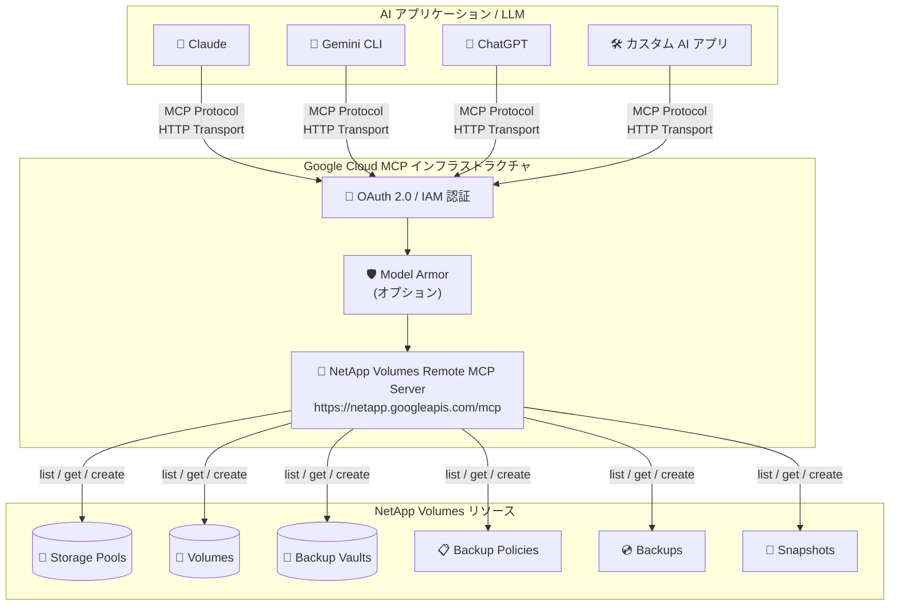

# Google Cloud NetApp Volumes: リモート MCP サーバー 一般提供 (GA)

**リリース日**: 2026-06-09

**サービス**: Google Cloud NetApp Volumes

**機能**: リモート Model Context Protocol (MCP) サーバー

**ステータス**: 一般提供 (GA)

📊 [このアップデートのインフォグラフィックを見る](https://takech9203.github.io/google-cloud-news-summary/20260609-netapp-volumes-mcp-server-ga.html)

## 概要

Google Cloud NetApp Volumes のリモート Model Context Protocol (MCP) サーバーが一般提供 (GA) となった。これにより、LLM (大規模言語モデル)、AI アプリケーション、AI 対応開発プラットフォームから、NetApp Volumes のストレージプール、ボリューム、バックアップボールト、バックアップポリシー、バックアップ、スナップショットを直接管理できるようになる。

MCP は、LLM と外部データソースやサービスの接続方法を標準化するオープンプロトコルである。今回 GA となったリモート MCP サーバーは、Google Cloud のインフラストラクチャ上で動作し、HTTP エンドポイント (`https://netapp.googleapis.com/mcp`) を通じて AI アプリケーションとの通信を提供する。Claude、Gemini CLI、ChatGPT、カスタムアプリケーションなど、MCP クライアントを実装した任意の AI アプリケーションから接続可能である。

このアップデートにより、ストレージ管理者や DevOps エンジニアは、自然言語による対話を通じて NetApp Volumes リソースの照会・作成 (一部) を行えるようになり、AI を活用したインフラストラクチャ管理の新たなパラダイムが実現される。

**アップデート前の課題**

- NetApp Volumes の管理は Google Cloud Console、gcloud CLI、REST API など従来のインターフェースに限定されていた
- ストレージリソースの状態確認やバックアップ作成には、専門的な CLI コマンドや API 呼び出しの知識が必要だった
- AI エージェントやアシスタントから直接ストレージ操作を行う標準的な方法が存在しなかった
- ローカル MCP サーバー (コミュニティ版) は存在したが、自前でのホスティングとメンテナンスが必要だった

**アップデート後の改善**

- LLM や AI アプリケーションから自然言語でストレージリソースの管理が可能になった
- Google Cloud マネージドのリモート MCP サーバーにより、セットアップや運用の負担なく MCP 統合が利用できるようになった
- OAuth 2.0 + IAM による細粒度のアクセス制御が標準で提供されるようになった
- Model Armor との統合により、MCP ツール呼び出しのセキュリティ保護がオプションで利用可能になった
- 集中型監査ログにより、AI アプリケーションからのストレージ操作の追跡が容易になった

## アーキテクチャ図



AI アプリケーションが MCP プロトコル (HTTP トランスポート) を通じて NetApp Volumes リモート MCP サーバーに接続し、OAuth 2.0 認証と IAM 認可を経て、ストレージリソースの管理操作を実行するアーキテクチャを示す。Model Armor によるセキュリティスキャンはオプションで有効化できる。

## サービスアップデートの詳細

### 主要機能

1. **リモート MCP サーバーエンドポイント**
   - グローバルエンドポイント: `https://netapp.googleapis.com/mcp`
   - HTTP トランスポートによる通信
   - NetApp Volumes API を有効化するだけで自動的に利用可能
   - `tools/list` メソッドは認証不要で利用可能

2. **ストレージリソース管理ツール**
   - ストレージプールの一覧取得・詳細取得
   - ボリュームの一覧取得・詳細取得
   - バックアップボールトの一覧取得・詳細取得
   - バックアップポリシーの一覧取得・詳細取得
   - バックアップの一覧取得・詳細取得・作成
   - スナップショットの一覧取得・詳細取得・作成

3. **Google Cloud MCP プラットフォーム統合**
   - 集中型のサーバーディスカバリ
   - マネージドのグローバル HTTP エンドポイント
   - 細粒度の IAM 認可制御
   - Model Armor によるプロンプト/レスポンスのセキュリティスキャン (オプション)
   - 集中型監査ログ

4. **ローカル MCP サーバーとの選択肢**
   - リモート版: Google マネージド、セットアップ不要、HTTP トランスポート
   - ローカル版 (GitHub: NetApp/gcnv-mcp-server): 自前ネットワーク内で動作、カスタマイズ可能、stdio トランスポート

## 技術仕様

### MCP ツール一覧

| ツール名 | 説明 | 必要な権限 |
|----------|------|-----------|
| `list_storage_pools` | ストレージプールの一覧取得 | `netapp.storagePools.list` |
| `get_storage_pool` | ストレージプールの詳細取得 | `netapp.storagePools.get` |
| `list_volumes` | ボリュームの一覧取得 | `netapp.volumes.list` |
| `get_volume` | ボリュームの詳細取得 | `netapp.volumes.get` |
| `list_backup_vaults` | バックアップボールトの一覧取得 | `netapp.backupVaults.list` |
| `get_backup_vault` | バックアップボールトの詳細取得 | `netapp.backupVaults.get` |
| `list_backup_policies` | バックアップポリシーの一覧取得 | `netapp.backupPolicies.list` |
| `get_backup_policy` | バックアップポリシーの詳細取得 | `netapp.backupPolicies.get` |
| `list_backups` | バックアップの一覧取得 | `netapp.backups.list` |
| `get_backup` | バックアップの詳細取得 | `netapp.backups.get` |
| `create_backup` | バックアップの作成 | `netapp.backups.create` |
| `list_snapshots` | スナップショットの一覧取得 | `netapp.snapshots.list` |
| `get_snapshot` | スナップショットの詳細取得 | `netapp.snapshots.get` |
| `create_snapshot` | スナップショットの作成 | `netapp.snapshots.create` |

### ブロックされている操作 (安全性のための制限)

| リソースタイプ | ブロックされている操作 |
|---------------|----------------------|
| Storage Pools | CreateStoragePool, UpdateStoragePool, DeleteStoragePool |
| Volumes | CreateVolume, UpdateVolume, DeleteVolume |
| Snapshots | UpdateSnapshot, DeleteSnapshot, RevertVolume |
| Backups | UpdateBackup, DeleteBackup |
| Backup Policies / Vaults | Create/Update/Delete BackupPolicy, Create/Update/Delete BackupVault |

### 必要な IAM ロール

| 操作 | 必要なロール |
|------|------------|
| MCP ツール呼び出し | `roles/mcp.toolUser` (MCP Tool User) |
| リソースの一覧取得・詳細取得 | `roles/netapp.viewer` (NetApp Volumes Viewer) |
| バックアップ・スナップショットの作成 | `roles/netapp.admin` (NetApp Volumes Admin) |

### OAuth スコープ

```
https://www.googleapis.com/auth/netapp
```

## 設定方法

### 前提条件

1. Google Cloud プロジェクトで NetApp Volumes API が有効化されていること
2. 適切な IAM ロール (`roles/mcp.toolUser` + `roles/netapp.viewer` 以上) が付与されていること
3. OAuth 2.0 認証の設定 (ADC、サービスアカウント、または OAuth クライアント ID)

### 手順

#### ステップ 1: MCP サーバーの有効化

NetApp Volumes API を有効化すると、リモート MCP サーバーが自動的に利用可能になる。

```bash
gcloud services enable netapp.googleapis.com
```

#### ステップ 2: IAM ロールの付与

```bash
# MCP ツール呼び出し権限
gcloud projects add-iam-policy-binding PROJECT_ID \
  --member="user:USER_EMAIL" \
  --role="roles/mcp.toolUser"

# NetApp Volumes の閲覧権限
gcloud projects add-iam-policy-binding PROJECT_ID \
  --member="user:USER_EMAIL" \
  --role="roles/netapp.viewer"

# バックアップ・スナップショット作成権限 (必要な場合)
gcloud projects add-iam-policy-binding PROJECT_ID \
  --member="user:USER_EMAIL" \
  --role="roles/netapp.admin"
```

#### ステップ 3: AI アプリケーションでの接続設定

**Claude の場合:**

MCP クライアント設定で以下を指定:
- Server name: `NetApp Volumes MCP server`
- Endpoint: `https://netapp.googleapis.com/mcp`
- Transport: HTTP
- Authentication: Google Cloud 認証情報

**Gemini CLI の場合:**

`settings.json` に以下を追加:

```json
{
  "mcpServers": {
    "netapp-volumes": {
      "httpUrl": "https://netapp.googleapis.com/mcp"
    }
  }
}
```

#### ステップ 4: ツール一覧の確認

```bash
curl --location 'https://netapp.googleapis.com/mcp' \
  --header 'content-type: application/json' \
  --header 'accept: application/json, text/event-stream' \
  --data '{
    "method": "tools/list",
    "jsonrpc": "2.0",
    "id": 1
  }'
```

## メリット

### ビジネス面

- **運用効率の向上**: 自然言語による対話でストレージリソースの確認・管理が可能になり、専門知識のない担当者でも基本的な操作が行える
- **AI エージェント統合**: 既存の AI ワークフローやエージェントにストレージ管理機能を組み込め、自動化の幅が広がる
- **セキュリティ・コンプライアンス**: IAM による細粒度制御と監査ログにより、AI からの操作もガバナンス要件を満たせる

### 技術面

- **標準プロトコル採用**: MCP はオープンスタンダードであり、特定の AI プラットフォームに依存しない汎用的な統合が可能
- **マネージドインフラ**: Google Cloud が MCP サーバーをホスト・運用するため、セットアップや可用性の管理が不要
- **セーフガード設計**: 破壊的操作 (削除・更新) はデフォルトでブロックされており、意図しないデータ損失を防止
- **Model Armor 統合**: プロンプトインジェクションや機密データ漏洩などの AI 特有のリスクに対する保護層を追加可能

## デメリット・制約事項

### 制限事項

- ストレージプール、ボリュームの作成・更新・削除操作はリモート MCP サーバー経由では実行不可
- バックアップ・スナップショットの更新・削除操作もブロックされている
- バックアップボールト・バックアップポリシーの作成・更新・削除はブロックされている
- 実質的に読み取り操作 (list/get) と、バックアップ・スナップショットの作成のみ利用可能

### 考慮すべき点

- AI エージェントに過度な権限を付与しないよう、IAM ロールの最小権限の原則を遵守する必要がある
- 本番環境ではエージェント専用のサービスアカウントを作成し、ユーザー個人の認証情報を使用しないことが推奨される
- Model Armor を有効化する場合、対応リージョンの制限がある
- ADC (Application Default Credentials) を使用する場合、1 時間ごとのトークン更新が必要な場合がある

## ユースケース

### ユースケース 1: AI アシスタントによるストレージ状態モニタリング

**シナリオ**: SRE チームが AI チャットボットを構築し、NetApp Volumes の状態を自然言語で問い合わせられるようにする。「us-central1 のストレージプール一覧を表示して」「volume-prod-01 の詳細を教えて」といった質問に AI が回答する。

**実装例**:
```json
{
  "jsonrpc": "2.0",
  "method": "tools/call",
  "params": {
    "name": "list_storage_pools",
    "arguments": {
      "project": "my-project",
      "location": "us-central1"
    }
  },
  "id": 1
}
```

**効果**: オペレーターが CLI コマンドを覚えなくても、対話形式でストレージ環境の状態を把握できる。障害調査やキャパシティプランニングの初期段階を迅速化できる。

### ユースケース 2: 自動バックアップエージェント

**シナリオ**: AI エージェントがスケジュールに従って NetApp Volumes のスナップショットやバックアップを作成する。異常を検知した際に自動的にスナップショットを取得し、データ保護を強化する。

**効果**: バックアップ運用の一部を AI エージェントに委任でき、人的ミスの削減とレスポンス時間の短縮が期待できる。

### ユースケース 3: マルチクラウドストレージ管理の統合 AI インターフェース

**シナリオ**: 企業が複数の MCP サーバー (NetApp Volumes、Cloud Storage など) を 1 つの AI エージェントに接続し、「すべてのストレージリソースの概要を教えて」のような統合的な問い合わせを可能にする。

**効果**: 複数のツールやコンソールを行き来する必要がなくなり、統合的なストレージ管理ビューを自然言語で取得できる。

## 料金

NetApp Volumes MCP サーバーの利用自体には追加料金は発生しない (NetApp Volumes の基本料金に含まれる)。NetApp Volumes のストレージ料金は、サービスレベルと容量に基づく。

### 料金例 (us-central1)

| サービスレベル | 料金 ($/GiB/月) | パフォーマンス |
|---------------|----------------|--------------|
| Flex Unified | $0.105 (カスタムプロビジョニング) | 最大 22 GiB/s (ラージボリューム) |
| Flex File Zonal | $0.105 (カスタムプロビジョニング) | 5 GiB/s (プール共有) |
| Flex File Regional | $0.40 | 16 MiB/s per TiB |
| Standard | $0.20 | 16 MiB/s per TiB |
| Premium | $0.29 | 64 MiB/s per TiB (最大 30 GiBps) |
| Extreme | $0.39 | 128 MiB/s per TiB (最大 30 GiBps) |

## 利用可能リージョン

NetApp Volumes リモート MCP サーバーのエンドポイントはグローバルである (`https://netapp.googleapis.com/mcp`)。管理対象の NetApp Volumes リソースは、NetApp Volumes がサポートするリージョンに存在する必要がある。

- **Flex Unified / Flex File**: 主要な Google Cloud リージョンで利用可能
- **Standard / Premium / Extreme**: 14 の Google Cloud リージョンで利用可能

詳細は [NetApp Volumes supported locations](https://docs.cloud.google.com/netapp/volumes/docs/locations) を参照。

## 関連サービス・機能

- **Google Cloud MCP サーバープラットフォーム**: NetApp Volumes 以外にも多数の Google Cloud サービスが MCP サーバーを提供しており、統合的な AI エージェント管理が可能
- **Model Armor**: MCP ツール呼び出しとレスポンスのセキュリティスキャン機能を提供し、プロンプトインジェクションや機密データ漏洩を防止
- **Cloud Audit Logs**: MCP サーバー経由の操作を含むすべての API 呼び出しの監査ログを記録
- **IAM (Identity and Access Management)**: MCP ツールの使用権限を細粒度で制御し、最小権限の原則を実現
- **NetApp Volumes ローカル MCP サーバー**: GitHub で公開されているオープンソース版。ネットワーク境界内での運用やカスタマイズが必要な場合に使用

## 参考リンク

- 📊 [インフォグラフィック](https://takech9203.github.io/google-cloud-news-summary/20260609-netapp-volumes-mcp-server-ga.html)
- [公式リリースノート](https://docs.cloud.google.com/release-notes#June_09_2026)
- [NetApp Volumes リモート MCP サーバーの使用方法](https://docs.cloud.google.com/netapp/volumes/docs/deploy-use-cases/mcp/use-netapp-mcp)
- [NetApp Volumes MCP リファレンス](https://docs.cloud.google.com/netapp/volumes/docs/reference/mcp)
- [Google Cloud MCP サーバー概要](https://docs.cloud.google.com/mcp/overview)
- [MCP 認証ガイド](https://docs.cloud.google.com/mcp/authenticate-mcp)
- [NetApp Volumes 料金](https://cloud.google.com/netapp/volumes/pricing)
- [NetApp Volumes ローカル MCP サーバー (GitHub)](https://github.com/NetApp/gcnv-mcp-server)

## まとめ

Google Cloud NetApp Volumes のリモート MCP サーバーが GA となり、AI アプリケーションからのエンタープライズストレージ管理が標準化されたプロトコルで可能になった。読み取り操作とバックアップ・スナップショット作成に限定された安全な設計により、AI エージェントにストレージモニタリングやデータ保護タスクを委任する最初のステップとして推奨される。今後、AI を活用したインフラストラクチャ管理を検討している組織は、まず閲覧専用のロールで MCP サーバーとの統合を試し、ユースケースに応じて権限を拡張していくアプローチが望ましい。

---

**タグ**: #NetAppVolumes #MCP #ModelContextProtocol #AI #LLM #StorageManagement #GA #Infrastructure #AIAgents
