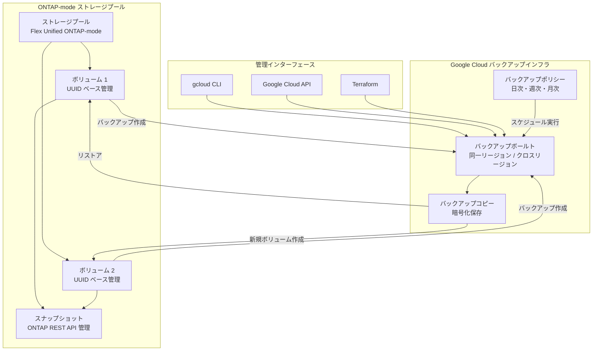

# NetApp Volumes: ONTAP-mode バックアップ機能が一般提供 (GA) に

**リリース日**: 2026-06-09

**サービス**: Google Cloud NetApp Volumes

**機能**: Backup capabilities for ONTAP-mode are generally available (GA)

**ステータス**: 一般提供 (GA)

[このアップデートのインフォグラフィックを見る](https://takech9203.github.io/google-cloud-news-summary/20260609-netapp-volumes-ontap-mode-backup-ga.html)

## 概要

Google Cloud NetApp Volumes の ONTAP-mode におけるバックアップ機能が一般提供 (GA) となりました。これにより、ONTAP-mode ストレージプールで管理されるボリュームに対して、手動バックアップおよびスケジュールバックアップを本番環境で安心して利用できるようになります。

ONTAP-mode は、NetApp Volumes の Flex Unified サービスレベルで提供されるデプロイメントモードで、ストレージプールを ONTAP システムとして管理できる高度な機能です。今回の GA により、エンタープライズ向けファイルストレージにおけるデータ保護の選択肢が大幅に強化され、既存の ONTAP 運用経験を持つ組織がクラウドでも同等のバックアップ運用を実現できます。

対象ユーザーは、既に NetApp ONTAP の運用経験を持つエンタープライズ組織、高度なストレージ管理機能を必要とするワークロード運用者、および Google Cloud 上でミッションクリティカルなファイルストレージを運用しているチームです。

**アップデート前の課題**

- ONTAP-mode のバックアップ機能はプレビュー段階であり、本番ワークロードでの利用に SLA が保証されていなかった
- ONTAP-mode ボリュームのバックアップに対する Google Cloud のサポートが限定的であった
- エンタープライズ顧客がクラウド上の ONTAP-mode ボリュームのデータ保護に確信を持てなかった

**アップデート後の改善**

- ONTAP-mode バックアップ機能が GA となり、SLA に基づく本番運用が可能になった
- 手動バックアップとスケジュールバックアップの両方が正式にサポートされた
- Google Cloud CLI および API を使用したバックアップの作成・管理・リストアが完全にサポートされた
- バックアップボールトへの保存、バックアップポリシーによる自動化、選択的ファイルリストアが利用可能になった

## アーキテクチャ図



ONTAP-mode では、ボリュームやスナップショットの管理は ONTAP REST API で行い、バックアップ関連の操作 (バックアップボールト、バックアップポリシー) は Google Cloud API / gcloud CLI で管理するハイブリッドなアーキテクチャとなっています。

## サービスアップデートの詳細

### 主要機能

1. **手動バックアップの作成**
   - gcloud CLI を使用して ONTAP-mode ボリュームの手動バックアップを作成可能
   - ボリューム UUID とストレージプール名を指定する `--ontap-source` パラメータによるバックアップ
   - 特定のスナップショットからのバックアップ作成にも対応

2. **スケジュールバックアップの自動化**
   - バックアップポリシーを設定し、日次・週次・月次の自動バックアップを実現
   - `gcloud netapp storage-pools update-backup-config` コマンドでスケジュール設定を管理
   - 保持数に達した場合の古いバックアップの自動削除

3. **バックアップからのリストア**
   - 完全リストア: データ保護 (DP) ボリュームへの復元
   - 選択的ファイルリストア: 特定のファイルのみを指定パスに復元
   - `gcloud netapp storage-pools restore-volume` コマンドによるリストア操作

4. **クロスリージョンバックアップ**
   - Flex Unified サービスレベルでクロスリージョンバックアップボールトをサポート
   - 同一リージョングループ内でのバックアップ保存が可能
   - ソースまたはデスティネーションリージョンでのリストアに対応

## 技術仕様

### ONTAP-mode バックアップの管理分担

| 操作 | 管理ツール |
|------|-----------|
| ストレージプール管理 | Google Cloud Console / gcloud CLI / Terraform |
| ボリューム作成・管理 | ONTAP REST API |
| スナップショット管理 | ONTAP REST API |
| バックアップ作成・管理 | gcloud CLI / Google Cloud API |
| バックアップポリシー設定 | gcloud CLI / Google Cloud API |
| バックアップボールト管理 | Google Cloud Console / gcloud CLI / Terraform |
| CMEK 暗号化設定 | Google Cloud Console / gcloud CLI / Terraform |

### バックアップポリシーの保持設定

| バックアップ種別 | 説明 |
|----------------|------|
| 日次バックアップ | 毎日自動作成、指定数を保持 |
| 週次バックアップ | 毎週自動作成、指定数を保持 |
| 月次バックアップ | 毎月自動作成、指定数を保持 |

## 設定方法

### 前提条件

1. Flex Unified サービスレベルの ONTAP-mode ストレージプールが作成済みであること
2. バックアップボールトが作成済みであること
3. バックアップ対象のボリュームの UUID を把握していること

### 手順

#### ステップ 1: ボリューム UUID の確認

ONTAP-mode ではボリュームの UUID が必要です。ストレージプール内の全ボリュームを一覧表示して UUID を確認します。

```bash
# ストレージプール内のボリューム一覧を取得
gcloud netapp storage-pools describe STORAGE_POOL_NAME \
  --location=LOCATION
```

#### ステップ 2: バックアップの作成

```bash
# ONTAP-mode ボリュームのバックアップを作成
gcloud netapp backup-vaults backups create BACKUP_NAME \
  --location=LOCATION \
  --backup-vault projects/PROJECT_NAME/locations/LOCATION/backupVaults/BACKUP_VAULT_NAME \
  --description="ONTAP-mode volume backup" \
  --ontap-source=storage-pool=projects/PROJECT_ID/locations/LOCATION/storagePools/STORAGE_POOL_NAME,volume-uuid=VOLUME_UUID,snapshot-uuid=SNAPSHOT_UUID
```

#### ステップ 3: スケジュールバックアップの設定

```bash
# バックアップポリシーの適用とスケジュール有効化
gcloud netapp storage-pools update-backup-config STORAGE_POOL \
  --location=LOCATION \
  --volume-uuid=VOLUME_UUID \
  --backup-vault=projects/PROJECT_NAME/locations/LOCATION/backupVaults/BACKUP_VAULT_NAME \
  --backup-policy=projects/PROJECT_NAME/locations/LOCATION/backupPolicies/BACKUP_POLICY \
  --enable-scheduled-backups=true
```

#### ステップ 4: バックアップからのリストア

```bash
# 完全リストア
gcloud netapp storage-pools restore-volume STORAGE_POOL \
  --location=LOCATION \
  --backup="projects/PROJECT_NAME/locations/LOCATION/backupVaults/BACKUP_VAULT_NAME/backups/BACKUP_NAME" \
  --volume-uuid=VOLUME_UUID

# 選択的ファイルリストア
gcloud netapp storage-pools restore-volume STORAGE_POOL \
  --location=LOCATION \
  --backup="projects/PROJECT_NAME/locations/LOCATION/backupVaults/BACKUP_VAULT_NAME/backups/BACKUP_NAME" \
  --volume-uuid=VOLUME_UUID \
  --files="/path/to/file1.txt,/path/to/file2.dat" \
  --destination-path="/restore_destination"
```

## メリット

### ビジネス面

- **本番環境での信頼性**: GA リリースにより SLA が保証され、ミッションクリティカルなワークロードのバックアップに利用可能
- **運用コストの削減**: スケジュールバックアップの自動化により、手動運用の負荷を軽減
- **コンプライアンス対応**: 最小保持期間の設定によりデータ保持ポリシーへの準拠を強制可能
- **事業継続性の向上**: クロスリージョンバックアップにより、リージョン障害からの復旧が可能

### 技術面

- **ONTAP 運用との親和性**: 既存の ONTAP 運用知識をそのまま活用しつつ、Google Cloud のバックアップインフラを利用可能
- **きめ細かなリストア**: 完全リストアだけでなく、選択的ファイルリストアにも対応
- **暗号化**: Google 管理鍵に加え、CMEK による顧客管理暗号化キーでのバックアップ暗号化をサポート (プレビュー)
- **モード間の相互運用性**: Default-mode と ONTAP-mode 間でのバックアップリストアが可能

## デメリット・制約事項

### 制限事項

- Google Cloud Console からの ONTAP-mode バックアップ操作は制限されている (スケジュール設定、リストア、ボリューム-ボールト関連の表示は非対応)
- ONTAP-mode ボリュームは Console に表示されないため、API または gcloud CLI での操作が必須
- CMEK バックアップ暗号化は ONTAP-mode ではプレビュー段階
- ボリュームは 1 つのバックアップボールトにのみバックアップ可能

### 考慮すべき点

- ONTAP-mode の利用には NetApp ONTAP の概念と管理に関する知識が必要
- バックアップボールトは同一リージョンまたは同一リージョングループ内に限定される
- バックアップ作成にはボリューム UUID の把握が必要であり、Default-mode に比べて操作が複雑
- 完全リストアにはデータ保護 (DP) タイプのボリュームの事前作成が必要

## ユースケース

### ユースケース 1: エンタープライズ NAS のクラウド移行とバックアップ

**シナリオ**: オンプレミスの NetApp ONTAP ストレージからクラウドへ移行した組織が、従来と同等のバックアップ運用をクラウド上で維持したい場合。

**実装例**:
```bash
# 日次 7 世代、週次 4 世代、月次 12 世代のバックアップポリシーを作成
gcloud netapp backup-policies create enterprise-backup-policy \
  --location=us-central1 \
  --daily-backup-limit=7 \
  --weekly-backup-limit=4 \
  --monthly-backup-limit=12 \
  --enabled=true

# ボリュームにバックアップポリシーを適用
gcloud netapp storage-pools update-backup-config my-ontap-pool \
  --location=us-central1 \
  --volume-uuid=VOLUME_UUID \
  --backup-vault=projects/my-project/locations/us-central1/backupVaults/enterprise-vault \
  --backup-policy=projects/my-project/locations/us-central1/backupPolicies/enterprise-backup-policy \
  --enable-scheduled-backups=true
```

**効果**: オンプレミスと同等のバックアップスケジュールをクラウド上で自動化し、運用チームの負荷を削減しながらデータ保護レベルを維持。

### ユースケース 2: 災害復旧 (DR) のためのクロスリージョンバックアップ

**シナリオ**: 金融機関や医療機関など、データ損失が許容されない環境で、リージョン障害に備えたクロスリージョンバックアップを実施したい場合。

**効果**: 別リージョンにバックアップを保持することで、プライマリリージョンの障害時にもデータを復旧可能。最小保持期間の設定により、誤削除からもデータを保護。

### ユースケース 3: 選択的ファイルリストアによる迅速な復旧

**シナリオ**: ユーザーが誤ってファイルを削除・上書きした際に、ボリューム全体をリストアすることなく、特定のファイルのみを迅速に復元したい場合。

**効果**: 完全リストアに比べて復旧時間を大幅に短縮し、他のファイルへの影響を回避。業務停止時間の最小化に貢献。

## 料金

NetApp Volumes の料金はサービスレベルと割り当て容量に基づきます。ONTAP-mode は Flex Unified サービスレベルで提供されます。

### 料金例 (us-central1 リージョン)

| 項目 | 月額料金 (概算) |
|------|-----------------|
| Flex Unified ストレージ容量 | $0.105 / GiB / 月 (カスタムプロビジョニング) |
| バックアップストレージ | 別途バックアップ容量に応じた課金 |

バックアップの詳細な料金については [NetApp Volumes 料金ページ](https://cloud.google.com/netapp/volumes/pricing) を参照してください。

## 利用可能リージョン

ONTAP-mode (Flex Unified) は以下のリージョンで利用可能です:

- **北米**: us-central1, us-east1, us-east4, us-south1, us-west1, us-west4
- **ヨーロッパ**: europe-west1, europe-west3, europe-west4
- **アジア太平洋**: asia-northeast2, asia-south1, asia-southeast1, australia-southeast1
- **中東**: me-central2, me-west1
- **南米**: southamerica-east1

制限付きパフォーマンスリージョン: asia-northeast1, europe-west2, europe-west9, us-east5, us-west2, us-west3

## 関連サービス・機能

- **NetApp Volumes Default-mode**: ONTAP の知識不要で利用できる標準モード。Console からの完全な操作が可能
- **NetApp Volumes ボリュームレプリケーション**: SnapMirror 技術による非同期リージョン間レプリケーション
- **NetApp Volumes スナップショット**: ONTAP REST API で管理するゼロフットプリントのスナップショット
- **Cloud Storage**: オブジェクトストレージによる大容量アーカイブバックアップ
- **Persistent Disk スナップショット**: Compute Engine ディスクのバックアップ (ブロックストレージ向け)

## 参考リンク

- [インフォグラフィック](https://takech9203.github.io/google-cloud-news-summary/20260609-netapp-volumes-ontap-mode-backup-ga.html)
- [公式リリースノート](https://docs.cloud.google.com/release-notes#June_09_2026)
- [NetApp Volumes バックアップについて](https://docs.cloud.google.com/netapp/volumes/docs/protect-data/about-backups)
- [ONTAP-mode 概要](https://docs.cloud.google.com/netapp/volumes/docs/ontap/overview)
- [バックアップの作成](https://docs.cloud.google.com/netapp/volumes/docs/protect-data/create-backup)
- [バックアップからのリストア](https://docs.cloud.google.com/netapp/volumes/docs/protect-data/create-volume-from-backup)
- [料金ページ](https://cloud.google.com/netapp/volumes/pricing)

## まとめ

NetApp Volumes の ONTAP-mode バックアップ機能が GA となったことで、エンタープライズ顧客は Google Cloud 上で ONTAP の高度なストレージ管理機能を活用しながら、信頼性の高いバックアップとリストアを本番ワークロードに適用できるようになりました。既に NetApp ONTAP を使用している組織にとって、クラウド移行後も一貫したデータ保護戦略を維持できる重要なマイルストーンです。次のステップとして、バックアップポリシーの設計とバックアップボールトの作成を計画し、段階的にスケジュールバックアップを導入することを推奨します。

---

**タグ**: #NetAppVolumes #ONTAP #Backup #GA #DataProtection #EnterpriseStorage #FlexUnified #DisasterRecovery
