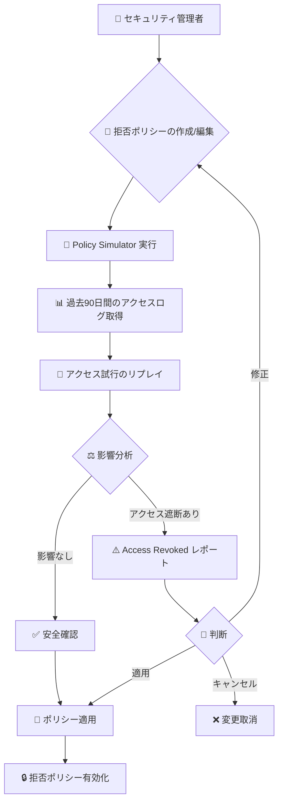

# Policy Intelligence: Policy Simulator for Deny Policies が一般提供開始

**リリース日**: 2026-06-09

**サービス**: Policy Intelligence

**機能**: Policy Simulator for Deny Policies

**ステータス**: 一般提供 (GA)

📊 [このアップデートのインフォグラフィックを見る](https://takech9203.github.io/google-cloud-news-summary/20260609-policy-intelligence-deny-simulator-ga.html)

## 概要

Policy Intelligence の Policy Simulator for Deny Policies が一般提供 (GA) となった。この機能により、IAM の拒否ポリシー (Deny Policy) を本番環境に適用する前に、その変更がプリンシパルのアクセスにどのような影響を与えるかをシミュレーションで確認できるようになる。

Policy Simulator は過去 90 日間のアクセスログを分析し、提案された拒否ポリシーの変更が実際のアクセスパターンに与える影響をレポートする。これにより、意図しないアクセスブロックを事前に検出し、重要なサービスやユーザーが誤ってロックアウトされることを防止できる。

GA 昇格により、本番環境での利用に対する SLA が適用され、エンタープライズグレードのセキュリティポリシー管理ワークフローに組み込むことが可能になった。

**アップデート前の課題**

- 拒否ポリシーの変更が実際のアクセスに与える影響を事前に把握する手段がなく、本番適用後に初めて問題が発覚するリスクがあった
- 大規模な組織で拒否ポリシーを導入する際、影響範囲の特定が困難で、サービスアカウントや重要なワークロードが意図せずブロックされる可能性があった
- 拒否ポリシーの変更をテストするためにステージング環境を用意する必要があり、本番環境のアクセスパターンを正確に再現できなかった
- Preview 段階では SLA が適用されず、ミッションクリティカルなワークフローへの組み込みが難しかった

**アップデート後の改善**

- 拒否ポリシーを適用する前に、過去 90 日間の実際のアクセスログに基づいてシミュレーションを実行し、影響を受けるプリンシパルを特定できるようになった
- シミュレーション結果に基づいて「ポリシーを適用」「ポリシーを修正」「キャンセル」の判断を行えるワークフローが確立された
- GA 昇格により SLA が適用され、エンタープライズのセキュリティガバナンスパイプラインに安心して組み込めるようになった
- Google Cloud コンソールから直感的にシミュレーションの開始、結果の確認、ポリシーの適用が一貫して行えるようになった

## アーキテクチャ図



Policy Simulator は管理者が拒否ポリシーを作成または編集した後、実際に適用する前にシミュレーションを実行し、過去のアクセスパターンに基づいて影響を分析するワークフローを提供する。

## サービスアップデートの詳細

### 主要機能

1. **アクセスログベースのシミュレーション**
   - 過去 90 日間 (リプレイ期間) の組織のアクセスログを取得し分析
   - 各プリンシパルの最新のアクセス試行を関連ログとして特定
   - 提案された拒否ポリシーの変更に基づいてアクセス試行をリプレイ
   - 組織が 90 日未満の場合は、作成以降の全アクセスログを使用

2. **Access Changes レポート**
   - シミュレーション結果を「Access Revoked」(アクセス遮断) として報告
   - 影響を受けるプリンシパル、リソース、権限を詳細に表示
   - リプレイ期間中のアクセス試行回数と最終アクセス日を表示
   - CSV 形式でのエクスポートに対応

3. **シミュレーション管理**
   - Google Cloud コンソールから新規ポリシーの作成時 (Test policy) と既存ポリシーの編集時 (Test changes) にシミュレーション可能
   - ユーザーあたり最大 50 件の同時シミュレーションに対応
   - 過去 14 日間のシミュレーション履歴を保持
   - シミュレーション完了後に「適用」「修正」「キャンセル」のアクションを選択可能

4. **ワンクリックポリシー適用**
   - シミュレーション結果を確認後、「Set policy」ボタンでそのまま本番環境にポリシーを適用
   - 追加の修正が必要な場合は「Modify policy」で拒否ポリシーエディタに遷移

## 技術仕様

### シミュレーション仕様

| 項目 | 詳細 |
|------|------|
| リプレイ期間 | 90 日間 (組織が 90 日未満の場合は全期間) |
| 最大同時シミュレーション数 | 50 件/ユーザー |
| タイムアウト | 24 時間 |
| シミュレーション履歴保持期間 | 14 日間 |
| 結果エクスポート形式 | CSV |
| 一貫性モデル | 結果整合性 (Eventual Consistency) |

### サポートされるプリンシパルタイプ

| プリンシパルタイプ | サポート状況 |
|------|------|
| Google Workspace アカウント | サポート対象 |
| サービスアカウント | サポート対象 |
| サービスアカウント プリンシパルセット | サポート対象 |
| サービスエージェント | サポート対象 |
| サービスエージェント プリンシパルセット | サポート対象 |
| Workload Identity Pool のフェデレーション ID | 非サポート |

### 必要な権限

```json
{
  "required_role": "roles/iam.denyAdmin",
  "role_name": "Deny Admin",
  "required_apis": [
    "policysimulator.googleapis.com",
    "iam.googleapis.com"
  ],
  "key_permissions": [
    "policysimulator.accessPolicySimulations.create",
    "policysimulator.accessPolicySimulations.get",
    "policysimulator.accessPolicySimulationResults.list"
  ]
}
```

## 設定方法

### 前提条件

1. Policy Simulator API と Identity and Access Management API が有効化されていること
2. シミュレーション実行者に `roles/iam.denyAdmin` ロールが付与されていること
3. API 有効化には `roles/serviceusage.serviceUsageAdmin` ロールが必要

### 手順

#### ステップ 1: API の有効化

```bash
# Policy Simulator API を有効化
gcloud services enable policysimulator.googleapis.com

# IAM API を有効化
gcloud services enable iam.googleapis.com
```

#### ステップ 2: 新規拒否ポリシーのシミュレーション

```bash
# Google Cloud コンソールで実行:
# 1. IAM ページの「Deny」タブに移動
# 2. プロジェクト、フォルダ、または組織を選択
# 3. 拒否ポリシーを作成し、「Test policy」をクリック
```

Google Cloud コンソールの IAM > Deny タブから、拒否ポリシーの作成画面で詳細を入力後、「Create」の代わりに「Test policy」をクリックすることでシミュレーションが開始される。

#### ステップ 3: 既存拒否ポリシーの変更シミュレーション

```bash
# Google Cloud コンソールで実行:
# 1. IAM ページの「Deny」タブで対象ポリシーの ID をクリック
# 2. 「Edit」をクリックして変更を加える
# 3. 「Test changes」をクリックしてシミュレーション開始
```

既存ポリシーの編集画面で変更を加え、「Test changes」をクリックすることでシミュレーションが開始される。

#### ステップ 4: シミュレーション結果の確認と適用

```bash
# Google Cloud コンソールで実行:
# 1. Deny simulation reports ページに移動
# 2. 対象シミュレーションの「View report」をクリック
# 3. 結果を確認し、「Set policy」で適用または「Modify policy」で修正
```

## メリット

### ビジネス面

- **運用リスクの低減**: 拒否ポリシーの誤設定によるサービス障害やユーザーロックアウトを事前に防止でき、ダウンタイムやインシデント対応コストを削減
- **コンプライアンス対応の効率化**: ポリシー変更の影響を事前に可視化することで、監査証跡の作成やガバナンスレビューの効率が向上
- **意思決定の迅速化**: 定量的なシミュレーション結果に基づいてポリシー変更の可否を判断でき、承認プロセスが短縮

### 技術面

- **実データに基づく検証**: ステージング環境では再現できない本番のアクセスパターン (90 日分) を使用してシミュレーションを実行
- **プロアクティブなセキュリティ管理**: リアクティブ (問題発生後の対応) からプロアクティブ (問題発生前の予防) なセキュリティポリシー管理への移行を実現
- **GA レベルの信頼性**: SLA 適用により、CI/CD パイプラインや自動化ワークフローに安心して組み込み可能

## デメリット・制約事項

### 制限事項

- Workload Identity Pool のフェデレーション ID はシミュレーション対象外。フェデレーション ID を使用している環境では影響の一部が検出されない可能性がある
- Credential Access Boundaries (ダウンスコープ) を使用している場合、トークンブローカーの権限変更がトークンコンシューマーに与える影響は評価されない
- シミュレーションのタイムアウトは 24 時間。大規模な組織では処理に時間がかかる場合がある
- リプレイ期間の一貫性は結果整合性のため、直近数日のアクセスログが反映されていない場合がある (最大 15 日のずれ)
- Workforce Identity のプリンシパル識別子を使用する拒否ルールは「無効なシミュレーション構成」としてエラーになる

### 考慮すべき点

- 90 日間使用されていない権限はシミュレーション対象外のため、稀にしか使用しない権限 (障害時の緊急アクセスなど) の影響が検出されない可能性がある
- シミュレーション結果はアクセスログの時点の状態を基に比較されるため、現在のアクセス状態とは異なる場合がある
- 同時実行数が 50 件に制限されているため、大規模な自動化パイプラインでは実行計画の調整が必要

## ユースケース

### ユースケース 1: 管理権限の集中化

**シナリオ**: 組織全体でカスタムロールの管理を特定のセキュリティチームに限定したい。全ユーザーに対して `iam.googleapis.com/roles.create`、`iam.googleapis.com/roles.update`、`iam.googleapis.com/roles.delete` を拒否し、例外としてセキュリティチームのグループのみ許可する。

**実装例**:
```json
{
  "deniedPrincipals": [
    "principalSet://goog/public:all"
  ],
  "exceptionPrincipals": [
    "principalSet://goog/group/security-admins@example.com"
  ],
  "deniedPermissions": [
    "iam.googleapis.com/roles.create",
    "iam.googleapis.com/roles.delete",
    "iam.googleapis.com/roles.update"
  ]
}
```

**効果**: シミュレーションにより、現在カスタムロールを管理しているがセキュリティチーム以外のプリンシパルを事前に特定し、移行計画を策定できる。

### ユースケース 2: プロジェクト単位のアクセス制限

**シナリオ**: 本番プロジェクトでサービスアカウントキーの作成・削除を制限したいが、開発チーム全体には他のプロジェクトでの権限を維持させたい。

**実装例**:
```json
{
  "deniedPrincipals": [
    "principalSet://goog/group/engineering@example.com"
  ],
  "exceptionPrincipals": [
    "principalSet://goog/group/prod-ops@example.com"
  ],
  "deniedPermissions": [
    "iam.googleapis.com/serviceAccountKeys.create",
    "iam.googleapis.com/serviceAccountKeys.delete"
  ]
}
```

**効果**: 本番プロジェクトに適用する前にシミュレーションを実行し、現在サービスアカウントキーを使用している開発者を特定して事前に通知できる。

### ユースケース 3: セキュリティポリシーの段階的展開

**シナリオ**: 新しいセキュリティ要件に基づいて複数の拒否ポリシーを組織全体に展開する必要がある。各ポリシーの影響を個別にシミュレーションし、安全に段階的に適用したい。

**効果**: 各拒否ポリシーの影響範囲を事前に把握し、影響が小さいものから順に適用することで、リスクを最小化した段階的展開が可能。

## 料金

Policy Simulator for Deny Policies は Policy Intelligence の一部として提供される。具体的な料金については以下の公式ページを参照。

- [Policy Intelligence の料金](https://cloud.google.com/policy-intelligence/pricing)

## 利用可能リージョン

Policy Simulator for Deny Policies はグローバルサービスとして提供されており、すべての Google Cloud リージョンで利用可能。シミュレーションは組織、フォルダ、プロジェクトレベルで実行できる。

## 関連サービス・機能

- **Policy Simulator for Allow Policies**: IAM 許可ポリシーの変更をシミュレーションする姉妹機能。ロールの変更が既存のアクセスに与える影響を事前確認
- **Policy Simulator for Principal Access Boundary Policies**: プリンシパルアクセス境界ポリシーの変更シミュレーション
- **Policy Simulator for Organization Policies**: 組織ポリシーの変更がリソースに与える影響をプレビュー
- **Policy Analyzer**: IAM 許可ポリシーを分析し、誰がどのリソースにアクセスできるかを可視化
- **Policy Troubleshooter**: アクセス拒否の原因を特定するトラブルシューティングツール
- **IAM Recommender**: 最小権限の原則に基づくロール推奨を提供
- **Cloud Audit Logs**: シミュレーションの基盤となるアクセスログを記録

## 参考リンク

- 📊 [インフォグラフィック](https://takech9203.github.io/google-cloud-news-summary/20260609-policy-intelligence-deny-simulator-ga.html)
- [公式リリースノート](https://docs.cloud.google.com/release-notes#June_09_2026)
- [Policy Simulator for Deny Policies 概要](https://docs.cloud.google.com/policy-intelligence/docs/deny-simulator-overview)
- [拒否ポリシーの変更をシミュレーションする](https://docs.cloud.google.com/policy-intelligence/docs/simulate-deny-policies)
- [IAM 拒否ポリシーの概要](https://docs.cloud.google.com/iam/docs/deny-overview)
- [Policy Intelligence 概要](https://docs.cloud.google.com/policy-intelligence/docs/overview)
- [料金ページ](https://cloud.google.com/policy-intelligence/pricing)

## まとめ

Policy Simulator for Deny Policies の GA 昇格により、エンタープライズ環境でのセキュリティポリシー管理がより安全かつ予測可能になった。拒否ポリシーの変更前に過去 90 日間の実アクセスデータに基づくシミュレーションを実行することで、意図しないアクセス遮断やサービス障害を未然に防止できる。セキュリティチームは直ちにこの機能をポリシー変更ワークフローに組み込み、変更管理プロセスの一部としてシミュレーション実行を標準化することを推奨する。

---

**タグ**: #PolicyIntelligence #IAM #DenyPolicy #PolicySimulator #Security #GA #Governance
