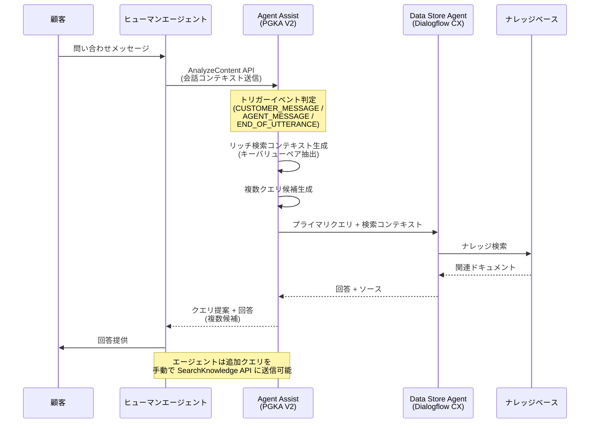

# Agent Assist: Proactive Generative Knowledge Assist V2 が一般提供開始

**リリース日**: 2026-06-10

**サービス**: Agent Assist (Gemini Enterprise for Customer Experience)

**機能**: Proactive Generative Knowledge Assist V2

**ステータス**: 一般提供 (GA)

[このアップデートのインフォグラフィックを見る](https://takech9203.github.io/google-cloud-news-summary/20260610-agent-assist-proactive-knowledge-assist-v2-ga.html)

## 概要

Google Cloud の Agent Assist において、Proactive Generative Knowledge Assist (PGKA) V2 が一般提供 (GA) として正式リリースされました。PGKA V2 は、コンタクトセンターのヒューマンエージェントと顧客間の会話をリアルタイムで分析し、エージェントが必要とする情報を先回りして提案する AI 支援機能の最新バージョンです。

V2 では、リッチ検索コンテキスト、複数クエリ提案、トリガーイベントのきめ細やかな制御という 3 つの主要な強化が導入されました。これにより、エージェントはより関連性の高い情報をより適切なタイミングで受け取ることが可能となり、顧客対応の質と速度が大幅に向上します。

本機能は、カスタマーサポートセンター、ヘルプデスク、テクニカルサポートなど、ナレッジベースを活用した顧客対応を行うすべての組織に適しています。チャットと音声の両チャネルで利用可能です。

**アップデート前の課題**

- V1 では単一のクエリ提案のみで、会話中に複数のトピックが議論されても一つの検索候補しか提示されなかった
- 検索コンテキストの制御が限定的で、クエリのみで検索が実行されるため精度が不十分な場合があった
- トリガーイベントが顧客メッセージ受信時のみに固定されており、エージェントのワークフローに柔軟に対応できなかった

**アップデート後の改善**

- 会話から抽出したキーバリューペアによるリッチ検索コンテキストが追加され、検索精度が大幅に向上
- 複数の関連クエリが同時に提案されるようになり、会話中の複数トピックに対応可能に
- `suggestion_trigger_event` フィールドによりトリガーイベントを CUSTOMER_MESSAGE、AGENT_MESSAGE、END_OF_UTTERANCE から選択可能に

## アーキテクチャ図



PGKA V2 は会話をリアルタイムで監視し、設定されたトリガーイベントに基づいて検索クエリとコンテキストを自動生成します。プライマリクエリは自動的にナレッジベースに送信され、追加のクエリ候補はエージェントが必要に応じて手動で実行できます。

## サービスアップデートの詳細

### 主要機能

1. **リッチ検索コンテキスト (Search Context)**
   - 会話の内容からキーバリューペアを自動抽出し、検索クエリに付加情報として追加
   - 検索精度が向上し、より関連性の高いナレッジ記事が提案される
   - `disable_query_search_context` フィールドで有効/無効を制御可能
   - 無効化した場合、クエリのみでナレッジベース検索が実行される

2. **複数クエリ提案 (Multiple Suggested Queries)**
   - 会話中に議論される複数のトピックに対して、それぞれ関連する検索クエリを生成
   - プライマリクエリは自動的にナレッジ検索に送信される
   - 追加のクエリはエージェントが SearchKnowledge API を通じて手動で実行可能
   - `enableQuerySuggestionWhenNoAnswer` を有効にすると、回答が見つからない場合でもクエリ候補を表示

3. **トリガーイベントのカスタマイズ (Customize Event Initiation)**
   - `suggestion_trigger_event` フィールドで提案のトリガーを制御
   - CUSTOMER_MESSAGE: 顧客メッセージ受信時 (デフォルト)
   - AGENT_MESSAGE: エージェントメッセージ送信時
   - END_OF_UTTERANCE: 発話終了検出時 (音声対応)

## 技術仕様

### 設定パラメータ

| パラメータ | 説明 | デフォルト値 |
|------|------|------|
| `baseline_model_version` | モデルバージョン | `"2.0"` |
| `disable_query_search_context` | 検索コンテキストの無効化 | `false` (コンテキスト有効) |
| `enableQuerySuggestionWhenNoAnswer` | 回答なし時のクエリ表示 | `false` |
| `suggestion_trigger_event` | 提案トリガーイベント | `CUSTOMER_MESSAGE` |

### 対応チャネル

| チャネル | サポート状況 |
|------|------|
| チャット (Web, Mobile, SMS, WhatsApp) | GA |
| 音声 (Voice) | GA |

### Conversation Profile 設定例

```json
{
  "name": "projects/PROJECT_ID/locations/LOCATION/conversationProfiles/PROFILE_ID",
  "human_agent_assistant_config": {
    "human_agent_suggestion_config": {
      "feature_configs": [
        {
          "suggestion_feature": {
            "type": "KNOWLEDGE_ASSIST"
          },
          "query_config": {
            "dialogflow_query_source": {
              "agent": "projects/PROJECT_ID/locations/LOCATION/agents/AGENT_ID"
            }
          },
          "conversation_model_config": {
            "baseline_model_version": "2.0"
          },
          "disable_query_search_context": false,
          "enableQuerySuggestionWhenNoAnswer": false,
          "suggestion_trigger_event": "END_OF_UTTERANCE"
        }
      ]
    }
  }
}
```

## 設定方法

### 前提条件

1. Google Cloud プロジェクトで Dialogflow API が有効化されていること
2. Flow-based Data Store Agent または Playbook-based Data Store Agent が作成済みであること
3. ナレッジベースとして使用するドキュメント (ウェブサイト、PDF、FAQ など) が準備されていること

### 手順

#### ステップ 1: Data Store Agent の作成

Dialogflow CX コンソールで Flow-based Data Store Agent または Playbook-based Data Store Agent を作成し、ナレッジベースとなるデータソースを接続します。

```bash
# Dialogflow CX API を使用してエージェントを作成する場合
gcloud dialogflow cx agents create \
  --display-name="knowledge-agent" \
  --location=LOCATION_ID \
  --default-language-code=ja \
  --time-zone="Asia/Tokyo"
```

#### ステップ 2: Conversation Profile の作成 (コンソール)

1. [Agent Assist コンソール](https://agentassist.cloud.google.com/) にアクセス
2. 「Conversation Profile」タブをクリック
3. 「Generative knowledge assist」を有効化し、ステップ 1 で作成した Data Store Agent をリンク
4. `baseline_model_version` を `2.0` に設定
5. オプション: 「Show all suggested queries for conversation」を有効化してテスト
6. オプション: 「Load proactive answers asynchronously」を有効化してクエリ提案のみ取得

#### ステップ 3: ランタイム会話の処理

```python
from google.cloud import dialogflow_v2beta1 as dialogflow

def analyze_content(project_id, conversation_id, participant_id, text):
    client = dialogflow.ParticipantsClient()
    participant_path = client.participant_path(
        project_id, conversation_id, participant_id
    )
    text_input = {"text": text, "language_code": "ja"}
    response = client.analyze_content(
        participant=participant_path,
        text_input=text_input
    )
    
    for suggestion_result in response.human_agent_suggestion_results:
        if suggestion_result.suggest_knowledge_assist_response:
            knowledge_answer = suggestion_result.suggest_knowledge_assist_response
            print(f"Suggested Query: {knowledge_answer.suggested_query}")
            print(f"Answer: {knowledge_answer.suggested_query_answer}")
    
    return response
```

#### ステップ 4: Agent Assist シミュレーターでテスト

Agent Assist コンソールのシミュレーターを使用して、作成した Conversation Profile の動作を確認します。

## メリット

### ビジネス面

- **顧客対応時間の短縮**: エージェントが情報を検索する時間が削減され、平均処理時間 (AHT) が改善
- **顧客満足度の向上**: より正確で一貫性のある回答が迅速に提供されることで CSAT スコアが向上
- **エージェント育成コストの削減**: 新人エージェントでもナレッジベースから適切な情報が自動提案されるため、トレーニング期間が短縮

### 技術面

- **検索精度の向上**: リッチコンテキストにより、単純なキーワードマッチングを超えた意味的な検索が実現
- **柔軟なイベント駆動**: 3 種類のトリガーイベントにより、様々なワークフローに対応可能
- **非同期処理対応**: プロアクティブ回答の非同期読み込みにより、クエリ提案のみの軽量モードが選択可能

## デメリット・制約事項

### 制限事項

- Dialogflow CX の Flow-based Data Store Agent または Playbook-based Data Store Agent の事前構築が必須
- リアルタイム処理のため、大量のナレッジドキュメントがある場合はレイテンシに影響する可能性
- 検索コンテキストの品質は会話の内容に依存するため、初期のやり取りが少ない段階では精度が低い場合がある

### 考慮すべき点

- ゴールデンセット (20-30 件の評価用データ) を作成して品質を事前評価することを推奨
- Data Store の信頼度レベルを Medium に設定すると提案数が増加するが、関連性が低い提案も含まれる可能性
- カスタムプロンプトやドキュメントメタデータの充実により検索精度を継続的に改善する必要がある

## ユースケース

### ユースケース 1: テクニカルサポートセンター

**シナリオ**: 顧客がクラウドサービスの設定エラーについて問い合わせ。会話中に認証、ネットワーク、権限の複数トピックが議論される。

**実装例**:
```json
{
  "suggestion_trigger_event": "CUSTOMER_MESSAGE",
  "disable_query_search_context": false,
  "enableQuerySuggestionWhenNoAnswer": true
}
```

**効果**: 複数クエリ提案により、認証設定、ネットワーク構成、IAM 権限それぞれについて関連ドキュメントが自動提案。エージェントは問題の切り分けと解決を迅速に実施可能。

### ユースケース 2: 音声対応コールセンター

**シナリオ**: 電話サポートで顧客が製品の使い方を質問。音声認識と連動して発話終了時に提案を生成。

**実装例**:
```json
{
  "suggestion_trigger_event": "END_OF_UTTERANCE",
  "disable_query_search_context": false,
  "enableQuerySuggestionWhenNoAnswer": false
}
```

**効果**: END_OF_UTTERANCE トリガーにより、顧客の発話が終わった瞬間に関連情報が提案される。音声対応特有のリアルタイム性要件に対応し、保留時間を最小化。

### ユースケース 3: 金融機関のカスタマーサービス

**シナリオ**: 口座開設、ローン審査、投資商品について多岐にわたる問い合わせを受けるエージェントに対し、コンプライアンス情報を含む正確な回答を支援。

**効果**: リッチ検索コンテキストにより顧客属性や取引履歴を加味した検索が実行され、適用される規制やポリシーに関する正確なドキュメントが提案される。

## 料金

Agent Assist の料金体系はコミュニケーションチャネルに基づいて課金されます。

### 料金例

| チャネル | 月額料金 |
|--------|-----------------|
| Agent Assist for Chat | $0.06 / セッション |
| Agent Assist for Voice | Google Cloud 営業担当にお問い合わせください |

※ PGKA V2 は Agent Assist の機能の一部として提供され、追加料金は発生しません。詳細は [Agent Assist 料金ページ](https://cloud.google.com/agent-assist/pricing) を参照してください。

## 利用可能リージョン

Agent Assist はリージョナライズされた環境で利用可能です。Conversation Profile 作成時に `LOCATION_ID` を指定することで、データ所在地の要件に対応できます。具体的な対応リージョンについては [Agent Assist ドキュメント](https://docs.cloud.google.com/agent-assist/docs) を参照してください。

## 関連サービス・機能

- **Generative Knowledge Assist**: エージェントが手動で質問した際にナレッジベースから回答を生成する機能。PGKA と組み合わせて使用可能
- **Dialogflow CX**: Data Store Agent の基盤となるプラットフォーム。ナレッジベース検索エンジンとして機能
- **Agent Assist Summarization**: 会話終了時に自動要約を生成する機能。PGKA と同じ Conversation Profile で設定可能
- **CCAI Platform UI Connector**: Salesforce、Genesys Cloud、Twilio Flex との統合コネクター

## 参考リンク

- [インフォグラフィック](https://takech9203.github.io/google-cloud-news-summary/20260610-agent-assist-proactive-knowledge-assist-v2-ga.html)
- [公式リリースノート](https://docs.cloud.google.com/release-notes#June_10_2026)
- [Proactive Generative Knowledge Assist ドキュメント](https://docs.cloud.google.com/agent-assist/docs/pgka)
- [ベストプラクティス](https://docs.cloud.google.com/agent-assist/docs/pgka-bp)
- [Conversation Profile 設定](https://docs.cloud.google.com/agent-assist/docs/conversation-profile)
- [Agent Assist 料金](https://cloud.google.com/agent-assist/pricing)

## まとめ

Proactive Generative Knowledge Assist V2 の一般提供開始により、コンタクトセンターのエージェントは会話コンテキストに基づいたより精度の高い情報提案を受けられるようになります。リッチ検索コンテキスト、複数クエリ提案、トリガーイベントのカスタマイズという 3 つの強化により、V1 から大幅な機能向上が実現されています。既に Agent Assist を利用している組織は `baseline_model_version` を `"2.0"` に更新することで V2 の恩恵を受けることができ、新規導入を検討している組織にとっても本格的な AI 支援エージェント環境を構築する好機です。

---

**タグ**: #AgentAssist #CCAI #ProactiveGenerativeKnowledgeAssist #GA #ContactCenter #DialogflowCX #CustomerExperience
