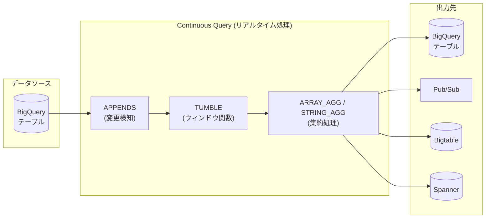

# BigQuery: Continuous Queries で ARRAY_AGG / STRING_AGG 集約関数をサポート

**リリース日**: 2026-06-10

**サービス**: BigQuery

**機能**: Continuous Queries における ARRAY_AGG / STRING_AGG 集約関数のサポート

**ステータス**: Preview

📊 [このアップデートのインフォグラフィックを見る](https://takech9203.github.io/google-cloud-news-summary/20260610-bigquery-continuous-queries-aggregation-functions.html)

## 概要

BigQuery Continuous Queries (連続クエリ) において、新たに `ARRAY_AGG` および `STRING_AGG` 集約関数がサポートされた。これにより、リアルタイムストリーミングデータの処理において、複数行の値を配列や連結文字列として集約する操作が可能になる。

Continuous Queries はリアルタイムでデータを分析し、BigQuery テーブル、Pub/Sub、Bigtable、Spanner にストリーミング出力を行う SQL ベースのイベント駆動型データ処理機能である。今回のアップデートにより、ウィンドウ集約でデータをグループ化し配列や文字列として収集するユースケースが新たに実現可能となった。

本機能は Preview ステータスであり、本番ワークロードへの利用は推奨されないが、検証環境での評価が可能である。

**アップデート前の課題**

- Continuous Queries のウィンドウ集約で `ARRAY_AGG` が使用できず、時間窓内の値を配列として収集するには別途パイプラインを構築する必要があった
- `STRING_AGG` が非サポートのため、ストリーミングデータの値を連結文字列として集約するリアルタイム処理が実現できなかった
- 複数の関連イベントを 1 レコードにまとめるリアルタイム集約処理を BigQuery 単体で完結できなかった

**アップデート後の改善**

- `ARRAY_AGG` を使用して時間窓内のストリーミングデータを配列として収集可能になった (LIMIT 句必須、最大 100)
- `STRING_AGG` を使用してストリーミングデータの値を任意の区切り文字で連結可能になった (LIMIT 句必須、最大 100)
- BigQuery Continuous Queries 単体で、イベント集約からエクスポートまでの一貫したリアルタイムパイプラインを構築可能になった

## アーキテクチャ図



BigQuery Continuous Queries のデータフローを示す。ソーステーブルの変更を APPENDS で検知し、TUMBLE ウィンドウで時間分割した後、ARRAY_AGG / STRING_AGG で集約し、各種出力先にエクスポートする。

## サービスアップデートの詳細

### 主要機能

1. **ARRAY_AGG のサポート**
   - 指定した時間窓内の値を配列 (ARRAY) として集約
   - `LIMIT` 句が必須 (最大値: 100)
   - `ORDER BY` 句はオプション
   - NULL 値の制御 (`IGNORE NULLS` / `RESPECT NULLS`) が利用可能

2. **STRING_AGG のサポート**
   - 指定した時間窓内の文字列値をカスタム区切り文字で連結
   - `LIMIT` 句が必須 (最大値: 100)
   - `ORDER BY` 句はオプション
   - デフォルト区切り文字はカンマ (`,`)

3. **TUMBLE ウィンドウとの組み合わせ**
   - 非重複時間ウィンドウ (タンブリングウィンドウ) 内でこれらの集約を実行
   - ウィンドウサイズは最大 24 時間
   - `window_start` および `window_end` カラムを `GROUP BY` に含める必要あり

## 技術仕様

### ARRAY_AGG の制約 (Continuous Queries 利用時)

| 項目 | 詳細 |
|------|------|
| LIMIT 句 | 必須 (最大値 100) |
| ORDER BY 句 | オプション |
| DISTINCT | 非サポート (Continuous Queries の制約) |
| IGNORE/RESPECT NULLS | サポート |
| 戻り値型 | ARRAY |

### STRING_AGG の制約 (Continuous Queries 利用時)

| 項目 | 詳細 |
|------|------|
| LIMIT 句 | 必須 (最大値 100) |
| ORDER BY 句 | オプション |
| DISTINCT | 非サポート (Continuous Queries の制約) |
| デリミタ指定 | サポート (デフォルト: カンマ) |
| 戻り値型 | STRING または BYTES |

### Continuous Queries の一般的な制約

| 項目 | 詳細 |
|------|------|
| エディション | Enterprise または Enterprise Plus |
| 予約タイプ | CONTINUOUS ジョブタイプ |
| 最大実行時間 (ユーザーアカウント) | 2 日間 |
| 最大実行時間 (サービスアカウント) | 150 日間 |
| ウィンドウサイズ上限 | 24 時間 |
| 予約スロット上限 | 500 スロット (上限引き上げ申請可能) |
| Watermark ラグ上限 | 48 時間 (超過でジョブ失敗) |

## 設定方法

### 前提条件

1. BigQuery Enterprise または Enterprise Plus エディションのリザベーションが構成されていること
2. CONTINUOUS ジョブタイプのリザベーション割り当てが作成されていること
3. サービスアカウントに適切な権限が付与されていること

### 手順

#### ステップ 1: リザベーションの作成

BigQuery Enterprise エディションのリザベーションと CONTINUOUS ジョブタイプの割り当てを作成する。

```bash
# リザベーションの作成
bq mk --reservation \
  --project_id=PROJECT_ID \
  --location=LOCATION \
  --reservation_id=my-continuous-reservation \
  --slots=100 \
  --edition=ENTERPRISE

# CONTINUOUS ジョブタイプの割り当て
bq mk --reservation_assignment \
  --project_id=PROJECT_ID \
  --location=LOCATION \
  --reservation_id=my-continuous-reservation \
  --job_type=CONTINUOUS \
  --assignee_id=PROJECT_ID \
  --assignee_type=PROJECT
```

#### ステップ 2: ARRAY_AGG を使用した Continuous Query の実行

```sql
-- 30分間のタンブリングウィンドウ内でイベントタイプを配列として集約
INSERT INTO `project.dataset.aggregated_events`
WITH event_stream AS (
  SELECT
    _CHANGE_TIMESTAMP AS bq_changed_ts,
    user_id,
    event_type
  FROM APPENDS(
    TABLE `project.dataset.raw_events`,
    CURRENT_TIMESTAMP() - INTERVAL 10 MINUTE
  )
)
SELECT
  window_end,
  user_id,
  ARRAY_AGG(event_type ORDER BY bq_changed_ts LIMIT 100) AS event_types
FROM TUMBLE(TABLE event_stream, "bq_changed_ts", INTERVAL 30 MINUTE)
GROUP BY window_end, user_id;
```

#### ステップ 3: STRING_AGG を使用した Continuous Query の実行

```sql
-- 15分間のウィンドウ内でログメッセージを連結
INSERT INTO `project.dataset.aggregated_logs`
WITH log_stream AS (
  SELECT
    _CHANGE_TIMESTAMP AS bq_changed_ts,
    service_name,
    log_message
  FROM APPENDS(
    TABLE `project.dataset.raw_logs`,
    CURRENT_TIMESTAMP() - INTERVAL 10 MINUTE
  )
)
SELECT
  window_end,
  service_name,
  STRING_AGG(log_message, " | " ORDER BY bq_changed_ts LIMIT 100) AS combined_logs
FROM TUMBLE(TABLE log_stream, "bq_changed_ts", INTERVAL 15 MINUTE)
GROUP BY window_end, service_name;
```

#### ステップ 4: API 経由での実行

```bash
curl --request POST \
  "https://bigquery.googleapis.com/bigquery/v2/projects/PROJECT_ID/jobs" \
  --header "Authorization: Bearer $(gcloud auth print-access-token)" \
  --header "Content-Type: application/json; charset=utf-8" \
  --data '{
    "configuration": {
      "query": {
        "query": "YOUR_CONTINUOUS_QUERY_SQL",
        "useLegacySql": false,
        "continuous": true,
        "connectionProperties": [{
          "key": "service_account",
          "value": "SERVICE_ACCOUNT_EMAIL"
        }]
      }
    }
  }'
```

## メリット

### ビジネス面

- **リアルタイムデータ集約の簡素化**: 外部ストリーミング処理基盤 (Dataflow 等) を別途構築せずに、BigQuery SQL のみでイベント集約パイプラインを実現可能
- **運用コストの削減**: 別途 Dataflow ジョブを管理する必要がなくなり、インフラ運用の複雑さが軽減

### 技術面

- **柔軟なデータ集約**: 時間窓内の複数イベントを配列や連結文字列として 1 レコードにまとめ、下流のアプリケーションでの処理を効率化
- **SQL ベースの記述**: 使い慣れた GoogleSQL で記述可能であり、学習コストが低い
- **エクスポート先の多様性**: 集約結果を BigQuery テーブル、Pub/Sub、Bigtable、Spanner に直接出力可能

## デメリット・制約事項

### 制限事項

- LIMIT 句が必須であり、最大値は 100 に制限される (大量の値を集約する場合には不向き)
- DISTINCT 式を含む集約関数は Continuous Queries では非サポート
- ステータスが Preview であり、SLA の対象外。本番環境での利用は推奨されない
- APPENDS 関数との組み合わせのみサポート (CHANGES 関数は非対応)
- ユーザー定義のタイムスタンプカラムは非サポート (`_CHANGE_TIMESTAMP` のみ)

### 考慮すべき点

- ウィンドウ集約はステートフル処理のため、ウィンドウが長いほどスロット消費量が増加する
- Enterprise または Enterprise Plus エディションのリザベーションが必須であり、オンデマンド課金モデルでは利用不可
- CONTINUOUS リザベーション割り当てのスロット上限はデフォルトで 500 (引き上げ申請可能)

## ユースケース

### ユースケース 1: ユーザー行動のリアルタイムセッション集約

**シナリオ**: EC サイトにおいて、ユーザーの行動イベント (ページビュー、クリック、カート追加等) を 30 分ウィンドウで配列として集約し、リアルタイムのセッション分析やパーソナライゼーションに活用する。

**実装例**:
```sql
INSERT INTO `project.dataset.user_sessions`
WITH events AS (
  SELECT
    _CHANGE_TIMESTAMP AS ts,
    user_id,
    event_type,
    page_url
  FROM APPENDS(TABLE `project.dataset.clickstream`)
)
SELECT
  window_end,
  user_id,
  ARRAY_AGG(event_type ORDER BY ts LIMIT 100) AS session_events,
  ARRAY_AGG(page_url ORDER BY ts LIMIT 100) AS visited_pages
FROM TUMBLE(TABLE events, "ts", INTERVAL 30 MINUTE)
GROUP BY window_end, user_id;
```

**効果**: セッション内の行動シーケンスをリアルタイムで配列として取得し、レコメンデーションエンジンや異常検知に即時反映可能。

### ユースケース 2: IoT センサーデータのリアルタイムサマリ生成

**シナリオ**: 複数の IoT センサーからのデータストリームにおいて、15 分ウィンドウ内のアラートメッセージを STRING_AGG で連結し、Pub/Sub 経由で監視ダッシュボードに送信する。

**実装例**:
```sql
EXPORT DATA
  OPTIONS (format = 'CLOUD_PUBSUB', uri = 'pubsub://projects/PROJECT/topics/alerts')
AS
WITH sensor_data AS (
  SELECT
    _CHANGE_TIMESTAMP AS ts,
    device_id,
    alert_message
  FROM APPENDS(TABLE `project.dataset.sensor_alerts`)
  WHERE severity = 'HIGH'
)
SELECT
  window_end,
  device_id,
  STRING_AGG(alert_message, " | " ORDER BY ts LIMIT 100) AS alert_summary
FROM TUMBLE(TABLE sensor_data, "ts", INTERVAL 15 MINUTE)
GROUP BY window_end, device_id;
```

**効果**: 高頻度のアラートをウィンドウ単位でまとめて配信し、アラート疲れを軽減しつつ重要情報を集約。

## 料金

BigQuery Continuous Queries は容量ベースのコンピュート課金 (スロット) を使用する。オンデマンド課金モデルは非対応。

- **Enterprise エディション**: スロット単価に基づく課金
- **Enterprise Plus エディション**: スロット単価に基づく課金 (より高度な機能付き)
- スロットオートスケーリングに対応しており、ワークロードに応じて動的にスロットが調整される
- ウィンドウ集約のステート保持により、長いウィンドウほどスロット使用率が増加

詳細な料金は [BigQuery 料金ページ](https://cloud.google.com/bigquery/pricing#capacity_compute_analysis_pricing) を参照。

## 利用可能リージョン

BigQuery Continuous Queries は以下のリージョンで利用可能:

**マルチリージョン**: US, EU

**アメリカ**: us-central1, us-east1, us-east4, us-east5, us-west1, us-west2, us-west3, us-west4, us-south1, us-central2, northamerica-northeast1, northamerica-northeast2, northamerica-south1, southamerica-east1, southamerica-west1

**アジア太平洋**: asia-east1, asia-east2, asia-south1, asia-south2, asia-southeast1, asia-southeast2, asia-northeast1, asia-northeast2, asia-northeast3, australia-southeast1, australia-southeast2

**ヨーロッパ**: europe-west1, europe-west2, europe-west3, europe-west4, europe-west6, europe-west8, europe-west9, europe-west10, europe-west12, europe-north1, europe-north2, europe-southwest1, europe-central2

**中東**: me-central1, me-central2, me-west1

**アフリカ**: africa-south1

## 関連サービス・機能

- **Pub/Sub**: Continuous Queries の出力先として利用可能。集約結果をリアルタイムで下流アプリケーションに配信
- **Bigtable**: Continuous Queries の出力先。低レイテンシのアプリケーションサービング用にリアルタイムデータを書き出し
- **Spanner**: Continuous Queries の出力先。トランザクション対応のリアルタイム Reverse ETL
- **Dataflow**: BigQuery Continuous Queries の代替/補完手段。より複雑なストリーミング処理が必要な場合に使用
- **BigQuery Storage Write API**: Continuous Queries のソーステーブルへのデータ書き込みに使用
- **Cloud Monitoring**: Continuous Queries ジョブのスロット使用率や Watermark ラグの監視

## 参考リンク

- 📊 [インフォグラフィック](https://takech9203.github.io/google-cloud-news-summary/20260610-bigquery-continuous-queries-aggregation-functions.html)
- [公式リリースノート](https://docs.google.com/release-notes#June_10_2026)
- [Continuous Queries ドキュメント](https://docs.cloud.google.com/bigquery/docs/continuous-queries)
- [Continuous Queries 概要](https://docs.cloud.google.com/bigquery/docs/continuous-queries-introduction)
- [ウィンドウ集約ドキュメント](https://docs.cloud.google.com/bigquery/docs/window-aggregations)
- [ARRAY_AGG 関数リファレンス](https://docs.cloud.google.com/bigquery/docs/reference/standard-sql/aggregate_functions#array_agg)
- [STRING_AGG 関数リファレンス](https://docs.cloud.google.com/bigquery/docs/reference/standard-sql/aggregate_functions#string_agg)
- [BigQuery 料金](https://cloud.google.com/bigquery/pricing#capacity_compute_analysis_pricing)
- [Continuous Queries 対応リージョン](https://docs.cloud.google.com/bigquery/docs/locations#continuous-query-loc)

## まとめ

BigQuery Continuous Queries への ARRAY_AGG / STRING_AGG サポートの追加により、リアルタイムストリーミング処理における集約表現力が大幅に強化された。LIMIT 句必須 (最大 100) という制約はあるものの、ユーザー行動のセッション集約や IoT データのサマリ生成など、多くの実用的ユースケースに対応可能である。Preview ステータスのため本番環境への適用は慎重に判断すべきだが、ストリーミング処理パイプラインの簡素化を検討している場合は評価を推奨する。

---

**タグ**: #BigQuery #ContinuousQueries #StreamProcessing #ARRAY_AGG #STRING_AGG #Preview
