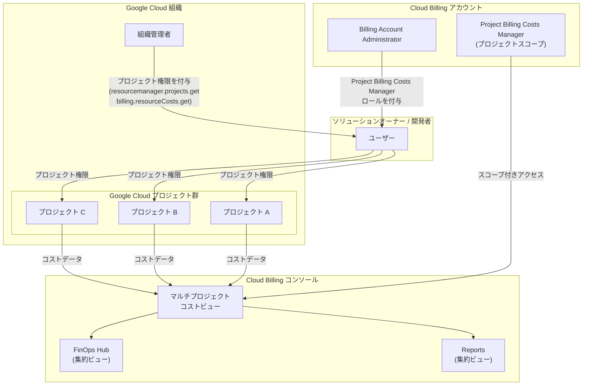

# Cloud Billing: マルチプロジェクト コストビューへのアクセス

**リリース日**: 2026-06-10

**サービス**: Cloud Billing

**機能**: Multi-project Access to Cost Views

**ステータス**: Preview

[このアップデートのインフォグラフィックを見る](https://takech9203.github.io/google-cloud-news-summary/20260610-cloud-billing-multi-project-cost-views.html)

## 概要

Google Cloud は、Cloud Billing コンソールにおける「マルチプロジェクト コストビュー」機能を Preview として公開しました。この機能により、プロジェクトオーナー、ソリューションオーナー、開発者、その他の非課金管理者が、権限を持つすべてのプロジェクトのコストデータを単一のビューで確認できるようになります。

マルチプロジェクトビューは、Cloud Billing アカウント権限と Google Cloud プロジェクト権限の組み合わせを使用します。これにより、Cloud Billing 管理者と組織管理者が共同でプロジェクトレベルのコストデータへのアクセスを制御できます。プロジェクトスコープの Cloud Billing アカウント権限を使用して、Cloud Billing 管理者はどのソリューションオーナーが Cloud Billing コンソールで集約コストデータを表示できるかを制御します。

この機能は、大規模な組織において複数のプロジェクトを管理するチームリーダーや DevOps エンジニアにとって特に有用であり、コスト可視性の向上とFinOps 実践の促進に貢献します。

**アップデート前の課題**

これまでの Cloud Billing コンソールでは、非課金管理者がコストデータにアクセスする際に以下のような制限がありました。

- プロジェクトオーナーや開発者は、一度に1つのプロジェクトのコストしか確認できなかった
- 複数プロジェクトの集約コストを確認するには、Billing Account Viewer 以上の課金アカウント全体の権限が必要だった
- プロジェクトを切り替えるたびに、Google Cloud コンソールのプロジェクトセレクターで選択し直し、再度 Billing セクションに入る必要があった
- ソリューションオーナーが自身の管理下にあるプロジェクト群の全体コストを俯瞰的に把握する手段がなかった

**アップデート後の改善**

今回のアップデートにより、以下の改善が実現されます。

- プロジェクトスコープの権限のみで、複数プロジェクトの集約コストデータを単一ビューで確認可能になった
- Billing Account Administrator に課金アカウント全体の閲覧権限を付与することなく、スコープ付きのアクセス制御が可能になった
- Reports と FinOps hub の両方でマルチプロジェクトの集約ビューが利用可能になった
- 組織管理者と課金管理者の共同管理モデルにより、最小権限の原則に基づいたアクセス制御が実現された

## アーキテクチャ図



この図は、マルチプロジェクト コストビューの権限モデルを示しています。ソリューションオーナーは、プロジェクト側の権限（組織管理者が付与）と課金アカウント側のプロジェクトスコープ権限（Billing Account Administrator が付与）の両方を持つことで、複数プロジェクトの集約コストビューにアクセスできます。

## サービスアップデートの詳細

### 主要機能

1. **マルチプロジェクト集約コストビュー**
   - 権限を持つすべてのプロジェクトのコストデータを単一の画面で表示
   - Cloud Billing コンソールの Reports ページおよび FinOps hub で利用可能
   - プロジェクトごとのコスト内訳やトレンド分析を集約的に確認

2. **プロジェクトスコープ権限モデル**
   - 新しい事前定義ロール「Project Billing Costs Manager」（`roles/billing.projectCostsManager`）を使用
   - ユーザーが閲覧できるのは、プロジェクト側の権限を持つプロジェクトのコストデータのみ
   - 課金アカウント全体のコストデータへのアクセスは付与されない

3. **共同アクセス制御**
   - Cloud Billing 管理者がプロジェクトスコープの課金アカウント権限を付与
   - プロジェクト管理者がプロジェクト側の課金関連権限を付与
   - 両方の権限が揃ったユーザーのみがマルチプロジェクトビューを利用可能

4. **FinOps hub 統合**
   - マルチプロジェクト権限を持つユーザーは FinOps hub にアクセス可能
   - コスト最適化の推奨事項を複数プロジェクトにまたがって確認
   - 利用率インサイトやコスト削減機会の特定

## 技術仕様

### 必要な権限

| 権限の種類 | 権限名 | 目的 | 付与元 |
|------|------|------|------|
| プロジェクト権限 | `resourcemanager.projects.get` | プロジェクトの詳細（名前、リンクされた課金アカウントID）を取得 | プロジェクト管理者 |
| プロジェクト権限 | `billing.resourceCosts.get` | Cloud Billing Reports でプロジェクトのコストを表示 | プロジェクト管理者 |
| プロジェクト権限 | `billing.resourcebudgets.read/write` | プロジェクトの予算を表示・管理 | プロジェクト管理者 |
| プロジェクト権限 | `billing.anomalies.get/list` | プロジェクトのコスト異常を表示 | プロジェクト管理者 |
| 課金アカウント権限 | `billing.accounts.get` | 課金アカウントの基本プロパティを表示 | Billing Account Administrator |
| 課金アカウント権限 | `billing.accounts.getIamPolicy` | 課金アカウントの IAM 割り当てを表示 | Billing Account Administrator |
| 課金アカウント権限 | `billing.accounts.getSpendingInformationScoped` | ユーザーの権限範囲内のプロジェクトにスコープされたコスト・使用量を表示 | Billing Account Administrator |
| 課金アカウント権限 | `billing.costRecommendations.listScoped` | ユーザーの権限範囲内のコスト推奨事項を表示 | Billing Account Administrator |

### 利用可能なツール比較

| ツール | シングルプロジェクトアクセス | マルチプロジェクトアクセス |
|------|------|------|
| Reports | 1プロジェクトずつ | 複数プロジェクト集約 |
| Budgets & alerts | 1プロジェクトずつ | 1プロジェクトずつ* |
| Anomalies | 1プロジェクトずつ | 1プロジェクトずつ* |
| FinOps hub | 利用不可 | 複数プロジェクト集約 |
| Account management | 利用可能 | 利用可能 |

*マルチプロジェクトアクセスでは、プロジェクトピッカーによりプロジェクトの切り替えが容易になります。

### Project Billing Costs Manager ロール

```json
{
  "role": "roles/billing.projectCostsManager",
  "title": "Project Billing Costs Manager",
  "description": "プロジェクトのコスト閲覧権限と組み合わせて、ユーザーがコストアクセスを持つプロジェクトにスコープされた課金情報へのアクセスを提供",
  "includedPermissions": [
    "billing.accounts.get",
    "billing.accounts.getIamPolicy",
    "billing.accounts.getSpendingInformationScoped",
    "billing.costRecommendations.listScoped"
  ],
  "lowestLevelResource": "Billing Account"
}
```

## 設定方法

### 前提条件

1. Cloud Billing アカウントが存在し、プロジェクトがリンクされていること
2. Billing Account Administrator 権限を持つユーザーがいること
3. 対象プロジェクトでプロジェクト権限を管理できる管理者がいること

### 手順

#### ステップ 1: プロジェクト側の権限を確認・付与

プロジェクト管理者が、ソリューションオーナーに対して以下の権限を含むロールを付与します。多くの場合、既に Project Viewer/Editor/Owner ロールが付与されている場合はこのステップは不要です。

```bash
# プロジェクトのIAMポリシーを確認
gcloud projects get-iam-policy PROJECT_ID \
  --flatten="bindings[].members" \
  --format="table(bindings.role, bindings.members)" \
  --filter="bindings.members:user@example.com"

# 必要に応じてProject Viewer ロールを付与
gcloud projects add-iam-policy-binding PROJECT_ID \
  --member="user:solution-owner@example.com" \
  --role="roles/viewer"
```

プロジェクト側で必要な権限: `resourcemanager.projects.get`、`billing.resourceCosts.get`

#### ステップ 2: 課金アカウントに Project Billing Costs Manager ロールを付与

Billing Account Administrator が、Google Cloud コンソールでソリューションオーナーに対して課金アカウントレベルの権限を付与します。

```bash
# 課金アカウントのIAMポリシーを確認
gcloud billing accounts get-iam-policy BILLING_ACCOUNT_ID

# Project Billing Costs Manager ロールを付与
gcloud billing accounts add-iam-policy-binding BILLING_ACCOUNT_ID \
  --member="user:solution-owner@example.com" \
  --role="roles/billing.projectCostsManager"
```

または Google Cloud コンソールで以下の手順を実行します:

1. Google Cloud コンソールで Billing の「Account management」ページに移動
2. Info パネルの「Show info panel」をクリック
3. 「Add principal」をクリック
4. プリンシパル（ユーザーのメールアドレス、グループなど）を入力
5. ロールとして「Project Billing Costs Manager」を選択
6. 「Save」をクリック

#### ステップ 3: マルチプロジェクトビューの確認

権限を付与されたユーザーが Cloud Billing コンソールにアクセスし、マルチプロジェクトビューが有効になっていることを確認します。

```bash
# ユーザーの課金アカウントへのアクセスを確認
gcloud billing accounts get-iam-policy BILLING_ACCOUNT_ID \
  --flatten="bindings[].members" \
  --format="table(bindings.role, bindings.members)" \
  --filter="bindings.role:roles/billing.projectCostsManager"
```

## メリット

### ビジネス面

- **コスト可視性の向上**: ソリューションオーナーが自身の責任範囲にあるすべてのプロジェクトの支出を一目で把握でき、コスト意識が向上する
- **FinOps 実践の促進**: 非課金管理者にもコスト最適化の推奨事項が表示されることで、エンジニアリングチームが主体的にコスト削減に取り組める
- **管理負荷の軽減**: これまで課金管理者にコストレポートの作成を依頼していた業務が、セルフサービスで完結する
- **アカウンタビリティの強化**: 各チームが自身の支出に対する責任を持ち、予算内での運用を自律的に管理できる

### 技術面

- **最小権限の原則**: 課金アカウント全体の閲覧権限（Billing Account Viewer）を付与せずに、プロジェクトスコープでのコスト閲覧を実現
- **共同管理モデル**: 組織管理者と課金管理者が独立して権限を管理でき、セキュリティと利便性を両立
- **スケーラブルな権限管理**: グループやドメインに対して一括で権限を付与可能
- **既存権限との互換性**: 既に Project Viewer/Editor/Owner を持つユーザーは、追加のプロジェクト側権限の設定が不要

## デメリット・制約事項

### 制限事項

- **プロジェクト数の上限**: 1つの課金アカウントあたり、マルチプロジェクトビューに含められるプロジェクトは最大300件まで。300件を超えると、エラーメッセージが表示され個別プロジェクトビューにリダイレクトされる
- **集約ビュー対応ツールが限定的**: マルチプロジェクト集約表示に対応しているのは Reports と FinOps hub のみ。Budgets & alerts と Anomalies はプロジェクトピッカーで切り替え可能だが集約表示はできない
- **Preview ステータス**: Pre-GA のため、サポートが限定的であり、今後仕様が変更される可能性がある

### 考慮すべき点

- **権限の付与範囲**: Project Billing Costs Manager ロールを付与すると、ユーザーがプロジェクト権限を持つすべてのプロジェクトの課金データが表示対象となる。集約データを見せたくないユーザーには付与しないこと
- **組織横断の制限**: 権限モデルは単一の課金アカウントにリンクされたプロジェクトに限定される。複数の課金アカウントをまたいだ集約ビューは提供されない
- **IAM ポリシーの既存設定との整合性**: 既存の Billing Account Viewer ロールとの権限の違いを理解し、適切なロールを選択する必要がある

## ユースケース

### ユースケース 1: プラットフォームチームのコスト管理

**シナリオ**: 大規模な組織のプラットフォームチームリーダーが、チームが管理する15個のプロジェクト（開発・ステージング・本番環境を含む）の合計コストを月次で確認したい。

**実装例**:
```bash
# プラットフォームチームリーダーに対して、課金アカウントレベルで権限を付与
gcloud billing accounts add-iam-policy-binding 01ABCD-EFGH12-345678 \
  --member="group:platform-team-leads@example.com" \
  --role="roles/billing.projectCostsManager"

# 各プロジェクトにはすでに Project Editor として参加していると仮定
# → マルチプロジェクトビューで15プロジェクトの集約コストが表示される
```

**効果**: 以前は課金管理者にレポート作成を依頼していたが、セルフサービスでリアルタイムに全プロジェクトのコストトレンドを確認でき、異常な支出増加を早期に検知できるようになる。

### ユースケース 2: マルチテナント SaaS のコスト配分

**シナリオ**: SaaS プロバイダーの DevOps マネージャーが、顧客ごとに分離されたプロジェクト群のインフラコストを確認し、顧客への請求計算の基礎データとしたい。

**効果**: FinOps hub を通じてコスト最適化の推奨事項を確認し、未使用リソースの特定や適切なコミットメント利用率の分析が、課金管理者の支援なしに実施できるようになる。

### ユースケース 3: 部門横断的なコストガバナンス

**シナリオ**: エンジニアリング VP が、配下の複数チームが運用するプロジェクト群の合計支出を定期的にモニタリングし、四半期予算との乖離を確認したい。

**効果**: Cloud Billing コンソールの Reports で集約ビューを使い、部門全体のコストトレンド、サービス別内訳、前月比較などを自律的に確認でき、経営判断のスピードが向上する。

## 料金

Cloud Billing のマルチプロジェクト コストビュー機能自体には追加料金は発生しません。Cloud Billing のコスト管理ツールは、Google Cloud の顧客に無料で提供されます。

### 料金例

| 項目 | 費用 |
|--------|-----------------|
| マルチプロジェクト コストビュー機能 | 無料 |
| Cloud Billing Reports | 無料 |
| FinOps hub | 無料 |
| Billing データの BigQuery エクスポート | BigQuery の使用量に応じた料金 |

## 利用可能リージョン

Cloud Billing コンソールはグローバルサービスであり、マルチプロジェクト コストビュー機能はすべてのリージョンの Cloud Billing アカウントで利用可能です。

## 関連サービス・機能

- **Cloud Billing Reports**: コストレポートのベース機能。マルチプロジェクトビューにより集約表示が可能に
- **FinOps hub**: コスト最適化の推奨事項と利用率インサイトを提供。マルチプロジェクトスコープで利用可能
- **Cloud Billing Budgets & Alerts**: 予算設定とアラート通知。現時点ではプロジェクト単位での利用に限定
- **Cloud Billing Export to BigQuery**: 詳細なコストデータの分析が必要な場合の補完機能
- **IAM (Identity and Access Management)**: 権限モデルの基盤。プロジェクトロールと課金アカウントロールの組み合わせ
- **Resource Manager**: プロジェクト・フォルダ・組織のリソース階層管理

## 参考リンク

- [インフォグラフィック](https://takech9203.github.io/google-cloud-news-summary/20260610-cloud-billing-multi-project-cost-views.html)
- [公式リリースノート](https://docs.google.com/release-notes#June_10_2026)
- [プロジェクトオーナー向けコスト管理の概要](https://docs.cloud.google.com/billing/docs/how-to/project-owners/overview)
- [マルチプロジェクトアクセスの設定](https://docs.cloud.google.com/billing/docs/how-to/project-owners/setup-multi-project-access)
- [Cloud Billing アクセス制御の概要](https://docs.cloud.google.com/billing/docs/how-to/billing-access)
- [料金ページ](https://cloud.google.com/cost-management)

## まとめ

Cloud Billing のマルチプロジェクト コストビューは、組織内のコスト可視性を大幅に向上させる重要なアップデートです。特に、最小権限の原則を維持しながら非課金管理者にコストデータへのアクセスを提供できる点が優れています。FinOps の実践を推進する組織においては、Preview 段階から評価を開始し、Billing Account Administrator と連携して対象ユーザーへの `Project Billing Costs Manager` ロールの付与を検討することをお勧めします。

---

**タグ**: #CloudBilling #CostManagement #FinOps #IAM #MultiProject #Preview #コスト可視化 #アクセス制御
