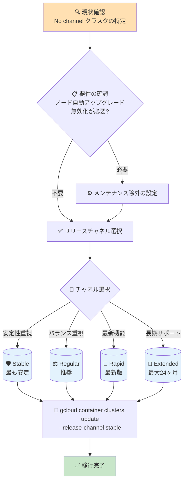

# Google Kubernetes Engine: "No channel" 構成オプションの非推奨化

**リリース日**: 2026-06-10

**サービス**: Google Kubernetes Engine (GKE)

**機能**: リリースチャネル未登録 ("No channel") 構成の非推奨化

**ステータス**: Deprecated

📊 [このアップデートのインフォグラフィックを見る](https://takech9203.github.io/google-cloud-news-summary/20260610-gke-no-channel-deprecated.html)

## 概要

Google Kubernetes Engine (GKE) において、クラスタをリリースチャネルに登録しない構成オプション (「No channel」、旧称「Static」) が正式に非推奨 (Deprecated) となりました。この構成オプションは **2027 年 6 月 14 日** に完全に削除される予定です。

この変更は、GKE のリリース管理を統一し、すべてのクラスタがリリースチャネルの恩恵を受けられるようにするための施策です。リリースチャネルに登録されていないクラスタは、削除日までに手動でいずれかのチャネルに登録することが推奨されます。削除日以降、未登録のクラスタは自動的に **Stable チャネル** に登録されます。

対象ユーザーは、現在 GKE Standard クラスタを「No channel」構成で運用しているすべてのユーザーです。Autopilot クラスタは常にリリースチャネルに登録されているため、この変更の影響を受けません。

**アップデート前の課題**

リリースチャネル未登録 ("No channel") の構成では、以下の制限がありました。

- メンテナンス除外のスコープが「No upgrades」(最大 90 日間) のみに制限されていた
- Accelerated patch auto-upgrades (パッチの早期適用) が利用できなかった
- Rollout sequencing (ロールアウト順序制御) が利用できなかった
- Extended チャネルによる長期サポート (最大 24 ヶ月) が利用できなかった
- Autopilot モードが利用できなかった
- ノードプール単位のメンテナンス除外が利用できなかった

**アップデート後の改善**

リリースチャネルへの移行により、以下が可能になります。

- メンテナンス除外のスコープとして「No minor upgrades」「No minor or node upgrades」(マイナーバージョンのサポート終了まで) が利用可能
- ノードプール単位のメンテナンス除外により、一部のノードプールのみ自動アップグレードを制御可能
- Accelerated patch auto-upgrades によりセキュリティパッチの早期適用が可能
- Rollout sequencing によりクラスタのアップグレード順序を制御可能
- Extended チャネルによる最大 24 ヶ月の長期サポートが利用可能

## アーキテクチャ図



この図は、"No channel" 構成からリリースチャネルへの移行パスを示しています。ユーザーの要件に応じて適切なチャネルを選択し、必要に応じてメンテナンス除外を設定することで、従来の "No channel" と同等以上の制御が可能です。

## サービスアップデートの詳細

### 主要機能

1. **非推奨化のスケジュール**
   - 2026 年 6 月 10 日: 「No channel」構成が正式に非推奨 (Deprecated) に
   - 2027 年 6 月 14 日: 「No channel」構成が完全に削除
   - 削除日以降: 未移行クラスタは自動的に Stable チャネルに登録

2. **影響範囲**
   - GKE Standard クラスタのみが対象 (Autopilot は常にリリースチャネルに登録済み)
   - 新規クラスタ作成時に「No channel」を選択する機能も削除日に廃止
   - 既存クラスタのリリースチャネル解除 (unsubscribe) も削除日に不可能に

3. **推奨される対応**
   - Recommender サービスによるインサイトと推奨事項の提供 (サブタイプ: `CLUSTER_RELEASE_CHANNEL_UNSPECIFIED`)
   - Google Cloud Console または gcloud CLI で未登録クラスタを特定可能
   - 2027 年 6 月 14 日までに手動で任意のチャネルに登録することを推奨

## 技術仕様

### リリースチャネル比較

| チャネル | マイナーバージョン提供 | 自動アップグレード対象設定 | 推奨用途 |
|----------|----------------------|--------------------------|----------|
| Rapid | upstream GA 後 1-2 週間 | Rapid リリース後 1-2 ヶ月 | 最新機能のテスト (プリプロダクション向け) |
| Regular (デフォルト) | Rapid 後約 2 ヶ月 | Regular リリース後約 3 ヶ月 | 一般的なワークロード (推奨) |
| Stable | Regular 後 3-4 ヶ月 | Stable リリース後約 2 ヶ月 | 安定性を最優先するワークロード |
| Extended | Regular と同じ | Regular と同じ | 長期サポート (最大 24 ヶ月) |
| No channel (非推奨) | Regular と同じ | Stable と同じ | 非推奨 - 移行を推奨 |

### リリースチャネル登録済み vs 未登録の機能比較

| 機能 | チャネル登録済み | 未登録 (No channel) |
|------|-----------------|-------------------|
| Accelerated patch auto-upgrades | 利用可能 | 利用不可 |
| メンテナンス除外スコープ | No upgrades (90日), No minor upgrades (EOS まで), No minor or node upgrades (EOS まで) | No upgrades (90日) のみ |
| ノードプールメンテナンス除外 | 利用可能 | 利用不可 |
| Rollout sequencing | 利用可能 | 利用不可 |
| Long-term support (Extended) | 利用可能 | 利用不可 |
| Autopilot | 利用可能 | 利用不可 |

## 設定方法

### 前提条件

1. GKE Standard クラスタが「No channel」構成で動作していること
2. クラスタのコントロールプレーンのマイナーバージョンが、移行先チャネルで利用可能であること
3. 適切な IAM 権限 (`container.clusters.update`) を持つこと

### 手順

#### ステップ 1: 未登録クラスタの特定

```bash
# gcloud CLI で No channel クラスタを一覧表示
gcloud container clusters list --filter="releaseChannel.channel=UNSPECIFIED" --format="table(name,location,currentMasterVersion)"
```

Recommender API を使用する場合:
```bash
# Recommender でリリースチャネル未登録の推奨事項を確認
gcloud recommender recommendations list \
  --recommender=google.container.DiagnosisRecommender \
  --location=LOCATION \
  --filter="recommenderSubtype=CLUSTER_RELEASE_CHANNEL_UNSPECIFIED"
```

#### ステップ 2: 移行先チャネルの利用可能バージョンを確認

```bash
# 各チャネルのデフォルトバージョンと利用可能バージョンを確認
gcloud container get-server-config --location=LOCATION
```

#### ステップ 3: リリースチャネルへの登録

```bash
# クラスタをリリースチャネルに登録 (例: Stable チャネル)
gcloud container clusters update CLUSTER_NAME \
  --location=LOCATION \
  --release-channel stable
```

利用可能なチャネル値: `rapid`, `regular`, `stable`, `extended`

#### ステップ 4: (任意) メンテナンス除外の設定

ノード自動アップグレードを制御する必要がある場合:

```bash
# クラスタレベルのメンテナンス除外 (マイナーバージョンおよびノードアップグレードを除外)
gcloud container clusters update CLUSTER_NAME \
  --location=LOCATION \
  --add-maintenance-exclusion-name=no-minor-or-node-upgrades \
  --add-maintenance-exclusion-start=2026-07-01T00:00:00Z \
  --add-maintenance-exclusion-end=2027-01-01T00:00:00Z \
  --add-maintenance-exclusion-scope=no_minor_or_node_upgrades
```

#### ステップ 5: (任意) ノードプール単位のメンテナンス除外

特定のノードプールのみ自動アップグレードを停止する場合:

```bash
# ノードプールメンテナンス除外の設定
gcloud container node-pools update NODE_POOL_NAME \
  --cluster=CLUSTER_NAME \
  --location=LOCATION \
  --add-maintenance-exclusion-name=np-exclusion \
  --add-maintenance-exclusion-start=2026-07-01T00:00:00Z \
  --add-maintenance-exclusion-end=2027-01-01T00:00:00Z
```

## メリット

### ビジネス面

- **運用の統一化**: すべてのクラスタがリリースチャネルに統合されることで、組織全体のバージョン管理が一元化される
- **セキュリティ態勢の改善**: Accelerated patch auto-upgrades により、セキュリティパッチの適用が迅速化
- **長期サポートの活用**: Extended チャネルにより、メジャーアップグレードの頻度を抑えつつ、セキュリティパッチは継続的に受領可能

### 技術面

- **柔軟なアップグレード制御**: メンテナンス除外スコープの拡充により、「No channel」以上にきめ細かいアップグレード制御が可能
- **ノードプール単位の制御**: ノードプールメンテナンス除外により、特定ノードプールのみアップグレードを停止可能
- **Rollout sequencing**: クラスタのアップグレード順序をカスタマイズ (開発 → ステージング → 本番)

## デメリット・制約事項

### 制限事項

- Extended チャネルの利用には追加料金が発生する (延長サポート期間中)
- クラスタのコントロールプレーンバージョンが移行先チャネルで利用可能でない場合、一部チャネルへの移行ができない可能性がある
- 移行後、GKE が自動アップグレードをスケジュールする可能性があるため、メンテナンスウィンドウの設定を推奨

### 考慮すべき点

- 移行時にダウンタイムは発生しないが、チャネル登録後に GKE が自動アップグレードを開始する可能性がある
- 2027 年 6 月 14 日までに対応しない場合、自動的に Stable チャネルに登録される (ユーザーの意図しないアップグレードが発生する可能性)
- ノード自動アップグレードを無効化している場合でも、リリースチャネルへの登録は可能 (GKE は登録時に自動的にノード自動アップグレードを有効化しない)

## ユースケース

### ユースケース 1: 本番環境で安定性を最重視するケース

**シナリオ**: 金融系ワークロードを運用しており、バージョンアップの頻度を最小限にしたい。現在「No channel」でノード自動アップグレードを無効化している。

**実装例**:
```bash
# Stable チャネルに登録
gcloud container clusters update prod-cluster \
  --location=asia-northeast1 \
  --release-channel stable

# マイナーバージョンおよびノードアップグレードを除外
gcloud container clusters update prod-cluster \
  --location=asia-northeast1 \
  --add-maintenance-exclusion-name=prod-stability \
  --add-maintenance-exclusion-start=2026-07-01T00:00:00Z \
  --add-maintenance-exclusion-end=2027-06-01T00:00:00Z \
  --add-maintenance-exclusion-scope=no_minor_or_node_upgrades
```

**効果**: Stable チャネルの安定したパッチ適用を受けつつ、マイナーバージョンのアップグレードはサポート終了まで延期可能。従来の「No channel」と同等以上の安定性を確保。

### ユースケース 2: 長期サポートが必要なケース

**シナリオ**: 特定の Kubernetes バージョンに依存するアプリケーションがあり、できるだけ長期間同じバージョンを使い続けたい。

**実装例**:
```bash
# Extended チャネルに登録
gcloud container clusters update legacy-app-cluster \
  --location=us-central1 \
  --release-channel extended
```

**効果**: Extended チャネルにより最大 24 ヶ月間同一マイナーバージョンを使用可能。「No channel」では利用できなかった長期サポートを活用できる。

### ユースケース 3: 段階的なロールアウトが必要なケース

**シナリオ**: 開発・ステージング・本番の複数クラスタがあり、アップグレードを段階的に適用したい。

**実装例**:
```bash
# 開発クラスタ: Rapid チャネル
gcloud container clusters update dev-cluster \
  --release-channel rapid

# ステージングクラスタ: Regular チャネル
gcloud container clusters update staging-cluster \
  --release-channel regular

# 本番クラスタ: Stable チャネル + Rollout sequencing
gcloud container clusters update prod-cluster \
  --release-channel stable
```

**効果**: Rollout sequencing と複数チャネルの組み合わせにより、新バージョンを開発で先行検証してから本番に適用する安全なデプロイメント戦略を実現。

## 料金

リリースチャネルへの登録自体には追加料金は発生しません。GKE の基本料金体系は以下の通りです。

### 料金例

| 項目 | 料金 |
|------|------|
| クラスタ管理費 | $0.10 / クラスタ / 時間 |
| Free tier | $74.40 / 月 (ゾーンおよび Autopilot クラスタに適用) |
| Extended チャネル延長サポート期間 | 追加料金あり (詳細は料金ページ参照) |

※ リリースチャネルの変更によるクラスタ管理費の変動はありません。Extended チャネルのみ、マイナーバージョンが延長サポート期間に入った場合に追加料金が発生します。

## 利用可能リージョン

この変更はすべての GKE リージョンおよびゾーンに適用されます。リリースチャネルはグローバルに利用可能です。

## 関連サービス・機能

- **GKE Autopilot**: 常にリリースチャネルに登録されているため、この変更の影響を受けない。チャネル移行後の運用として参考になるモード
- **Cloud Recommender**: 未登録クラスタの検出と移行推奨を提供するサービス (サブタイプ: `CLUSTER_RELEASE_CHANNEL_UNSPECIFIED`)
- **メンテナンスウィンドウと除外**: リリースチャネル登録後のアップグレード制御に不可欠な機能
- **GKE Release Schedule**: 各チャネルのバージョンリリーススケジュールを確認可能

## 参考リンク

- 📊 [インフォグラフィック](https://takech9203.github.io/google-cloud-news-summary/20260610-gke-no-channel-deprecated.html)
- [公式リリースノート](https://docs.cloud.google.com/release-notes#June_10_2026)
- [リリースチャネルの概要](https://docs.cloud.google.com/kubernetes-engine/docs/concepts/release-channels)
- [既存クラスタのリリースチャネル登録手順](https://docs.cloud.google.com/kubernetes-engine/docs/how-to/release-channels#existing-cluster)
- [No channel の詳細情報](https://docs.cloud.google.com/kubernetes-engine/docs/concepts/release-channels#no_channel)
- [チャネル登録済み vs 未登録の比較表](https://docs.cloud.google.com/kubernetes-engine/docs/concepts/release-channels#comparison-table-no-channel)
- [メンテナンスウィンドウと除外](https://docs.cloud.google.com/kubernetes-engine/docs/concepts/maintenance-windows-and-exclusions)
- [GKE 料金ページ](https://cloud.google.com/kubernetes-engine/pricing)

## まとめ

GKE の「No channel」構成が非推奨となり、2027 年 6 月 14 日に削除されます。すべてのユーザーは削除日までにクラスタをいずれかのリリースチャネル (Rapid, Regular, Stable, Extended) に登録する必要があります。リリースチャネルへの移行により、従来の「No channel」では利用できなかった Accelerated patch auto-upgrades、ノードプールメンテナンス除外、Rollout sequencing、長期サポートなどの機能が利用可能になります。特に、ノード自動アップグレードの制御が目的で「No channel」を使用していた場合は、メンテナンス除外機能により同等以上の制御が可能ですので、早期の移行計画策定を推奨します。

---

**タグ**: #GKE #Kubernetes #ReleaseChannel #Deprecated #Migration #ClusterManagement
