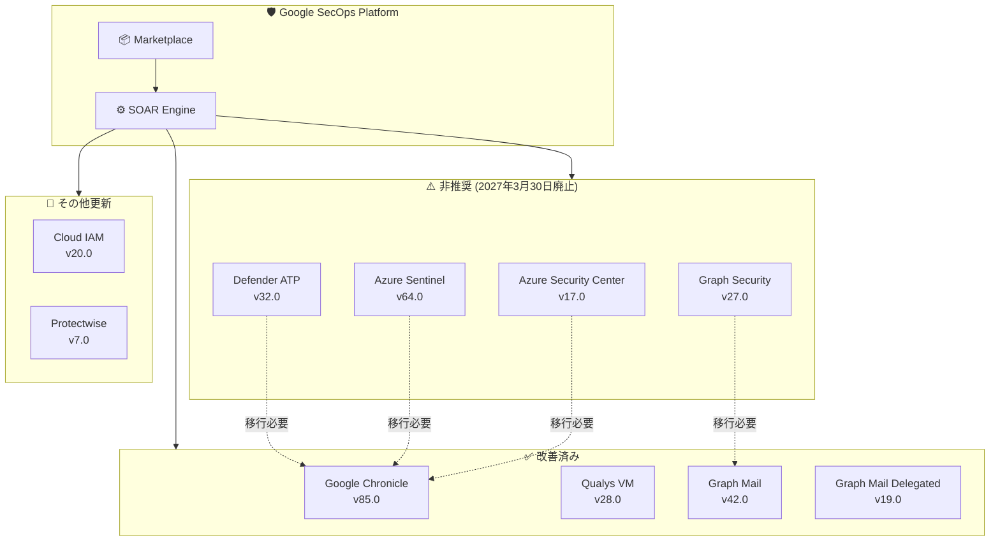

# Google SecOps Marketplace: コネクタアップデートと非推奨化

**リリース日**: 2026-06-10

**サービス**: Google SecOps (Security Operations) Marketplace

**機能**: コネクタの非推奨化通知、パフォーマンス改善、バグ修正

**ステータス**: Change (複数の非推奨化 + 改善)

📊 [このアップデートのインフォグラフィックを見る](https://takech9203.github.io/google-cloud-news-summary/20260610-google-secops-marketplace-connector-updates.html)

## 概要

Google SecOps Marketplace において、10 件のコネクタに対する大規模なアップデートが実施された。最も注目すべき変更は、Microsoft/Azure 関連の 4 つのコネクタ (Azure Security Center、Microsoft Azure Sentinel、Microsoft Defender ATP、Microsoft Graph Security) に対する非推奨化 (Deprecation) 通知であり、いずれも 2027 年 3 月 30 日に廃止される予定である。

これと並行して、Google Chronicle コネクタ v85.0 ではバッチ処理の大幅な改善が行われ、タイムアウトループの防止や処理効率の向上が実現された。また、Qualys VM コネクタでは AttributeError の修正とフォールバックホスト名マッチングの追加により、ホストリスト解析の信頼性が向上している。

本アップデートは、セキュリティオペレーションチームに対して、Microsoft 製品との連携方式の見直しと移行計画の策定を求める重要な変更である。約 9 か月の猶予期間が設けられているが、影響範囲が広いため早期の対応計画が推奨される。

**アップデート前の課題**

- Microsoft/Azure 関連の古いコネクタが継続的にメンテナンスされていたが、アーキテクチャの陳腐化により最新の API 仕様への追従が困難になっていた
- Google Chronicle コネクタでバッチ処理時にタイムアウトループが発生する可能性があった
- Qualys VM コネクタで複数ホストリスト解析時に AttributeError が発生し、ホスト検出に失敗するケースがあった
- Microsoft Graph Mail コネクタで一時的な上流 API エラーやコネクション問題への耐性が不十分だった

**アップデート後の改善**

- 非推奨化コネクタの明確な廃止期限 (2027年3月30日) が設定され、計画的な移行が可能になった
- Chronicle コネクタの動的バッチサイジングによりタイムアウトループが防止され、モニタリングシグナルによる運用可視性が向上した
- Qualys VM のフォールバックホスト名マッチングにより、ホスト検出の信頼性が向上した
- Microsoft Graph Mail コネクタの一時的エラー処理が堅牢化され、上流 API の不安定さに対する耐性が向上した

## アーキテクチャ図

Google SecOps Marketplace のコネクタエコシステムを示す図。4 つの Microsoft/Azure コネクタが非推奨化され、改善されたコネクタへの移行パスが示されている。

## サービスアップデートの詳細

### 主要機能

1. **Microsoft/Azure コネクタの非推奨化 (4 件)**
   - **Azure Security Center v17.0**: Security Alerts Connector が非推奨化。2027 年 3 月 30 日以降はクリティカルバグ修正のみ対応
   - **Microsoft Azure Sentinel v64.0**: Incident Connector v2 および Incident Tracking Connector が非推奨化。同日廃止予定
   - **Microsoft Defender ATP v32.0**: Connector および Connector V2 の両方が非推奨化。同日廃止予定
   - **Microsoft Graph Security v27.0**: Office 365 Security/Compliance Connector および Graph Security Connector が非推奨化。同日廃止予定

2. **Google Chronicle v85.0 - パフォーマンス大幅改善**
   - Chronicle Alerts Connector のバッチ処理を全面的に刷新
   - 動的バッチサイジングの導入によりタイムアウトループを防止
   - ロギングのリファクタリングとモニタリングシグナルの追加 (プロセスヘルス、パイプライン状態)
   - 検出バッチの解析・処理効率の改善
   - 認証フロー機構の更新

3. **Qualys VM v28.0 - バグ修正と信頼性向上**
   - 複数ホストリスト解析時の AttributeError を修正
   - フォールバックホスト名マッチングを追加
   - 影響アクション: List Endpoint Detections、Enrich Host

4. **Microsoft Graph Mail v42.0 / v19.0 - エラー耐性の向上**
   - Graph Mail Connector: 一時的な上流 API エラーおよびコネクション問題の堅牢なハンドリングロジックを実装
   - Graph Mail Delegated Connector: 同様の一時的エラーハンドリング改善

5. **Google Cloud IAM v20.0 - ウィジェット更新**
   - List Roles ウィジェットの更新
   - List Service Accounts ウィジェットの更新

6. **Protectwise v7.0 - コードリファクタリング**
   - Get Pcap アクションのコードリファクタリング

## 技術仕様

### 非推奨化スケジュール

| コネクタ | バージョン | 非推奨化発表日 | 廃止予定日 | 対象コンポーネント |
|---------|-----------|--------------|-----------|------------------|
| Azure Security Center | v17.0 | 2026-06-10 | 2027-03-30 | Security Alerts Connector |
| Microsoft Azure Sentinel | v64.0 | 2026-06-10 | 2027-03-30 | Incident Connector v2, Incident Tracking Connector |
| Microsoft Defender ATP | v32.0 | 2026-06-10 | 2027-03-30 | Connector, Connector V2 |
| Microsoft Graph Security | v27.0 | 2026-06-10 | 2027-03-30 | Office 365 Security/Compliance, Graph Security Connector |

### Google Chronicle v85.0 改善内容

| 改善項目 | 詳細 |
|---------|------|
| 動的バッチサイジング | バッチサイズを動的に調整し、タイムアウトループを防止 |
| ロギングリファクタリング | プロセスヘルスとパイプライン状態のモニタリングシグナルを追加 |
| 検出バッチ処理 | 解析と処理の効率改善 |
| 認証フロー | 認証機構の更新 |

### Qualys VM v28.0 修正内容

| 修正項目 | 詳細 |
|---------|------|
| AttributeError 修正 | 複数ホストリストの解析時に発生するエラーを修正 |
| フォールバックホスト名マッチング | プライマリマッチングが失敗した場合の代替マッチングロジックを追加 |
| 影響アクション | List Endpoint Detections, Enrich Host |

## 設定方法

### 非推奨コネクタからの移行

#### ステップ 1: 影響範囲の確認

Google SecOps SOAR のコネクタ設定画面で、現在使用中の非推奨コネクタを特定する。

1. Google SecOps コンソールにアクセス
2. Response > Connectors に移動
3. 以下のコネクタが有効化されているか確認:
   - Azure Security Center - Security Alerts Connector
   - Microsoft Azure Sentinel - Incident Connector v2
   - Microsoft Sentinel - Incident Tracking Connector
   - Microsoft Defender ATP Connector / V2
   - Microsoft Graph Security Connector

#### ステップ 2: 移行先の検討

非推奨コネクタに対する公式の代替手段については、各コネクタのドキュメントを参照する。以下は一般的な移行パターン:

- **Azure Sentinel**: 既に Incident Connector v2 が非推奨対象のため、今後発表される後継コネクタまたは API 直接連携への移行を検討
- **Microsoft Defender ATP**: Microsoft Defender XDR との統合コネクタが後継となる可能性
- **Microsoft Graph Security**: Microsoft Graph API v2 ベースの新コネクタへの移行を検討

#### ステップ 3: 移行スケジュールの策定

2027 年 3 月 30 日の廃止期限に向けて、以下のマイルストーンを設定する:

1. **2026 Q3**: 影響範囲の詳細調査、代替手段の選定
2. **2026 Q4**: テスト環境での移行検証
3. **2027 Q1**: 本番環境での移行実施、並行稼働期間の確保
4. **2027 Q1 末**: 旧コネクタの無効化

## メリット

### ビジネス面

- **計画的な移行が可能**: 約 9 か月の猶予期間が設けられており、段階的な移行を計画できる
- **運用可視性の向上**: Chronicle コネクタのモニタリングシグナル追加により、コネクタの健全性をリアルタイムに把握可能
- **インシデント検出の信頼性向上**: Qualys VM の修正により、ホスト検出の漏れが削減される

### 技術面

- **タイムアウト問題の解消**: Chronicle コネクタの動的バッチサイジングにより、大量アラート処理時のタイムアウトループが防止される
- **エラー耐性の向上**: Microsoft Graph Mail コネクタの一時的エラーハンドリング改善により、上流 API の不安定さに対する耐性が強化された
- **デバッグ容易性**: Chronicle コネクタのロギングリファクタリングにより、問題発生時の原因特定が容易になった

## デメリット・制約事項

### 制限事項

- 非推奨化されたコネクタは 2027 年 3 月 30 日以降、クリティカルバグ修正のみの対応となり、新機能の追加や通常のバグ修正は行われない
- Azure Sentinel Incident Connector v2 自体が非推奨対象であるため、以前の v1 から v2 への移行を行ったユーザーは再度移行が必要になる可能性がある
- 非推奨コネクタの公式な後継コネクタが一部明示されていないため、移行先の確定には追加情報を待つ必要がある

### 考慮すべき点

- 4 つの Microsoft/Azure コネクタが同時に非推奨化されるため、Microsoft 製品との連携を多用している環境では移行の工数が大きくなる可能性がある
- 廃止期限までの間にクリティカルバグ修正のみの対応となるため、セキュリティパッチの適用頻度が低下する可能性がある
- Qualys VM の修正適用後、既存のホストマッチングロジックに依存するワークフローの動作確認が推奨される
- Chronicle コネクタの認証フロー更新により、既存の認証設定の再構成が必要になる場合がある

## ユースケース

### ユースケース 1: Microsoft セキュリティスタック統合環境の移行計画

**シナリオ**: Azure Sentinel、Defender ATP、Graph Security の全てを使用してマルチクラウドセキュリティ監視を行っている SOC チーム。全コネクタが非推奨化対象となり、包括的な移行計画が必要。

**対応手順**:
1. 各コネクタで取り込んでいるアラート種別と量を棚卸し
2. Google SecOps のネイティブ機能 (Chronicle SIEM 直接取り込み) で代替可能な範囲を特定
3. Microsoft Graph API v2 ベースの新コネクタ (リリース時) への移行を準備
4. 並行稼働期間を設けて段階的に切り替え

**効果**: 廃止期限前に計画的な移行を完了し、セキュリティ監視の中断を防止できる

### ユースケース 2: 大量アラート環境での Chronicle コネクタ活用

**シナリオ**: 1 日あたり数万件の検出アラートが生成される大規模環境で、Chronicle Alerts Connector のタイムアウトが散発的に発生していた。

**効果**: v85.0 の動的バッチサイジングとモニタリングシグナルにより、タイムアウトループが防止され、パイプライン状態の可視化によりボトルネックの早期発見が可能になる

## 料金

Google SecOps Marketplace のコネクタ自体には追加料金は発生しない。Google SecOps の料金体系に含まれる。ただし、コネクタの移行に伴う作業工数やテスト環境の維持コストは別途考慮が必要。

詳細な料金情報は [Google SecOps 料金ページ](https://cloud.google.com/chronicle/pricing) を参照。

## 関連サービス・機能

- **Google Chronicle SIEM**: SecOps プラットフォームのコアとなるSIEM機能。コネクタはChronicleへのデータ取り込みを担当
- **Google SecOps SOAR**: セキュリティオーケストレーション、自動化、レスポンス機能。コネクタはSOARのアラート取り込みに使用
- **Microsoft Azure Sentinel**: Microsoft のクラウドネイティブ SIEM。Google SecOps との統合により、マルチクラウドセキュリティ監視を実現
- **Microsoft Defender XDR**: エンドポイント保護プラットフォーム。Defender ATP コネクタの後継として連携が期待される
- **Qualys Vulnerability Management**: 脆弱性管理ソリューション。SecOps との連携により脆弱性ベースの優先度付けが可能
- **Cloud IAM**: Google Cloud のアクセス管理。SecOps との連携でロール・サービスアカウントの監視に活用

## 参考リンク

- 📊 [インフォグラフィック](https://takech9203.github.io/google-cloud-news-summary/20260610-google-secops-marketplace-connector-updates.html)
- [公式リリースノート](https://docs.cloud.google.com/release-notes#June_10_2026)
- [Google SecOps Marketplace リリースノート](https://docs.cloud.google.com/chronicle/docs/soar/marketplace-integrations/release-notes)
- [Microsoft Azure Sentinel コネクタドキュメント](https://docs.cloud.google.com/chronicle/docs/soar/marketplace-integrations/microsoft-azure-sentinel)
- [Google Chronicle コネクタドキュメント](https://docs.cloud.google.com/chronicle/docs/soar/marketplace-integrations/google-chronicle)
- [Google SecOps 料金](https://cloud.google.com/chronicle/pricing)

## まとめ

本アップデートは、Google SecOps Marketplace における Microsoft/Azure 関連コネクタの大規模な非推奨化と、Google Chronicle コネクタの重要なパフォーマンス改善を含む。特に 4 つの Microsoft コネクタが同時に 2027 年 3 月 30 日廃止予定となるため、Microsoft セキュリティスタックとの統合を行っている組織は早急に移行計画を策定すべきである。Chronicle コネクタの動的バッチサイジングとモニタリング機能の強化は、大規模環境での運用安定性を大幅に向上させる改善であり、即座に恩恵を受けられるアップデートである。

---

**タグ**: #GoogleSecOps #Chronicle #SOAR #Marketplace #Connector #Deprecation #AzureSentinel #MicrosoftDefender #QualysVM #SecurityOperations
