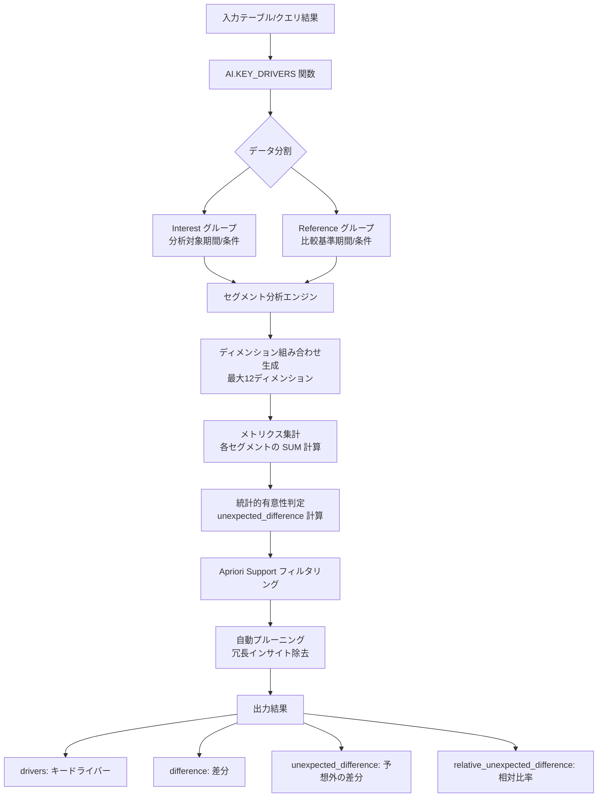

# BigQuery: AI.KEY_DRIVERS 関数のサポート復活

**リリース日**: 2026-06-11

**サービス**: BigQuery

**機能**: AI.KEY_DRIVERS 関数のサポート復活 - 集計可能なメトリクスに対して統計的に有意な変化を引き起こすデータセグメントを特定

**ステータス**: Preview

[このアップデートのインフォグラフィックを見る](https://takech9203.github.io/google-cloud-news-summary/20260611-bigquery-ai-key-drivers.html)

## 概要

BigQuery の AI.KEY_DRIVERS 関数のサポートが復活しました。この関数は、集計可能なメトリクス (summable metric) に対して統計的に有意な変化を引き起こすデータセグメントを自動的に特定する分析関数です。例えば、売上の増減に最も影響を与えている地域や製品カテゴリ、ベンダーなどを SQL クエリ一つで発見できます。

AI.KEY_DRIVERS は、従来の貢献分析モデル (Contribution Analysis Model) の作成と ML.GET_INSIGHTS 関数の呼び出しを組み合わせた手法と比較して、簡略化された構文、高速な結果取得、冗長なインサイトの自動プルーニングを提供します。データアナリスト、ビジネスインテリジェンスチーム、データサイエンティストが、メトリクスの変動要因を迅速に理解するために活用できます。

本機能は現在 Preview ステータスであり、Pre-GA Offerings Terms が適用されます。フィードバックやサポートについては bqml-feedback@google.com に連絡可能です。

**アップデート前の課題**

AI.KEY_DRIVERS 関数は一時的にサポートが停止されていたため、以下の課題がありました。

- メトリクスの変動要因分析を行うには、Contribution Analysis Model を手動で作成し ML.GET_INSIGHTS を呼び出す複数ステップの手順が必要だった
- モデルの作成と管理が必要で、アドホックな分析に向いていなかった
- 冗長なインサイトが返却されるため、結果の解釈に時間がかかった

**アップデート後の改善**

- AI.KEY_DRIVERS 関数が再び利用可能になり、単一の SQL 関数呼び出しで変動要因分析を実行できる
- モデルの作成・管理が不要で、アドホックな分析を即座に開始できる
- 冗長なインサイトが自動的にプルーニングされ、重要な知見に集中できる

## アーキテクチャ図



AI.KEY_DRIVERS 関数は、Interest グループと Reference グループのデータを比較し、指定されたディメンションの各組み合わせについて統計的に有意な変化を検出します。自動プルーニングにより、冗長でないインサイトのみが返却されます。

## サービスアップデートの詳細

### 主要機能

1. **統計的変動要因の自動検出**
   - 集計可能なメトリクスに対して、どのデータセグメントが変化の主要な要因であるかを自動的に特定
   - `unexpected_difference` (予想外の差分) を計算し、他のセグメントの変化率と比較して異常な変化を検出
   - `relative_unexpected_difference` により、変化の相対的な大きさを評価

2. **簡略化された SQL 構文**
   - テーブルまたはクエリ結果を直接入力として使用可能
   - 名前付き引数 (named arguments) による直感的なパラメータ指定
   - モデル作成ステップが不要で、SELECT 文の中で直接呼び出し可能

3. **自動プルーニング機能**
   - 冗長なインサイトをデフォルトで自動的に除去
   - `min_apriori_support` または `top_k` パラメータでフィルタリングを制御
   - 不要な結果を除外することでクエリ実行時間を短縮

## 技術仕様

### 関数シグネチャ

| 項目 | 詳細 |
|------|------|
| 関数名 | `AI.KEY_DRIVERS` |
| 入力形式 | TABLE 参照またはサブクエリ |
| サポートメトリクス | 集計可能 (summable) メトリクスのみ |
| 最大ディメンション数 | 12 |
| ディメンションのデータ型 | INT64, BOOL, STRING |
| デフォルト min_apriori_support | 0.1 |
| top_k 範囲 | 1 - 1,000,000 |
| ステータス | Preview |

### 出力カラム

| カラム名 | 説明 |
|----------|------|
| `drivers` | ARRAY&lt;STRING&gt; - セグメントのディメンション値 |
| `metric_interest` | Interest データセットにおけるメトリクスの合計 |
| `metric_reference` | Reference データセットにおけるメトリクスの合計 |
| `difference` | metric_interest - metric_reference |
| `relative_difference` | difference / metric_reference |
| `unexpected_difference` | 予想との差分 (他セグメントの変化率と比較) |
| `relative_unexpected_difference` | unexpected_difference / expected_metric_interest |
| `apriori_support` | セグメントの全体に対する割合 |
| `contribution` | ABS(difference) |

### SQL 構文

```sql
AI.KEY_DRIVERS(
  { TABLE TABLE_NAME | (QUERY_STATEMENT) },
  metric_col => 'METRIC_COL',
  dimension_cols => DIMENSION_COLS,
  interest_label_col => 'INTEREST_LABEL_COL',
  [, min_apriori_support => MIN_APRIORI_SUPPORT]
  [, top_k => TOP_K]
  [, enable_pruning => ENABLE_PRUNING]
)
```

## 設定方法

### 前提条件

1. BigQuery プロジェクトが有効化されていること
2. 分析対象テーブルに数値型のメトリクスカラム、BOOL 型の Interest/Reference ラベルカラム、およびディメンションカラムが含まれていること

### 手順

#### ステップ 1: 入力データの準備

```sql
-- Interest グループと Reference グループを区別する BOOL カラムを準備
WITH InputData AS (
  SELECT
    CAST(sale_dollars AS BIGNUMERIC) AS sale_dollars,
    city,
    category_name,
    vendor_name,
    (date > '2024-07-01') AS IS_H2  -- TRUE = Interest, FALSE = Reference
  FROM `bigquery-public-data.iowa_liquor_sales.sales`
  WHERE EXTRACT(YEAR FROM DATE) = 2024
)
```

Interest ラベルカラム (上記例では `IS_H2`) が TRUE の行が分析対象 (Interest)、FALSE の行が比較基準 (Reference) として使用されます。

#### ステップ 2: AI.KEY_DRIVERS 関数の実行

```sql
SELECT * EXCEPT(city, vendor_name, category_name)
FROM AI.KEY_DRIVERS(
  TABLE InputData,
  metric_col => 'sale_dollars',
  dimension_cols => ['city', 'vendor_name', 'category_name'],
  interest_label_col => 'IS_H2',
  min_apriori_support => 0
);
```

`dimension_cols` に指定したカラムの組み合わせごとに、メトリクスの変化が統計的に有意かどうかが分析されます。

## メリット

### ビジネス面

- **迅速な要因分析**: 売上変動やユーザー行動の変化の根本原因を、モデル構築なしに即座に特定できる
- **意思決定の加速**: データに基づいた説明が SQL 一文で得られるため、経営判断やキャンペーン評価を迅速化
- **コスト削減**: 従来の手動分析やモデル管理に必要だった工数を大幅に削減

### 技術面

- **シンプルな実装**: モデルの作成・管理が不要で、SQL 関数として直接呼び出し可能
- **自動最適化**: 冗長なインサイトの自動プルーニングにより、結果の品質が向上
- **高速実行**: Contribution Analysis Model + ML.GET_INSIGHTS の組み合わせよりも高速な結果取得

## デメリット・制約事項

### 制限事項

- Preview ステータスのため、本番環境での利用には Pre-GA Offerings Terms が適用される
- サポートされるメトリクスは集計可能 (summable) メトリクスのみ (比率やカテゴリベースのメトリクスは非対応)
- ディメンション数は最大 12 に制限されている
- ディメンションカラムのデータ型は INT64, BOOL, STRING のみ対応

### 考慮すべき点

- 12 以上のディメンションが必要な場合は、従来の Contribution Analysis Model + ML.GET_INSIGHTS を使用する必要がある
- summable by ratio や summable by category メトリクスが必要な場合も従来手法が必要
- `min_apriori_support` と `top_k` は同時に指定できない

## ユースケース

### ユースケース 1: EC サイトの売上変動分析

**シナリオ**: EC サイトで前月比の売上が大きく変動した際に、どの地域・商品カテゴリ・顧客セグメントが主要な変動要因であるかを特定する。

**実装例**:
```sql
SELECT *
FROM AI.KEY_DRIVERS(
  (SELECT
    revenue,
    region,
    product_category,
    customer_segment,
    (month = '2026-05') AS is_current_month
   FROM `project.dataset.sales`
   WHERE month IN ('2026-04', '2026-05')),
  metric_col => 'revenue',
  dimension_cols => ['region', 'product_category', 'customer_segment'],
  interest_label_col => 'is_current_month'
);
```

**効果**: 売上変動の主要因を即座に特定し、マーケティング施策やリソース配分の調整を迅速に実施できる。

### ユースケース 2: 新製品ローンチの影響分析

**シナリオ**: 新製品のローンチ後、既存製品と比較してどの地域・チャネルで予想以上の売上を記録しているかを分析する。

**実装例**:
```sql
SELECT *
FROM AI.KEY_DRIVERS(
  TABLE `mydataset.sales_table`,
  metric_col => 'sales',
  dimension_cols => ['state', 'city'],
  interest_label_col => 'is_new_product'
);
```

**効果**: 新製品の成功要因となっている地域やチャネルを統計的に特定し、今後の展開戦略に活用できる。

### ユースケース 3: インフラコストの変動要因特定

**シナリオ**: クラウドインフラのコストが予想以上に増加した月について、どのサービス・プロジェクト・リージョンが主要な増加要因かを分析する。

**効果**: コスト最適化の優先対象を統計的に特定し、効率的なコスト削減施策を立案できる。

## 料金

AI.KEY_DRIVERS 関数は BigQuery ML の一部として提供されます。料金は BigQuery の標準的な分析料金モデルに基づきます。

### 料金例

| 使用量 | 料金 |
|--------|------|
| オンデマンドクエリ | 処理データ量に基づく標準 BigQuery 料金 |
| 容量ベース (Editions) | スロット使用量に基づく料金 |

## 利用可能リージョン

BigQuery が利用可能なすべてのリージョンおよびマルチリージョン (US, EU) で使用可能です。

## 関連サービス・機能

- **BigQuery ML (Contribution Analysis Model)**: AI.KEY_DRIVERS の代替手法で、12 以上のディメンションや比率メトリクスをサポート
- **ML.GET_INSIGHTS**: Contribution Analysis Model と組み合わせて使用するインサイト取得関数
- **Gemini Cloud Assist in BigQuery**: パフォーマンス監視、容量分析、コスト最適化を支援する AI 機能 (同日に Preview リリース)
- **BigQuery データ分析**: AI.KEY_DRIVERS の基盤となるデータウェアハウス機能

## 参考リンク

- [インフォグラフィック](https://takech9203.github.io/google-cloud-news-summary/20260611-bigquery-ai-key-drivers.html)
- [公式リリースノート](https://docs.cloud.google.com/release-notes#June_11_2026)
- [AI.KEY_DRIVERS 関数ドキュメント](https://docs.cloud.google.com/bigquery/docs/reference/standard-sql/bigqueryml-syntax-ai-key-drivers)
- [Contribution Analysis Model ドキュメント](https://docs.cloud.google.com/bigquery/docs/reference/standard-sql/bigqueryml-syntax-create-contribution-analysis)
- [ML.GET_INSIGHTS ドキュメント](https://docs.cloud.google.com/bigquery/docs/reference/standard-sql/bigqueryml-syntax-get-insights)

## まとめ

BigQuery の AI.KEY_DRIVERS 関数のサポート復活により、データアナリストやビジネスチームは SQL 一文でメトリクスの変動要因を統計的に特定できるようになりました。従来の Contribution Analysis Model と比較して、モデル管理不要・簡略構文・自動プルーニングという利点があり、アドホックな分析や迅速な意思決定に特に有効です。Preview ステータスのため本番利用には注意が必要ですが、要因分析のワークフローを大幅に簡素化する機能として、早期の検証・評価をお勧めします。

---

**タグ**: #BigQuery #BigQueryML #AI_KEY_DRIVERS #ContributionAnalysis #データ分析 #統計分析 #Preview
