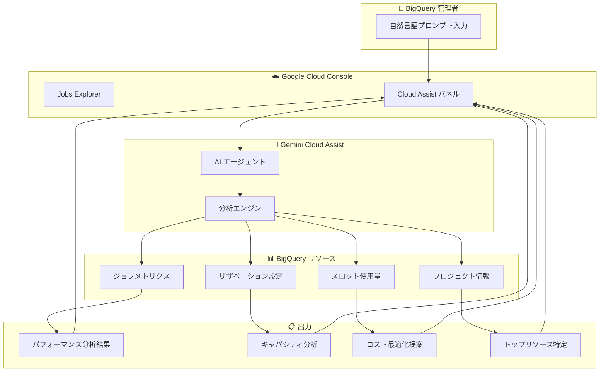

# BigQuery: Gemini Cloud Assist によるパフォーマンス監視、キャパシティ分析、コスト最適化

**リリース日**: 2026-06-11

**サービス**: BigQuery

**機能**: Gemini Cloud Assist によるパフォーマンス監視、キャパシティ分析、コスト最適化

**ステータス**: Preview

📊 [このアップデートのインフォグラフィックを見る](https://takech9203.github.io/google-cloud-news-summary/20260611-bigquery-gemini-cloud-assist-monitoring.html)

## 概要

BigQuery の Jobs Explorer において、Gemini Cloud Assist を使用してパフォーマンスの監視、キャパシティの分析、コストの最適化が可能になりました。自然言語でプロンプトを入力するだけで、リザベーションの利用状況分析、ジョブの比較、ワークロード管理設定の確認、トップリソース消費者の特定などが行えます。

この機能は、BigQuery 管理者が日常的に行うスロット使用量の監視、パフォーマンスボトルネックの特定、コスト削減の機会発見といったタスクを、AI アシスタントとの対話型インターフェースで効率化するものです。従来は INFORMATION_SCHEMA への複雑なクエリや複数のダッシュボードの確認が必要だった作業を、自然言語による質問一つで完了できるようになります。

対象ユーザーは BigQuery の管理者、プラットフォームエンジニア、FinOps 担当者であり、特にリザベーションベースの容量管理を行っている組織にとって大きな価値を提供します。

**アップデート前の課題**

- INFORMATION_SCHEMA.JOBS_BY_ORGANIZATION などへの複雑な SQL クエリを記述して、ジョブのパフォーマンスやスロット使用状況を分析する必要があった
- リザベーションの設定確認（オートスケール、アイドルスロット、コミットメント）に複数のコンソールページやコマンドを使い分ける必要があった
- パフォーマンス劣化の原因特定には、ジョブ間の比較を手動で行い、実行グラフやメトリクスを個別に確認する必要があった
- トップリソース消費者の特定には、スロット使用量の集計クエリを都度作成する必要があった

**アップデート後の改善**

- 自然言語プロンプトでリザベーションのパフォーマンス分析が可能になった（例：「過去 24 時間のリザベーションパフォーマンスを分析して」）
- ジョブの比較やボトルネック特定が対話形式で行え、最適化の機会を自動的にハイライトしてくれるようになった
- ワークロード管理設定（オートスケール、アイドルスロット、エディション別リザベーション）の確認が自然言語で一括して可能になった
- プロジェクトやリザベーション内のトップスロット消費ユーザー・ジョブの即時特定が可能になった

## アーキテクチャ図



BigQuery の Jobs Explorer 内で Gemini Cloud Assist パネルを開き、自然言語プロンプトを入力すると、AI エージェントが BigQuery のジョブメトリクス、リザベーション設定、スロット使用量を分析し、パフォーマンスインサイト、キャパシティ分析、コスト最適化提案を返します。

## サービスアップデートの詳細

### 主要機能

1. **リザベーションとキャパシティの分析**
   - 自然言語でコンピュート使用率の監視とボトルネック特定が可能
   - プロンプト例：「過去 24 時間のリザベーションパフォーマンスを分析して」
   - プロンプト例：「production リザベーションを消費しているトッププロジェクトとユーザーを表示して」
   - プロンプト例：「現在のキャパシティはピーク負荷に十分か？」

2. **ジョブの監視と比較**
   - ワークロード間のパフォーマンス変化を理解するためのジョブ比較
   - ボトルネックと最適化の機会をハイライトするジョブパフォーマンスサマリー
   - 異なるジョブの実行詳細を直接比較し、リグレッションや改善を特定

3. **ワークロード管理設定の確認**
   - リザベーション設定（アサイメント、コミットメント）を自然言語で検査・管理
   - オートスケール設定、アイドルスロット管理、エディション固有の詳細の可視化
   - プロンプト例：「オートスケール付きのリザベーションを一覧表示して」
   - プロンプト例：「すべてのリザベーションの slot_capacity と autoscale_max_slots を表示して」
   - プロンプト例：「ignore idle slots が設定されているリザベーションはいくつあるか？」

4. **トップリソース消費者の特定**
   - プロジェクトやリザベーション内のスロット使用量に基づくトップユーザーとジョブの特定
   - ジョブ、ユーザー、プロジェクト、リザベーションにわたる包括的な管理サポート
   - スロット使用量やジョブ期間などの主要パフォーマンスメトリクスの分析
   - プロンプト例：「プロジェクト内でスロット使用量が最も多いユーザーは？」
   - プロンプト例：「過去 1 時間にリザベーション RESERVATION_NAME で最もスロットを消費しているジョブを表示して」

## 技術仕様

### 前提条件と権限

| 項目 | 詳細 |
|------|------|
| ステータス | Preview（Pre-GA Offerings Terms が適用） |
| 必要な API | Gemini Cloud Assist API (`geminicloudassist.googleapis.com`) |
| 必須 IAM ロール | `roles/geminicloudassist.user`（Gemini Cloud Assist User） |
| 追加 IAM ロール | `roles/cloudasset.viewer`（Cloud Asset Viewer） |
| BigQuery 権限 | `roles/bigquery.resourceViewer`（BigQuery Resource Viewer） |
| アクセス方法 | BigQuery Jobs Explorer 内の Cloud Assist パネル |

### 対応する BigQuery エディション

| エディション | 対応状況 | 備考 |
|------|------|------|
| Standard | 対応 | オートスケールのみ、最大 1,600 スロット |
| Enterprise | 対応 | オートスケール + ベースライン、高度なワークロード管理 |
| Enterprise Plus | 対応 | オートスケール + ベースライン、DR 対応 |
| On-demand | 対応 | リザベーション関連機能は対象外 |

## 設定方法

### 前提条件

1. Google Cloud プロジェクトで Gemini Cloud Assist API が有効化されていること
2. ユーザーに適切な IAM ロールが付与されていること
3. BigQuery リザベーションが設定されていること（キャパシティ分析機能を使用する場合）

### 手順

#### ステップ 1: Gemini Cloud Assist API の有効化

```bash
gcloud services enable geminicloudassist.googleapis.com --project PROJECT_ID
```

追加の必須 API も有効化します：

```bash
gcloud services enable cloudasset.googleapis.com designcenter.googleapis.com \
  appoptimize.googleapis.com apphub.googleapis.com --project PROJECT_ID
```

#### ステップ 2: IAM ロールの付与

```bash
# Gemini Cloud Assist User ロールの付与
gcloud projects add-iam-policy-binding PROJECT_ID \
  --member=user:USER_EMAIL --role=roles/geminicloudassist.user

# Cloud Asset Viewer ロールの付与
gcloud projects add-iam-policy-binding PROJECT_ID \
  --member=user:USER_EMAIL --role=roles/cloudasset.viewer

# BigQuery Resource Viewer ロールの付与（Jobs Explorer 利用に必要）
gcloud projects add-iam-policy-binding PROJECT_ID \
  --member=user:USER_EMAIL --role=roles/bigquery.resourceViewer
```

#### ステップ 3: Cloud Assist パネルの利用開始

1. Google Cloud Console で BigQuery ページに移動
2. Jobs Explorer を開く
3. ツールバーの Gemini アイコンをクリックして Cloud Assist パネルを開く
4. プロンプトフィールドに自然言語で質問を入力

## メリット

### ビジネス面

- **運用コストの可視化と削減**: スロット使用量の分析とコスト最適化提案により、BigQuery の運用費用を削減できる
- **管理者の生産性向上**: 複雑な INFORMATION_SCHEMA クエリの作成が不要になり、自然言語で即座に分析結果を取得可能
- **迅速な意思決定**: キャパシティの過不足を即座に把握し、リザベーションの調整判断を迅速化

### 技術面

- **ボトルネックの早期発見**: スロット競合やジョブパフォーマンス劣化を自然言語で即座に特定可能
- **ジョブ比較の効率化**: 実行グラフ、SQL テキスト、システムレベルの分析を含む包括的なジョブ比較が対話形式で実現
- **設定の一元確認**: オートスケール、アイドルスロット、コミットメントなどのワークロード管理設定を自然言語で一括確認可能

## デメリット・制約事項

### 制限事項

- Preview 段階のため、「Pre-GA Offerings Terms」が適用される（限定的なサポート）
- Gemini Cloud Assist はユーザーの IAM 権限を継承するため、分析対象のリソースへのアクセス権限が必要
- AI による回答はファクトチェックを推奨（事実と異なる出力の可能性あり）
- データレジデンシーまたは CMEK 要件があるプロジェクトでは利用不可（Gemini Cloud Assist はグローバルにデータを保存する可能性がある）

### 考慮すべき点

- リザベーション関連の分析は、容量ベース課金を利用しているプロジェクトでのみ有効
- 組織レベルのデータ表示には `bigquery.jobs.listAll` の組織レベルでの権限が必要
- カスタム制約（Organization Policy）が設定されている場合、チャット機能がブロックされる可能性がある

## ユースケース

### ユースケース 1: ピーク時のキャパシティ不足調査

**シナリオ**: 毎朝 9 時にバッチジョブが集中し、クエリの実行時間が通常の 3 倍に延びている。スロット競合が原因かどうかを確認し、適切なキャパシティを判断したい。

**実装例**:
```
プロンプト: 「過去 24 時間のリザベーションパフォーマンスを分析して。特に朝 9 時前後のスロット使用量とジョブ待機時間を確認したい」
プロンプト: 「現在のキャパシティはピーク負荷に十分か？」
プロンプト: 「オートスケールの最大スロット数を増やすべきか？」
```

**効果**: INFORMATION_SCHEMA クエリを書かずに、スロット競合の有無と適切なオートスケール設定を迅速に判断できる

### ユースケース 2: コスト異常の原因特定

**シナリオ**: 今月の BigQuery コストが前月比 40% 増加している。どのプロジェクト・ユーザー・ジョブがコスト増加の主因なのかを特定したい。

**実装例**:
```
プロンプト: 「プロジェクト内でスロット使用量が最も多いユーザーは？」
プロンプト: 「過去 1 週間で最もスロットを消費しているジョブを表示して」
プロンプト: 「production リザベーションを消費しているトッププロジェクトを表示して」
```

**効果**: コスト増加の主因となっているジョブやユーザーを即座に特定し、最適化アクションにつなげられる

### ユースケース 3: リザベーション設定の棚卸し

**シナリオ**: 組織内に複数のリザベーションが存在し、各リザベーションのオートスケール設定やアイドルスロット設定を一括で把握したい。

**実装例**:
```
プロンプト: 「すべてのリザベーションの slot_capacity と autoscale_max_slots を表示して」
プロンプト: 「ignore idle slots が設定されているリザベーションはいくつあるか？」
プロンプト: 「Enterprise エディションのすべてのリザベーションを一覧表示して」
プロンプト: 「コミットメントを一覧表示して」
```

**効果**: 複数の管理プロジェクトにまたがるリザベーション設定を一箇所で確認し、設定の不整合や最適化の機会を発見できる

## 料金

Gemini Cloud Assist は現在 Preview 段階であり、無料で提供されています。一般提供（GA）開始後は一部の機能に料金が発生する予定です。

詳細な料金情報は [Gemini Cloud Assist pricing](https://cloud.google.com/products/gemini/pricing) を参照してください。

## 関連サービス・機能

- **BigQuery Administrative Resource Charts**: スロット使用量とオペレーショナルヘルスを視覚的に監視するダッシュボード。Gemini Cloud Assist と組み合わせて詳細分析が可能
- **BigQuery Jobs Explorer**: ジョブの監視・トラブルシューティングのための管理ツール。Gemini Cloud Assist のホストとなるインターフェース
- **BigQuery Slot Recommender**: 過去 30 日間のスロット使用量に基づくコスト最適化推奨。コミットメントやオートスケール設定の最適化提案
- **Cloud Hub Optimization**: Gemini Cloud Assist によるプロジェクトやアプリケーションのコスト・利用率の可視化とインサイト生成
- **Cloud Monitoring / Cloud Logging**: BigQuery メトリクスとログの収集。Gemini Cloud Assist の分析データソースとなる

## 参考リンク

- 📊 [インフォグラフィック](https://takech9203.github.io/google-cloud-news-summary/20260611-bigquery-gemini-cloud-assist-monitoring.html)
- [公式リリースノート](https://docs.cloud.google.com/release-notes#June_11_2026)
- [Gemini Cloud Assist in BigQuery ドキュメント](https://docs.cloud.google.com/bigquery/docs/use-cloud-assist)
- [Gemini Cloud Assist セットアップガイド](https://docs.cloud.google.com/cloud-assist/set-up-gemini)
- [Gemini Cloud Assist 概要](https://docs.cloud.google.com/cloud-assist/overview)
- [BigQuery Administrative Jobs Explorer](https://docs.cloud.google.com/bigquery/docs/admin-jobs-explorer)
- [BigQuery Resource Utilization Charts](https://docs.cloud.google.com/bigquery/docs/admin-resource-charts)
- [Gemini Cloud Assist IAM 要件](https://docs.cloud.google.com/cloud-assist/iam-requirements)
- [Gemini Cloud Assist 料金](https://cloud.google.com/products/gemini/pricing)

## まとめ

BigQuery の Jobs Explorer に統合された Gemini Cloud Assist は、BigQuery 管理者のパフォーマンス監視、キャパシティ分析、コスト最適化ワークフローを大幅に効率化します。自然言語による対話型インターフェースにより、従来は複雑な SQL クエリや複数ツールの操作が必要だったタスクが即座に実行可能になります。Preview 段階で無料利用できるため、BigQuery リザベーションを使用している組織は早期に評価を開始し、管理業務の効率化効果を確認することを推奨します。

---

**タグ**: #BigQuery #GeminiCloudAssist #パフォーマンス監視 #コスト最適化 #キャパシティ分析 #Preview #AI #ワークロード管理
