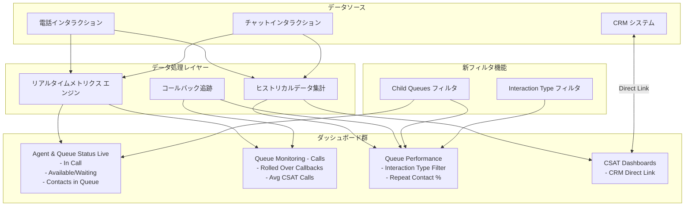

# Google Cloud Contact Center as a Service (CCaaS): ダッシュボード機能強化

**リリース日**: 2026-06-11

**サービス**: Google Cloud Contact Center as a Service (CCaaS)

**機能**: Advanced Reporting Dashboard Enhancements

**ステータス**: Feature / Fixed

[このアップデートのインフォグラフィックを見る](https://takech9203.github.io/google-cloud-news-summary/20260611-ccaas-dashboard-enhancements.html)

## 概要

Google Cloud Contact Center as a Service (CCaaS) の Advanced Reporting ダッシュボードに対する包括的な機能強化が実施された。今回のアップデートでは、リアルタイムモニタリング機能の拡充、キューパフォーマンスの可視性向上、CSAT (顧客満足度) スコアへのダイレクトアクセス機能、およびリピートコンタクトの追跡機能が新たに追加されている。

このアップデートは、コンタクトセンターの運用管理者やスーパーバイザーがリアルタイムでエージェントの状態やキューの状況を把握し、迅速に対応するための機能を大幅に強化するものである。特に、子キューフィルタの追加やインタラクションタイプフィルタにより、大規模な階層型キュー構成を持つエンタープライズ環境での分析がより効率的になった。

また、6 件のバグ修正により、Repeat Contact % の計算精度向上、日付フィルタの動作改善、レポートの正確性が向上している。

**アップデート前の課題**

- キューに子キューが存在する場合、親キューでフィルタしても子キューのデータが自動的に含まれず、個別にフィルタする必要があった
- Agent & Queue Status (Live) Explore でリアルタイムのエージェント状態 (通話中、待機中) やキュー内の待機コンタクト数を即座に確認できなかった
- CSAT ダッシュボードからセッションの CSAT スコアを確認するために、別途 CRM を開いて手動で検索する必要があった
- Queue Monitoring ダッシュボードでロールオーバーされたコールバックやリアルタイムの平均 CSAT を確認できなかった
- Queue Performance ダッシュボードでインタラクションタイプ別のフィルタリングや分析ができなかった
- リピートコンタクト (同じ顧客からの繰り返しの問い合わせ) を Queue Summary Table で直接追跡できなかった

**アップデート後の改善**

- 子キューフィルタの追加により、親キュー選択時に子キューのデータを一括で含めることが可能になった
- Agent & Queue Status (Live) Explore に In Call、Available/Waiting、Contacts in Queue メトリクスが追加され、リアルタイムの状況把握が容易になった
- CSAT ダッシュボードの Session ID から CRM 内の CSAT スコアへ直接リンクでアクセス可能になった
- Real-time Queue Monitoring に Total Rolled Over Pending/Completed Callbacks と Avg CSAT Calls タイルが追加された
- Queue Performance ダッシュボードに Interaction Type フィルタとカラムが追加され、インタラクションタイプ別の分析が可能になった
- Queue Summary Table に Total Repeat Contacts と Repeat Contact % カラムが追加され、リピートコンタクトの定量的な追跡が可能になった

## アーキテクチャ図

CCaaS Advanced Reporting のダッシュボードアーキテクチャを示す図。リアルタイムメトリクスエンジンとヒストリカルデータ集計がデータソースから各ダッシュボードへデータを供給し、新フィルタ機能が横断的にダッシュボードに適用される構成を表している。

## サービスアップデートの詳細

### 主要機能 (新規追加)

1. **子キューフィルタオプション**
   - Queue Name フィルタを持つすべてのダッシュボードに「Child Queues」チェックボックスが追加
   - 「Yes」を選択すると、指定したキューのすべての子キューが自動的に含まれる
   - Queue Name フィルタを持つ Explore にも「Child Queues (Yes / No)」フィルタが新規利用可能
   - 階層型キュー構成を持つ大規模コンタクトセンターでの運用効率が大幅に向上

2. **Agent & Queue Status (Live) Explore 新メトリクス**
   - **In Call**: 現在通話中のエージェント数
   - **Available / Waiting**: 次のコンタクトを待機中の利用可能エージェント数
   - **Contacts in Queue**: キュー内で待機中のコール数
   - リアルタイムでエージェントの稼働状況とキュー負荷を即座に把握可能

3. **CSAT ダッシュボード CRM ダイレクトリンク**
   - CSAT - Calls / CSAT - Chats ダッシュボードの CSAT Interactions テーブルに CRM リンクを追加
   - Session ID の横に CRM 内の CSAT スコアへの直接リンクが表示
   - CRM 内で手動検索する手間を排除し、即座にスコア詳細を確認可能

4. **Real-time Queue Monitoring - Calls 新メトリクスタイル**
   - **Total Rolled Over Pending Callbacks**: ロールオーバーされた保留中コールバック総数
   - **Total Rolled Over Completed Callbacks**: ロールオーバーされた完了済みコールバック総数
   - **Avg CSAT Calls**: 通話のリアルタイム平均 CSAT スコア
   - コールバック運用の健全性と顧客満足度をリアルタイムで監視可能

5. **Queue Performance ダッシュボード機能拡張**
   - Queue Performance - Calls / Chats に新しい **Interaction Type フィルタ**を追加
   - Queue Detailed Table に **Interaction Type カラム**を追加
   - Queue Performance - Calls に **Total Rolled Over Completed Callbacks** / **Total Rolled Over Pending Callbacks** メトリクスタイルを追加
   - インタラクションの種別 (インバウンド、アウトバウンド、コールバック等) ごとのパフォーマンス分析が可能に

6. **Queue Summary Table リピートコンタクトデータ**
   - Queue Performance - Calls / Chats の Queue Summary Table に新カラム追加:
     - **Total Repeat Contacts**: リピートコンタクトの総数
     - **Repeat Contact %**: 全コンタクトに対するリピートコンタクトの割合
   - 顧客の問題解決率 (FCR: First Contact Resolution) の間接的な指標として活用可能

### バグ修正

1. **Repeat Contact % 100% 超過問題の修正**
   - Queue Performance - Calls ダッシュボードの Queue Summary Table で Repeat Contact % が 100% を超える値を表示する問題を修正
   - 計算ロジックの不具合が修正され、正確なパーセンテージが表示されるように

2. **日付フィルタ「is on or after」問題の修正**
   - Explore の Date フィルタで絶対日付に「is on or after」を設定した際に結果が返されない問題を修正
   - 日付範囲指定によるレポート生成が正常に動作するように

3. **Agent Availability ダッシュボードの Total Logged in Time 削除**
   - Agent Availability ダッシュボードから Total Logged in Time メトリクスタイルを削除
   - 不要または不正確なメトリクスの整理

4. **言語ラベルの欠落修正**
   - Advanced Reporting ダッシュボードで言語ラベルが表示されない問題を修正
   - 多言語対応環境での正確なフィルタリングが可能に

5. **Virtual Agent Chats テーブルのチャット ID 問題修正**
   - All Interactions - Chats ダッシュボードでチャット ID でフィルタした際に、Virtual Agent Chats テーブルに誤ったチャット ID が表示される問題を修正

6. **アウトバウンドコールの Disposition Code 欠落修正**
   - Call Agent Metrics (Historical) ダッシュボードでアウトバウンドコールの Disposition Code が欠落またはブランクになる問題を修正
   - アウトバウンドキャンペーンの結果分析が正確に

## 技術仕様

### 新規メトリクス一覧

| ダッシュボード | メトリクス名 | 種類 | 説明 |
|------|------|------|------|
| Agent & Queue Status (Live) | In Call | リアルタイム | 通話中のエージェント数 |
| Agent & Queue Status (Live) | Available / Waiting | リアルタイム | 待機中のエージェント数 |
| Agent & Queue Status (Live) | Contacts in Queue | リアルタイム | キュー待機中のコンタクト数 |
| Queue Monitoring - Calls | Total Rolled Over Pending Callbacks | リアルタイム | ロールオーバー保留コールバック数 |
| Queue Monitoring - Calls | Total Rolled Over Completed Callbacks | リアルタイム | ロールオーバー完了コールバック数 |
| Queue Monitoring - Calls | Avg CSAT Calls | リアルタイム | 通話平均 CSAT スコア |
| Queue Performance - Calls | Total Rolled Over Completed Callbacks | ヒストリカル | ロールオーバー完了コールバック数 |
| Queue Performance - Calls | Total Rolled Over Pending Callbacks | ヒストリカル | ロールオーバー保留コールバック数 |
| Queue Summary Table | Total Repeat Contacts | ヒストリカル | リピートコンタクト総数 |
| Queue Summary Table | Repeat Contact % | ヒストリカル | リピートコンタクト割合 |

### 新規フィルタ一覧

| フィルタ名 | 適用先 | 説明 |
|------|------|------|
| Child Queues (Yes/No) | Queue Name フィルタを持つ全ダッシュボード・Explore | 子キューの包含/除外 |
| Interaction Type | Queue Performance - Calls / Chats | インタラクションタイプ別フィルタリング |

### ダッシュボードアクセス要件

| ロール | 閲覧権限 | 編集権限 |
|------|------|------|
| Admin | 全ダッシュボード | 全ダッシュボード |
| Manager Admin | 全ダッシュボード | なし |
| Manager / Manager Team / Manager Data | 担当キューのみ | なし |
| Agent | なし | なし |

## 設定方法

### 前提条件

1. CCAI Platform インスタンスが Advanced Reporting 対応リージョン (us-east1, us-central1, us-west1, europe-west2, asia-northeast1, northamerica-northeast1, australia-southeast1) にデプロイされていること
2. Advanced Reporting 拡張機能が有効化されていること
3. 適切なロール (Admin, Manager Admin, Manager) が割り当てられていること

### 手順

#### ステップ 1: Advanced Reporting の有効化確認

Google Cloud コンソールでプロジェクトを選択し、CCAI Platform インスタンスの詳細ページで Extensions セクションの「Advanced reporting」チェックボックスが有効であることを確認する。

#### ステップ 2: 子キューフィルタの使用

1. CCAI Platform ポータルで Dashboard > Advanced Reporting を選択
2. 対象のダッシュボードを開く
3. Queue Name フィルタでキューを選択
4. 「Child Queues」チェックボックスで「Yes」を選択
5. 「Update」をクリック

#### ステップ 3: CSAT ダイレクトリンクの活用

1. Dashboard > CSAT - Calls または CSAT - Chats を開く
2. CSAT Interactions テーブルで対象の Session ID を確認
3. Session ID 横のリンクをクリックして CRM 内の CSAT スコアに直接アクセス

## メリット

### ビジネス面

- **運用可視性の向上**: リアルタイムメトリクスの追加により、エージェントの稼働状況やキュー負荷を即座に把握でき、迅速なスタッフィング調整が可能
- **顧客体験の改善**: Repeat Contact % の追跡により FCR (First Contact Resolution) の間接指標を把握し、問題解決品質の改善につなげられる
- **CSAT 分析効率化**: CRM へのダイレクトリンクにより、顧客フィードバックの調査時間を大幅に削減
- **コールバック運用の最適化**: Rolled Over Callbacks メトリクスにより、コールバックの滞留や完了状況を可視化し、SLA 遵守を支援

### 技術面

- **階層型キュー管理の簡素化**: 子キューフィルタにより、複雑なキュー階層でも一括でデータ取得が可能
- **Explore の柔軟性向上**: Interaction Type フィルタとリアルタイムメトリクスの追加により、カスタムレポートの作成幅が拡大
- **データ精度の向上**: Repeat Contact % の計算修正と Disposition Code の欠落修正により、レポートの信頼性が向上

## デメリット・制約事項

### 制限事項

- Advanced Reporting は対応リージョン (7 リージョン) でのみ利用可能
- Advanced Reporting を有効化すると、レガシーダッシュボードは利用不可になる
- Agent ロールのユーザーはダッシュボードにアクセスできない
- Queue Performance ダッシュボードの日付範囲は最大 45 日間に制限
- ダッシュボードのリフレッシュ間隔はデフォルト 60 秒

### 考慮すべき点

- Advanced Reporting の有効化/無効化はカスタムロールの権限設定に影響する可能性がある
- CRM ダイレクトリンクは CRM 側の設定が正しく構成されている必要がある
- Rolled Over Callbacks メトリクスはコールバック機能を利用している環境でのみ有用

## ユースケース

### ユースケース 1: 大規模コンタクトセンターのリアルタイム監視

**シナリオ**: 複数の製品ラインにまたがる階層型キュー構成 (親キュー: 製品カテゴリ、子キュー: 言語別) を持つエンタープライズコンタクトセンターで、製品カテゴリ全体のリアルタイム状況を把握したい。

**効果**: 子キューフィルタを使用することで、親キューを選択するだけで配下のすべての言語別キューのデータが統合表示される。Agent & Queue Status (Live) の新メトリクスと組み合わせることで、製品カテゴリ全体のエージェント稼働率とキュー負荷をリアルタイムで監視し、必要に応じてエージェントの再配置を迅速に判断できる。

### ユースケース 2: 顧客体験品質の継続的改善

**シナリオ**: CSAT スコアが低下している傾向を検知し、根本原因を特定して改善アクションにつなげたい。

**効果**: Avg CSAT Calls メトリクスでリアルタイムの CSAT トレンドを監視し、スコアが低下した Session ID から CRM ダイレクトリンクで即座に詳細を確認。さらに Repeat Contact % を追跡することで、問題が一度で解決されていないケース (低 FCR) を特定し、エージェントトレーニングやプロセス改善に活用できる。

### ユースケース 3: コールバック運用の最適化

**シナリオ**: コールバック機能を利用しているが、ロールオーバー (未完了のまま翌日に持ち越し) されるコールバックが増加しており、SLA に影響している。

**効果**: Total Rolled Over Pending Callbacks と Total Rolled Over Completed Callbacks をリアルタイムで監視し、コールバックの滞留状況を可視化。Interaction Type フィルタでコールバックのみを抽出してパフォーマンスを分析し、適切なスタッフ配置やコールバック枠の調整を行うことで SLA 遵守率を改善できる。

## 料金

CCaaS の料金体系は Google Cloud の営業担当を通じたカスタム見積もりとなる。Advanced Reporting ダッシュボード機能は CCaaS プラットフォームの標準機能として含まれており、今回のダッシュボード機能強化による追加料金は発生しない。

詳細は [Google Cloud Contact Center as a Service 料金ページ](https://cloud.google.com/solutions/contact-center-as-a-service#pricing) を参照。

## 利用可能リージョン

Advanced Reporting ダッシュボードは以下のリージョンで利用可能:

| リージョン | ロケーション |
|------|------|
| us-east1 | サウスカロライナ |
| us-central1 | アイオワ |
| us-west1 | オレゴン |
| europe-west2 | ロンドン |
| asia-northeast1 | 東京 |
| northamerica-northeast1 | モントリオール |
| australia-southeast1 | シドニー |

## 関連サービス・機能

- **CCAI Platform (Contact Center AI Platform)**: CCaaS の基盤となるプラットフォーム。AI 機能、ルーティング、エージェント管理を提供
- **Customer Engagement Suite**: CCaaS と統合された顧客エンゲージメントツール群。チャットボット、音声 AI、自然言語処理を含む
- **Looker (Advanced Reporting 基盤)**: CCaaS の Advanced Reporting は Looker ベースの Explore 機能を使用しており、カスタムレポートやダッシュボードの作成が可能
- **Cloud Monitoring**: インフラストラクチャレベルの監視。CCaaS のシステムヘルスと組み合わせて総合的な運用監視を実現

## 参考リンク

- [インフォグラフィック](https://takech9203.github.io/google-cloud-news-summary/20260611-ccaas-dashboard-enhancements.html)
- [公式リリースノート](https://docs.cloud.google.com/release-notes#June_11_2026)
- [ダッシュボード概要ドキュメント](https://docs.cloud.google.com/contact-center/ccai-platform/docs/dashboards-overview)
- [Queue Performance ダッシュボード](https://docs.cloud.google.com/contact-center/ccai-platform/docs/dashboards-queue-performance)
- [Real-time Queue Monitoring ダッシュボード](https://docs.cloud.google.com/contact-center/ccai-platform/docs/dashboards-real-time-queue-monitor)
- [Agent Monitoring ダッシュボード](https://docs.cloud.google.com/contact-center/ccai-platform/docs/dashboards-real-time-agent-monitoring)
- [Contact Center as a Service ソリューション](https://cloud.google.com/solutions/contact-center-as-a-service)

## まとめ

今回の CCaaS ダッシュボード機能強化は、コンタクトセンター運用の可視性とデータ精度を大幅に向上させるアップデートである。特に子キューフィルタ、リアルタイムメトリクスの拡充、CRM ダイレクトリンク、リピートコンタクト追跡の追加により、エンタープライズ規模のコンタクトセンターにおける運用効率と顧客体験の改善を支援する。CCaaS を利用中の組織は、Advanced Reporting が有効化されていることを確認し、新しいメトリクスとフィルタを活用してオペレーショナルエクセレンスの向上に取り組むことを推奨する。

---

**タグ**: #CCaaS #ContactCenter #Dashboard #RealTimeMonitoring #CSAT #QueueManagement #AdvancedReporting #CCAI
