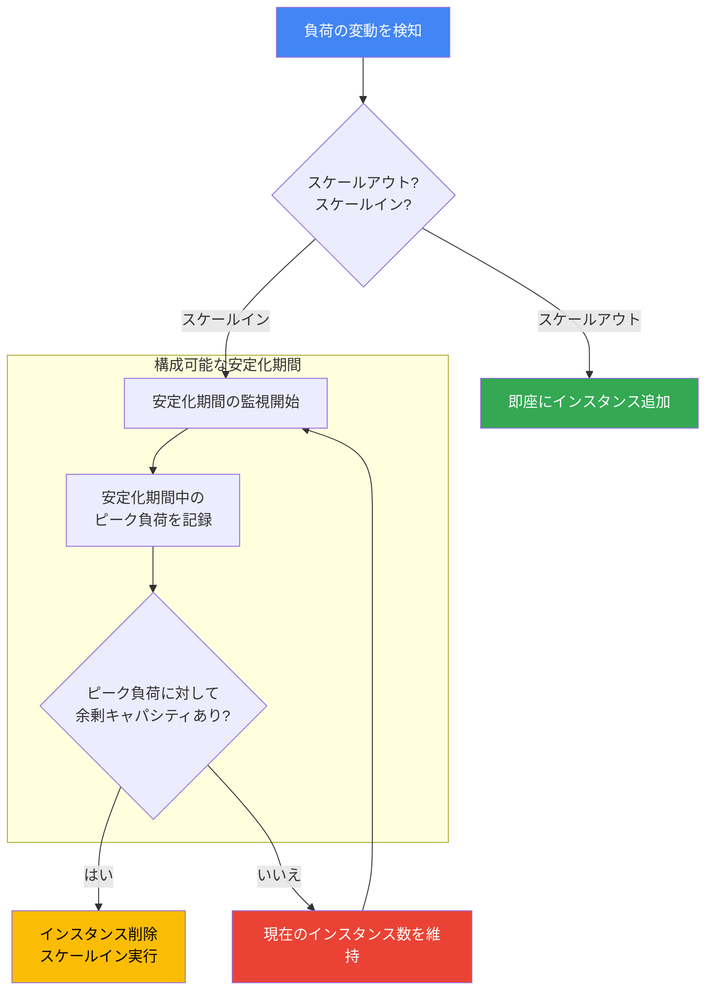

# Compute Engine: MIG Autoscaler Stabilization Period の構成機能

**リリース日**: 2026-06-11

**サービス**: Compute Engine

**機能**: MIG Autoscaler Stabilization Period (安定化期間の構成)

**ステータス**: Feature

[このアップデートのインフォグラフィックを見る](https://takech9203.github.io/google-cloud-news-summary/20260611-compute-engine-mig-stabilization-period.html)

## 概要

Google Cloud Compute Engine のマネージド インスタンス グループ (MIG) のオートスケーラーにおいて、安定化期間 (Stabilization Period) を明示的に構成できる機能が正式にリリースされました。この機能により、負荷が減少した後にオートスケーラーがインスタンスを削除するまでの待機時間をワークロードの特性に合わせてカスタマイズできます。

安定化期間は、オートスケーラーがスケールイン (インスタンス削除) の判断を行う際に使用されるパラメータです。オートスケーラーは安定化期間中に観測されたピーク負荷に基づいてグループの推奨サイズを計算し、急激なインスタンスの増減を防ぎます。これにより、コスト最適化と可用性のバランスを取ることが可能になります。

この機能は、トラフィックパターンが予測しにくいワークロードや、コスト削減を積極的に行いたい Web サービス、セッションアフィニティを必要とするアプリケーションなど、多様なユースケースに対応します。

**アップデート前の課題**

- 安定化期間はデフォルトの 600 秒 (10 分) に固定されており、ワークロードの特性に合わせた細かい調整が困難だった
- 負荷の変動が激しいワークロードでは、頻繁なインスタンスの作成と削除によるオーバーヘッドが発生していた
- コスト最適化を重視する場合でも、不要なインスタンスが 10 分間維持され続けるため、無駄なコストが発生していた

**アップデート後の改善**

- 安定化期間を 0 秒から 3600 秒 (1 時間) の範囲で自由に設定可能になった
- ワークロードの特性に応じて、コスト最適化と安定性のトレードオフを制御できるようになった
- Console、gcloud CLI、REST API のすべてのインターフェースから構成が可能になった

## アーキテクチャ図



この図は、MIG オートスケーラーがスケールイン判断を行う際の安定化期間の役割を示しています。負荷減少時にはすぐにインスタンスを削除するのではなく、設定された安定化期間中のピーク負荷を基準に判断します。

## サービスアップデートの詳細

### 主要機能

1. **安定化期間のカスタム設定**
   - 0 秒から 3600 秒 (1 時間) の範囲で設定可能
   - デフォルト値は 600 秒 (10 分)
   - 新規オートスケーラー作成時および既存オートスケーラー更新時の両方で設定可能

2. **ピーク負荷ベースの判断ロジック**
   - 安定化期間中に観測されたピーク負荷を基準にスケールイン判断を実施
   - 負荷シグナルの安定化により、不要なインスタンスの増減を防止
   - 新しく追加されたインスタンスは安定化期間が経過するまで削除対象にならない

3. **スケールイン制御との併用**
   - 安定化期間とスケールイン制御 (Scale-in Controls) は独立した機能として併用可能
   - 安定化期間はピーク負荷に基づく判断、スケールイン制御はインスタンス削減率の制限を提供
   - それぞれ異なる観点からスケールインの安全性を担保

## 技術仕様

### パラメータ仕様

| 項目 | 詳細 |
|------|------|
| パラメータ名 (gcloud) | `--stabilization-period` |
| パラメータ名 (REST API) | `stabilizationPeriodSec` |
| 最小値 | 0 秒 |
| 最大値 | 3600 秒 (1 時間) |
| デフォルト値 | 600 秒 (10 分) |
| 適用対象 | スケールイン判断のみ (スケールアウトには影響しない) |

### 必要な IAM 権限

| 権限 | 用途 |
|------|------|
| `compute.autoscalers.create` | オートスケーラーの新規作成 |
| `compute.autoscalers.update` | 既存オートスケーラーの更新 |
| `compute.instanceGroupManagers.use` | インスタンスグループの使用 |

## 設定方法

### 前提条件

1. マネージド インスタンス グループ (MIG) が作成済みであること
2. 適切な IAM 権限が付与されていること

### 手順

#### ステップ 1: gcloud CLI でオートスケーラーを作成する場合

```bash
gcloud compute instance-groups managed set-autoscaling INSTANCE_GROUP_NAME \
    --max-num-replicas 20 \
    --target-cpu-utilization 0.60 \
    --cool-down-period 90 \
    --stabilization-period 240
```

`--stabilization-period` フラグで安定化期間を秒単位で指定します。この例では 240 秒 (4 分) に設定しています。

#### ステップ 2: 既存のオートスケーラーを更新する場合

```bash
gcloud compute instance-groups managed update-autoscaling INSTANCE_GROUP_NAME \
    --stabilization-period 300
```

既存のオートスケーラーの安定化期間のみを変更する場合は `update-autoscaling` コマンドを使用します。

#### ステップ 3: REST API で設定する場合

```json
POST https://www.googleapis.com/compute/v1/projects/PROJECT_ID/regions/REGION/autoscalers

{
  "name": "my-autoscaler",
  "target": "https://www.googleapis.com/compute/v1/projects/PROJECT_ID/regions/REGION/instanceGroupManagers/my-mig",
  "autoscalingPolicy": {
    "minNumReplicas": 1,
    "maxNumReplicas": 5,
    "coolDownPeriodSec": 60,
    "cpuUtilization": {
      "utilizationTarget": 0.8
    },
    "stabilizationPeriodSec": 240
  }
}
```

#### ステップ 4: Console から設定する場合

1. Google Cloud コンソールで「インスタンス グループ」ページに移動
2. オートスケーリングが設定された MIG を選択
3. 「編集」をクリック
4. 「グループサイズとオートスケーリング」セクションを展開
5. 「安定化期間」フィールドに秒数を入力
6. 「保存」をクリック

## メリット

### ビジネス面

- **コスト最適化**: 安定化期間を短縮することで、不要なインスタンスをより早く削除し、コンピューティングコストを削減できる
- **SLA 維持**: 安定化期間を延長することで、急激な負荷変動に対する余裕を確保し、サービスの安定性を維持できる

### 技術面

- **ワークロード最適化**: アプリケーションの特性に合わせたスケーリング動作のチューニングが可能
- **運用オーバーヘッド削減**: 適切な安定化期間を設定することで、不要なインスタンスの作成・削除の繰り返しを防止できる
- **他の制御機能との連携**: スケールイン制御や予測オートスケーリングと組み合わせて、より精密なスケーリング戦略を構築可能

## デメリット・制約事項

### 制限事項

- 安定化期間はスケールインにのみ適用され、スケールアウトには影響しない
- 設定可能な範囲は 0 秒から 3600 秒 (1 時間) に限定される
- バックエンドサービスでコネクションドレインが有効な場合、安定化期間に加えて最大 60 秒の追加遅延が発生する可能性がある

### 考慮すべき点

- 安定化期間を 0 秒に設定すると、負荷の急激な変動時にインスタンスの頻繁な作成・削除が発生し、パフォーマンスに影響する可能性がある
- 安定化期間は初期化期間 (Cool-down Period) よりも長く設定することが推奨される (新しいインスタンスが完全に準備できる前に削除されることを防ぐため)
- 安定化期間の変更は即座に反映されるため、本番環境では段階的に調整することが望ましい

## ユースケース

### ユースケース 1: 高速スケーリング Web サービス

**シナリオ**: 初期化が数秒で完了する軽量な Web サービスで、コスト削減を積極的に行いたい場合

**実装例**:
```bash
gcloud compute instance-groups managed set-autoscaling web-service-mig \
    --max-num-replicas 50 \
    --target-cpu-utilization 0.60 \
    --cool-down-period 30 \
    --stabilization-period 180
```

**効果**: デフォルトの 600 秒から 180 秒に短縮することで、不要なインスタンスがより早く削除され、コンピューティングコストを約 70% 早く最適化できる

### ユースケース 2: セッションアフィニティが必要なアプリケーション

**シナリオ**: ユーザーセッションが特定の VM に紐付いており、負荷減少後もクライアントリクエストを処理し続ける必要がある場合

**実装例**:
```bash
gcloud compute instance-groups managed set-autoscaling session-app-mig \
    --max-num-replicas 20 \
    --target-cpu-utilization 0.70 \
    --cool-down-period 120 \
    --stabilization-period 1800
```

**効果**: 安定化期間を 30 分に設定することで、セッションのライフサイクルに対応し、アクティブなセッションが中断されるリスクを低減

### ユースケース 3: 変動の激しいバッチ処理ワークロード

**シナリオ**: 日中に断続的なバッチジョブが実行され、負荷が急激に上下するワークロード

**実装例**:
```bash
gcloud compute instance-groups managed set-autoscaling batch-mig \
    --max-num-replicas 100 \
    --target-cpu-utilization 0.80 \
    --cool-down-period 60 \
    --stabilization-period 600
```

**効果**: デフォルトの 600 秒を維持することで、断続的な負荷スパイクに対応する余裕を確保し、ジョブの再起動を防止

## 料金

安定化期間の設定自体に追加料金は発生しません。ただし、安定化期間の設定値はインスタンスの稼働時間に直接影響するため、以下の点を考慮する必要があります。

- **安定化期間を短くした場合**: インスタンスがより早く削除されるため、Compute Engine の使用料金が削減される
- **安定化期間を長くした場合**: インスタンスがより長く維持されるため、その分の Compute Engine 使用料金が発生する
- インスタンスの料金は通常の Compute Engine VM の料金体系に従う

## 関連サービス・機能

- **スケールイン制御 (Scale-in Controls)**: 安定化期間と併用して、一度に削除されるインスタンス数の上限を設定する機能
- **予測オートスケーリング (Predictive Autoscaling)**: 過去のデータに基づいて将来の負荷を予測し、事前にスケールアウトする機能
- **初期化期間 (Cool-down Period)**: 新しいインスタンスのアプリケーション初期化時間を指定する機能
- **Cloud Load Balancing**: MIG と連携してトラフィックを分散するサービス
- **Cloud Monitoring**: オートスケーラーの判断に使用されるメトリクスを提供するサービス

## 参考リンク

- [インフォグラフィック](https://takech9203.github.io/google-cloud-news-summary/20260611-compute-engine-mig-stabilization-period.html)
- [公式リリースノート](https://docs.cloud.google.com/release-notes#June_11_2026)
- [安定化期間の構成ドキュメント](https://docs.cloud.google.com/compute/docs/autoscaler/managing-autoscalers#configure_stabilization_period)
- [オートスケーラーの判断について](https://docs.cloud.google.com/compute/docs/autoscaler/understanding-autoscaler-decisions)
- [ベストプラクティス](https://docs.google.com/compute/docs/autoscaler/managing-autoscalers#stabilization-period-best-practices)
- [gcloud set-autoscaling リファレンス](https://docs.cloud.google.com/sdk/gcloud/reference/compute/instance-groups/managed/set-autoscaling)

## まとめ

MIG Autoscaler の安定化期間構成機能により、ワークロードの特性に合わせてスケールイン動作を精密に制御できるようになりました。コスト最適化を重視する場合は期間を短縮し、安定性を重視する場合は延長することで、ビジネス要件に最適なスケーリング戦略を実現できます。既存の MIG を運用しているユーザーは、ワークロードの特性に応じて安定化期間の見直しを検討することを推奨します。

---

**タグ**: #ComputeEngine #MIG #Autoscaler #StabilizationPeriod #ScaleIn #コスト最適化 #オートスケーリング
