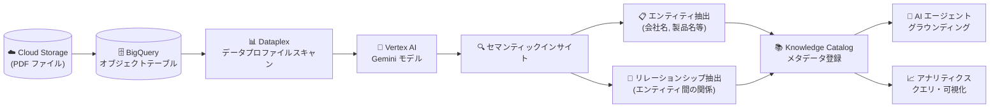

# Knowledge Catalog (Dataplex): 非構造化データに対するデータプロファイルスキャン

**リリース日**: 2026-06-11

**サービス**: Knowledge Catalog (Dataplex)

**機能**: 既存の BigQuery オブジェクトテーブル上の非構造化データ (Cloud Storage 内の PDF) に対するデータプロファイルスキャン

**ステータス**: Preview (Dataplex REST API のみ)

📊 [このアップデートのインフォグラフィックを見る](https://takech9203.github.io/google-cloud-news-summary/20260611-knowledge-catalog-unstructured-data-profiles.html)

## 概要

Knowledge Catalog (旧 Dataplex Universal Catalog) に、既存の BigQuery オブジェクトテーブル上の非構造化データ (Cloud Storage 内の PDF ファイル) に対するデータプロファイルスキャン機能が Preview として追加されました。この機能は Vertex AI Gemini モデルを活用して、非構造化コンテンツからエンティティやリレーションシップなどのセマンティックインサイトを自動的に抽出します。

従来の Knowledge Catalog のデータプロファイリングは、BigQuery テーブルや Iceberg REST Catalog テーブルの構造化データを対象としていました。今回のアップデートにより、PDF などの非構造化ファイルについても、Vertex AI を活用したセマンティック分析が可能となり、これまで「ダークデータ」として活用されていなかった非構造化データを構造化されたクエリ可能なアセットに変換できるようになります。

現時点では Dataplex REST API のみで利用可能であり、Cloud Console や gcloud コマンドラインでのワークフローはサポートされていません。

**アップデート前の課題**

- 非構造化データ (PDF 等) の内容を把握するには、手動でのドキュメント解析やカスタム ETL コードの開発が必要だった
- 既存の BigQuery オブジェクトテーブルに対して、ファイルレベルのメタデータ (サイズ、タイプ) しか確認できなかった
- 非構造化ファイル内のビジネスコンテキスト (エンティティ、リレーションシップ) を AI エージェントやアナリティクスで活用するための仕組みがなかった
- ダークデータの発見・分類・活用には、ドメイン知識を持つ人間が手動でファイルを確認する必要があった

**アップデート後の改善**

- 既存の BigQuery オブジェクトテーブル上の PDF ファイルに対して、データプロファイルスキャンを実行できるようになった
- Vertex AI Gemini モデルによるセマンティック分析で、エンティティ (会社名、製品名、シリアル番号等) とリレーションシップ (エンティティ間の関係) を自動抽出
- 抽出されたインサイトは Knowledge Catalog のエントリとして登録され、検索可能なメタデータとして活用可能
- AI エージェントのグラウンディングや RAG (Retrieval-Augmented Generation) に活用可能な構造化データを自動生成

## アーキテクチャ図



Cloud Storage 内の PDF ファイルが BigQuery オブジェクトテーブルを経由してスキャンされ、Vertex AI Gemini がセマンティック分析を行い、抽出されたエンティティとリレーションシップが Knowledge Catalog に登録される流れを示しています。

## サービスアップデートの詳細

### 主要機能

1. **非構造化データのセマンティック分析**
   - Cloud Storage 内の PDF ファイルの実際のコンテンツを Vertex AI で分析
   - ファイルレベルのメタデータ (サイズ、タイプ) を超えた深い内容理解を実現
   - エンティティ推論: 生成 AI を使用してファイルコンテンツから特定の属性 (会社名、製品名、シリアル番号等) を抽出

2. **リレーションシップ抽出**
   - エンティティ間の接続関係を自動識別 (例: 「コンポーネント is_part_of 製品」)
   - セマンティックグラフの構築による関係性の可視化
   - グラフプロファイルアスペクトとして Knowledge Catalog メタデータに格納

3. **既存 BigQuery オブジェクトテーブルへの対応**
   - 新規ディスカバリスキャンなしで、既存のオブジェクトテーブルに対してプロファイルスキャンを実行可能
   - Dataplex REST API を通じたスキャンの作成・実行・管理

4. **AI 生成メタデータの自動登録**
   - スキーマ推論: AI が提案するリレーショナルスキーマを自動生成
   - 人間が読める自然言語の説明を自動生成
   - Knowledge Catalog エントリとしてメタデータを自動登録し、検索・活用が可能

## 技術仕様

### スキャン対象と制約

| 項目 | 詳細 |
|------|------|
| 対象ファイル形式 | PDF (現時点で最適化対象) |
| データソース | 既存の BigQuery オブジェクトテーブル (Cloud Storage 上のファイルを参照) |
| 利用可能 API | Dataplex REST API のみ |
| Cloud Console | 未サポート |
| gcloud CLI | 未サポート |
| ステータス | Preview |
| 使用 AI モデル | Vertex AI Gemini |
| 利用可能リージョン | Vertex AI Gemini 2.5 Pro モデルがサポートされるリージョン |

### 必要な IAM ロール

| ID | ロール | 対象 |
|------|------|------|
| Knowledge Catalog ディスカバリサービスエージェント | Vertex AI User (`roles/aiplatform.user`) | プロジェクト |
| BigQuery 接続サービスアカウント | Storage Object Viewer (`roles/storage.objectViewer`) | ソースバケット |
| BigQuery 接続サービスアカウント | Vertex AI User (`roles/aiplatform.user`) | プロジェクト |
| エンドユーザー | Dataplex DataScan DataViewer (`roles/dataplex.dataScanDataViewer`) | プロジェクト |
| エンドユーザー | BigQuery Data Editor (`roles/bigquery.dataEditor`) | データセット |

### REST API によるスキャン作成

```bash
# データプロファイルスキャンの作成 (REST API)
curl -X POST \
  "https://dataplex.googleapis.com/v1/projects/PROJECT_ID/locations/LOCATION/dataScans?dataScanId=DATASCAN_ID" \
  -H "Authorization: Bearer $(gcloud auth print-access-token)" \
  -H "Content-Type: application/json" \
  -d '{
    "data": {
      "resource": "//bigquery.googleapis.com/projects/PROJECT_ID/datasets/DATASET/tables/OBJECT_TABLE"
    },
    "dataProfileSpec": {}
  }'
```

```bash
# データプロファイルスキャンの実行
curl -X POST \
  "https://dataplex.googleapis.com/v1/projects/PROJECT_ID/locations/LOCATION/dataScans/DATASCAN_ID:run" \
  -H "Authorization: Bearer $(gcloud auth print-access-token)"
```

## 設定方法

### 前提条件

1. Dataplex API が有効化されていること
2. BigQuery オブジェクトテーブルが作成済みであること (Cloud Storage 内の PDF ファイルを参照)
3. BigQuery 接続 (Cloud Resource Connection) が設定済みであること
4. 必要な IAM ロールが付与されていること (Vertex AI User、Storage Object Viewer 等)
5. Vertex AI Gemini モデルが利用可能なリージョンであること

### 手順

#### ステップ 1: BigQuery 接続サービスアカウントに権限を付与

```bash
# BigQuery 接続のサービスアカウント ID を取得
# (接続詳細の Connection info セクションから取得)

# Storage Object Viewer を付与
gcloud storage buckets add-iam-policy-binding gs://BUCKET_NAME \
  --member="serviceAccount:CONNECTION_SERVICE_ACCOUNT" \
  --role="roles/storage.objectViewer"

# Vertex AI User を付与
gcloud projects add-iam-policy-binding PROJECT_ID \
  --member="serviceAccount:CONNECTION_SERVICE_ACCOUNT" \
  --role="roles/aiplatform.user"
```

BigQuery 接続サービスアカウントに、Cloud Storage バケットへの読み取り権限と Vertex AI の推論権限を付与します。

#### ステップ 2: Dataplex REST API でデータプロファイルスキャンを作成・実行

```bash
# データプロファイルスキャンの作成
curl -X POST \
  "https://dataplex.googleapis.com/v1/projects/PROJECT_ID/locations/LOCATION/dataScans?dataScanId=my-unstructured-profile-scan" \
  -H "Authorization: Bearer $(gcloud auth print-access-token)" \
  -H "Content-Type: application/json" \
  -d '{
    "data": {
      "resource": "//bigquery.googleapis.com/projects/PROJECT_ID/datasets/DATASET_ID/tables/OBJECT_TABLE_ID"
    },
    "dataProfileSpec": {}
  }'

# スキャンの実行
curl -X POST \
  "https://dataplex.googleapis.com/v1/projects/PROJECT_ID/locations/LOCATION/dataScans/my-unstructured-profile-scan:run" \
  -H "Authorization: Bearer $(gcloud auth print-access-token)"
```

REST API を使用してスキャンを作成し、実行します。結果は Knowledge Catalog のエントリとして登録されます。

## メリット

### ビジネス面

- **ダークデータの活用**: これまで活用されていなかった大量の PDF ドキュメントから、検索可能でクエリ可能な構造化データを自動生成
- **コスト削減**: カスタムパーサーや ETL コードの開発・保守が不要になり、データエンジニアリングコストを削減
- **コンプライアンス強化**: 大量の非構造化ドキュメント内のエンティティを自動分類し、規制報告のためのデータスチュワードによる検証を効率化

### 技術面

- **AI エージェントグラウンディング**: RAG エージェントに検証済みのグラフを提供し、ファイルから構造化ビジネスロジックへの「トレーサビリティチェーン」を確立
- **スキーマ自動推論**: Vertex AI Gemini による自動的なスキーマ提案により、手動でのデータベーススキーマ設計が不要
- **Knowledge Catalog 統合**: 抽出されたメタデータが自動的に Knowledge Catalog に登録され、セマンティック検索やデータ製品として活用可能

## デメリット・制約事項

### 制限事項

- 現時点では **PDF ファイルのみ** に最適化されている (他の非構造化ファイル形式は未対応)
- **Dataplex REST API のみ** で利用可能 (Cloud Console、gcloud CLI は未サポート)
- 利用可能リージョンは **Vertex AI Gemini 2.5 Pro モデルがサポートされるリージョン** に限定
- Preview ステータスのため、SLA は適用されない (「Pre-GA Offerings Terms」が適用)

### 考慮すべき点

- Vertex AI の推論コストが追加で発生する (aiplatform.endpoints.predict の呼び出し)
- 大量の PDF ファイルをスキャンする場合、処理時間が数分かかる可能性がある
- BigQuery オブジェクトテーブルの事前作成が前提条件であり、ディスカバリスキャンとの組み合わせが必要な場合がある
- REST API のみの提供のため、自動化パイプラインの構築には API の直接呼び出しが必要

## ユースケース

### ユースケース 1: 金融サービスにおける請求書データの自動抽出

**シナリオ**: 金融サービス企業が数千件の PDF 請求書から請求詳細、ベンダー名、契約条件を自動抽出し、BigQuery で即座に支出分析を実行したい。

**効果**: カスタムパースコードを記述することなく、PDF 請求書の内容を構造化データとして BigQuery テーブルにマテリアライズし、支出分析ダッシュボードに直接連携可能。

### ユースケース 2: 法務・コンプライアンス部門の契約書分類

**シナリオ**: 法務部門が過去の契約書リポジトリを自動分類し、主要なエンティティ (当事者名、契約日、条項等) を抽出。データスチュワードが AI 生成メタデータを検証してから規制報告に使用したい。

**効果**: 人間によるレビュー (Human-in-the-loop) と AI の自動分類を組み合わせることで、大規模なドキュメント管理の効率化とコンプライアンス要件への対応を両立。

### ユースケース 3: 製造業におけるメンテナンスログの活用

**シナリオ**: 製造企業がメンテナンスログ PDF から機器のリレーションシップを抽出し、AI エージェントが「シリコンリコールの影響を受けるリージョンはどこか」といった質問に正確に回答できるようにしたい。

**効果**: 検証済みリレーションシップグラフにより、AI エージェントが元のマニュアルへの明確なトレーサビリティチェーンを持つ正確な回答を提供。ハルシネーションのリスクを低減。

## 料金

Knowledge Catalog のデータプロファイリングは Premium 処理レベルに分類されます。

| 項目 | 料金 |
|------|------|
| Knowledge Catalog Standard 処理 | $0.060/DCU-hour (月間 100 DCU-hour まで無料) |
| Knowledge Catalog Premium 処理 (データプロファイリング含む) | $0.089/DCU-hour |
| メタデータストレージ | $2/GiB/月 (最初の 1 MiB 無料) |
| API コール | $10/100,000 コール (月間 100 万コールまで無料) |

加えて、Vertex AI Gemini モデルの推論コスト、BigQuery のストレージ・クエリコストが別途発生します。詳細は [Knowledge Catalog 料金ページ](https://cloud.google.com/dataplex/pricing) を参照してください。

## 利用可能リージョン

Vertex AI Gemini 2.5 Pro モデルがサポートされるリージョンで利用可能です。詳細は [Gemini 2.5 Pro サポートリージョン](https://docs.cloud.google.com/vertex-ai/generative-ai/docs/models/gemini/2-5-pro) を参照してください。

## 関連サービス・機能

- **BigQuery**: オブジェクトテーブルのホスト。非構造化データへの構造化インターフェースを提供
- **Cloud Storage**: PDF ファイルの格納先。オブジェクトテーブルが参照するデータソース
- **Vertex AI**: Gemini モデルによるセマンティック分析エンジン。エンティティ推論とリレーションシップ抽出を実行
- **Knowledge Catalog データプロファイリング (構造化データ)**: 従来の BigQuery/Iceberg テーブル向けプロファイリング。今回のアップデートは非構造化データへの拡張
- **Knowledge Catalog データ品質**: プロファイリング結果に基づくデータ品質ルールの自動推奨機能と連携
- **Knowledge Catalog ディスカバリスキャン**: Cloud Storage の非構造化ファイルを自動検出し BigQuery オブジェクトテーブルを作成する機能

## 参考リンク

- 📊 [インフォグラフィック](https://takech9203.github.io/google-cloud-news-summary/20260611-knowledge-catalog-unstructured-data-profiles.html)
- [公式リリースノート](https://docs.cloud.google.com/release-notes#June_11_2026)
- [About data insights for unstructured data](https://docs.cloud.google.com/dataplex/docs/data-insights-unstructured-data)
- [Use data profile for unstructured data](https://docs.cloud.google.com/dataplex/docs/use-data-insights-unstructured-data)
- [Data profiling overview](https://docs.cloud.google.com/dataplex/docs/data-profiling-overview)
- [Dataplex REST API - DataScans](https://docs.cloud.google.com/dataplex/docs/reference/rest/v1/projects.locations.dataScans)
- [Knowledge Catalog 料金ページ](https://cloud.google.com/dataplex/pricing)

## まとめ

Knowledge Catalog の非構造化データプロファイルスキャンは、これまで活用が困難だった PDF ドキュメントから自動的にセマンティックインサイトを抽出する強力な機能です。Vertex AI Gemini モデルとの統合により、カスタムパーサーの開発なしに、エンティティやリレーションシップを含む構造化メタデータを生成できます。現時点では REST API のみの Preview 提供であるため、本番ワークロードへの適用は GA を待つことを推奨しますが、大量の PDF ドキュメントを保有する組織は早期に評価を開始する価値があります。

---

**タグ**: #KnowledgeCatalog #Dataplex #DataProfiling #UnstructuredData #VertexAI #Gemini #BigQuery #CloudStorage #Preview #DataGovernance
